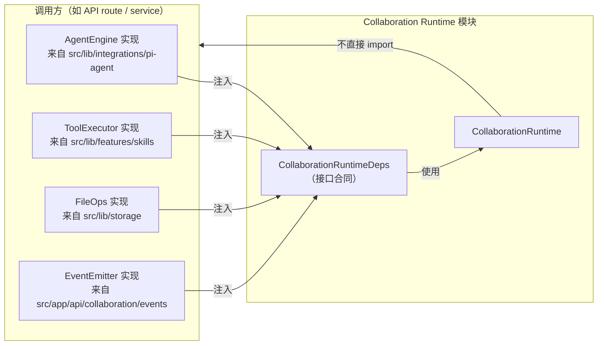

# H02：`CollaborationRuntimeDeps`：依赖注入与模块边界规约

## 小林的旅行规划会话为什么没有被直接启动

上一章（H01）说到，小林点击“启动协作规划”后，系统不会直接启动三个 Agent 子进程，而是先创建一个 `CollaborationSession` 和一个 `Blackboard`。但这里还缺了一个关键步骤：谁来真正启动 Agent？谁提供文件读写？谁向外推送事件？

如果 Collaboration Runtime 模块直接 import `src/lib/integrations/pi-agent/` 里的 `PersistentAgentManager`，再直接 import `src/lib/storage/json-store.ts` 做文件读写，再直接 import `src/app/api/...` 里的事件推送逻辑，会怎样？

答案是：模块会失去独立性，测试时必须把整个 OriginOS 跑起来，也无法单独替换 LLM 引擎或存储层。更严重的，它会违反 AGENTS.md 的强制规约：

> `collaboration-runtime` 模块内部**禁止直接 import `src/lib/` 和 `src/components/` 下的任何模块**。

因此，Collaboration Runtime 采用**依赖注入**：模块只声明自己需要哪些能力接口，具体实现由调用方在构造时传入。本章回答：这些接口是什么？每个接口解决什么问题？注入时有哪些真实约束？

## 概念阶梯：依赖注入不是“把依赖藏起来”

很多人把依赖注入理解为“少写 import”，这不够准确。在 Collaboration Runtime 中，依赖注入有三个具体作用：

| 作用 | 通俗解释 | 在本模块中的体现 |
| --- | --- | --- |
| **解耦** | 模块不直接依赖具体实现 | 不 import `src/lib/`，只使用接口 |
| **可测试** | 单元测试可以用 mock 替代真实 LLM/文件系统 | 测试时传入 fake `agentEngine` 和 `fileOps` |
| **可替换** | 未来换 LLM 引擎或存储层，只需换注入实例 | `agentEngine` 和 `fileOps` 的实现可以替换 |

关键区别：依赖注入不是让模块“不知道”自己依赖什么，而是让模块“明确知道自己依赖什么能力”，同时“不知道这些能力由谁实现”。

## 第一段源码：`CollaborationRuntimeDeps` 的七个接口

打开 [packages/core/src/modules/collaboration-runtime/config.ts](../../../../packages/core/src/modules/collaboration-runtime/config.ts#L10)：

```ts
export interface AgentConfig {
  projectId: string;
  agentId: string;
  workingDirectory: string;
}

export interface AgentInstance {
  id: string;
  status: "running" | "stopped" | "error";
  prompt(message: string): Promise<void>;
  abort(): Promise<void>;
}

export interface AgentEngine {
  startAgent(config: AgentConfig): Promise<AgentInstance>;
  stopAgent(id: string): Promise<void>;
  getAgent(id: string): AgentInstance | null;
}
```

前三个接口定义了“如何启动和管理一个 Agent 子进程”：

- `AgentConfig`：启动一个 Agent 需要知道它属于哪个项目（`projectId`）、它是谁（`agentId`）、它在哪个目录工作（`workingDirectory`）。
- `AgentInstance`：一个已启动的 Agent 必须有 ID、状态和两个操作——`prompt`（发消息让它思考）和 `abort`（终止）。
- `AgentEngine`：引擎负责启动、停止、查找 Agent。

注意 `AgentInstance.prompt` 返回 `Promise<void>`，不直接返回思考结果。结果通过事件流异步返回。这是多 Agent 协作与单 Agent 同步调用的一大区别：协作运行时不等待 Agent 立即返回，而是订阅事件。

## 第二段源码：工具、本体、文件、事件

继续看 [packages/core/src/modules/collaboration-runtime/config.ts](../../../../packages/core/src/modules/collaboration-runtime/config.ts#L33)：

```ts
export interface ToolRegistration {
  name: string;
  description: string;
  parameters: Record<string, unknown>;
}

export interface ToolExecutor {
  execute(toolName: string, args: Record<string, unknown>): Promise<unknown>;
  listTools(): ToolRegistration[];
}

export interface OntologyStore {
  query(
    entityType: string,
    filter: Record<string, unknown>
  ): Promise<unknown[]>;
  save(entityType: string, data: unknown): Promise<void>;
  delete(entityType: string, id: string): Promise<void>;
}

export interface FileOps {
  read(path: string): Promise<string>;
  write(path: string, content: string): Promise<void>;
  exists(path: string): Promise<boolean>;
  listDir(path: string): Promise<string[]>;
}

export interface EventEmitter {
  emit(event: RuntimeEvent): void;
}

export interface AgentDefinitionParser {
  parseAgentDefinition(content: string): unknown;
  parseToolDefinition(content: string): unknown;
}
```

这五个接口分别对应五种外部能力：

| 接口 | 解决什么问题 | 为什么不能直接 import 实现 |
| --- | --- | --- |
| `ToolExecutor` | Agent 子进程需要调用工具 | 工具集由项目/Agent 配置决定，Runtime 不应硬编码 |
| `OntologyStore` | Agent 需要查询/保存本体数据 | 本体存储可能在文件系统，也可能在云存储 |
| `FileOps` | 事件日志、黑板快照需要读写文件 | 文件系统路径和权限由调用方管理 |
| `EventEmitter` | Runtime 需要把事件推送给 Web 层（SSE） | 推送机制可能是 SSE、WebSocket 或其他 |
| `AgentDefinitionParser` | Runtime 需要解析 Agent.md / Tool.md | 解析逻辑可能随 Agent 格式演化 |

设计文档 [§5.5](../../../../docs/design/multi-agent-runtime.md#L988) 把这一点说得很清楚：

> 协作运行时模块内部**禁止直接 import `src/lib/` 或 `src/components/` 下的任何模块**。所有外部依赖通过依赖注入接口传入。

## 第三段源码：`CollaborationRuntime` 如何接收依赖

[packages/core/src/modules/collaboration-runtime/config.ts](../../../../packages/core/src/modules/collaboration-runtime/config.ts#L86) 的类定义：

```ts
export class CollaborationRuntime {
  readonly deps: CollaborationRuntimeDeps;
  private sessions: Map<string, CollaborationSession>;

  constructor(deps: CollaborationRuntimeDeps) {
    this.deps = deps;
    this.sessions = new Map();
  }

  createSession(session: CollaborationSession): void {
    this.sessions.set(session.id, session);
  }

  getSession(id: string): CollaborationSession | undefined {
    return this.sessions.get(id);
  }

  listSessions(): CollaborationSession[] {
    return Array.from(this.sessions.values());
  }
}
```

这个类目前很简单：构造时保存依赖，提供会话的增删改查。但不要因为它简单就忽略其设计含义：

1. `deps` 是 `readonly` 的，说明运行时一旦创建，其依赖能力就固定了。
2. `sessions` 是内存中的 `Map`，说明当前实现是会话管理的起点，不是完整实现。
3. 所有外部能力都通过 `this.deps` 访问，例如 `this.deps.agentEngine.startAgent(...)`、`this.deps.fileOps.write(...)`。

## 图解：依赖注入的边界



这张图说明：

- 调用方知道 Runtime 需要哪些能力，并组装实现实例。
- Runtime 只依赖接口，不依赖具体实现。
- 箭头是单向的：调用方 → Runtime，Runtime 不反向 import 调用方。

## 真实注入路径：facade 层如何组装

虽然 H12 才会详细讲 facade，但这里可以提前看一个入口。打开 [packages/core/src/modules/collaboration-runtime/facade/index.ts](../../../../packages/core/src/modules/collaboration-runtime/facade/index.ts#L45)：

```ts
export async function createSession(input: CreateSessionInput): Promise<CollaborationSession> {
  const { parseAgentDefinition, parseToolDefinition } = await import("../../../lib/integrations/pi-agent/persistent-agent");
  return _createSession(input, eventEmitter, { parseAgentDefinition, parseToolDefinition });
}
```

这里发生了两件关键的事：

1. `agentDefinitionParser` 的实现通过**动态 import** 从 `src/lib/integrations/pi-agent/persistent-agent` 获取，而不是在模块顶层 import。
2. `eventEmitter` 来自同目录的 `event-bus.ts`，由 facade 层维护。

动态 import 是一种折中：它让模块在运行时才获取外部实现，既满足了“模块顶层不 import `src/lib/`”的规约，又方便了调用方使用。但这也意味着：如果运行环境中缺少 `persistent-agent` 模块，`createSession` 会失败，而不是在模块加载时就失败。

## 失败路径与边界

### 边界 1：注入实例不能为空

`CollaborationRuntime` 的构造函数接受 `CollaborationRuntimeDeps`，但 TypeScript 编译器只能保证类型，不能保证运行时真的传入了有效实例。如果调用方传入 `{ agentEngine: undefined }` 之类的对象，构造时不会报错，但后续调用 `this.deps.agentEngine.startAgent(...)` 会抛出运行时错误。

这不是 Runtime 的 bug，而是调用方的责任。但教材需要让读者知道：类型安全不等于运行时安全。

### 边界 2：接口实现的行为差异

`FileOps.read(path)` 的签名很简单，但不同实现可能有不同行为：

- 一个实现可能把 `path` 当作绝对路径。
- 另一个实现可能把 `path` 当作相对于数据根目录的相对路径。
- 一个实现遇到不存在的文件可能抛错，另一个可能返回空字符串。

Runtime 不能假设具体行为，它只能按照接口调用。如果调用方和 Runtime 对路径语义理解不一致，就会出现“文件明明存在但 Runtime 找不到”的问题。这是跨层合同一致性的经典风险。

### 边界 3：`AgentEngine` 不保证 Agent 一定存活

`AgentEngine.startAgent` 返回 `Promise<AgentInstance>`，但 Agent 子进程可能在任何时候崩溃。`AgentInstance.status` 可以是 `"running" | "stopped" | "error"`，Runtime 必须检查状态，而不是假设 `startAgent` 成功后 Agent 永远可用。

## 测试证据与缺口

### 已覆盖的测试

- `packages/core/src/modules/collaboration-runtime/engine/__tests__/*.test.ts`：大量测试使用 mock 的 `CollaborationRuntimeDeps` 来验证引擎行为，间接证明了依赖注入接口的可 mock 性。
- `packages/core/src/modules/collaboration-runtime/__tests__/story-9.36.test.ts`：通过真实注入路径验证了一次完整协作会话。

### 测试缺口

- `config.ts` 本身没有单元测试。`CollaborationRuntime` 类目前只有会话 CRUD，逻辑简单，但随着模块演进，应该补充构造注入和会话状态管理的测试。
- 没有针对“注入实例为空/不完整”的负向测试。这类测试通常在 facade 层或 API route 层补充。

## 小实验

1. 打开 [packages/core/src/modules/collaboration-runtime/config.ts](../../../../packages/core/src/modules/collaboration-runtime/config.ts#L10)，把七个接口按“与 Agent 生命周期相关”“与数据存储相关”“与事件/通信相关”分类。
2. 假设你要为 `CollaborationRuntime` 写一个单元测试，测试 `createSession` 后 `getSession` 能返回正确会话。你需要 mock `CollaborationRuntimeDeps` 的哪些字段？为什么有些字段可以留空？
3. 比较 [packages/core/src/modules/collaboration-runtime/facade/index.ts](../../../../packages/core/src/modules/collaboration-runtime/facade/index.ts#L45) 和 [packages/core/src/modules/collaboration-runtime/config.ts](../../../../packages/core/src/modules/collaboration-runtime/config.ts#L86)：为什么 facade 可以用动态 import 获取 `parseAgentDefinition`，而 `CollaborationRuntime` 类本身不直接做这件事？

## 口头验收

不看源码，你能解释：

1. `AgentEngine`、`AgentConfig`、`AgentInstance` 三个接口之间的关系是什么？
2. `ToolExecutor` 为什么只暴露 `execute` 和 `listTools`，而不暴露工具的具体实现？
3. `EventEmitter.emit` 返回 `void` 而不是 `Promise<void>`，这对 Runtime 的事件处理意味着什么？
4. 如果调用方传入的 `FileOps` 实现把路径当作绝对路径，而 Runtime 把路径当作相对路径，会出现什么问题？责任在哪一层？
5. 为什么 `CollaborationRuntime` 模块顶层不能 import `src/lib/integrations/pi-agent/`？

## 章节收束

本章解释了 Collaboration Runtime 的“外接电源插口”——`CollaborationRuntimeDeps`。七个接口分别对应 Agent 生命周期、工具执行、本体存储、文件操作、事件推送和 Agent 定义解析六种外部能力。模块通过依赖注入保持独立，调用方通过 facade 或 API route 组装实现。

下一章（H03）会进入类型合同，详细讲解 `CollaborationSession`、`RuntimeEvent`、`SessionStatus` 等核心类型，回答：一个协作会话到底由哪些字段组成？
