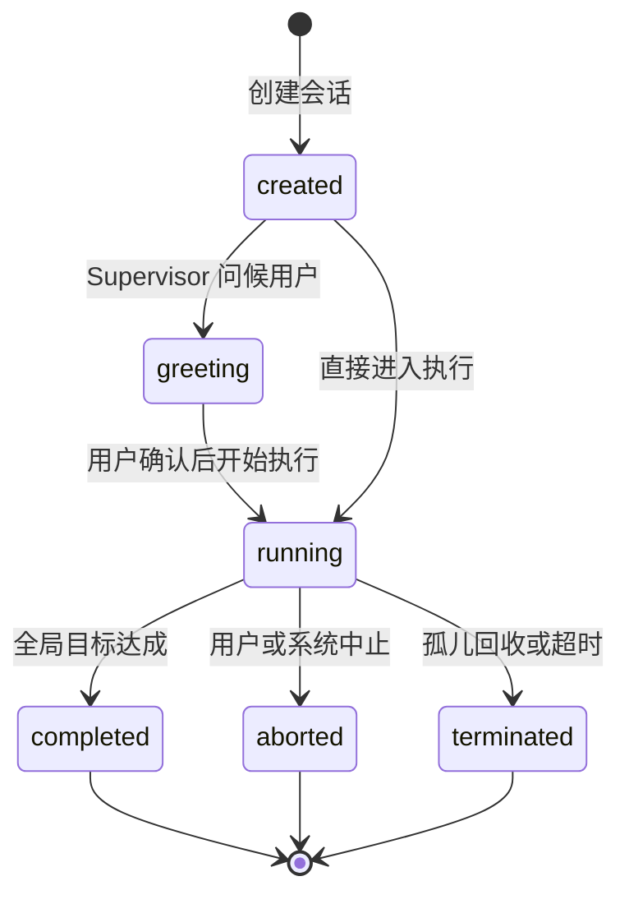
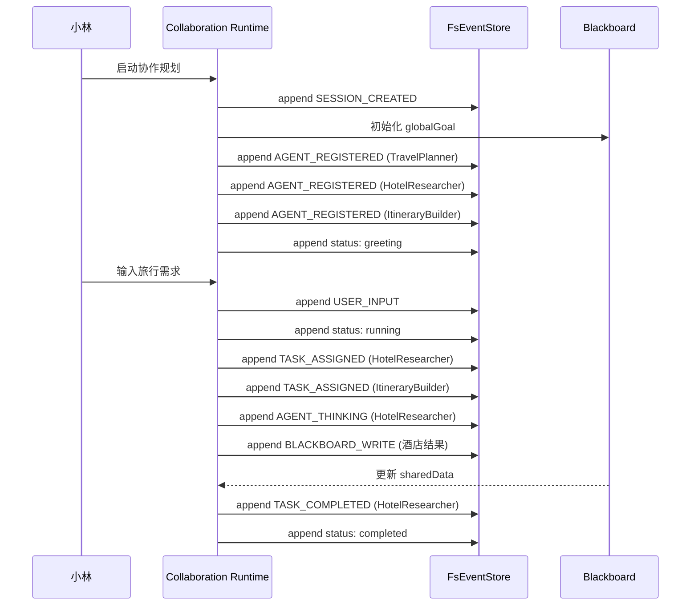

# H03：会话类型合同：`RuntimeEvent`、`CollaborationSession`、`SessionStatus`

## 小林的协作会话里发生了什么

小林点击“启动协作规划”后，系统创建了一个协作会话。接下来她看到：

1. `TravelPlanner` 显示“正在思考”。
2. `HotelResearcher` 和 `ItineraryBuilder` 同时被激活。
3. 酒店列表和行程草案陆续出现在黑板上。
4. 某个时刻，所有 Agent 都安静下来，界面提示“协作完成”。

这些可观察现象的背后，是三种核心类型在起作用：

- **`CollaborationSession`**：会话本身的档案，包括目标、状态、配置。
- **`RuntimeEvent`**：协作过程中发生的每一件事，按顺序追加到事件日志。
- **`SessionStatus`**：会话当前处于哪个生命周期阶段。

本章回答：这三种类型如何共同描述一次多 Agent 协作？它们的字段各自承担什么责任？

## 概念阶梯：事件不是消息，消息也不是状态

在多 Agent 系统中，三个概念最容易混淆：

| 概念 | 通俗解释 | 小林的例子 | 不能把它误认为 |
| --- | --- | --- | --- |
| **Event（事件）** | “某时某刻发生了某事”的记录 | `HotelResearcher` 开始思考、完成子任务 | Agent 之间的对话内容 |
| **Message（消息）** | Agent A 发给 Agent B 的通信单元 | `HotelResearcher` 通知 `ItineraryBuilder` 酒店已找到 | 任意事件 |
| **State（状态）** | 某一时刻黑板的快照 | 当前酒店列表、任务队列、锁 | 完整事件历史 |

三者的关系：事件是 append-only 的历史记录；消息是事件的一种类型（`AGENT_MESSAGE`、`AGENT_BROADCAST`）；状态是根据事件推导或保存的当前视图。没有事件，状态就失去审计能力；没有状态，每次读取都要重放所有事件。

## 第一段源码：`RuntimeEvent` 的字段责任

打开 [packages/core/src/modules/collaboration-runtime/session/types.ts](../../../../packages/core/src/modules/collaboration-runtime/session/types.ts#L111)：

```ts
export interface RuntimeEvent {
  id: string;
  sessionId: string;
  seq: number;
  type: EventType;
  payload: Record<string, unknown>;
  source: string; // Agent ID, 'user', or 'system'
  target?: string; // Target Agent ID (directed messages)
  broadcast?: boolean; // Whether this is a broadcast event
  correlationId?: string; // Correlates related events in the same collaboration session
  timestamp: string; // ISO 8601
}
```

每个字段都有明确责任：

- `id`：事件的唯一标识，用于去重和引用。
- `sessionId`：事件属于哪个协作会话，防止跨会话污染。
- `seq`：事件在会话内的单调递增序号，决定事件顺序。没有 `seq`，分布式或异步产生的事件就无法可靠排序。
- `type`：事件类型，告诉消费者这是什么类型的事。
- `payload`：事件的具体内容，类型是 `Record<string, unknown>`，因为不同事件类型的数据结构不同。
- `source`：谁产生了这个事件。可以是 Agent ID、`'user'` 或 `'system'`。
- `target`：定向消息的目标 Agent ID。如果是广播，这个字段可能为空。
- `broadcast`：是否为广播事件。
- `correlationId`：把同一协作对话中的多个事件关联起来。
- `timestamp`：事件发生时间，ISO 8601 字符串。

注意：`payload` 使用 `unknown` 而不是 `any`，这符合 AGENTS.md “禁止 any 类型”的约束，同时保留了事件内容的灵活性。

## 第二段源码：事件类型全景

[packages/core/src/modules/collaboration-runtime/session/types.ts](../../../../packages/core/src/modules/collaboration-runtime/session/types.ts#L14) 定义了 `EventType`：

```ts
export type EventType =
  // Lifecycle
  | "SESSION_CREATED"
  | "SESSION_COMPLETE"
  | "SESSION_ABORTED"
  | "SESSION_END"
  | "SESSION_ERROR"
  | "DAG_COMPLETE"
  | "DAG_FAIL"
  | "CHECKPOINT"
  // User interaction
  | "USER_INPUT"
  | "USER_RESPONSE"
  // Agent activity
  | "AGENT_REGISTERED"
  | "AGENT_UNREGISTERED"
  | "AGENT_THINKING"
  | "AGENT_ACT"
  // ...
  | "TOOL_CALL"
  | "TOOL_RESULT"
  | "TOOL_FAILURE"
  | "ASSISTANT_MESSAGE"
  | "SUPERVISOR_AGENT_START"
  // ...
  | "HITL_ESCALATE";
```

事件类型可以分为六组：

| 分组 | 示例 | 作用 |
| --- | --- | --- |
| 生命周期 | `SESSION_CREATED`、`SESSION_COMPLETE` | 标记会话和 DAG 的整体状态 |
| 用户交互 | `USER_INPUT`、`USER_RESPONSE` | 用户与系统的双向输入 |
| Agent 活动 | `AGENT_THINKING`、`AGENT_COMPLETE_TASK` | 单个 Agent 的状态变化 |
| Agent 通信 | `AGENT_MESSAGE`、`AGENT_BROADCAST` | Agent 之间的消息 |
| 协调 | `TASK_ASSIGNED`、`TASK_REASSIGNED` | 任务分配和重新分配 |
| 黑板操作 | `BLACKBOARD_WRITE`、`BLACKBOARD_LOCK` | 共享状态变更 |
| 冲突 | `CONFLICT_DETECTED`、`CONFLICT_RESOLVED` | 竞争与消解 |
| 沙箱 | `TOOL_CALL`、`TOOL_RESULT` | 工具执行 |

设计文档 [§3.2](../../../../docs/design/multi-agent-runtime.md#L419) 也描述了类似的事件模型。但源码中的 `EventType` 比设计文档更完整，增加了 Story 9.30-9.34 引入的 Supervisor 相关事件和 `HITL_ESCALATE`。

## 第三段源码：`CollaborationSession` 是会话档案

[packages/core/src/modules/collaboration-runtime/session/types.ts](../../../../packages/core/src/modules/collaboration-runtime/session/types.ts#L329)：

```ts
export interface CollaborationSession {
  id: string;
  projectId: string;
  globalGoal?: string;
  status: SessionStatus;
  createdAt: string;
  updatedAt: string;
  config: {
    maxIterations?: number;
    timeoutMs?: number;
    mode?: "workflow" | "system";
    llmConfig?: { /* ... */ } & RuntimeLLMConfig;
  };
  hostPid?: number;
  terminationReason?: string;
}
```

这个类型与单 Agent 会话有本质区别：

| 对比项 | Pi Agent 单会话（Part E） | `CollaborationSession` |
| --- | --- | --- |
| 核心标识 | `sessionId` | `id` + `projectId` |
| 目标 | 回复用户当前消息 | `globalGoal`（全局目标） |
| 状态 | 通常只有活跃/结束 | `SessionStatus` 六种状态 |
| 配置 | 模型、提示词、工具 | `maxIterations`、`timeoutMs`、`mode`、`llmConfig` |
| 进程归属 | 无 | `hostPid`（用于孤儿回收） |

`projectId` 字段特别重要：它把协作会话绑定到具体项目，从而决定数据存储路径和 Agent 定义来源。没有 `projectId`，Runtime 就不知道去哪里读 `Agent.md` 和 `solution.json`。

## 第四段源码：`SessionStatus` 的生命周期

[packages/core/src/modules/collaboration-runtime/session/types.ts](../../../../packages/core/src/modules/collaboration-runtime/session/types.ts#L327)：

```ts
export type SessionStatus = "created" | "greeting" | "running" | "completed" | "aborted" | "terminated";
```

六个状态构成一个有限状态机：



每个状态的含义：

- `created`：会话刚创建，尚未开始任何 Agent 活动。
- `greeting`：Supervisor 正在向用户打招呼、确认目标（v2.0 强约束：用户只与 Supervisor 对话）。
- `running`：协作正在执行，Agent 子进程可能正在运行。
- `completed`：全局目标达成，所有任务完成。
- `aborted`：被用户或系统显式中止。
- `terminated`：被孤儿回收器或超时机制终止。

注意：`aborted` 和 `terminated` 都是结束状态，但语义不同。`aborted` 是主动中止，`terminated` 通常是被动清理。`terminationReason` 字段用于区分具体原因。

## 图解：事件流如何驱动状态变化



这张图说明：

- 用户的每一个动作和 Agent 的每一个状态变化都被记录为事件。
- 黑板的当前状态是从事件中推导出来的。
- 会话状态也是由事件驱动的。

## 失败路径与边界

### 边界 1：`payload` 是 `unknown`，不是运行时验证过的

`RuntimeEvent.payload` 的类型是 `Record<string, unknown>`，这意味着 TypeScript 不会在编译时检查 `payload` 内部字段。如果某个事件生产者写入 `payload.agentId` 而消费者读取 `payload.agentID`，编译器不会报错，但运行时会得到 `undefined`。

这是多 Agent 系统中常见的合同风险：事件类型的结构需要在团队约定或 schema 中明确，不能仅靠 TypeScript 接口。

### 边界 2：`seq` 单调递增但不保证连续

`seq` 用于排序，但不一定是 1, 2, 3 这样完全连续。如果某些事件被过滤或合并，可能出现间隙。消费者应该按 `seq` 排序，而不是假设 `seq` 没有间隙。

### 边界 3：`globalGoal` 是可选的

`globalGoal?: string` 说明低层运行时允许创建没有明确全局目标的会话。但这不表示产品界面可以不写目标。如果 `globalGoal` 缺失，Supervisor 可能无法有效分解任务。

### 边界 4：`status` 转换不自动发生

`SessionStatus` 是一个联合类型，但类型系统不会自动阻止非法转换。例如，代码可以把 `completed` 改回 `running`，TypeScript 不会报错。状态机的正确性需要业务逻辑保证。

## 测试证据与缺口

### 已覆盖的测试

- `packages/core/src/modules/collaboration-runtime/__tests__/story-9.36.test.ts`：验证了 `SESSION_CREATED`、`TASK_ASSIGNED`、`AGENT_THINKING`、`BLACKBOARD_WRITE`、`TASK_COMPLETED` 等事件的完整流转。
- `packages/core/src/modules/collaboration-runtime/facade/__tests__/session-store.test.ts`：验证了会话的创建、查询和列表行为。

### 测试缺口

- 没有直接针对 `EventType` 联合类型完整性的测试。如果新增事件类型，需要手动确保所有消费者都能处理。
- 没有针对 `seq` 排序和去重的单元测试。这在并发场景下尤其重要。
- 没有针对非法 `SessionStatus` 转换的测试。

## 小实验

1. 打开 [packages/core/src/modules/collaboration-runtime/session/types.ts](../../../../packages/core/src/modules/collaboration-runtime/session/types.ts#L14)，数一下 `EventType` 有多少个取值。把它们按“生命周期/用户/Agent/通信/协调/黑板/冲突/沙箱/Supervisor”分组。
2. 假设一个事件 `type: "AGENT_MESSAGE"`，`source: "HotelResearcher"`，`target: "ItineraryBuilder"`。它的 `payload` 应该包含哪些字段？为什么 `target` 不能替代 `payload.to`？
3. 如果 `seq` 字段缺失，事件日志会出现什么问题？从排序、去重、并发三个角度分析。

## 口头验收

不看源码，你能解释：

1. `RuntimeEvent` 中 `seq`、`source`、`target`、`correlationId` 各自解决什么问题？
2. `CollaborationSession` 比 Pi Agent 单会话多了哪些关键字段？为什么需要它们？
3. `SessionStatus` 的六个状态分别代表什么？`aborted` 和 `terminated` 有什么区别？
4. 事件、消息、状态三者的关系是什么？
5. `payload` 使用 `unknown` 有什么优势和风险？

## 章节收束

本章讲解了协作运行时的三种核心类型合同：`RuntimeEvent` 描述协作过程中发生的每一件事，`CollaborationSession` 是会话档案，`SessionStatus` 是会话生命周期状态。它们共同构成多 Agent 协作的“数据骨架”。

下一章（H04）会进入 `Blackboard`，讲解共享状态如何被组织、写入和审计。
