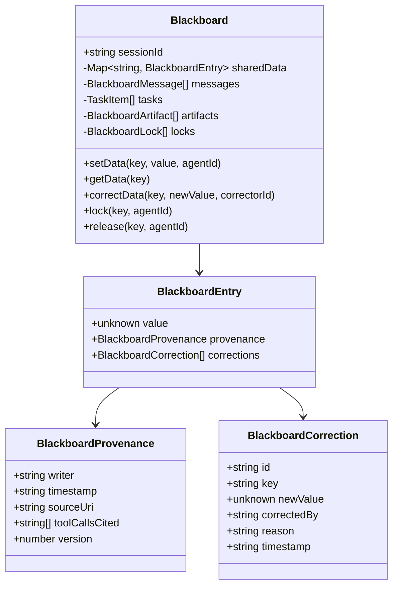

# H04：Blackboard 共享状态：entry、provenance 与 append-only correction

## 小林的酒店数据写到了哪里

上一章（H03）讲到，协作会话创建后，系统会生成一个 `CollaborationSession` 对象。但 Agent 之间需要共享数据——`HotelResearcher` 找到的酒店列表必须能被 `ItineraryBuilder` 读取，`TravelPlanner` 也需要看到所有 Worker 的结果才能汇总。

这些数据不会放在某个 Agent 的私有内存里，而是写入一个**共享黑板（Blackboard）**。本章回答：Blackboard 如何组织共享数据？如何追踪"谁写了什么、基于什么证据"？如果写错了，如何修正而不丢失历史？

## 概念阶梯：黑板不是数据库

初学者容易把 Blackboard 理解成"一个给 Agent 用的键值数据库"。这个理解不够准确：

| 维度 | 普通数据库 | Blackboard |
| --- | --- | --- |
| 写入方式 | 直接覆盖旧值 | 版本递增，旧值保留 |
| 来源追踪 | 通常没有 | 每个 entry 都有 provenance |
| 修正方式 | UPDATE 语句覆盖 | append-only correction，旧值仍在 |
| 并发控制 | 事务/锁 | 基于 TTL 的乐观锁 |
| 事件关联 | 无 | 每个变更对应一个 `RuntimeEvent` |

Blackboard 的设计目标是**可审计的共享状态**：任何人都能查看某个 key 的完整历史，包括谁写的、什么时候写的、基于什么工具调用结果。

## 第一段源码：`Blackboard` 类的结构

打开 [packages/core/src/modules/collaboration-runtime/session/blackboard.ts](../../../../packages/core/src/modules/collaboration-runtime/session/blackboard.ts#L41)：

```ts
export class Blackboard {
  readonly sessionId: string;
  private sharedData: Record<string, BlackboardEntry> = {};
  private messages: BlackboardMessage[] = [];
  private tasks: TaskItem[] = [];
  private artifacts: Record<string, BlackboardArtifact> = {};
  private locks: Record<string, BlackboardLock> = {};
  private registeredAgents: Set<string> = new Set();
  private msgSeq = 0;
  private snapshotDir: string;

  constructor(sessionId: string, snapshotDir: string) {
    this.sessionId = sessionId;
    this.snapshotDir = snapshotDir;
  }
```

五个私有字段的分工：

- `sharedData`：核心共享数据，每个 key 对应一个 `BlackboardEntry`（包含值、来源、版本）。
- `messages`：Agent 之间的 ACL 消息记录。
- `tasks`：任务队列，记录任务从创建到完成的全过程。
- `artifacts`：协作产物（如生成的文档、代码片段）。
- `locks`：并发控制锁，防止多个 Agent 同时写入同一 key。

注意 `snapshotDir`：Blackboard 支持将当前状态持久化到文件系统，以便进程重启后恢复。

## 第二段源码：`BlackboardEntry` 的结构——值、来源与修正历史

[packages/core/src/modules/collaboration-runtime/session/types.ts](../../../../packages/core/src/modules/collaboration-runtime/session/types.ts#L205) 定义了 `BlackboardEntry`：

```ts
export interface BlackboardEntry {
  value: unknown;
  provenance: BlackboardProvenance;
  corrections: BlackboardCorrection[]; // Append-only correction history
}
```

三个字段的分工：

- `value`：当前有效值。可以是任意类型（`unknown`），由写入方决定。
- `provenance`：来源元数据，回答"谁写的、什么时候写的、基于什么"。
- `corrections`：修正历史，append-only，旧值永远保留。

`BlackboardProvenance` 的结构（[types.ts](../../../../packages/core/src/modules/collaboration-runtime/session/types.ts#L179)）：

```ts
export interface BlackboardProvenance {
  writer: string;       // Agent ID that wrote this entry
  timestamp: string;    // ISO 8601 — when the write occurred
  sourceUri?: string;   // Optional: source that informed this write
  toolCallsCited?: string[]; // Optional: tool call IDs cited as evidence
  version: number;      // Monotonically increasing per key
}
```

这个设计直接回应了 AGENTS.md 中的安全约束：**"追踪谁写了什么、基于什么证据"**。`toolCallsCited` 字段尤其重要：它把 Blackboard 上的数据与 Agent 的工具调用链关联起来，防止"幻觉数据"——Agent 声称某个数据来自工具调用，但实际上没有。

## 第三段源码：`setData` 与 `makeEntry`——写入与来源追踪

[blackboard.ts](../../../../packages/core/src/modules/collaboration-runtime/session/blackboard.ts#L227)：

```ts
setData(key: string, value: unknown, agentId: string, options?: { sourceUri?: string; toolCallsCited?: string[] }): void {
  if (this.isLocked(key) && this.locks[key]?.holder !== agentId) {
    throw new Error(
      `Blackboard key "${key}" is locked by ${this.locks[key]?.holder}`
    );
  }
  const existing = this.sharedData[key];
  const nextVersion = existing ? existing.provenance.version + 1 : 1;
  this.sharedData[key] = this.makeEntry(value, agentId, new Date().toISOString(), {
    sourceUri: options?.sourceUri,
    toolCallsCited: options?.toolCallsCited,
  }, nextVersion);
}
```

写入流程：

1. **锁检查**：如果 key 被其他 Agent 锁定，抛出错误。
2. **版本递增**：如果有旧值，版本号 +1；否则从 1 开始。
3. **创建 entry**：调用 `makeEntry` 封装值和来源。

`makeEntry` 的实现（[blackboard.ts](../../../../packages/core/src/modules/collaboration-runtime/session/blackboard.ts#L292)）：

```ts
private makeEntry(
  value: unknown,
  agentId: string,
  timestamp: string,
  eventPayload: Record<string, unknown>,
  version: number
): BlackboardEntry {
  const provenance: BlackboardProvenance = {
    writer: agentId,
    timestamp,
    sourceUri: (eventPayload["sourceUri"] as string) ?? undefined,
    toolCallsCited: (eventPayload["toolCallsCited"] as string[]) ?? undefined,
    version,
  };

  return {
    value,
    provenance,
    corrections: [],
  };
}
```

关键设计：

- `version` 是**每个 key 独立递增**的，不是全局的。这意味着不同 key 的版本号没有可比性。
- `corrections` 初始为空数组，修正时 append 新条目。

## 第四段源码：`correctData`——append-only 修正

[blackboard.ts](../../../../packages/core/src/modules/collaboration-runtime/session/blackboard.ts#L246)：

```ts
correctData(key: string, newValue: unknown, correctorId: string, reason: string): void {
  const existing = this.sharedData[key];
  if (!existing) {
    throw new Error(`Blackboard key "${key}" does not exist to correct`);
  }

  const correction: BlackboardCorrection = {
    id: `corr-${Date.now()}-${Math.random().toString(36).slice(2, 8)}`,
    key,
    newValue,
    supersededBy: "",
    correctedBy: correctorId,
    reason,
    timestamp: new Date().toISOString(),
  };

  // Append correction to the existing entry's history
  existing.corrections.push(correction);

  // Update the effective value (append-only: old value + provenance preserved)
  const nextVersion = existing.provenance.version + 1;
  this.sharedData[key] = {
    value: newValue,
    provenance: {
      writer: correctorId,
      timestamp: correction.timestamp,
      sourceUri: `correction://${correction.id}`,
      toolCallsCited: [],
      version: nextVersion,
    },
    corrections: existing.corrections,
  };
}
```

修正流程：

1. **生成 correction ID**：基于时间戳和随机数，确保唯一性。
2. **append 到历史**：把修正记录 push 到 `existing.corrections`。
3. **更新有效值**：创建新的 `BlackboardEntry`，版本号 +1，来源标记为 `correction://{id}`。

注意 `supersededBy: ""`：这个字段预留了"修正链"功能。未来如果 correction A 被 correction B 取代，A 的 `supersededBy` 会指向 B 的 ID。当前实现中这个字段始终为空字符串。

## 图解：Blackboard 的数据结构



## 事件溯源：`fromEvents` 方法

Blackboard 支持从事件流重建状态（[blackboard.ts](../../../../packages/core/src/modules/collaboration-runtime/session/blackboard.ts#L61)）：

```ts
fromEvents(events: RuntimeEvent[]): Blackboard {
  for (const event of events) {
    this.applyEvent(event);
  }
  return this as unknown as Blackboard;
}
```

`applyEvent` 是一个巨大的 switch 语句，处理所有与 Blackboard 相关的事件类型：

- `BLACKBOARD_WRITE` / `BLACKBOARD_UPDATE`：写入或更新 sharedData
- `BLACKBOARD_LOCK` / `BLACKBOARD_RELEASE`：获取或释放锁
- `TASK_CREATED` / `TASK_ASSIGNED` / `TASK_STARTED` / `TASK_COMPLETED` / `TASK_FAILED`：任务生命周期
- `AGENT_MESSAGE` / `AGENT_REQUEST` / `AGENT_RESPONSE` / `AGENT_DELEGATE` / `AGENT_BROADCAST`：消息通信

这意味着：**Blackboard 的当前状态完全可以通过重放事件日志得到**。如果事件日志完整，理论上可以重建任意时刻的黑板状态。

## 锁机制：基于 TTL 的乐观锁

[blackboard.ts](../../../../packages/core/src/modules/collaboration-runtime/session/blackboard.ts#L332)：

```ts
lock(key: string, agentId: string, ttlMs: number = DEFAULT_LOCK_TTL_MS): boolean {
  this.pruneExpiredLocks();

  if (this.locks[key] && this.locks[key].holder !== agentId) {
    return false;
  }

  this.locks[key] = {
    holder: agentId,
    expiresAt: new Date(Date.now() + ttlMs).toISOString(),
  };
  return true;
}
```

锁的特点：

1. **TTL 自动过期**：默认 30 秒，防止 Agent 崩溃后锁永远不失效。
2. **持有者重入**：同一 Agent 可以重复获取已持有的锁。
3. **非阻塞**：获取失败时返回 `false`，不阻塞调用方。

这与传统数据库的悲观锁不同：Blackboard 的锁是"建议性"的，`setData` 会检查锁，但不强制阻止无锁写入（除了抛出错误）。

## 失败路径与边界

### 边界 1：`correctData` 不能修正不存在的 key

如果某个 Agent 尝试修正一个从未写入的 key，`correctData` 会抛出错误。这与 `setData` 不同——`setData` 可以创建新 key。这个设计防止了"误修正"：Agent 以为自己修正的是 A key，但实际上系统里没有这个 key。

### 边界 2：`supersededBy` 当前未使用

`BlackboardCorrection.supersededBy` 字段在当前代码中始终为空字符串。这意味着如果同一个 key 被修正多次，所有 correction 都平铺在 `corrections` 数组中，没有形成链式结构。未来如果需要支持"撤销修正"或"查看修正历史"，需要填充这个字段。

### 边界 3：锁不是强一致性保证

`isLocked` 检查在 `setData` 内部进行，但这不是原子操作。如果两个 Agent 几乎同时检查锁并写入，仍可能出现竞态条件。Blackboard 目前运行在单进程 Node.js 中，事件循环的串行性实际上避免了这个问题，但如果未来扩展到多进程或多机，需要更强的并发控制。

### 边界 4：事件溯源的完整性依赖

`fromEvents` 假设事件日志完整且有序。如果事件丢失或顺序错乱，重建的黑板状态可能不正确。`seq` 字段（H03 讲过）用于排序，但没有自动的完整性校验机制。

## 测试证据与缺口

### 已覆盖的测试

- `packages/core/src/modules/collaboration-runtime/__tests__/story-9.36.test.ts`：验证了 Blackboard 的 `setData`、`getData`、`lock`、`release` 在完整协作会话中的使用。
- `packages/core/src/modules/collaboration-runtime/__tests__/blackboard.test.ts`（如果存在）：应覆盖 entry CRUD、provenance、correction、lock 等基础操作。

### 测试缺口

- 没有针对 `fromEvents` 重建状态与直接调用 API 结果一致性的测试。
- 没有针对锁 TTL 过期后自动释放的测试（需要模拟时间）。
- 没有针对并发写入冲突的测试。
- `supersededBy` 字段的行为未测试（因为当前未使用）。

## 小实验

1. 打开 [packages/core/src/modules/collaboration-runtime/session/blackboard.ts](../../../../packages/core/src/modules/collaboration-runtime/session/blackboard.ts)，找到 `applyEvent` 方法。列出它处理的所有事件类型，并说明每种事件如何改变 Blackboard 状态。
2. 假设 `HotelResearcher` 写入 `hotels` key 后，`TravelPlanner` 发现数据有误并调用 `correctData`。画出这个 key 的 `BlackboardEntry` 在修正前后的结构变化。
3. 为什么 `makeEntry` 是 `private` 的？如果把它改成 `public`，会有什么风险？
4. 设计一个测试用例：验证 `fromEvents` 重建的 Blackboard 状态与直接调用 `setData` 的结果一致。

## 口头验收

不看源码，你能解释：

1. `BlackboardEntry` 的三个字段分别是什么？`corrections` 为什么是 append-only 的？
2. `BlackboardProvenance` 中的 `toolCallsCited` 字段解决了什么问题？
3. `correctData` 和 `setData` 有什么区别？为什么修正不直接覆盖旧值？
4. Blackboard 的锁机制有什么特点？它和数据库事务锁有什么不同？
5. 什么是事件溯源？Blackboard 如何通过事件重建状态？

## 章节收束

本章讲解了 Blackboard 的核心设计：共享数据以 `BlackboardEntry` 形式组织，每个 entry 包含值、来源（provenance）和修正历史（corrections）。写入时检查锁、递增版本；修正时 append-only 保留旧值。Blackboard 支持从事件流重建状态，是 Collaboration Runtime 的"共享记忆"。

下一章（H05）会进入 ACL 消息原语，讲解 Agent 之间如何通过 Blackboard 发送定向消息、广播消息，以及 `Performative` 的语义区分。
