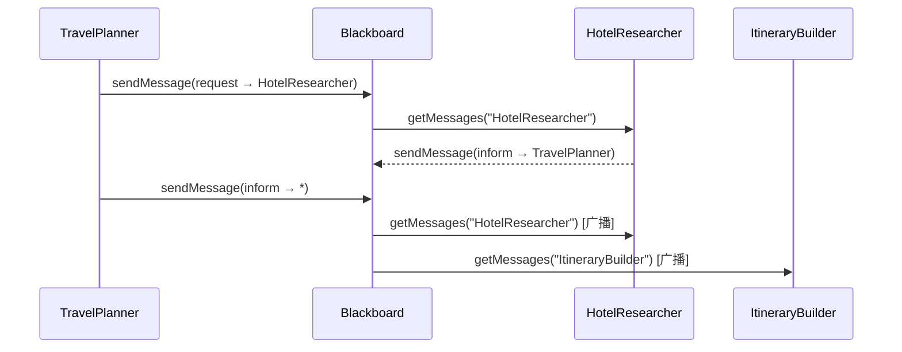

# H05：ACL 消息原语：定向、广播与 performative

## 小林的 Agent 们如何对话

上一章（H04）讲到，Blackboard 是 Agent 共享状态的容器。但 Agent 之间还需要**直接通信**——`TravelPlanner` 需要告诉 `HotelResearcher`"去查西湖区的酒店"，`HotelResearcher` 完成后需要回复"已找到 5 家符合条件的酒店"。

这些通信不是简单的"发消息"，而是有明确语义的**言语行为（Speech Acts）**。本章回答：Agent 之间如何通过 Blackboard 发送消息？`Performative` 的 13 种取值各代表什么语义？定向消息和广播消息有什么区别？

## 概念阶梯：消息不是数据，而是"行为"

初学者容易把 Agent 通信理解为"A 给 B 发了一段 JSON"。这在技术层面是对的，但在协作层面不够。多 Agent 系统中的消息是一种**言语行为**——说话本身就是一种行动。

| 日常对话 | Performative | 含义 |
| --- | --- | --- |
| "我找到了三家酒店" | `inform` | 告知一个事实 |
| "请查一下西湖区的酒店" | `request` | 请求对方执行动作 |
| "我建议住民宿而不是酒店" | `propose` | 提出一个建议 |
| "好的，就按你说的办" | `accept` | 接受一个提案 |
| "不行，预算超了" | `reject` | 拒绝一个提案 |
| "谁愿意接这个任务？" | `cfp` | 招标（Call For Proposal） |

理解 performative 的关键：**同样的 content，不同的 performative，意味着完全不同的协作语义**。

## 第一段源码：`ACLMessage` 的结构

打开 [packages/core/src/modules/collaboration-runtime/session/types.ts](../../../../packages/core/src/modules/collaboration-runtime/session/types.ts#L250)：

```ts
export interface ACLMessage {
  id: string;
  performative: Performative;
  sender: string; // Sender Agent ID
  receiver: string; // Receiver Agent ID ('*' for broadcast)
  content: unknown;
  conversationId?: string; // Isolates different conversation flows
  replyWith?: string; // Identifier for matching responses
  inReplyTo?: string; // References the request this responds to
  timestamp: string; // ISO 8601
}
```

字段分工：

- `id`：消息唯一标识，用于去重和引用。
- `performative`：消息的言语行为类型，告诉接收方"我这是在做什么"。
- `sender` / `receiver`：发送方和接收方的 Agent ID。`receiver: '*'` 表示广播。
- `content`：消息内容，具体结构由 performative 决定。
- `conversationId`：隔离不同的对话流。一个 Agent 可能同时参与多个对话，这个字段防止消息串线。
- `replyWith` / `inReplyTo`：请求-响应配对。`replyWith` 是请求方生成的标识，响应方在 `inReplyTo` 中引用它。
- `timestamp`：消息发送时间。

## 第二段源码：`Performative` 的 13 种取值

[types.ts](../../../../packages/core/src/modules/collaboration-runtime/session/types.ts#L235)：

```ts
export type Performative =
  | "inform"      // Inform a fact
  | "request"     // Request an action
  | "query"       // Query information
  | "propose"     // Propose a suggestion
  | "accept"      // Accept a proposal
  | "reject"      // Reject a proposal
  | "cfp"         // Call for proposal (bidding)
  | "subscribe"   // Subscribe to events
  | "notify"      // Notify an event
  | "failure"     // Execution failure notification
  | "refuse"      // Refuse to execute
  | "agree"       // Agree to execute
  | "delegate";   // Delegate a task
```

13 种 performative 可以分为五组：

| 分组 | Performative | 使用场景 |
| --- | --- | --- |
| **信息传递** | `inform`, `query`, `notify` | 告知事实、查询信息、通知事件 |
| **请求执行** | `request` | 请求对方执行某个动作 |
| **协商决策** | `propose`, `accept`, `reject` | 提出建议、接受或拒绝 |
| **招标分配** | `cfp`, `agree`, `refuse` | 招标、同意执行、拒绝执行 |
| **任务委托** | `delegate` | 把任务委托给另一个 Agent |

### 小林的例子

```
TravelPlanner → HotelResearcher
  performative: "request"
  content: { action: "searchHotels", location: "西湖区", budget: 3000 }
  replyWith: "req-001"

HotelResearcher → TravelPlanner
  performative: "inform"
  content: { hotels: [...] }
  inReplyTo: "req-001"
```

`TravelPlanner` 用 `request` 请求搜索酒店，`HotelResearcher` 用 `inform` 回复结果。`replyWith`/`inReplyTo` 把请求和响应配对。

## 第三段源码：Blackboard 如何存储消息

ACL 消息通过 Blackboard 的 `sendMessage` 方法存储（[blackboard.ts](../../../../packages/core/src/modules/collaboration-runtime/session/blackboard.ts#L382)）：

```ts
sendMessage(msg: ACLMessage): void {
  this.msgSeq += 1;
  this.messages.push({
    id: msg.id,
    from: msg.sender,
    to: msg.receiver,
    type: this.mapPerformativeToMessageType(msg.performative),
    content: msg.content,
    seq: this.msgSeq,
    readBy: [],
    timestamp: msg.timestamp,
    conversationId: msg.conversationId,
    replyWith: msg.replyWith,
    inReplyTo: msg.inReplyTo,
  });
}
```

注意这里的转换：`ACLMessage` 的 `performative` 被映射到 `BlackboardMessage` 的 `type`。这是因为 `BlackboardMessage` 只支持 6 种类型（`inform`/`request`/`propose`/`accept`/`reject`/`cfp`），而 `Performative` 有 13 种。映射规则在 `mapPerformativeToMessageType` 中定义：

```ts
private mapPerformativeToMessageType(
  performative: ACLMessage["performative"]
): BlackboardMessage["type"] {
  const map: Record<ACLMessage["performative"], BlackboardMessage["type"]> = {
    inform: "inform",
    request: "request",
    propose: "propose",
    accept: "accept",
    reject: "reject",
    cfp: "cfp",
    query: "inform",      // query 映射为 inform
    subscribe: "inform",  // subscribe 映射为 inform
    notify: "inform",     // notify 映射为 inform
    failure: "inform",    // failure 映射为 inform
    refuse: "reject",     // refuse 映射为 reject
    agree: "accept",      // agree 映射为 accept
    delegate: "inform",  // delegate 映射为 inform
  };
  return map[performative];
}
```

设计考量：

- `BlackboardMessage` 是内部存储格式，简化到 6 种类型足够支持基本的查询和过滤。
- `query`/`subscribe`/`notify`/`failure`/`delegate` 在存储时都归入 `inform`，但在协议层（H22-H24）会保留原始 performative 的完整语义。

## 第四段源码：定向消息与广播消息

`ACLMessage.receiver` 字段控制消息的目标：

```ts
// 定向消息：只发给特定 Agent
const directedMsg: ACLMessage = {
  id: "msg-001",
  performative: "request",
  sender: "TravelPlanner",
  receiver: "HotelResearcher",  // 明确的目标
  content: { action: "searchHotels" },
  timestamp: new Date().toISOString(),
};

// 广播消息：发给所有 Agent
const broadcastMsg: ACLMessage = {
  id: "msg-002",
  performative: "inform",
  sender: "TravelPlanner",
  receiver: "*",  // '*' 表示广播
  content: { status: "planning_started" },
  timestamp: new Date().toISOString(),
};
```

Blackboard 的 `getMessages` 方法支持按 Agent ID 过滤（[blackboard.ts](../../../../packages/core/src/modules/collaboration-runtime/session/blackboard.ts#L399)）：

```ts
getMessages(agentId: string): ACLMessage[] {
  return this.messages
    .filter(
      (m) =>
        m.to === agentId || m.to === "*" || m.from === agentId
    )
    .map(/* ... */);
}
```

过滤逻辑：

- `m.to === agentId`：发给该 Agent 的定向消息
- `m.to === "*"`：广播消息（所有 Agent 都能收到）
- `m.from === agentId`：该 Agent 发出的消息（用于查看自己的发送记录）

## 图解：ACL 消息流



## 失败路径与边界

### 边界 1：`getMessages` 不删除消息

`getMessages` 只是查询，不会从 Blackboard 中删除消息。这意味着消息会累积，长时间运行的协作会话可能面临内存问题。当前实现中没有消息清理机制。

### 边界 2：`replyWith`/`inReplyTo` 是约定，不是强制

`replyWith` 和 `inReplyTo` 字段用于请求-响应配对，但 Blackboard 不会自动验证响应是否匹配请求。如果 Agent 发送了 `inReplyTo: "req-001"`，但 Blackboard 中不存在 `replyWith: "req-001"` 的消息，系统不会报错。这种一致性需要上层协议保证。

### 边界 3：广播消息的"所有 Agent"范围

`receiver: '*'` 表示广播，但"所有 Agent"的范围由谁定义？当前实现中，`getMessages` 只是简单过滤 `to === '*'`，不检查 Agent 是否已注册。这意味着如果一个 Agent 在消息发送后才注册，它仍然能收到之前的历史广播消息（如果 `getMessages` 被调用时历史消息还在）。

### 边界 4：`Performative` 到 `BlackboardMessage.type` 的映射丢失信息

`query` 映射为 `inform` 意味着：从 Blackboard 存储层面看，无法区分"告知事实"和"查询信息"。如果 UI 需要显示"这是一个查询请求"，必须依赖原始 `ACLMessage` 的 `performative` 字段，而不能只看 `BlackboardMessage.type`。

## 测试证据与缺口

### 已覆盖的测试

- `packages/core/src/modules/collaboration-runtime/__tests__/story-9.36.test.ts`：验证了 Agent 消息的完整流转，包括定向消息和广播消息。

### 测试缺口

- 没有针对 `replyWith`/`inReplyTo` 配对正确性的测试。
- 没有针对广播消息范围的测试（例如：未注册的 Agent 是否收到广播）。
- 没有针对 `mapPerformativeToMessageType` 映射完整性的测试。如果新增 performative，需要确保映射表也更新。
- 没有针对消息累积和内存增长的测试。

## 小实验

1. 打开 [packages/core/src/modules/collaboration-runtime/session/types.ts](../../../../packages/core/src/modules/collaboration-runtime/session/types.ts#L235)，把 13 种 performative 按"信息传递/请求执行/协商决策/招标分配/任务委托"分组。
2. 假设 `TravelPlanner` 发送一个 `performative: "delegate"` 消息给 `HotelResearcher`。根据 `mapPerformativeToMessageType`，它在 Blackboard 中存储的 `type` 是什么？这对后续查询有什么影响？
3. 设计一个测试用例：验证 `getMessages` 能正确返回定向消息和广播消息，同时过滤掉发给其他 Agent 的消息。
4. 为什么 `getMessages` 要返回 `m.from === agentId` 的消息？如果去掉这个条件，会有什么后果？

## 口头验收

不看源码，你能解释：

1. `ACLMessage` 和 `BlackboardMessage` 有什么区别？为什么需要两种消息格式？
2. `performative` 和 `content` 的关系是什么？同样的 content，不同的 performative，协作语义有什么不同？
3. 定向消息和广播消息在 `receiver` 字段上有什么区别？`getMessages` 如何处理广播消息？
4. `replyWith` 和 `inReplyTo` 的作用是什么？它们如何保证请求-响应配对？
5. `query` 为什么映射为 `inform`？这种映射有什么优势和局限？

## 章节收束

本章讲解了 Agent 之间的通信原语：`ACLMessage` 定义了消息的完整结构，`Performative` 定义了 13 种言语行为语义，Blackboard 的 `sendMessage`/`getMessages` 提供了消息存储和查询能力。定向消息和广播消息通过 `receiver` 字段区分，请求-响应通过 `replyWith`/`inReplyTo` 配对。

下一章（H06）是 Unit 1 的小结课，会回顾 H01-H05 的核心概念，画出"入口 → deps → 会话 → 黑板 → 消息"的完整层次图。
