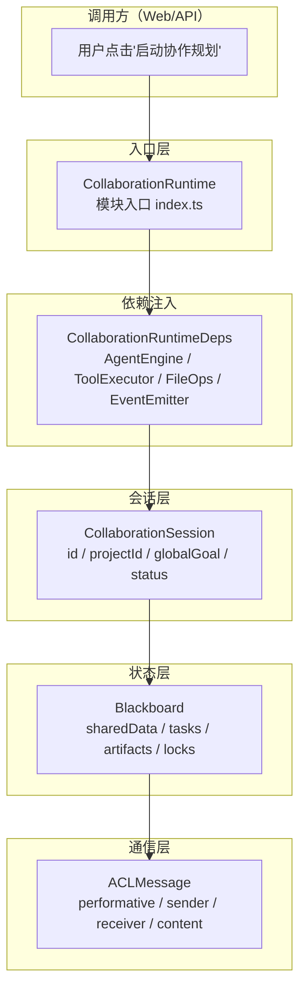

# H06：单元小结课——协作运行时的基础对象地图

## 本单元回顾

Unit 1（H01-H05）从"为什么需要 Collaboration Runtime"讲起，到"Agent 如何通过 Blackboard 通信"结束。让我们用一张图串联所有概念。

## 层次图：入口 → deps → 会话 → 黑板 → 消息



每一层的职责：

| 层次 | 对象 | 职责 | 关键字段/方法 |
| --- | --- | --- | --- |
| 入口 | `CollaborationRuntime` | 模块公共 API，封装内部实现 | `createSession`, `getSession`, `listSessions` |
| 依赖注入 | `CollaborationRuntimeDeps` | 声明外部能力接口，保持模块独立 | `agentEngine`, `toolExecutor`, `fileOps`, `eventEmitter` |
| 会话 | `CollaborationSession` | 描述一次多 Agent 协作的档案 | `id`, `projectId`, `globalGoal`, `status`, `config.mode` |
| 事件 | `RuntimeEvent` | 记录协作过程中发生的每一件事 | `id`, `seq`, `type`, `payload`, `source`, `target` |
| 状态 | `Blackboard` | 共享状态容器，支持审计和修正 | `sharedData`, `tasks`, `artifacts`, `locks` |
| 通信 | `ACLMessage` | Agent 之间的言语行为消息 | `performative`, `sender`, `receiver`, `content` |

## 核心概念对照表

### Collaboration Runtime vs Pi Agent 基础运行时

| 维度 | Pi Agent 基础运行时（Part E） | Collaboration Runtime（Part H） |
| --- | --- | --- |
| 核心问题 | 单个 Agent 如何思考、调用工具、生成回复 | 多个 Agent 如何协同、共享状态、避免冲突 |
| 会话对象 | `Session`（单 Agent） | `CollaborationSession`（多 Agent） |
| 状态管理 | Agent 私有内存 | `Blackboard` 共享状态 |
| 通信方式 | 用户 ↔ Agent 直接对话 | Agent ↔ Agent 通过 ACL 消息 |
| 执行模式 | 单线程对话 | Workflow DAG / System 黑板 |

### Event vs Message vs State

| 概念 | 定义 | 例子 | 不能误认为 |
| --- | --- | --- | --- |
| Event | "某时某刻发生了某事"的记录 | `AGENT_THINKING`, `BLACKBOARD_WRITE` | Agent 对话内容 |
| Message | Agent A 发给 Agent B 的通信单元 | `ACLMessage` with `performative: "request"` | 任意事件 |
| State | 某一时刻黑板的快照 | `Blackboard.sharedData["hotels"]` | 完整事件历史 |

### Blackboard 的五种数据类型

| 类型 | 用途 | 典型操作 |
| --- | --- | --- |
| `sharedData` | Agent 共享的键值数据 | `setData`, `getData`, `correctData` |
| `tasks` | 任务队列 | `createTask`, `assignTask`, `completeTask` |
| `artifacts` | 协作产物 | `addArtifact`, `getArtifact` |
| `locks` | 并发控制 | `lock`, `release`, `isLocked` |
| `messages` | Agent 通信记录 | `sendMessage`, `getMessages`, `markMessageRead` |

## 正向追踪：从用户点击到 Blackboard 写入

```
用户点击"启动协作规划"
  → Web API route 接收请求
    → facade.createSession() 创建 CollaborationSession
      → Blackboard 初始化（sessionId, snapshotDir）
        → AgentEngine.startAgent() 启动 TravelPlanner
          → TravelPlanner 发送 request 消息给 HotelResearcher
            → Blackboard.sendMessage() 存储 ACLMessage
              → HotelResearcher 读取消息并开始工作
                → HotelResearcher 调用 setData("hotels", [...])
                  → BlackboardEntry 生成（value + provenance + corrections）
```

## 反向诊断：从症状定位责任层

| 症状 | 可能的责任层 | 排查方向 |
| --- | --- | --- |
| 会话创建失败 | 入口层 / 依赖注入层 | 检查 `CollaborationRuntimeDeps` 是否完整注入 |
| Agent 收不到消息 | 通信层 | 检查 `ACLMessage.receiver` 是否正确，消息是否被过滤 |
| 数据写入后读取为空 | 状态层 | 检查 key 是否正确，是否有锁阻止写入 |
| 事件顺序错乱 | 事件层 | 检查 `seq` 是否正确递增，事件是否按顺序处理 |
| 状态无法恢复 | 状态层 / 持久化层 | 检查 `snapshotDir` 路径是否正确，文件是否写入成功 |

## 源码覆盖台账（Unit 1）

| 文件路径 | 状态 | 主讲章节 | 关键代码窗口 |
| --- | --- | --- | --- |
| `packages/core/src/modules/collaboration-runtime/index.ts` | ✅ 精读 | H01 | 公共 API 导出 |
| `packages/core/src/modules/collaboration-runtime/config.ts` | ✅ 精读 | H02 | `CollaborationRuntimeDeps`, `CollaborationRuntime` |
| `packages/core/src/modules/collaboration-runtime/session/types.ts` | ✅ 精读 | H03, H05 | `RuntimeEvent`, `EventType`, `CollaborationSession`, `SessionStatus`, `ACLMessage`, `Performative` |
| `packages/core/src/modules/collaboration-runtime/session/blackboard.ts` | ✅ 精读 | H04, H05 | `Blackboard` 类，`setData`, `correctData`, `sendMessage`, `getMessages` |

## 口头验收

不看源码，你能解释：

1. 画出"入口 → deps → 会话 → 事件 → 黑板 → 消息"的层次图，并说明每层的关键对象。
2. 如果一个 Agent 写入 Blackboard 后另一个 Agent 读不到，按层次图逐层排查可能的原因。
3. `Event`、`Message`、`State` 三者的关系是什么？为什么需要区分它们？
4. `BlackboardEntry` 的 `provenance` 和 `corrections` 分别解决什么问题？
5. `Performative` 的 13 种取值中，`inform`、`request`、`propose`、`delegate` 分别用于什么场景？

## 下一单元预告

Unit 2（H07-H13）将深入事件流与持久化：

- `EventStore` 与 `FsEventStore` 的 append-only 语义
- Blackboard 的写入、锁定与上游结果管理
- 结构化 Memory Keys 与共享内存约定
- 会话状态恢复与孤儿会话回收
- Facade 层的组装

核心问题：**多 Agent 运行时产生的事件如何被保存、索引和回放？黑板上的数据如何在进程重启后恢复？**
