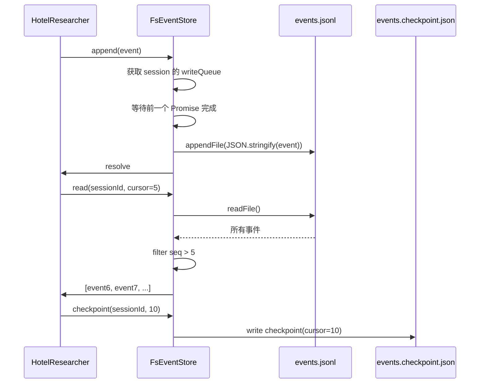

# H07：`EventStore` 与 `FsEventStore` 的 append-only 语义

## 小林的协作事件去了哪里

上一章（H06）我们画出了协作运行时的基础对象地图。现在让我们追问一个关键问题：当 `HotelResearcher` 完成酒店搜索、把结果写入 Blackboard 时，这个"写入"动作本身如何被持久化？如果应用进程此时崩溃，重启后系统如何知道之前发生了什么？

答案在 **EventStore**。本章回答：事件存储的接口设计为什么必须是 append-only？`FsEventStore` 如何保证事件顺序和并发安全？

## 概念阶梯：append-only 不是"只能添加"，而是"永不删除"

初学者容易把 append-only 理解为"只能往末尾加数据"。准确地说，append-only 意味着：

| 特性 | append-only 语义 | 反例（可变存储） |
| --- | --- | --- |
| 写入 | 只能在末尾追加新记录 | 可以 UPDATE 旧记录 |
| 读取 | 按顺序读取所有记录 | 可以 SELECT 最新快照 |
| 删除 | 不允许删除 | DELETE 语句 |
| 修改 | 不允许修改 | UPDATE 语句 |
| 历史 | 完整保留 | 旧版本丢失 |

append-only 的核心价值：**可审计性**。在多 Agent 系统中，如果允许删除或修改事件，就无法回答"当时到底发生了什么"。

## 第一段源码：`EventStore` 接口

打开 [packages/core/src/modules/collaboration-runtime/session/event-store.ts](../../../../packages/core/src/modules/collaboration-runtime/session/event-store.ts)：

```ts
export interface EventStore {
  /** Append an event to the store (append-only, immutable) */
  append(event: RuntimeEvent): Promise<void>;

  /**
   * Read events for a session.
   * If cursor is provided, returns only events with seq > cursor (incremental read).
   */
  read(sessionId: string, cursor?: number): Promise<RuntimeEvent[]>;

  /** Save a checkpoint so incremental reads know where to resume from */
  checkpoint(sessionId: string, seq: number): Promise<void>;

  /** List all session IDs in the store */
  list(): Promise<string[]>;
}
```

四个方法的分工：

- `append`：追加事件，唯一写入入口。
- `read`：读取事件，支持按 cursor 增量读取。
- `checkpoint`：保存检查点，标记已处理到的 seq。
- `list`：列出所有会话 ID，用于管理和清理。

注意接口的简洁性：没有 `update`、`delete`、`clear` 等方法。这就是 append-only 的约束。

## 第二段源码：`FsEventStore` 的实现

[packages/core/src/modules/collaboration-runtime/session/fs-event-store.ts](../../../../packages/core/src/modules/collaboration-runtime/session/fs-event-store.ts) 提供了基于文件系统的实现：

```ts
export class FsEventStore implements EventStore {
  /** Per-session write queue — serialises concurrent appends for the same session. */
  private readonly writeQueues = new Map<string, Promise<void>>();

  constructor(private baseDir: string = BASE_DIR) {}
```

核心设计：**每个会话有自己的写入队列**。`writeQueues` 是一个 `Map<string, Promise<void>>`，key 是 `sessionId`，value 是该会话最后一个未完成的写入 Promise。

### `append` 方法

```ts
append(event: RuntimeEvent): Promise<void> {
  // Streaming token fragments have no replay value — skip persistence.
  if (event.type === "MESSAGE_SENT") return Promise.resolve();

  const { sessionId } = event;
  const prev = this.writeQueues.get(sessionId) ?? Promise.resolve();

  // Chain the new write onto the tail of the queue.
  const next = prev.then(() => this._doAppend(event));
  this.writeQueues.set(sessionId, next.catch(() => {}));

  return next;
}
```

写入流程：

1. **过滤 `MESSAGE_SENT`**：流式 token 片段不持久化，避免文件膨胀。
2. **获取前一个 Promise**：如果该会话有未完成的写入，等待它完成。
3. **链式写入**：新写入 Promise 依赖前一个完成。
4. **存储新 Promise**：`.catch(() => {})` 防止失败写入阻塞后续写入。
5. **返回实际 Promise**：调用方可以 await 并处理错误。

### `_doAppend` 方法

```ts
private async _doAppend(event: RuntimeEvent): Promise<void> {
  const dir = this.sessionDir(event.sessionId);
  await fs.mkdir(dir, { recursive: true });
  const line = JSON.stringify(event) + "\n";
  await fs.appendFile(path.join(dir, "events.jsonl"), line, "utf-8");
}
```

存储格式：**JSONL**（JSON Lines），每行一个 JSON 对象。这种格式的好处：

- **追加友好**：不需要读取整个文件，直接在末尾追加。
- **容错**：即使文件末尾有损坏的行，前面的记录仍然可读。
- **流式处理**：可以逐行读取，不需要一次性加载整个文件。

### `read` 方法

```ts
async read(sessionId: string, cursor?: number): Promise<RuntimeEvent[]> {
  const filePath = path.join(this.sessionDir(sessionId), "events.jsonl");

  try {
    const content = await fs.readFile(filePath, "utf-8");
    const lines = content
      .split("\n")
      .filter((line) => line.trim().length > 0);

    const events = lines
      .map((line) => JSON.parse(line) as RuntimeEvent)
      .filter((e) => e.type !== "MESSAGE_SENT");

    if (cursor !== undefined) {
      return events.filter((e) => e.seq > cursor);
    }
    return events;
  } catch {
    return [];
  }
}
```

读取流程：

1. **读取文件**：一次性读取整个 JSONL 文件。
2. **过滤空行**：去除末尾的空行。
3. **解析 JSON**：每行解析为一个 `RuntimeEvent`。
4. **过滤 `MESSAGE_SENT`**：与写入时保持一致。
5. **按 cursor 过滤**：如果提供了 cursor，只返回 `seq > cursor` 的事件。

### `checkpoint` 方法

```ts
async checkpoint(sessionId: string, seq: number): Promise<void> {
  const dir = this.sessionDir(sessionId);
  await fs.mkdir(dir, { recursive: true });

  const checkpointPath = path.join(dir, "events.checkpoint.json");
  // ... 读取已存在的 checkpoint 以保留 createdAt

  const dataFile: DataFile = {
    version: DATA_FILE_VERSION,
    createdAt,
    updatedAt: now,
    data: {
      cursor: seq,
      timestamp: now,
    } satisfies CheckpointData,
  };

  await fs.writeFile(checkpointPath, JSON.stringify(dataFile, null, 2) + "\n", "utf-8");
}
```

检查点的作用：标记已处理到的 `seq`，支持增量恢复。文件格式遵循 AGENTS.md 的数据格式约束（`version`、`createdAt`、`updatedAt`、`data`）。

## 图解：事件存储的数据流



## 失败路径与边界

### 边界 1：并发写入的队列模型

`writeQueues` 使用 Promise 链实现串行化，但有一个细节：

```ts
this.writeQueues.set(sessionId, next.catch(() => {}));
```

`.catch(() => {})` 的作用是：**即使当前写入失败，后续写入仍然可以继续**。但如果写入失败，事件实际上没有持久化，而调用方通过 `return next` 可以收到错误。这意味着：

- 调用方知道写入是否成功。
- 队列不会阻塞，后续写入可以继续尝试。
- 但失败的写入不会自动重试。

### 边界 2：`read` 一次性读取整个文件

当前实现中，`read` 方法使用 `fs.readFile` 一次性读取整个 JSONL 文件。对于长时间运行的协作会话，文件可能很大，导致内存问题。更优的实现应该是流式读取（`createReadStream` + `readline`）。

### 边界 3：`MESSAGE_SENT` 过滤的双向性

`MESSAGE_SENT` 在写入和读取时都被过滤。这意味着：即使历史 JSONL 文件中包含 `MESSAGE_SENT` 事件，读取时也会被过滤掉。这是为了向后兼容——旧文件可能包含这些事件，但新代码不再使用它们。

### 边界 4：检查点不保证原子性

`checkpoint` 和 `append` 是独立操作。如果系统在写入事件后、保存检查点前崩溃，重启后可能重复处理事件。上层需要能处理重复事件（通过 `id` 或 `seq` 去重）。

## 测试证据与缺口

### 已覆盖的测试

- `packages/core/src/modules/collaboration-runtime/__tests__/fs-event-store.test.ts`（如有）：应覆盖 append、read、checkpoint 的基本行为。
- `packages/core/src/modules/collaboration-runtime/__tests__/story-9.36.test.ts`：验证了事件在完整协作会话中的流转。

### 测试缺口

- 没有针对并发写入的测试（验证 Promise 链是否正确串行化）。
- 没有针对大文件读取性能的测试。
- 没有针对检查点与事件一致性的测试（崩溃恢复场景）。
- 没有针对 `MESSAGE_SENT` 过滤的测试。

## 小实验

1. 打开 [packages/core/src/modules/collaboration-runtime/session/fs-event-store.ts](../../../../packages/core/src/modules/collaboration-runtime/session/fs-event-store.ts)，画出 `append` 方法的 Promise 链模型。如果连续调用两次 `append`，Promise 链是什么样的？
2. 为什么 `read` 方法要过滤 `MESSAGE_SENT`？如果去掉这个过滤，会有什么后果？
3. 设计一个测试用例：验证 `FsEventStore` 在并发写入时的顺序保证。
4. `checkpoint` 方法中的 `createdAt` 为什么要从已存在的 checkpoint 文件中读取？如果每次都用 `now`，会有什么问题？

## 口头验收

不看源码，你能解释：

1. `EventStore` 接口为什么只有 `append` 没有 `update`/`delete`？
2. `FsEventStore` 如何保证同一 session 的并发写入顺序？
3. `read` 方法的 `cursor` 参数有什么作用？在什么场景下使用？
4. `checkpoint` 和 `append` 有什么关系？它们为什么不合并成一个操作？
5. 如果 `FsEventStore` 在写入时崩溃，重启后如何恢复？可能丢失什么数据？

## 章节收束

本章讲解了事件存储的 append-only 语义：`EventStore` 接口定义了 append/read/checkpoint/list 四个方法，`FsEventStore` 基于 JSONL 文件实现，使用 Promise 链保证同一 session 的写入顺序。`MESSAGE_SENT` 被过滤以避免文件膨胀，检查点支持增量恢复。

下一章（H08）会深入 Blackboard 的写入、锁定与上游结果管理，讲解 `sharedData`、`locks`、`artifacts` 的读写边界，以及 `upstream-results.ts` 在 DAG 执行中的角色。
