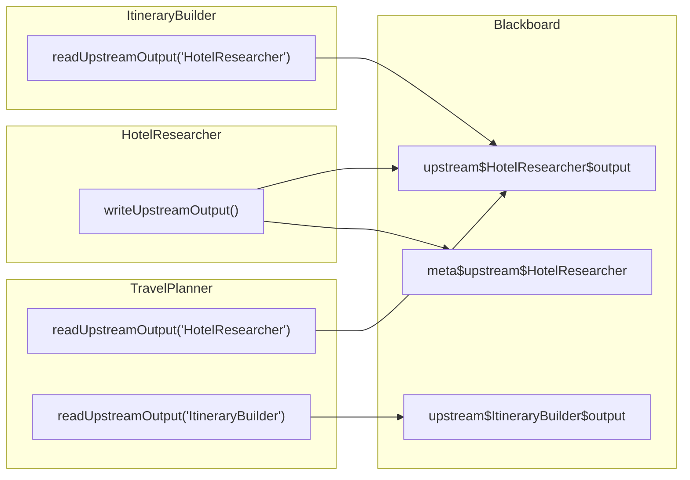

# H08：Blackboard 写入、锁定与上游结果管理

## 小林的酒店数据如何被下游消费

上一章（H07）讲到，事件通过 `FsEventStore` 持久化到 JSONL 文件。但事件只是"记录"，Agent 真正需要的是**数据本身**——`HotelResearcher` 找到的酒店列表必须能被 `ItineraryBuilder` 读取，`TravelPlanner` 也需要看到所有 Worker 的产出才能汇总。

本章回答：Blackboard 的 `sharedData` 如何被写入和读取？`UpstreamResults` 如何管理 DAG 中的数据流？

## 概念阶梯：上游结果不是"返回值"

初学者容易把 Agent 的产出理解为"函数返回值"。但在多 Agent 协作中，Agent 之间是异步的、并行的，不存在"调用-返回"的同步关系。

| 同步调用 | 异步协作 |
| --- | --- |
| `result = func()` | `blackboard.setData(key, result)` |
| 返回值直接传递 | 结果写入共享状态，下游自行读取 |
| 调用方等待被调用方 | 双方独立运行，通过事件同步 |
| 数据生命周期由调用栈管理 | 数据持久化到 Blackboard，可审计 |

`UpstreamResults` 就是用来管理这种"异步产出"的。

## 第一段源码：`UpstreamResults` 的设计

打开 [packages/core/src/modules/collaboration-runtime/session/upstream-results.ts](../../../../packages/core/src/modules/collaboration-runtime/session/upstream-results.ts)：

```ts
export class UpstreamResults {
  private blackboard: Blackboard;

  constructor(blackboard: Blackboard) {
    this.blackboard = blackboard;
  }
```

`UpstreamResults` 不直接存储数据，而是**委托给 Blackboard**。这意味着：

1. 上游产出通过 Blackboard 持久化。
2. 下游通过 Blackboard 读取。
3. 所有写入都带有 provenance（来源追踪）。

### 写入上游产出

```ts
writeUpstreamOutput(agentId: string, agentName: string, output: string): void {
  const outputKey = `upstream$${agentId}$output`;
  this.blackboard.setData(outputKey, output, agentId, {
    sourceUri: `dag-executor:upstream:${this.blackboard.sessionId}`,
    toolCallsCited: [],
  });

  // 同时写入上游元数据
  const metaKey = `meta$upstream$${agentId}`;
  const meta = {
    agentId,
    agentName,
    completedAt: new Date().toISOString(),
    outputLength: output.length,
  };
  this.blackboard.setData(metaKey, meta, "dag-executor", {
    sourceUri: `dag-executor:meta:${this.blackboard.sessionId}`,
  });
}
```

写入两个 key：

- `upstream$${agentId}$output`：实际产出内容。
- `meta$upstream$${agentId}`：元数据（完成时间、输出长度等）。

`sourceUri` 标记了数据来源：`dag-executor:upstream:${sessionId}`，便于审计。

### 读取上游产出

```ts
readUpstreamOutput(agentId: string, agentName: string): string {
  const outputKey = `upstream$${agentId}$output`;
  const value = this.blackboard.getData(outputKey);

  if (!value) {
    return `(上游 ${agentName} 尚未完成或无输出)`;
  }

  return String(value);
}
```

如果上游尚未完成，返回占位字符串而不是 `undefined`。这让下游 Agent 能优雅处理"数据尚未就绪"的情况。

### 检查上游完成状态

```ts
isUpstreamCompleted(agentId: string): boolean {
  const outputKey = `upstream$${agentId}$output`;
  return this.blackboard.getData(outputKey) !== undefined;
}
```

用于 DAG 执行器判断前置任务是否完成。

## 第二段源码：结构化 Memory Keys

[packages/core/src/modules/collaboration-runtime/session/memory-keys.ts](../../../../packages/core/src/modules/collaboration-runtime/session/memory-keys.ts) 定义了 Blackboard key 的命名规范：

```ts
export enum MemoryKeyPrefix {
  SWARM = "swarm",       // 协作 Agent 集群
  AGENT = "agent",       // 单个 Agent 状态
  SHARED = "shared",     // 跨 Agent 共享数据
  ONTOLOGY = "ontology",   // 本体相关
  UPSTREAM = "upstream",   // 上游产出
  METADATA = "metadata",   // 元数据
  PROJECT = "project",     // 项目上下文
}
```

键值格式：`<prefix>$<role>$<category>$<subkey>?$<tag>`

示例：

- `swarm$supervisor$status`：Supervisor 的状态
- `swarm$worker-coder$progress`：Worker 的进度
- `shared$hierarchy`：共享层级结构
- `upstream$HotelResearcher$output`：上游产出

### 键值构建器

```ts
export function buildSupervisorKey(
  category: MemoryKeyCategory,
  _sessionId: string,
  subkey?: string
): string {
  if (subkey) {
    return `${MemoryKeyPrefix.SWARM}$supervisor$${category}$${subkey}`;
  }
  return `${MemoryKeyPrefix.SWARM}$supervisor$${category}`;
}

export function buildWorkerKey(
  category: MemoryKeyCategory,
  workerId: string,
  subkey?: string
): string {
  if (subkey) {
    return `${MemoryKeyPrefix.SWARM}$worker-${workerId}$${category}$${subkey}`;
  }
  return `${MemoryKeyPrefix.SWARM}$worker-${workerId}$${category}`;
}
```

### 键值解析与过滤

```ts
export function parseMemoryKey(key: string): {
  prefix: string;
  role?: string;
  category?: string;
  subkey?: string;
} | null {
  const parts = key.split("$");
  if (parts.length < 2) return null;

  const prefix = parts[0]!;
  const validPrefixes = Object.values(MemoryKeyPrefix);
  if (!validPrefixes.includes(prefix as MemoryKeyPrefix)) {
    return null;
  }

  const role = parts[1];
  const category = parts[2];
  const subkey = parts.length > 3 ? parts.slice(3).join("$") : undefined;

  return { prefix, role, category, subkey };
}
```

过滤函数：

```ts
export function filterKeysByPrefix(keys: string[], prefix: MemoryKeyPrefix): string[] {
  return keys.filter(key => hasPrefix(key, prefix));
}

export function filterKeysByRole(keys: string[], role: string): string[] {
  return keys.filter(key => belongsToRole(key, role));
}
```

## 图解：DAG 中的数据流



## 失败路径与边界

### 边界 1：`readUpstreamOutput` 返回占位字符串

如果上游尚未完成，`readUpstreamOutput` 返回 `(上游 ${agentName} 尚未完成或无输出)`。这个设计让下游 Agent 能优雅处理，但也意味着：**下游必须能解析这个字符串并判断"数据尚未就绪"**。如果下游直接把这个字符串当作有效数据处理，就会出现错误。

### 边界 2：键值格式没有强制约束

`memory-keys.ts` 提供了构建器和解析器，但 Blackboard 本身不验证 key 的格式。Agent 可以直接调用 `setData("任意字符串", ...)`，绕过命名规范。这是约定而非强制。

### 边界 3：`UpstreamResults` 只管理字符串产出

`writeUpstreamOutput` 的 `output` 参数类型是 `string`。如果 Agent 的产出是结构化数据（如 JSON 对象），需要先序列化为字符串。这增加了使用方的心智负担。

### 边界 4：元数据与数据分离

`outputKey` 和 `metaKey` 是两个独立的 key。如果写入 `outputKey` 成功但写入 `metaKey` 失败（虽然概率很低），就会出现"数据存在但元数据缺失"的不一致状态。

## 测试证据与缺口

### 已覆盖的测试

- `packages/core/src/modules/collaboration-runtime/__tests__/upstream-results.test.ts`（如有）：应覆盖 write/read/isCompleted 的基本行为。

### 测试缺口

- 没有针对"上游未完成时返回占位字符串"的测试。
- 没有针对键值解析器 `parseMemoryKey` 的边界测试（如非法格式、空字符串等）。
- 没有针对并发写入同一 key 的测试。

## 小实验

1. 打开 [packages/core/src/modules/collaboration-runtime/session/memory-keys.ts](../../../../packages/core/src/modules/collaboration-runtime/session/memory-keys.ts)，用 `buildWorkerKey` 构建一个 key，然后用 `parseMemoryKey` 解析它。验证解析结果是否与输入一致。
2. 为什么 `UpstreamResults` 不直接存储数据，而是委托给 Blackboard？如果直接存储在内存 Map 中，会有什么风险？
3. 设计一个测试用例：验证 `UpstreamResults` 在并发写入时的行为。

## 口头验收

不看源码，你能解释：

1. `UpstreamResults` 和 Blackboard 的关系是什么？
2. `writeUpstreamOutput` 写入几个 key？分别是什么？
3. `readUpstreamOutput` 在上游未完成时返回什么？为什么这样设计？
4. Memory Key 的命名规范是什么？`parseMemoryKey` 能解析哪些字段？
5. 如果 DAG 执行器需要等待多个上游完成，应该如何使用 `isUpstreamCompleted`？

## 章节收束

本章讲解了 Blackboard 的写入边界和上游结果管理：`UpstreamResults` 通过 Blackboard 持久化上游产出，使用结构化的 Memory Key 命名规范，支持下游异步读取。所有写入都带有 provenance，支持审计。

下一章（H09）会深入结构化 Memory Keys 的设计哲学，讲解 Ruflo-style key 的命名约定和过滤机制。
