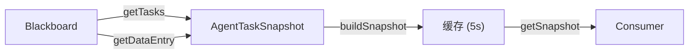

# H10：`AgentTaskSnapshot` 与会话状态恢复

## 小林的协作会话崩溃后

假设小林的旅行协作会话正在运行，`HotelResearcher` 和 `ItineraryBuilder` 并行工作。突然，应用进程崩溃（或用户刷新了页面）。重启后，系统如何恢复到崩溃前的状态？

本章回答：`AgentTaskSnapshot` 如何捕获任务状态？崩溃后如何恢复？

## 概念阶梯：快照不是备份

| 特性 | 备份（Backup） | 快照（Snapshot） |
| --- | --- | --- |
| 频率 | 定期（每天/每小时） | 实时或近实时 |
| 粒度 | 整个系统/数据库 | 特定对象（如任务状态） |
| 目的 | 灾难恢复 | 快速恢复、监控、审计 |
| 大小 | 大 | 小 |

`AgentTaskSnapshot` 捕获的是**任务级别的状态**，不是整个系统的备份。

## 第一段源码：`AgentTaskSnapshot` 的数据结构

打开 [packages/core/src/modules/collaboration-runtime/session/agent-task-snapshot.ts](../../../../packages/core/src/modules/collaboration-runtime/session/agent-task-snapshot.ts)：

```ts
export interface AgentTaskSnapshotData {
  agentId: string;
  agentName: string;
  activeTask?: {
    taskId: string;
    description: string;
    status: "running" | "assigned";
    assignedAt: string;
    startedAt?: string;
    progress?: WorkerProgressData;
  };
  recentTerminalTask?: {
    taskId: string;
    description: string;
    status: "completed" | "failed" | "reported";
    completedAt: string;
    output?: string;
  };
  resourceUsage?: {
    memoryMbAvg: number;
    cpuPercentageAvg: number;
    taskCount: number;
  };
  blockedStatus?: {
    blockedOn: string;
    waitingFor: string[];
    since: string;
  };
}
```

每个 Agent 的快照包含：

- `activeTask`：当前活跃任务（running/assigned）。
- `recentTerminalTask`：最近的终端任务（completed/failed/reported）。
- `resourceUsage`：资源使用统计。
- `blockedStatus`：阻塞状态。

## 第二段源码：快照构建

```ts
export class AgentTaskSnapshot {
  private blackboard: Blackboard;
  private cachedSnapshot?: WorkspaceTaskSnapshot;
  private cacheExpiryMs: number = 5_000; // 5 秒缓存
  private lastRefreshAt: number = 0;
  private pendingInvalidation: boolean = false;

  async getSnapshot(forceRefresh = false): Promise<WorkspaceTaskSnapshot> {
    const now = Date.now();

    if (!forceRefresh && !this.pendingInvalidation && this.cachedSnapshot && (now - this.lastRefreshAt) < this.cacheExpiryMs) {
      return this.cachedSnapshot;
    }

    this.pendingInvalidation = false;
    const snapshot = await this.buildSnapshot();

    this.cachedSnapshot = snapshot;
    this.lastRefreshAt = now;
    return snapshot;
  }
```

缓存策略：

- 默认 5 秒缓存，避免频繁构建快照。
- `forceRefresh` 参数强制刷新。
- `invalidate()` 方法标记缓存失效。

## 第三段源码：从 Blackboard 读取状态

```ts
private async buildAgentSnapshot(
  agentId: string,
  _allTasks: TaskItem[],
  activeTasks: TaskItem[],
  completedTasks: TaskItem[],
  failedTasks: TaskItem[],
  blockedTasks: TaskItem[]
): Promise<AgentTaskSnapshotData> {
  const activeTask = activeTasks.find((t) => t.assignedTo === agentId);
  const recentTerminalTask = [...completedTasks, ...failedTasks, ...blockedTasks]
    .filter((t) => t.assignedTo === agentId)
    .sort((a, b) => {
      const timeA = ((a.completedAt && new Date(a.completedAt).getTime()) ?? 0) as number;
      const timeB = ((b.completedAt && new Date(b.completedAt).getTime()) ?? 0) as number;
      return timeB - timeA;
    })[0];

  // 读取进度
  const progressEntry = this.blackboard.getDataEntry(
    buildWorkerKey(MemoryKeyCategory.PROGRESS, agentId)
  );
  const progress: WorkerProgressData | undefined = progressEntry?.value as WorkerProgressData | undefined;

  // 读取阻塞状态
  const blockedEntry = this.blackboard.getDataEntry(
    buildWorkerKey(MemoryKeyCategory.BLOCKED, agentId)
  );
  const blockedStatus = blockedEntry?.value as
    | { blockedOn: string; waitingFor: string[]; since: string }
    | undefined;

  return {
    agentId,
    agentName: this.blackboard.getAgentName(agentId),
    activeTask: activeTask ? { /* ... */ } : undefined,
    recentTerminalTask: recentTerminalTask ? { /* ... */ } : undefined,
    resourceUsage: this.calculateResourceUsage(agentId),
    blockedStatus,
  };
}
```

关键设计：快照数据来自 Blackboard，而不是独立存储。这意味着：

1. **一致性**：快照总是反映 Blackboard 的最新状态。
2. **简化**：不需要独立的持久化机制。
3. **依赖**：Blackboard 必须可访问，否则快照无法构建。

## 图解：快照构建流程



## 失败路径与边界

### 边界 1：缓存过期与状态不一致

`cacheExpiryMs` 默认 5 秒，意味着快照最多滞后 5 秒。对于监控场景，这通常可接受。但如果需要实时状态，必须设置 `forceRefresh: true`。

### 边界 2：`getAgentName` 的占位实现

`this.blackboard.getAgentName(agentId)` 当前返回 `agentId` 本身（占位实现）。这意味着 `agentName` 字段实际上没有提供额外信息。

### 边界 3：资源使用统计的准确性

`calculateResourceUsage` 从 Blackboard 读取 `METRICS` 数据，但这些数据由谁写入？如果 Agent 没有定期上报资源使用，统计就会缺失。

## 测试证据与缺口

### 测试缺口

- 没有针对缓存过期策略的测试。
- 没有针对 `getAgentName` 占位实现的测试。
- 没有针对资源使用统计缺失的测试。

## 口头验收

不看源码，你能解释：

1. `AgentTaskSnapshot` 和 Blackboard 的关系是什么？
2. 为什么快照要缓存？缓存过期时间是多少？
3. `activeTask` 和 `recentTerminalTask` 的区别是什么？
4. 如果 Blackboard 不可访问，`AgentTaskSnapshot` 会怎样？
5. 如何强制刷新快照？

## 章节收束

本章讲解了 `AgentTaskSnapshot` 的设计：从 Blackboard 读取任务状态，构建 Agent 级别的快照，支持缓存和强制刷新。快照数据来自 Blackboard，确保了一致性。

下一章（H11）会进入 `OrphanReconciler`，讲解孤儿会话的检测与回收。
