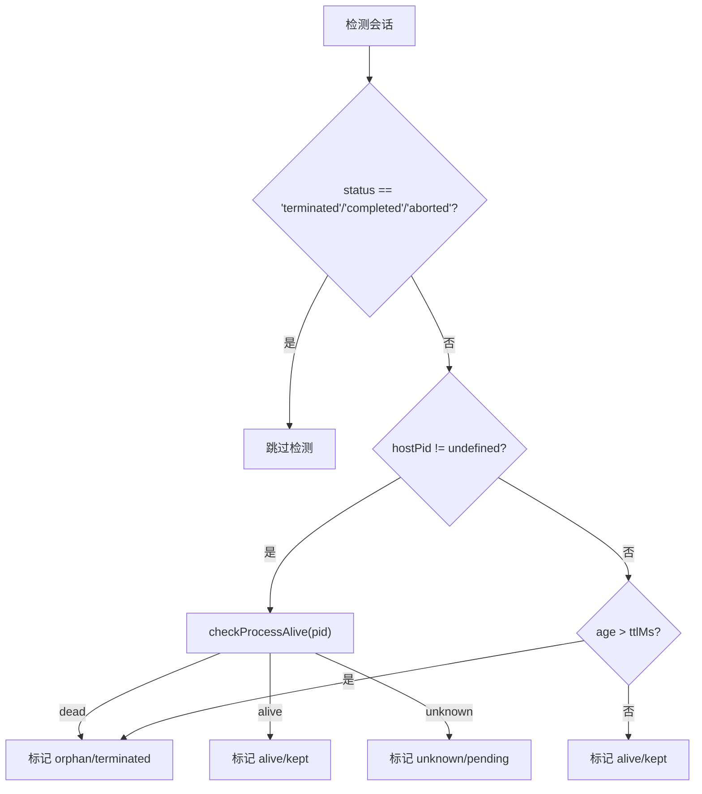

# H11：`OrphanReconciler` 与孤儿会话回收

## 小林的会话为什么被标记为"terminated"

上一章（H10）讲到，`AgentTaskSnapshot` 可以捕获任务状态。但有一个更基础的问题：如果创建会话的进程已经崩溃，会话状态再完整也没有意义。系统如何检测并回收这些"孤儿"会话？

本章回答：`OrphanReconciler` 如何检测孤儿会话？PID 检测和 TTL 兜底分别适用于什么场景？

## 概念阶梯：孤儿不是"没人管"，而是"宿主已死"

| 状态 | 含义 | 例子 |
| --- | --- | --- |
| `completed` | 正常完成 | 所有任务执行完毕 |
| `aborted` | 主动中止 | 用户点击"取消" |
| `terminated` | 被动终止 | 宿主进程崩溃，被孤儿回收器标记 |

`terminated` 和 `aborted` 的区别：

- `aborted`：用户或系统主动中止，数据可能完整。
- `terminated`：宿主进程已死，数据可能不完整，需要清理。

## 第一段源码：`checkProcessAlive`

打开 [packages/core/src/modules/collaboration-runtime/session/orphan-reconciler.ts](../../../../packages/core/src/modules/collaboration-runtime/session/orphan-reconciler.ts)：

```ts
export function checkProcessAlive(pid: number): "alive" | "dead" | "unknown" {
  try {
    process.kill(pid, 0);
    return "alive";
  } catch (err) {
    const error = err as NodeJS.ErrnoException;
    if (error.code === "ESRCH") return "dead";
    if (error.code === "EPERM") return "alive";
    return "unknown";
  }
}
```

`process.kill(pid, 0)` 是 Node.js 的"零信号"检测：不发送任何信号，只检查进程是否存在。

返回值：

- `"alive"`：进程存在。
- `"dead"`：`ESRCH`（No such process），进程不存在。
- `"unknown"`：`EPERM`（Permission denied）或其他错误，无法判断。

## 第二段源码：`OrphanReconciler` 的检测逻辑

```ts
private checkSession(session: CollaborationSession): OrphanReport {
  // 已经终止的会话不需要检测
  if (session.status === "terminated" || session.status === "completed" || session.status === "aborted") {
    return {
      sessionId: session.id,
      hostPid: session.hostPid ?? null,
      status: "alive",
      reason: "already_terminal",
      action: "kept",
    };
  }

  // 有 PID：检测进程存活
  if (session.hostPid !== undefined) {
    const alive = checkProcessAlive(session.hostPid);
    if (alive === "dead") {
      return {
        sessionId: session.id,
        hostPid: session.hostPid,
        status: "orphan",
        reason: `ESRCH: process ${session.hostPid} is dead`,
        action: "terminated",
      };
    }
    if (alive === "alive") {
      return {
        sessionId: session.id,
        hostPid: session.hostPid,
        status: "alive",
        reason: `EPERM or alive: process ${session.hostPid} is running`,
        action: "kept",
      };
    }
    return {
      sessionId: session.id,
      hostPid: session.hostPid,
      status: "unknown",
      reason: `unknown: process ${session.hostPid} check inconclusive`,
      action: "pending",
    };
  }

  // 无 PID：TTL 兜底检查
  const updatedAt = new Date(session.updatedAt).getTime();
  const ageMs = Date.now() - updatedAt;
  if (ageMs > this.ttlMs) {
    return {
      sessionId: session.id,
      hostPid: null,
      status: "orphan",
      reason: `TTL expired: last updated ${Math.round(ageMs / 60000)}min ago (threshold: ${Math.round(this.ttlMs / 60000)}min)`,
      action: "terminated",
    };
  }

  return {
    sessionId: session.id,
    hostPid: null,
    status: "alive",
    reason: `within TTL (${Math.round(ageMs / 60000)}min < ${Math.round(this.ttlMs / 60000)}min)`,
    action: "kept",
  };
}
```

检测优先级：

1. **已终止**：跳过检测。
2. **有 PID**：检测进程存活。
3. **无 PID**：TTL 兜底检查（默认 24 小时）。

## 第三段源码：回收流程

```ts
async runReconciliation(sessions: CollaborationSession[]): Promise<OrphanReport[]> {
  const reports = await this.detectOrphans(sessions);

  // 额外检查无 PID 的 TTL 过期会话
  const ttlReports = await this.checkTTLExpired(sessions);
  const allReports = [...reports, ...ttlReports];

  const terminated = allReports.filter((r) => r.action === "terminated");
  if (terminated.length > 0) {
    const reconciled = await this.reconcile(sessions, allReports);
    await this.saveSessions(reconciled);
  }

  return allReports;
}
```

回收流程：

1. **检测孤儿**：遍历所有 running/created 状态的会话。
2. **TTL 兜底**：额外检查无 PID 的 TTL 过期会话。
3. **标记终止**：将孤儿会话标记为 `terminated`。
4. **持久化**：保存更新后的会话状态。

## 图解：孤儿检测流程



## 失败路径与边界

### 边界 1：`EPERM` 被当作 alive

`checkProcessAlive` 对 `EPERM` 返回 `"alive"`。这是因为：如果进程存在但当前用户没有权限发送信号，`kill` 会返回 `EPERM`。此时进程实际上是存活的，只是无法验证。但这也意味着：**如果进程实际上已死，但由于权限问题返回 `EPERM`，会被误判为 alive**。

### 边界 2：TTL 兜底可能误删

TTL 默认 24 小时。如果一个会话正在运行，但由于某种原因（如进程休眠）超过 24 小时没有更新 `updatedAt`，就会被误判为孤儿并回收。这是一个保守的策略，但可能误删长时间运行的任务。

### 边界 3：`unknown` 状态不处理

`checkProcessAlive` 返回 `"unknown"` 时，`checkSession` 返回 `action: "pending"`。但 `runReconciliation` 只处理 `action === "terminated"` 的报告，`pending` 状态的会话不会被进一步处理。这意味着：**如果 PID 检测返回 unknown，会话会一直挂起**。

## 测试证据与缺口

### 已覆盖的测试

- `packages/core/src/modules/collaboration-runtime/session/__tests__/orphan-reconciler.test.ts`：应覆盖 PID 检测、TTL 检测、回收流程。

### 测试缺口

- 没有针对 `EPERM` 误判的测试。
- 没有针对 TTL 误删的测试。
- 没有针对 `unknown` 状态挂起的测试。

## 小实验

1. 打开 [packages/core/src/modules/collaboration-runtime/session/orphan-reconciler.ts](../../../../packages/core/src/modules/collaboration-runtime/session/orphan-reconciler.ts)，画出 `checkSession` 的决策树。
2. 为什么 `EPERM` 被当作 `alive`？什么情况下会出现 `EPERM`？
3. 设计一个测试用例：验证 TTL 过期会话被正确回收。
4. 如果 `hostPid` 是 `undefined`，`checkSession` 会走哪条分支？为什么？

## 口头验收

不看源码，你能解释：

1. `checkProcessAlive` 的三种返回值分别代表什么？
2. `OrphanReconciler` 的检测优先级是什么？
3. `terminated` 和 `aborted` 的区别是什么？
4. TTL 兜底策略可能误删哪些会话？
5. `unknown` 状态的会话会被如何处理？

## 章节收束

本章讲解了 `OrphanReconciler` 的设计：通过 PID 检测和 TTL 兜底，检测并回收孤儿会话。PID 检测优先，TTL 兜底用于无 PID 的场景。`EPERM` 被保守地当作 alive，可能误判。

下一章（H12）会进入 Facade 层，讲解 `session-store`、`event-bus`、`dag-runner` 等模块如何组装对外 API。
