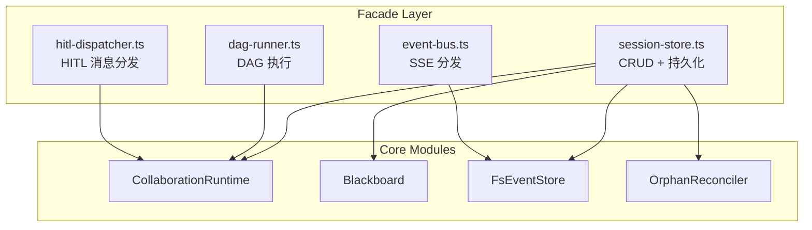

# H12：Facade 层——session-store、event-bus 与组装

## 小林的协作请求如何被处理

前 11 章讲解了 Collaboration Runtime 的内部机制。但用户（或 API）不会直接调用 `Blackboard.setData` 或 `FsEventStore.append`，而是通过一个** facade 层** 来组装这些能力。

本章回答：Facade 层如何组装 Collaboration Runtime 的各组件？`session-store`、`event-bus`、`dag-runner` 分别承担什么职责？

## 概念阶梯：Facade 不是"多余的中间层"

初学者容易把 Facade 理解为"多余的包装"。实际上，Facade 解决三个问题：

| 问题 | 没有 Facade | 有 Facade |
| --- | --- | --- |
| 依赖组装 | API route 需要知道所有内部模块 | API route 只依赖 Facade |
| 生命周期 | 各模块独立初始化，顺序混乱 | Facade 统一管理初始化顺序 |
| 接口稳定 | 内部重构影响所有调用方 | Facade 屏蔽内部变化 |

## 第一段源码：`facade/index.ts` 的组装逻辑

打开 [packages/core/src/modules/collaboration-runtime/facade/index.ts](../../../../packages/core/src/modules/collaboration-runtime/facade/index.ts)：

```ts
export async function createSession(input: CreateSessionInput): Promise<CollaborationSession> {
  // AG.2: agentDefinitionParser 通过动态 import 从 lib/integrations 获取
  const { parseAgentDefinition, parseToolDefinition } = await import("../../../lib/integrations/pi-agent/persistent-agent");
  return _createSession(input, eventEmitter, { parseAgentDefinition, parseToolDefinition });
}
```

关键设计：**动态 import**。`parseAgentDefinition` 和 `parseToolDefinition` 通过动态 import 从 `lib/integrations` 获取，避免在模块顶层 import（违反模块边界规约）。

## 第二段源码：`session-store.ts` 的持久化

[session-store.ts](../../../../packages/core/src/modules/collaboration-runtime/facade/session-store.ts) 管理会话的 CRUD 和持久化：

```ts
export async function createSession(input: CreateSessionInput, emitter: EventEmitter, agentDefinitionParser?: AgentDefinitionParser): Promise<CollaborationSession> {
  const id = generateId();
  const now = new Date().toISOString();

  const session: CollaborationSession = {
    id,
    projectId: input.projectId,
    globalGoal: input.globalGoal,
    status: "created",
    createdAt: now,
    updatedAt: now,
    config: { /* ... */ },
  };

  // 记录宿主进程 PID
  const sessionWithPid = new OrphanReconciler(getProjectStateDir(projectId)).recordPid(session);
  sessions.set(id, sessionWithPid);

  // 持久化到磁盘
  await saveProjectSessions(projectId);

  // 创建 EventStore
  const store = new FsEventStore(sessionDir);
  eventStores.set(id, store);

  // 创建 Blackboard
  const bb = new Blackboard(id, snapshotDir);
  blackboards.set(id, bb);

  // 注册到 Runtime
  getRuntime(emitter, agentDefinitionParser).createSession(sessionWithPid);

  return sessionWithPid;
}
```

`createSession` 的组装流程：

1. 生成 session ID。
2. 创建 `CollaborationSession`。
3. 记录 PID（孤儿检测）。
4. 持久化到磁盘。
5. 创建 `FsEventStore`。
6. 创建 `Blackboard`。
7. 注册到 `CollaborationRuntime`。

## 第三段源码：`event-bus.ts` 的 SSE 分发

[event-bus.ts](../../../../packages/core/src/modules/collaboration-runtime/facade/event-bus.ts) 实现 SSE（Server-Sent Events）客户端管理和事件分发：

```ts
class SseEventEmitter implements EventEmitter {
  private sessionClients = new Map<string, SseClient[]>();

  emit(event: RuntimeEvent): void {
    const data = JSON.stringify(event);
    const targets = this.sessionClients.get(event.sessionId) ?? [];
    for (const client of targets) {
      try {
        client.send("message", data);
      } catch {
        // client disconnected, will be cleaned up
      }
    }
  }
}
```

SSE 客户端管理：

- `registerClient`：注册客户端，取消 grace 定时器。
- `unregisterClient`：移除客户端，启动 grace 定时器。
- `startGraceTimer`：30 秒 grace 期，允许页面刷新后重连。

## 图解：Facade 层的组装关系



## 失败路径与边界

### 边界 1：动态 import 的延迟

`createSession` 使用动态 import 获取 `parseAgentDefinition`。这意味着：如果 `persistent-agent` 模块加载失败，`createSession` 会失败，而不是在模块加载时就失败。调用方需要处理这个异步错误。

### 边界 2：全局状态的生命周期

`session-store.ts` 使用 `globalThis.__collaborationSessions` 存储会话。这意味着：会话数据在进程级别共享，但不会在进程间共享。如果应用是多进程的（如 cluster 模式），每个进程有自己的会话副本。

### 边界 3：SSE grace 期不终止会话

`startGraceTimer` 在 grace 期结束后只记录日志，不自动终止会话。这意味着：如果用户关闭页面后不再打开，会话会一直运行直到超时。这是设计选择（由 window 关闭时手动回收），但可能导致资源泄漏。

## 测试证据与缺口

### 测试缺口

- 没有针对动态 import 失败的测试。
- 没有针对多进程会话共享的测试。
- 没有针对 SSE grace 期后资源泄漏的测试。

## 口头验收

不看源码，你能解释：

1. Facade 层的作用是什么？为什么需要 Facade？
2. `createSession` 的组装流程是什么？
3. `event-bus.ts` 如何管理 SSE 客户端？grace 期的作用是什么？
4. 动态 import 有什么优势和风险？
5. 全局状态 `globalThis.__collaborationSessions` 的生命周期是什么？

## 章节收束

本章讲解了 Facade 层的设计：`session-store.ts` 管理会话 CRUD 和持久化，`event-bus.ts` 管理 SSE 客户端和事件分发。Facade 通过组装内部模块，为 API route 提供稳定的公共接口。

下一章（H13）是 Unit 2 的小结课，会回顾事件流与状态持久化的核心概念。
