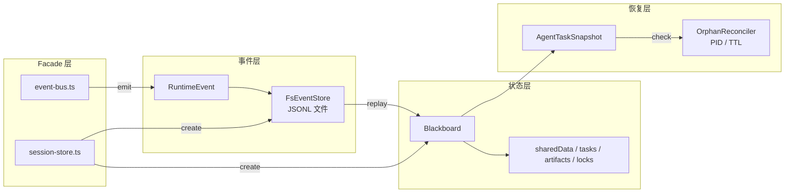

# H13：单元小结课——事件流与状态持久化排查

## 本单元回顾

Unit 2（H07-H12）从事件存储的 append-only 语义讲起，到 Facade 层的组装结束。让我们回顾核心概念。

## 层次图：事件流与状态持久化



## 核心概念对照表

### EventStore vs FsEventStore

| 维度 | EventStore（接口） | FsEventStore（实现） |
| --- | --- | --- |
| 职责 | 定义事件存储的契约 | 基于文件系统的实现 |
| 方法 | append, read, checkpoint, list | 同上 |
| 持久化 | 不指定 | JSONL 文件 |
| 并发 | 不指定 | Promise 链串行化 |

### Blackboard 的五种数据类型

| 类型 | 用途 | 典型操作 |
| --- | --- | --- |
| `sharedData` | 共享键值数据 | `setData`, `getData`, `correctData` |
| `tasks` | 任务队列 | `createTask`, `assignTask`, `completeTask` |
| `artifacts` | 协作产物 | `addArtifact`, `getArtifact` |
| `locks` | 并发控制 | `lock`, `release`, `isLocked` |
| `messages` | Agent 通信 | `sendMessage`, `getMessages` |

### 恢复机制对比

| 机制 | 触发时机 | 恢复粒度 | 局限 |
| --- | --- | --- | --- |
| `AgentTaskSnapshot` | 按需构建 | 任务状态 | 依赖 Blackboard |
| `OrphanReconciler` | 定期检测 | 会话级别 | PID 可能误判 |
| `FsEventStore` | 事件回放 | 完整事件历史 | 文件可能损坏 |

## 正向追踪：从事件到状态

```
Agent 产生事件
  → EventStore.append(event)
    → JSONL 文件追加
      → Blackboard.applyEvent(event)
        → 更新 sharedData / tasks / messages
          → AgentTaskSnapshot.buildSnapshot()
            → 缓存快照
```

## 反向诊断：从症状定位责任层

| 症状 | 可能的责任层 | 排查方向 |
| --- | --- | --- |
| 事件丢失 | EventStore | 检查 JSONL 文件是否完整 |
| 状态未恢复 | Blackboard | 检查 `fromEvents` 是否正确重放 |
| 会话未回收 | OrphanReconciler | 检查 PID 检测和 TTL 设置 |
| SSE 客户端收不到事件 | event-bus | 检查 `registerClient` 和 `emit` |
| 数据冲突 | Blackboard locks | 检查 `lock` 和 `setData` 的顺序 |

## 源码覆盖台账（Unit 2）

| 文件路径 | 状态 | 主讲章节 | 关键代码窗口 |
| --- | --- | --- | --- |
| `session/event-store.ts` | ✅ 精读 | H07 | `EventStore` 接口 |
| `session/fs-event-store.ts` | ✅ 精读 | H07 | `FsEventStore` 实现 |
| `session/blackboard.ts` | ✅ 精读 | H08 | `setData`, `getData`, `lock` |
| `session/upstream-results.ts` | ✅ 精读 | H08 | `writeUpstreamOutput`, `readUpstreamOutput` |
| `session/memory-keys.ts` | ✅ 精读 | H09 | `build*Key`, `parseMemoryKey` |
| `session/agent-task-snapshot.ts` | ✅ 精读 | H10 | `AgentTaskSnapshot` 类 |
| `session/orphan-reconciler.ts` | ✅ 精读 | H11 | `checkProcessAlive`, `runReconciliation` |
| `facade/index.ts` | ✅ 精读 | H12 | `createSession` |
| `facade/session-store.ts` | ✅ 精读 | H12 | `createSession`, `listSessions` |
| `facade/event-bus.ts` | ✅ 精读 | H12 | `SseEventEmitter`, `registerClient` |

## 口头验收

不看源码，你能解释：

1. `EventStore` 为什么设计为 append-only？
2. `FsEventStore` 如何保证同一 session 的并发写入顺序？
3. `AgentTaskSnapshot` 和 Blackboard 的关系是什么？
4. `OrphanReconciler` 的检测优先级是什么？
5. Facade 层的作用是什么？

## 下一单元预告

Unit 3（H14-H21）将深入拓扑解析、DAG 执行与 Supervisor 协调：

- 拓扑解析器：从 manifest 到 `AgentNode`/`CollaborationEdge`
- 模式路由器：`workflow` vs `system`
- DAG 执行器：线性、并行、汇总
- Supervisor 核心：任务分解与 Worker 分配

核心问题：**给定一个由多个 Agent 组成的协作拓扑，系统如何决定执行策略？**
