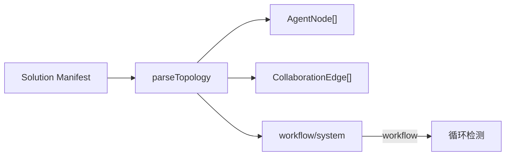

# H14：拓扑解析器——从 manifest 到 `AgentNode`/`CollaborationEdge`

## 小林的协作拓扑长什么样

上一单元（H13）结束时，我们已经知道事件如何被存储、状态如何被恢复。但有一个关键问题还没回答：系统怎么知道 `TravelPlanner`、`HotelResearcher`、`ItineraryBuilder` 这三个 Agent 应该按什么顺序协作？

答案在**协作拓扑（Collaboration Topology）**。本章回答：拓扑解析器如何从 Solution Manifest 中解析出 Agent 节点和协作边？如何检测循环依赖？

## 概念阶梯：拓扑不是"流程图"

初学者容易把拓扑理解为"流程图"（先 A 后 B 再 C）。实际上，拓扑描述的是**Agent 之间的协作关系**，而不是严格的执行顺序。

| 概念 | 流程图 | 协作拓扑 |
| --- | --- | --- |
| 节点 | 步骤/任务 | Agent（角色） |
| 边 | 执行顺序 | 协作关系（trigger/notify/depend） |
| 方向 | 单向 | 可能有双向 |
| 循环 | 不允许 | 在 system 模式下允许 |

## 第一段源码：`parseTopology` 函数

打开 [packages/core/src/modules/collaboration-runtime/engine/topology-parser.ts](../../../../packages/core/src/modules/collaboration-runtime/engine/topology-parser.ts)：

```ts
export function parseTopology(manifest: SolutionManifest): CollaborationTopology {
  const agents = parseAgents(manifest.agents ?? []);
  const edges = parseEdges(manifest.collaboration?.edges ?? []);

  const entryPoints = findEntryPoints(agents, edges);
  const exitPoints = findExitPoints(agents, edges);
  const mode = determineMode(edges);
  // System 模式允许双向通信，只在 Workflow 模式检测循环
  if (mode === "workflow") {
    detectCycles(agents, edges);
  }

  return { agents, edges, entryPoints, exitPoints, mode };
}
```

解析流程：

1. `parseAgents`：解析 Agent 定义列表。
2. `parseEdges`：解析协作边列表。
3. `findEntryPoints`：找出无入边的 Agent（入口点）。
4. `findExitPoints`：找出无出边的 Agent（出口点）。
5. `determineMode`：判定执行模式（workflow/system）。
6. `detectCycles`：检测循环依赖（仅 workflow 模式）。

## 第二段源码：`parseAgents` 和 `extractCapabilities`

```ts
function parseAgents(agents: ManifestAgent[]): Record<string, AgentNode> {
  const result: Record<string, AgentNode> = {};

  for (const a of agents) {
    const capabilities = extractCapabilities(a.responsibility);
    result[a.id] = {
      id: a.id,
      name: a.name,
      domain: a.domain ?? a.businessDomain ?? "",
      responsibility: a.responsibility,
      capabilities,
      dataOperations: a.dataOperations ?? {},
      skills: a.skills ?? [],
    };
  }

  return result;
}
```

`extractCapabilities` 从 `responsibility` 文本中提取能力关键词：

```ts
function extractCapabilities(responsibility: string): string[] {
  const sentences = responsibility
    .split(/[.;，。；\n]/)
    .map((s) => s.trim())
    .filter(Boolean);

  return sentences
    .map((s) => {
      const match = s.match(/^(?:负责|处理|管理|执行|分析|生成|创建|验证|协调|驱动|实现)\s*[:：]?\s*(.{2,30}?)(?:，|,|。|;|$)/i)
        ?? s.match(/^(\w+(?:\s+\w+){0,3})\s*[-:：]/);
      return match ? match[1]?.trim() ?? s.slice(0, 30).trim() : s.slice(0, 30).trim();
    })
    .filter((c) => c.length > 1);
}
```

能力提取策略：

- 按句号/分号分割句子。
- 提取以"负责/处理/管理/执行/分析/生成/创建/验证/协调/驱动/实现"开头的短语。
- 如果没有匹配，取前 30 个字符。

## 第三段源码：`determineMode` 和 `detectCycles`

```ts
function determineMode(edges: CollaborationEdge[]): "workflow" | "system" {
  const hasNotifyOrDepend = edges.some(
    (e) => e.type === "notify" || e.type === "depend"
  );
  if (hasNotifyOrDepend) return "system";

  // 双向 trigger（A→B 且 B→A）= hub-and-spoke 汇报模式 → System
  const triggerPairs = new Set(
    edges.filter((e) => e.type === "trigger").map((e) => `${e.from}→${e.to}`)
  );
  const hasBidirectional = edges.some(
    (e) => e.type === "trigger" && triggerPairs.has(`${e.to}→${e.from}`)
  );
  return hasBidirectional ? "system" : "workflow";
}
```

模式判定规则：

1. 如果有 `notify` 或 `depend` 边 → **system** 模式。
2. 如果有双向 `trigger` 边 → **system** 模式。
3. 否则 → **workflow** 模式。

`detectCycles` 使用 DFS 三色标记法检测循环：

```ts
function detectCycles(agents: Record<string, AgentNode>, edges: CollaborationEdge[]): void {
  const adj: Record<string, string[]> = {};
  // 构建邻接表（只含 trigger/depend 边）
  for (const e of edges) {
    if (e.type === "notify") continue; // notify 允许双向
    if (adj[e.from]) {
      adj[e.from]!.push(e.to);
    }
  }

  // DFS 三色标记法
  const WHITE = 0; // 未访问
  const GRAY = 1;  // 正在访问
  const BLACK = 2; // 已访问完成

  function dfs(node: string): boolean {
    color[node] = GRAY;
    cycle.push(node);

    for (const neighbor of adj[node] ?? []) {
      if (color[neighbor] === GRAY) {
        // 找到循环
        const cycleStart = cycle.indexOf(neighbor);
        const cyclePath = cycle.slice(cycleStart).join(" → ");
        throw new Error(`Circular dependency detected: ${cyclePath} → ${neighbor}`);
      }
      if (color[neighbor] === WHITE) {
        if (dfs(neighbor)) return true;
      }
    }

    color[node] = BLACK;
    cycle.pop();
    return false;
  }
}
```

## 图解：拓扑解析流程



## 失败路径与边界

### 边界 1：`extractCapabilities` 是启发式的

能力提取基于正则表达式匹配，可能提取不准确。例如："负责酒店搜索和预订" 可能被提取为 "酒店搜索和预订"，而不是两个独立的能力。

### 边界 2：`notify` 边不参与循环检测

`detectCycles` 忽略 `notify` 边，因为 `notify` 是发布-订阅模式，允许双向。但如果 `notify` 和 `trigger` 混合使用，可能产生意想不到的循环。

### 边界 3：双向 `trigger` 被强制转为 system 模式

如果拓扑中有双向 `trigger` 边，系统会强制转为 system 模式。这意味着：即使开发者意图是 workflow 模式，系统也会按 system 模式执行。

## 测试证据与缺口

### 测试缺口

- 没有针对 `extractCapabilities` 准确性的测试。
- 没有针对混合边类型（trigger + notify）循环检测的测试。

## 口头验收

不看源码，你能解释：

1. `parseTopology` 的输入和输出分别是什么？
2. `determineMode` 的判定规则是什么？
3. `detectCycles` 为什么忽略 `notify` 边？
4. `extractCapabilities` 的提取策略是什么？有什么局限？
5. 如果拓扑中有循环依赖，系统会怎么处理？

## 章节收束

本章讲解了拓扑解析器的设计：从 Solution Manifest 解析 Agent 节点和协作边，判定执行模式，检测循环依赖。`extractCapabilities` 从 responsibility 文本中提取能力关键词，`determineMode` 根据边类型判定 workflow/system 模式。

下一章（H15）会深入模式路由器，讲解 workflow 和 system 模式的详细区别。
