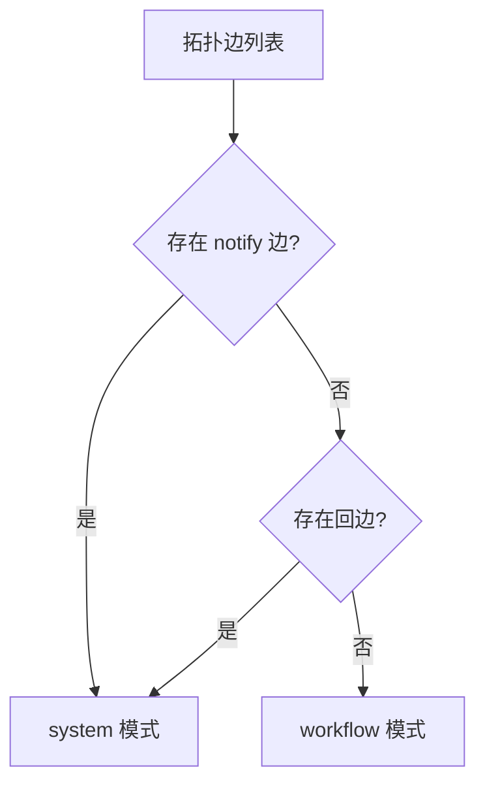

# H15：模式路由器——`workflow` vs `system`

## 小林的旅行规划走什么模式

上一章（H14）讲到，拓扑解析器从 Solution Manifest 中解析出 Agent 节点和协作边。但解析出来后，系统还需要决定：**这些 Agent 应该按什么模式协作？**

本章回答：`mode-router.ts` 如何根据拓扑边类型选择执行模式？

## 概念阶梯：workflow 和 system 不是"二选一"

| 维度 | workflow 模式 | system 模式 |
| --- | --- | --- |
| 边的类型 | 全是 `trigger` | 存在 `notify`/`depend` |
| 执行顺序 | DAG 拓扑排序 | 依赖满足即可并行 |
| 上下文传递 | Handoff（A 输出 → B 输入） | 共享 Blackboard |
| 冲突检测 | 不需要 | 需要 |
| 适用场景 | 固定流程（如 CI/CD） | 动态协作（如头脑风暴） |

## 第一段源码：`selectExecutionMode`

打开 [packages/core/src/modules/collaboration-runtime/engine/mode-router.ts](../../../../packages/core/src/modules/collaboration-runtime/engine/mode-router.ts)：

```ts
export type ExecutionMode = "workflow" | "system";

export interface CollaborationEdge {
  from: string;
  to: string;
  type?: string; // trigger | notify | depend
}

export interface Topology {
  collaborations: CollaborationEdge[];
}

export function selectExecutionMode(topology: Topology): ExecutionMode {
  const edges = topology.collaborations ?? [];
  const hasNotify = edges.some((e) => e.type === "notify");
  const hasBackEdge = edges.some((e) => e.from !== undefined && e.to !== undefined && e.from === e.to);
  return hasNotify || hasBackEdge ? "system" : "workflow";
}
```

判定规则：

1. 如果有 `notify` 边 → **system** 模式。
2. 如果有回边（`from === to`）→ **system** 模式。
3. 否则 → **workflow** 模式。

注意：`hasBackEdge` 检查 `from === to`，即 Agent 指向自己的边。这种边在 DAG 中是不允许的，但在 system 模式下可以作为自通知使用。

## 图解：模式判定流程



## 失败路径与边界

### 边界 1：`hasBackEdge` 的实现可能有误

`hasBackEdge` 检查 `e.from === e.to`，但 `from` 和 `to` 是字符串，理论上不会出现 `from === to` 的情况（除非 manifest 故意这样定义）。这个检查可能是为了防御性编程，但实际中很少触发。

### 边界 2：`depend` 边被忽略

`selectExecutionMode` 只检查 `notify` 和回边，不检查 `depend` 边。这意味着：如果拓扑中只有 `depend` 边而没有 `notify` 边，系统会误判为 workflow 模式。这与 `topology-parser.ts` 中的 `determineMode` 不一致。

### 边界 3：模式判定是二元的

`selectExecutionMode` 返回 `"workflow"` 或 `"system"`，没有中间状态。这意味着：如果拓扑混合了 workflow 和 system 的特征，系统只能选择其一。

## 测试证据与缺口

### 测试缺口

- 没有针对 `depend` 边被忽略的测试。
- 没有针对混合边类型的测试。

## 口头验收

不看源码，你能解释：

1. `selectExecutionMode` 的判定规则是什么？
2. 为什么 `notify` 边会触发 system 模式？
3. `hasBackEdge` 检查什么？有什么局限？
4. 如果拓扑中只有 `depend` 边，系统会怎么判定？

## 章节收束

本章讲解了模式路由器的设计：根据拓扑边类型选择 workflow 或 system 模式。`notify` 边和回边触发 system 模式，否则为 workflow 模式。

下一章（H16）会深入 DAG 执行器，讲解 workflow 模式下的具体执行机制。
