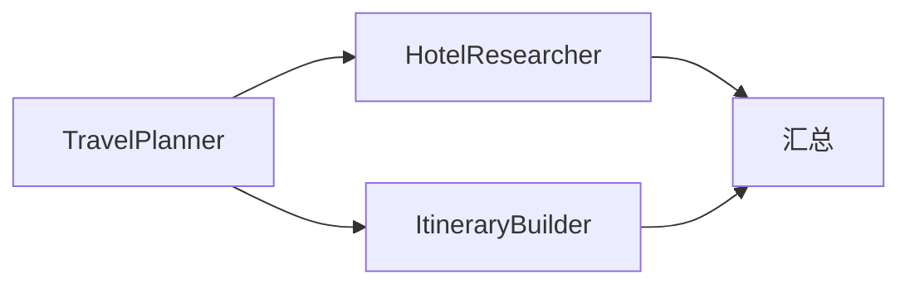

# H16：DAG 执行器——线性、并行、汇总

## 小林的 Agent 们如何按顺序执行

上一章（H15）讲到，模式路由器根据拓扑边类型选择 workflow 或 system 模式。对于 workflow 模式，系统使用 **DAG 执行器** 来按顺序执行 Agent。

本章回答：DAG 执行器如何构建 DAG？如何并行执行就绪节点？如何处理超时和失败？

## 概念阶梯：DAG 不是"流程图"

DAG（有向无环图）的特点是：

| 特性 | DAG | 普通流程图 |
| --- | --- | --- |
| 方向 | 有向 | 可能有双向 |
| 循环 | 无环 | 可能有循环 |
| 并行 | 支持 | 不支持 |
| 依赖 | 显式 | 隐式 |

## 第一段源码：`DagExecutor` 的构建

打开 [packages/core/src/modules/collaboration-runtime/engine/dag-executor.ts](../../../../packages/core/src/modules/collaboration-runtime/engine/dag-executor.ts)：

```ts
export class DagExecutor {
  private nodes = new Map<string, DagNode>();
  private eventStore: EventStore;
  private agentExecutor: AgentExecutor;
  private events: RuntimeEvent[] = [];
  private aborted = false;

  constructor(
    eventStore: EventStore,
    agentExecutor: AgentExecutor,
    config: DagExecutorConfig = {}
  ) {
    this.eventStore = eventStore;
    this.agentExecutor = agentExecutor;
    this.config = {
      timeoutMs: config.timeoutMs ?? 300_000,
      maxIterations: config.maxIterations ?? 100,
      // ...
    };
  }
```

`DagNode` 的状态机：

```ts
interface DagNode {
  agentId: string;
  dependencies: string[]; // 入边（上游 Agent IDs）
  dependents: string[];   // 出边（下游 Agent IDs）
  status: "pending" | "ready" | "running" | "waiting" | "completed" | "failed";
  priority: number;       // 动态优先级（aging 会提升）
  queuedAt: number;       // 入队时间戳
}
```

## 第二段源码：DAG 构建

```ts
private buildDag(topology: CollaborationTopology): void {
  // 初始化所有节点
  for (const agentId of Object.keys(topology.agents)) {
    this.nodes.set(agentId, {
      agentId,
      dependencies: [],
      dependents: [],
      status: "pending",
      priority: 0,
      queuedAt: Date.now(),
    });
  }

  // 构建邻接关系（仅 trigger 类型的边参与 DAG）
  for (const edge of topology.edges) {
    if (edge.type !== "trigger") {continue;}
    const fromNode = this.nodes.get(edge.from);
    const toNode = this.nodes.get(edge.to);
    if (fromNode && toNode) {
      fromNode.dependents.push(edge.to);
      toNode.dependencies.push(edge.from);
    }
  }

  // 无依赖的节点标记为 ready
  for (const node of this.nodes.values()) {
    if (node.dependencies.length === 0) {
      node.status = "ready";
    }
  }
}
```

## 第三段源码：主执行循环

```ts
async execute(topology: CollaborationTopology): Promise<DagResult> {
  this.buildDag(topology);

  const deadline = Date.now() + this.config.timeoutMs;
  let iterations = 0;

  while (true) {
    if (this.aborted) return this.buildResult("aborted");
    if (Date.now() > deadline) return this.buildResult("timed_out");
    if (iterations >= this.config.maxIterations) return this.buildResult("failed");
    iterations++;

    this.applyAging();

    // Back-pressure 检查
    const runningCount = this.countByStatus("running");
    if (runningCount >= this.config.backPressureThreshold) {
      await this.sleep(100);
      continue;
    }

    // 找出就绪节点
    const readyNodes = this.getReadyNodes();
    this.checkConflicts();

    // 并行执行就绪节点
    if (readyNodes.length > 0) {
      await this.executeBatch(readyNodes);
    }

    // 检查是否全部完成
    if (this.isDone()) {
      return this.buildResult("completed");
    }

    // 死锁检测
    if (readyNodes.length === 0 && this.hasUnfinishedNodes()) {
      // 标记 blocked 节点为 failed
      return this.buildResult("failed");
    }

    await this.sleep(10);
  }
}
```

## 第四段源码：并行执行

```ts
private async executeBatch(agentIds: string[]): Promise<void> {
  const promises = agentIds.map(async (agentId) => {
    const node = this.nodes.get(agentId)!;
    node.status = "running";

    try {
      const result = await this.agentExecutor(agentId);

      if (result.status === "completed") {
        node.status = "completed";
        // 触发下游
        for (const depId of node.dependents) {
          this.maybeMarkReady(depId);
        }
      } else if (result.status === "waiting") {
        node.status = "waiting"; // HITL
      } else {
        node.status = "failed";
      }
    } catch (err) {
      node.status = "failed";
    }
  });

  await Promise.all(promises);
}
```

## 图解：DAG 执行流程



执行顺序：

1. `TravelPlanner` 先执行（无依赖）。
2. `HotelResearcher` 和 `ItineraryBuilder` 并行执行（依赖 `TravelPlanner`）。
3. `汇总` 最后执行（依赖 `HotelResearcher` 和 `ItineraryBuilder`）。

## 失败路径与边界

### 边界 1：Back-pressure 可能暂停上游

`backPressureThreshold` 默认 10，如果 running 节点数超过阈值，主循环会 sleep 100ms。这可能导致上游节点无法及时触发。

### 边界 2：`agentExecutor` 可能抛出异常

`executeBatch` 中，`agentExecutor` 抛出异常时，节点状态被标记为 `failed`。但异常信息可能丢失（只记录到事件）。

### 边界 3：死锁检测不精确

死锁检测逻辑：`readyNodes.length === 0 && hasUnfinishedNodes()`。这意味着：如果所有节点都 pending 但没有 ready，会被判定为死锁。但如果节点只是执行较慢，也会误判。

## 测试证据与缺口

### 测试缺口

- 没有针对 back-pressure 的测试。
- 没有针对死锁误判的测试。
- 没有针对 HITL（waiting）状态的测试。

## 口头验收

不看源码，你能解释：

1. `DagExecutor` 的主循环包含哪些步骤？
2. `buildDag` 如何构建邻接关系？
3. `executeBatch` 如何并行执行节点？
4. Back-pressure 机制的作用是什么？
5. 死锁检测的条件是什么？有什么局限？

## 章节收束

本章讲解了 DAG 执行器的设计：构建 DAG、并行执行就绪节点、处理超时和失败。`DagExecutor` 是 workflow 模式的核心执行引擎。

下一章（H17）会进入 Supervisor 核心，讲解任务分解与 Worker 分配。
