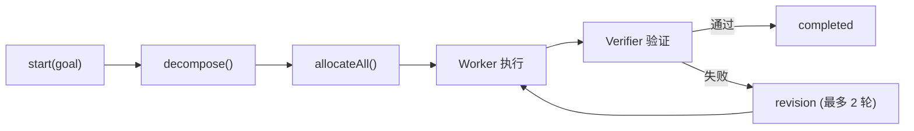

# H17：Supervisor 核心——任务分解与 Worker 分配

## 小林的旅行规划谁来做主

上一章（H16）讲到，DAG 执行器按拓扑顺序执行 Agent。但对于复杂任务（如旅行规划），系统需要一个**Supervisor** 来分解任务、分配给 Worker、验证结果。

本章回答：Supervisor 如何分解任务？如何通过 Contract Net 分配 Worker？Verifier 如何验证结果？

## 概念阶梯：Supervisor 不是"老板"

| 角色 | 职责 | 类比 |
| --- | --- | --- |
| Supervisor | 分解任务、分配 Worker、验证结果 | 项目经理 |
| Worker | 执行具体任务 | 团队成员 |
| Verifier | 检查 Worker 产出 | QA 工程师 |
| Contract Net | 招标-投标-中标协议 | 人才市场 |

## 第一段源码：`SupervisorMode` 的初始化

打开 [packages/core/src/modules/collaboration-runtime/engine/supervisor.ts](../../../../packages/core/src/modules/collaboration-runtime/engine/supervisor.ts)：

```ts
export interface SupervisorDeps {
  blackboard: Blackboard;
  eventStore: EventStore;
  eventEmitter: EventEmitter;
  contractNet: ContractNetProtocol;
  agents: AgentCapability[];
  maxRevisionRounds?: number;
  maxDepth?: number;
}

export class SupervisorMode {
  private deps: SupervisorDeps;
  private contractNet: ContractNetProtocol;
  private capabilityMatcher = new CapabilityMatcher();
  private plan: DecompositionPlan | null = null;
  private verifierChecks: VerifierCheck[] = [];
  private maxRevisions: number;

  constructor(deps: SupervisorDeps) {
    this.deps = deps;
    this.contractNet = deps.contractNet;
    this.maxRevisions = deps.maxRevisionRounds ?? 2;
  }
```

## 第二段源码：任务分解

```ts
async start(goal: string): Promise<DecompositionPlan> {
  this.plan = {
    goal,
    subTasks: [],
    depth: 0,
    state: "decomposing",
    startedAt: new Date().toISOString(),
  };

  this.emitEvent("SUPERVISOR_START", { goal });

  // Step 1: 分解为子任务
  this.decompose();

  // Step 2: 为每个子任务分配 Worker 和 Verifier
  await this.allocateAll();

  return this.plan;
}
```

`decompose` 方法（MVP 简化版）：

```ts
private decompose(): void {
  if (this.plan === null) { return; }

  this.plan.state = "decomposing";

  // MVP: 将目标按能力需求拆分为独立子任务
  const subTask: SubTask = {
    id: this.generateTaskId(),
    description: this.plan.goal,
    state: "pending",
    revisionCount: 0,
  };

  this.plan.subTasks.push(subTask);

  this.emitEvent("DECOMPOSITION_COMPLETE", {
    subTaskCount: this.plan.subTasks.length,
  });
}
```

注意：MVP 版本的 `decompose` 非常简化，只是把全局目标作为一个子任务。生产环境应使用 LLM 动态分解。

## 第三段源码：Worker 分配

```ts
private async allocateTask(task: SubTask): Promise<void> {
  task.state = "allocating";

  // 1. 匹配候选 Worker
  const taskDesc: TaskDescription = {
    id: task.id,
    description: task.description,
    requiredCapabilities: task.requiredCapabilities,
    deadline: new Date(Date.now() + 5 * 60 * 1000),
  };

  const candidates = this.capabilityMatcher.match(
    taskDesc,
    this.deps.agents.filter((a) => a.agentId !== "supervisor")
  );

  // 2. 选择最佳 Worker
  const selectedWorker = candidates[0]!;

  // 3. 选择 Verifier
  const verifierCandidates = this.deps.agents.filter(
    (a) => a.agentId !== selectedWorker.agentId
  );
  const verifier = verifierCandidates.length > 0 ? verifierCandidates[0] : null;

  // 4. 分配
  task.assignedWorker = selectedWorker.agentId;
  task.verifierId = verifier?.agentId;
  task.state = "executing";

  // 5. 通过 Contract Net 发送正式分配
  const convId = await this.contractNet.callForProposal(
    taskDesc,
    [selectedWorker.agentId],
    taskDesc.deadline!,
    this.deps.blackboard
  );

  this.contractNet.acceptProposal(
    convId,
    selectedWorker.agentId,
    this.deps.blackboard
  );
}
```

## 第四段源码：Verifier 验证

```ts
runVerifier(taskId: string, verifierId: string): VerifierCheck {
  const task = this.plan?.subTasks.find((t) => t.id === taskId);
  if (!task || !task.result) {
    throw new Error(`Task ${taskId} has no result to verify`);
  }

  // Verifier 使用确定性检查（非 LLM）
  const check: VerifierCheck = {
    taskId,
    verifierId,
    passed: true, // 默认通过
    errors: [],
    timestamp: new Date().toISOString(),
  };

  this.verifierChecks.push(check);

  if (check.passed) {
    task.state = "completed";
  } else {
    this.handleVerificationFailure(task, check);
  }

  return check;
}
```

## 图解：Supervisor 工作流程



## 失败路径与边界

### 边界 1：`decompose` 是 MVP 简化版

MVP 版本的 `decompose` 只是把全局目标作为一个子任务，没有真正的任务分解能力。这意味着：对于复杂任务，Supervisor 无法有效分解。

### 边界 2：Verifier 默认通过

`runVerifier` 中 `passed: true` 是硬编码的。这意味着：当前版本的 Verifier 实际上没有验证功能，只是占位。

### 边界 3：Contract Net 失败不影响分配

`allocateTask` 中，Contract Net 调用失败时（`catch` 块），任务仍然被分配给 Worker。这意味着：Contract Net 的协议保证实际上没有生效。

## 测试证据与缺口

### 测试缺口

- 没有针对 `decompose` 简化版的测试。
- 没有针对 Verifier 默认通过的测试。
- 没有针对 Contract Net 失败场景的测试。

## 口头验收

不看源码，你能解释：

1. Supervisor 的三个核心步骤是什么？
2. `CapabilityMatcher` 如何评分？
3. Verifier 的作用是什么？当前实现有什么局限？
4. Contract Net 在分配中起什么作用？
5. `maxRevisionRounds` 的作用是什么？

## 章节收束

本章讲解了 Supervisor 的设计：分解任务、通过 Contract Net 分配 Worker、Verifier 验证结果。当前实现是 MVP 简化版，`decompose` 和 `runVerifier` 都是占位实现。

下一章（H18）会进入 Supervisor-DAG 集成与 HITL 收敛。
