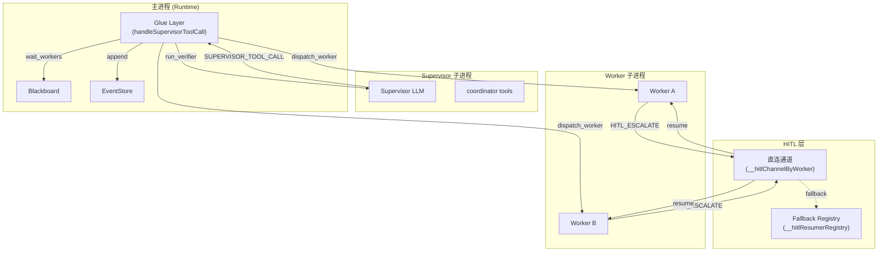

# H18：Supervisor-DAG 集成与 HITL 收敛

## 小林的旅行规划，谁来决定走 DAG 还是 Supervisor

上一章（H17）讲到，Supervisor 负责分解任务、分配 Worker、验证结果。但 Supervisor 和 DAG 执行器是什么关系？当系统面对一个多 Agent 协作任务时，**谁来决定走 DAG 路径还是 Supervisor 路径**？

本章回答：`executeCollaborationRuntime` 如何根据拓扑自动路由？`executeSupervisorDag` 的胶水层如何拦截 Supervisor 的工具调用？HITL（Human-in-the-Loop）如何在 Supervisor 和 Worker 之间收敛？

## 概念阶梯：DAG 和 Supervisor 不是“二选一”

| 维度 | DAG 路径 (`executeMultiAgentDag`) | Supervisor 路径 (`executeSupervisorDag`) |
| --- | --- | --- |
| 决策方式 | 静态拓扑排序 | Supervisor LLM 动态决策 |
| 执行顺序 | 按 DAG 拓扑自动触发 | Supervisor 按需 dispatch_worker |
| 任务分解 | 无（拓扑即任务） | Supervisor LLM 动态分解 |
| Worker 分配 | 按拓扑依赖自动分配 | Supervisor 通过 Contract Net 分配 |
| HITL 处理 | WORKER_BLOCK 事件 | Supervisor 工具调用 + 直连通道 |
| 适用场景 | 固定流程（如 CI/CD） | 动态协作（如旅行规划） |

## 第一段源码：`executeCollaborationRuntime` — 统一入口

打开 [packages/core/src/modules/collaboration-runtime/engine/supervisor-dag.ts](../../../../packages/core/src/modules/collaboration-runtime/engine/supervisor-dag.ts) 第 2011—2035 行：

```ts
export async function executeCollaborationRuntime(
  config: MultiAgentExecutorConfig,
  eventStore: EventStore,
  eventEmitter?: { emit: (RuntimeEvent) => void },
  executionMode?: ExecutionMode
): Promise<MultiAgentExecutionResult> {
  const manifestDir = await findLatestManifestDir(config.projectId);
  if (manifestDir === null) {
    throw new Error(`No solution manifest found for project ${config.projectId}`);
  }

  const agents = await loadAgentsJson(manifestDir);
  const edges = extractEdges(agents);

  const mode: ExecutionMode = executionMode ?? selectExecutionMode({
    collaborations: edges.map((e) => ({ from: e.from, to: e.to, type: e.type })),
  });

  console.log(`[executeCollaborationRuntime] mode=${mode}`);

  if (mode === "system") {
    return executeSupervisorDag(config, eventStore, eventEmitter);
  }
  return executeMultiAgentDag(config, eventStore, eventEmitter);
}
```

路由逻辑：

1. 加载 manifest 和 edges。
2. 如果 `executionMode` 已指定，直接使用。
3. 否则调用 `selectExecutionMode`（H15 讲过）自动判定：
   - 有 `notify` 边或回边 → **system** 模式 → `executeSupervisorDag`
   - 否则 → **workflow** 模式 → `executeMultiAgentDag`

## 第二段源码：`executeSupervisorDag` — 胶水层启动

`executeSupervisorDag`（第 996—1934 行）是 Story 9.30 SUPA-02 的核心实现。它的职责是：

1. 加载 manifest + 构建拓扑
2. 写入 `project-collaboration-context.json`
3. 启动 Supervisor 子进程
4. **拦截 `SUPERVISOR_TOOL_CALL` 事件，在胶水层执行实际工作**
5. 通过 `sendToolResult` 将结果回传给 Supervisor

启动 Supervisor 子进程（第 1770—1807 行）：

```ts
let supervisorProc: AgentProcess;
try {
  const spawnAt = Date.now();
  supervisorProc = await spawner.spawn(
    {
      projectId: config.projectId,
      agentId: supervisorAgentId,
      workingDirectory: supervisorWorkDir,
      agentType: "supervisor",
      collaborationSessionId: config.sessionId,
      blackboardDir,
      model: workerModel,
    },
    onSupervisorEvent,
  );
} catch (spawnErr) {
  throw new Error(`Failed to spawn supervisor: ${(spawnErr as Error).message}`);
}
```

关键设计：**Supervisor 子进程通过 `SUPERVISOR_TOOL_CALL` 事件与胶水层通信**，而不是直接调用函数。这实现了进程隔离：Supervisor 运行在独立子进程中，胶水层运行在主进程中。

## 第三段源码：胶水层拦截 `SUPERVISOR_TOOL_CALL`

事件处理器 `onSupervisorEvent`（第 1163—1201 行）：

```ts
const onSupervisorEvent = (event: RuntimeEvent): void => {
  supervisorEvents.push(event);
  void eventStore.append(event);
  eventEmitter?.emit(event);

  if (event.type === "AGENT_END" && event.source === supervisorAgentId) {
    supervisorResolveDone({ completedAgents, failedAgents });
    return;
  }

  if (event.type === "HUMAN_REVIEW_REQUEST" && event.source === supervisorAgentId) {
    // 注册 resume handler
    if (config.sessionId) {
      hitlResumerRegistry.set(config.sessionId, (reply: string) => {
        const sup = getGlobalSpawner().get(supervisorAgentId);
        if (sup) {
          sup.resume(reply).catch((err: Error) => {
            console.error(`[SupervisorDag] resume() failed:`, err);
          });
        }
      });
    }
    return;
  }

  if (event.type === "SUPERVISOR_TOOL_CALL") {
    const { toolCallId, toolName, args } = event.payload as {
      toolCallId: string;
      toolName: string;
      args: unknown;
    };
    // 异步处理工具调用，不阻塞事件处理器
    void handleSupervisorToolCall(toolCallId, toolName, args as Record<string, unknown>);
  }
};
```

胶水层处理的所有工具（第 1204—1758 行）：

| 工具名 | 职责 |
| --- | --- |
| `dispatch_worker` | 启动 Worker 子进程，分配任务 |
| `wait_workers` | 等待指定 Worker 完成 |
| `cancel_worker` | 取消运行中的 Worker |
| `run_verifier` | 对 Worker 产出进行 LLM 验证 |
| `bb_list_artifacts` | 列出 Blackboard 上的产物 |
| `bb_get_artifact` | 获取指定产物 |
| `resume_worker` | 恢复被 HITL 暂停的 Worker |
| `escalate_to_human` | Supervisor 请求人类介入 |
| `ask_user_question` | Supervisor 向用户提问 |
| `wait_for_human` | Supervisor 等待人类回复 |

## 第四段源码：`dispatch_worker` — 启动 Worker 子进程

`dispatch_worker` 工具调用（第 1213—1525 行）：

```ts
case "dispatch_worker": {
  const workerId = String(args["workerId"] ?? "");
  const specificAction = String(args["specificAction"] ?? config.globalGoal);
  const acceptanceCriteria = String(args["acceptanceCriteria"] ?? "完成任务");

  // 1. 写入 Blackboard（pending 状态）
  bb.setData(`swarm$tasks$${workerId}`, {
    taskId: workerId,
    status: "pending",
    assignedTo: workerId,
    goal: specificAction,
    acceptanceCriteria,
    createdAt: new Date().toISOString(),
  }, "supervisor", { sourceUri: `supervisor:dispatch:${config.sessionId ?? "supervisor"}` });

  // 2. 过滤掉不允许的工具
  const forbiddenTools = ["ask_user_question", "create_domain", "create_concept", ...];
  const workerSkills = (agent.skills ?? []).filter((skill: string) => !forbiddenTools.includes(skill));

  // 3. 写入 Worker 协作上下文
  const workerCtxPath = path.join(workingDirectory, "project-collaboration-context.json");
  await writeFile(workerCtxPath, JSON.stringify(workerCtx, null, 2), "utf-8");

  // 4. 启动 Worker 子进程
  const proc = await spawner.spawn(
    {
      projectId: config.projectId,
      agentId: workerId,
      workingDirectory,
      agentType: "originos",
      collaborationSessionId: config.sessionId,
      blackboardDir,
      model: workerModel,
    },
    captureWorkerEvent,
  );

  // 5. 非阻塞发送 prompt
  proc.prompt(prompt).catch((err) => {
    console.error(`[SupervisorDag] Worker ${workerId} prompt error:`, err);
  });

  resultJson = JSON.stringify({ dispatchId: workerId, status: "dispatched" });
  break;
}
```

注意：**`dispatch_worker` 启动 Worker 后，必须立即调用 `wait_workers` 等待完成**。这是 Supervisor prompt 中的强制约束（第 1846 行）。

## 第五段源码：`wait_workers` — 等待 Worker 完成

`wait_workers` 工具调用（第 1528—1578 行）：

```ts
case "wait_workers": {
  const workerIds = Array.isArray(args["workerIds"]) ? (args["workerIds"] as string[]) : [];
  const timeoutMs = typeof args["timeoutMs"] === "number" ? args["timeoutMs"] : 300_000;

  // 等待所有指定 Worker 完成（或超时）
  const waitPromises = workerIds.map((wId) => {
    const wResult = workerResults.get(wId);
    if (wResult && (wResult.status === "completed" || wResult.status === "failed")) {
      return Promise.resolve();
    }
    return new Promise<void>((resolve) => {
      const callbacks = workerCompletionCallbacks.get(wId) ?? [];
      callbacks.push(resolve);
      workerCompletionCallbacks.set(wId, callbacks);
    });
  });

  await Promise.race([
    Promise.all(waitPromises),
    new Promise<void>((resolve) => setTimeout(resolve, timeoutMs)),
  ]);

  // 返回结果
  resultJson = JSON.stringify({ completed: resultCompleted, failed: resultFailed, waiting: resultWaiting, nextStep });
  break;
}
```

等待机制：

1. 检查每个 Worker 是否已完成（`completed` 或 `failed`）。
2. 如果未完成，注册一个回调到 `workerCompletionCallbacks`。
3. 当 Worker 完成时，`notifyWorkerCompletion` 调用所有注册的回调。
4. `Promise.race` 确保超时后返回。

## 第六段源码：HITL 收敛 — 直连通道与 Fallback

HITL（Human-in-the-Loop）在 Supervisor 模式下的收敛逻辑（第 1273—1369 行）：

```ts
if (ev.type === "HITL_ESCALATE" && ev.source === workerId) {
  // 1. 直接 emit HUMAN_REVIEW_REQUEST（前端立即显示 HITL 输入框）
  const directHitlEvent: RuntimeEvent = {
    id: `evt-hitl-direct-${workerId}-${Date.now()}`,
    sessionId: config.sessionId ?? "supervisor",
    seq: 0,
    type: "HUMAN_REVIEW_REQUEST",
    payload: {
      question,
      options: options ?? [],
      multiSelect,
      agentId: workerId,
      onBehalfOf: workerId,
      onBehalfOfName,
      directChannel: true,
    },
    source: "supervisor",
    timestamp: new Date().toISOString(),
  };
  void eventStore.append(directHitlEvent);
  eventEmitter?.emit(directHitlEvent);

  // 2. 注册直连 resume channel
  const workerProc = spawner.get(workerId);
  if (config.sessionId && workerProc) {
    const sessionChannels = globalThis.__hitlChannelByWorker.get(config.sessionId) ?? new Map();
    sessionChannels.set(workerId, {
      resume: (reply: string) => workerProc.resume(reply),
      question,
      onBehalfOfName,
    });
    globalThis.__hitlChannelByWorker.set(config.sessionId, sessionChannels);

    // 同时注册到 hitlResumerRegistry 作为 fallback
    hitlResumerRegistry.set(config.sessionId, (reply: string) => {
      workerProc.resume(reply).catch((err: Error) => {
        console.error(`[SupervisorDag] HITL fallback resume failed for ${workerId}:`, err);
      });
    });
  }

  // 3. wait_workers 继续等待（不 notify）
  console.error(`[SupervisorDag] HITL_ESCALATE from worker ${workerId}: direct channel registered, waiting for user reply`);
  return;
}
```

HITL 收敛的两条路径：

| 路径 | 触发条件 | 恢复方式 |
| --- | --- | --- |
| **直连通道** | Worker 发出 `HITL_ESCALATE` | `globalThis.__hitlChannelByWorker` 直接 `resume` Worker |
| **Fallback** | 直连通道不存在 | `globalThis.__hitlResumerRegistry` 调用注册的 resumer |

`resumeSupervisorHitl` 函数（第 938—974 行）处理恢复：

```ts
export function resumeSupervisorHitl(sessionId: string, userReply: string, workerId?: string): boolean {
  // 优先：直连 Worker channel
  const workerChannels = globalThis.__hitlChannelByWorker?.get(sessionId);
  if (workerChannels && workerChannels.size > 0) {
    let targetWorkerId: string | undefined;
    if (workerId && workerChannels.has(workerId)) {
      targetWorkerId = workerId;
    } else {
      const entries = Array.from(workerChannels.entries());
      const last = entries[entries.length - 1];
      if (!last) return false;
      targetWorkerId = last[0];
    }

    const channel = workerChannels.get(targetWorkerId);
    if (!channel) return false;
    workerChannels.delete(targetWorkerId);
    channel.resume(userReply).catch((err: Error) => {
      console.error(`[HITL] direct worker resume failed for ${targetWorkerId}:`, err);
    });
    // 清理 session 级别的 hitlResumerRegistry
    if (workerChannels.size === 0) {
      globalThis.__hitlResumerRegistry?.delete(sessionId);
    }
    return true;
  }

  // Fallback：supervisor 自身的 escalate_to_human 挂起态
  const registry = globalThis.__hitlResumerRegistry;
  if (!registry) return false;
  const resumer = registry.get(sessionId);
  if (!resumer) return false;
  registry.delete(sessionId);
  resumer(userReply);
  return true;
}
```

## 第七段源码：`run_verifier` — LLM 验证与 Fallback

`run_verifier` 工具调用（第 1595—1618 行）：

```ts
case "run_verifier": {
  const workerId = String(args["workerId"] ?? "");
  const criteria = String(args["criteria"] ?? "");

  const wResult = workerResults.get(workerId);
  if (!wResult || wResult.status !== "completed") {
    resultJson = JSON.stringify({ passed: false, reasoning: `Worker ${workerId} is not completed` });
    break;
  }

  // 优先使用 workerResult 中保存的 messages
  const messages = wResult.messages
    ?? (supervisorEvents.filter((e) => e.source === workerId && e.type === "AGENT_END")
      .at(-1)?.payload?.["messages"] as Array<{ role: string; content?: unknown }> | undefined);

  let verification: VerificationResult;
  if (messages && messages.length > 0) {
    verification = await verifyTaskCompletion(criteria || wResult.output, messages, config.modelFactory);
  } else {
    verification = verifierFallbackResult([wResult.output], wResult.artifacts.map((a) => a.ref), 0);
  }

  resultJson = JSON.stringify({ passed: verification.passed, reasoning: verification.reasoning });
  break;
}
```

验证的两级策略：

1. **LLM 验证**：如果有 Worker 的 messages，调用 `verifyTaskCompletion`（第 782—896 行）进行 LLM 分析。
2. **Fallback 规则**：如果没有 messages，使用 `verifierFallbackResult`（第 899—917 行）进行纯函数判定。

`verifyTaskCompletion` 构建 system prompt（第 836—845 行），通过 LLM 判断任务是否完成。如果 LLM 调用失败，回退到规则判定：

```ts
export function verifierFallbackResult(
  textParts: string[],
  artifacts: string[],
  toolCallCount: number,
): VerificationResult {
  const output = textParts.join("\n");
  const lastAssistantText = textParts.at(-1) ?? "";
  const isQuestioning = /请[您你]?提供|需要[您你]?|请告诉|请您确认/.test(lastAssistantText)
    && lastAssistantText.trim().endsWith("？");
  const hasWrite = artifacts.some((a) => !a.endsWith("/"));
  const hasToolCalls = toolCallCount > 0;
  const passed = (hasToolCalls && !isQuestioning) || hasWrite;
  return {
    passed,
    reasoning: `...`,
    extractedArtifacts: artifacts,
    outputText: output,
  };
}
```

## 图解：Supervisor-DAG 集成架构



## 失败路径与边界

### 边界 1：Supervisor 子进程崩溃

如果 Supervisor 子进程崩溃（`spawn` 失败或 `prompt` 抛出异常），`executeSupervisorDag` 会抛出错误（第 1800—1807 行）。但 Worker 子进程可能仍在运行，形成孤儿进程。

### 边界 2：HITL 直连通道泄漏

`__hitlChannelByWorker` 使用 `globalThis` 存储，HMR（热重载）时不会被清除。虽然代码中做了 `if (!globalThis.__hitlChannelByWorker)` 的初始化保护，但如果 Worker 恢复后没有正确删除 channel，可能导致内存泄漏。

### 边界 3：Verifier LLM 失败

`verifyTaskCompletion` 依赖 LLM 调用（第 857—895 行）。如果 LLM 调用失败（网络问题、模型不可用），会回退到 `verifierFallbackResult`。但 fallback 规则是启发式的（检查是否有工具调用、是否有文件写入），可能误判。

### 边界 4：`wait_workers` 超时

`wait_workers` 使用 `Promise.race` 实现超时（第 1550—1553 行）。超时后返回的结果中，`waiting` 数组包含未完成的 Worker。Supervisor 需要处理这种情况，但当前实现只是返回结果，没有自动重试或失败处理。

## 测试证据与缺口

### 测试缺口

- 没有针对 Supervisor 子进程崩溃的测试。
- 没有针对 HITL 直连通道泄漏的测试。
- 没有针对 Verifier LLM 失败 fallback 的测试。
- 没有针对 `wait_workers` 超时后 Supervisor 行为的测试。
- 没有针对 `dispatch_worker` 重复 spawn 同一 Worker 的测试。

## 口头验收

不看源码，你能解释：

1. `executeCollaborationRuntime` 如何决定走 DAG 还是 Supervisor 路径？
2. 胶水层（Glue Layer）的作用是什么？它如何与 Supervisor 子进程通信？
3. `dispatch_worker` 和 `wait_workers` 的关系是什么？为什么必须“dispatch 后立即 wait”？
4. HITL 收敛的两条路径是什么？各有什么优缺点？
5. Verifier 的两级策略是什么？Fallback 规则有哪些局限？

## 章节收束

本章讲解了 Supervisor-DAG 集成与 HITL 收敛：`executeCollaborationRuntime` 统一入口根据拓扑自动路由，`executeSupervisorDag` 通过胶水层拦截 Supervisor 工具调用，HITL 通过直连通道和 Fallback 两条路径收敛。

下一章（H19）会进入 Supervisor 心跳与依赖检查。
