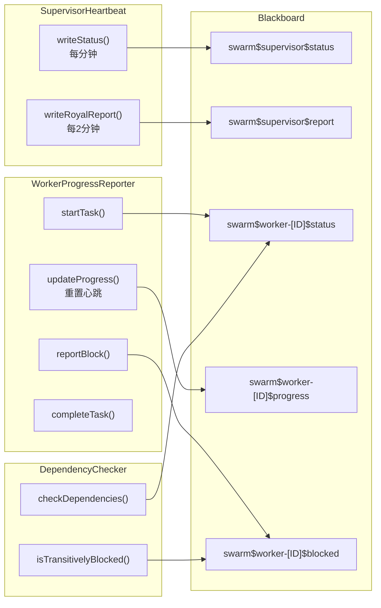

# H19：Supervisor 心跳与依赖检查

## 小林的旅行规划，Supervisor 怎么知道 Worker 还活着

上一章（H18）讲到，Supervisor 通过胶水层 dispatch Worker、wait Worker 完成。但有一个关键问题：**如果 Worker 执行到一半卡住了，Supervisor 怎么知道？** 如果 Worker 依赖的上游任务还没完成，Worker 应该怎么报告？

本章回答：`SupervisorHeartbeat` 如何定时写入权威状态？`DependencyChecker` 如何检查 Worker 依赖？`WorkerProgressReporter` 如何汇报进度和阻塞？

## 概念阶梯：心跳不是“ ping 一下”

初学者容易把心跳理解为简单的"ping 一下"。实际上，心跳是**权威状态写入**：Supervisor 定时将当前状态写入 Blackboard，其他组件（包括 Worker 和 UI）可以从 Blackboard 读取最新状态。

| 概念 | 通俗理解 | 准确职责 |
| --- | --- | --- |
| 心跳（Heartbeat） | Supervisor 还活着 | 定时写入权威状态到 Blackboard |
| 依赖检查 | 等上游完成 | 验证上游 Agent/任务状态，阻塞时报告 |
| 进度汇报 | Worker 在干活 | 定时更新进度到 Blackboard，供 Supervisor 查询 |

## 第一段源码：`SupervisorHeartbeat` — Queen 风格的心跳

打开 [packages/core/src/modules/collaboration-runtime/engine/supervisor-heartbeat.ts](../../../../packages/core/src/modules/collaboration-runtime/engine/supervisor-heartbeat.ts)：

```ts
export class SupervisorHeartbeat {
  private heartbeatTimer?: NodeJS.Timeout;
  private reportTimer?: NodeJS.Timeout;
  private objectives: { completed: string[]; pending: string[] } = {
    completed: [],
    pending: [],
  };

  constructor(
    blackboard: Blackboard,
    supervisorId: string,
    config: SupervisorHeartbeatConfig = {}
  ) {
    this.blackboard = blackboard;
    this.supervisorId = supervisorId;
    this.sessionId = blackboard.sessionId;
    this.intervalMs = config.intervalMs ?? 60_000; // 1 分钟
    this.reportIntervalMs = config.reportIntervalMs ?? 120_000; // 2 分钟
  }
```

`SupervisorHeartbeat` 借鉴了 Ruflo 的 Queen 心跳机制，有两个定时器：

1. **状态心跳**（默认 1 分钟）：写入 `swarm$supervisor$status`
2. **Royal Report**（默认 2 分钟）：写入 `swarm$supervisor$report`

启动心跳（第 84—101 行）：

```ts
start(): void {
  this.stop();
  this.writeStatus(); // 立即写入第一次

  // 状态心跳
  this.heartbeatTimer = setInterval(() => {
    this.writeStatus();
  }, this.intervalMs);

  // Royal Report
  this.reportTimer = setInterval(() => {
    this.writeRoyalReport();
  }, this.reportIntervalMs);
}
```

`writeStatus`（第 150—181 行）从 Blackboard 读取任务状态，构建 `SupervisorStatus`：

```ts
private writeStatus(): void {
  const tasks = this.blackboard.getTasks();
  const activeWorkers = new Set(
    tasks
      .filter((t) => t.status === "running" || t.status === "assigned")
      .map((t) => t.assignedTo)
      .filter((v): v is string => v !== undefined)
  );

  const status: SupervisorStatus = {
    agent: this.supervisorId,
    status: this.determineSwarmState(tasks),
    hierarchyEstablished: activeWorkers.size > 0,
    subjects: Array.from(activeWorkers),
    royalDirectives: this.extractDirectives(tasks),
    successionPlan: "collective-intelligence",
    timestamp: Date.now(),
    activeTaskCount: tasks.filter((t) => t.status === "running").length,
    completedCount: tasks.filter((t) => t.status === "completed").length,
    failedCount: tasks.filter((t) => t.status === "failed").length,
    reportedCount: tasks.filter((t) => t.status === "reported").length,
  };

  const key = buildSupervisorKey(MemoryKeyCategory.STATUS, this.sessionId);
  this.blackboard.setData(key, status, this.supervisorId, {
    sourceUri: `supervisor-heartbeat:${this.sessionId}`,
  });
}
```

状态判定逻辑（第 221—232 行）：

```ts
private determineSwarmState(tasks: any[]): SupervisorStatus["status"] {
  const failed = tasks.filter((t) => t.status === "failed").length;
  const blocked = tasks.filter((t) => t.status === "blocked").length;

  if (failed > 0 && failed > tasks.length / 2) {
    return "failed";
  }
  if (blocked > 0) {
    return "paused";
  }
  return "sovereign-active";
}
```

判定规则：

1. 如果失败任务数超过总数的一半 → **failed**
2. 如果有阻塞任务 → **paused**
3. 否则 → **sovereign-active**

## 第二段源码：`DependencyChecker` — 依赖检查前置

打开 [packages/core/src/modules/collaboration-runtime/engine/dependency-checker.ts](../../../../packages/core/src/modules/collaboration-runtime/engine/dependency-checker.ts)：

```ts
export interface DependencySpec {
  agentId: string;
  taskId?: string;
  outputKey?: string;
  type?: "agent-complete" | "task-complete";
}

export interface DependencyCheckResult {
  satisfied: boolean;
  missingDeps: DependencySpec[];
  blockedReason?: string;
}
```

`checkDependencies`（第 55—71 行）：

```ts
checkDependencies(dependencies: DependencySpec[]): DependencyCheckResult {
  const missingDeps: DependencySpec[] = [];

  for (const dep of dependencies) {
    const satisfied = this.checkSingleDependency(dep);
    if (!satisfied) {
      missingDeps.push(dep);
    }
  }

  if (missingDeps.length === 0) {
    return { satisfied: true, missingDeps: [] };
  }

  const blockedReason = this.formatBlockedReason(missingDeps);
  return { satisfied: false, missingDeps, blockedReason };
}
```

检查单个依赖（第 221—241 行）：

```ts
private checkSingleDependency(dep: DependencySpec): boolean {
  if (dep.type === "task-complete" && dep.taskId) {
    // 检查特定任务是否完成
    const task = this.blackboard.getTasks().find((t) => t.id === dep.taskId);
    if (!task) return false;
    return task.status === "completed" && !!task.completedAt;
  } else {
    // 检查 Agent 是否有任何已完成任务
    const tasks = this.blackboard.getTasks();
    const agentCompletedTasks = tasks.filter(
      (t) => t.assignedTo === dep.agentId && (t.status === "completed" || t.status === "reported")
    );

    if (dep.type === "agent-complete") {
      return agentCompletedTasks.length > 0;
    }

    // 默认：只要上游有任务（非 pending）即可
    const agentTasks = tasks.filter((t) => t.assignedTo === dep.agentId);
    return agentTasks.some((t) => t.status !== "pending");
  }
}
```

依赖类型：

| 类型 | 检查内容 | 适用场景 |
| --- | --- | --- |
| `agent-complete` | Agent 是否有任何已完成任务 | 上游 Agent 完成即可 |
| `task-complete` | 特定任务是否完成 | 需要特定任务产出 |

从 Topology 推导依赖（第 76—95 行）：

```ts
deriveDependenciesFromTopology(
  agentId: string,
  topology: CollaborationTopology
): DependencySpec[] {
  const dependencies: DependencySpec[] = [];
  const incomingEdges = topology.edges.filter(
    (e) => e.to === agentId && e.type === "trigger"
  );

  for (const edge of incomingEdges) {
    dependencies.push({
      agentId: edge.from,
      taskId: undefined,
      outputKey: undefined,
      type: "agent-complete",
    });
  }

  return dependencies;
}
```

传递性阻塞检测（第 149—168 行）：

```ts
isTransitivelyBlocked(dependencies: DependencySpec[]): boolean {
  for (const dep of dependencies) {
    // 检查上游 Agent 是否阻塞
    const blockedKey = buildWorkerKey(MemoryKeyCategory.BLOCKED, dep.agentId);
    const blockedEntry = this.blackboard.getDataEntry(blockedKey);

    if (blockedEntry?.value) {
      return true;
    }

    // 检查上游任务是否阻塞
    const tasks = this.blackboard.getTasks();
    const depTask = tasks.find((t) => t.id === dep.taskId);
    if (depTask?.status === "blocked") {
      return true;
    }
  }

  return false;
}
```

关键设计：**依赖检查不仅检查直接依赖，还检查传递性阻塞**。如果上游 Agent 被阻塞，下游 Agent 也会被阻塞。

## 第三段源码：`WorkerProgressReporter` — Worker 进度汇报

打开 [packages/core/src/modules/collaboration-runtime/sandbox/worker-progress-reporter.ts](../../../../packages/core/src/modules/collaboration-runtime/sandbox/worker-progress-reporter.ts)：

```ts
export class WorkerProgressReporter {
  private intervalMs: number = 45_000; // 45 秒
  private timer?: NodeJS.Timeout;

  constructor(blackboard: Blackboard, workerId: string, intervalMs?: number) {
    this.blackboard = blackboard;
    this.workerId = workerId;
    this.sessionId = blackboard.sessionId;
    if (intervalMs) this.intervalMs = intervalMs;
  }
```

Worker 进度汇报协议：

1. **接受任务时**：写入 `swarm$worker-[ID]$status`
2. **每个显著步骤**：更新 `swarm$worker-[ID]$progress`
3. **依赖缺失时**：写入 `swarm$worker-[ID]$blocked`
4. **完成时**：写入 `swarm$worker-[ID]$complete`

开始任务（第 98—118 行）：

```ts
startTask(taskId: string, estimatedMs: number, dependencies: string[] = []): void {
  this.currentTaskId = taskId;
  this.status = "task-received";

  this.lastProgress = {
    taskId,
    stepsCompleted: [],
    currentStep: "task-received",
    progressPercentage: 0,
    blockers: [],
    filesModified: [],
    estimatedCompletion: Date.now() + estimatedMs,
  };

  this.writeStatus(dependencies);
  this.startHeartbeat();

  console.error(
    `[WorkerProgressReporter] Started: worker=${this.workerId}, task=${taskId}, estimated=${estimatedMs}ms`
  );
}
```

报告阻塞（第 197—222 行）：

```ts
reportBlock(
  blockedOn: WorkerBlocked["blockedOn"],
  waitingFor: string[],
  rationale?: string,
  suggestedAction?: string
): void {
  this.status = "blocked";

  const blocked: WorkerBlocked = {
    blockedOn,
    waitingFor,
    since: Date.now(),
    taskId: this.currentTaskId,
    rationale,
    suggestedAction,
  };

  const key = buildWorkerKey(MemoryKeyCategory.BLOCKED, this.workerId);
  this.blackboard.setData(key, blocked, this.workerId, {
    sourceUri: `worker-block:${this.sessionId}:${this.workerId}`,
  });

  console.error(
    `[WorkerProgressReporter] Blocked: worker=${this.workerId}, blockedOn=${blockedOn}, waitingFor=${waitingFor.length}`
  );
}
```

心跳定时器（第 327—344 行）：

```ts
private startHeartbeat(): void {
  this.stopHeartbeat();
  this.timer = setInterval(() => {
    this.writeProgress();
  }, this.intervalMs);
}

private resetHeartbeat(): void {
  this.stopHeartbeat();
  this.startHeartbeat();
}
```

关键设计：**每次 `updateProgress` 都会重置心跳定时器**，防止 Worker 还在活跃时被误判为超时。

## 图解：心跳、依赖检查、进度汇报的协作



## 失败路径与边界

### 边界 1：心跳定时器泄漏

`SupervisorHeartbeat` 和 `WorkerProgressReporter` 都使用 `setInterval`，如果 `stop()` 没有被调用（如进程异常退出），定时器会持续运行。虽然 Node.js 进程退出时会清理定时器，但在长时间运行的测试中可能导致泄漏。

### 边界 2：依赖检查的竞态条件

`checkDependencies` 读取 Blackboard 的任务状态，但任务状态可能在检查后被更新。这意味着：依赖检查通过时，上游任务可能实际上还未完成（检查后被更新为完成），或者依赖检查失败时，上游任务可能实际上已经完成（检查后被更新）。

### 边界 3：`isTransitivelyBlocked` 只检查一层

`isTransitivelyBlocked` 检查上游 Agent 是否被阻塞，但**只检查直接依赖**，不检查间接依赖（依赖的依赖）。这意味着：如果 A 依赖 B，B 依赖 C，C 被阻塞，`isTransitivelyBlocked` 对 A 的检查会返回 false。

### 边界 4：进度汇报的 `estimatedCompletion` 计算

`completeTask` 中 `timeTakenMs` 的计算（第 259—261 行）使用了复杂的公式，但实际上这个公式基于 `estimatedCompletion` 和 `progressPercentage`，可能产生不准确的结果。

## 测试证据与缺口

### 已有测试（Story 9.36）

测试文件：[packages/core/src/modules/collaboration-runtime/__tests__/story-9.36.test.ts](../../../../packages/core/src/modules/collaboration-runtime/__tests__/story-9.36.test.ts)

**M2: Supervisor 心跳机制**：

```ts
it("应该写入 Supervisor 权威状态", async () => {
  const task = blackboard.createTask("test task");
  blackboard.assignTask(task.id, "worker-1");
  blackboard.startTask(task.id);

  heartbeat.start();
  await new Promise(resolve => setTimeout(resolve, 50));

  const statusKey = buildSupervisorKey(MemoryKeyCategory.STATUS, "test-session");
  const statusEntry = blackboard.getDataEntry(statusKey);
  expect(statusEntry?.value).toBeDefined();
  const status = statusEntry?.value as { status: string; activeTaskCount: number };
  expect(status?.status).toBe("sovereign-active");
  expect(status?.activeTaskCount).toBe(1);
});
```

**M5: 依赖检查器**：

```ts
it("应该检查依赖满足", () => {
  const task0 = blackboard.createTask("upstream task");
  blackboard.assignTask(task0.id, "worker-0");
  blackboard.startTask(task0.id);
  blackboard.completeTask(task0.id, "output");

  const dependencies = [{ agentId: "worker-0", type: "agent-complete" }];
  const result = checker.checkDependencies(dependencies);
  expect(result.satisfied).toBe(true);
  expect(result.missingDeps).toHaveLength(0);
});

it("应该检测传递性阻塞", () => {
  const reporter0 = new WorkerProgressReporter(blackboard, "worker-0", 50);
  reporter0.reportBlock("dependencies", ["external-system"]);

  const dependencies = [{ agentId: "worker-0", type: "agent-complete" }];
  const isBlocked = checker.isTransitivelyBlocked(dependencies);
  expect(isBlocked).toBe(true);
});
```

### 测试缺口

- 没有针对心跳定时器泄漏的测试。
- 没有针对依赖检查竞态条件的测试。
- 没有针对 `isTransitivelyBlocked` 多层依赖的测试。
- 没有针对 Worker 进度汇报超时的测试。

## 口头验收

不看源码，你能解释：

1. `SupervisorHeartbeat` 的两个定时器分别做什么？状态判定规则是什么？
2. `DependencyChecker` 的两种依赖类型有什么区别？
3. `isTransitivelyBlocked` 检查什么？有什么局限？
4. `WorkerProgressReporter` 的心跳定时器为什么需要重置？
5. 心跳、依赖检查、进度汇报三者如何协作？

## 章节收束

本章讲解了 Supervisor 心跳与依赖检查：`SupervisorHeartbeat` 定时写入权威状态，`DependencyChecker` 检查 Worker 依赖并检测传递性阻塞，`WorkerProgressReporter` 汇报进度和阻塞。三者通过 Blackboard 共享状态。

下一章（H20）会进入 CapabilityMatcher 与能力匹配。
