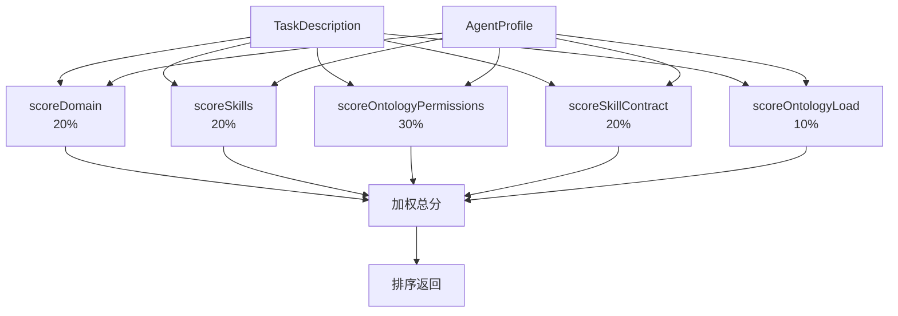

# H20：CapabilityMatcher 与能力匹配

## 小林的旅行规划，谁来完成酒店搜索

上一章（H19）讲到，Supervisor 通过心跳和依赖检查管理 Worker。但有一个关键问题还没回答：**Supervisor 如何决定哪个 Worker 来完成酒店搜索？** 系统有多个 Worker，每个 Worker 的能力不同，Supervisor 需要根据任务需求匹配最佳 Worker。

本章回答：`CapabilityMatcher` 如何评分？本体权限匹配如何工作？Skill I/O 契约如何影响匹配？

## 概念阶梯：能力匹配不是“随机分配”

| 维度 | 能力匹配 | 随机分配 |
| --- | --- | --- |
| 依据 | 任务需求 vs Worker 能力 | 无 |
| 结果 | 排序后的 Worker 列表 | 单个 Worker |
| 可解释性 | 有评分明细 | 无 |
| 失败处理 | 选择次优 Worker | 可能选到完全不匹配的 |

## 第一段源码：`CapabilityMatcher` 的评分维度

打开 [packages/core/src/modules/collaboration-runtime/engine/capability-matcher.ts](../../../../packages/core/src/modules/collaboration-runtime/engine/capability-matcher.ts)：

```ts
const WEIGHTS = {
  domain: 0.20,
  skill: 0.20,
  ontology: 0.30,        // 本体操作权限
  skillContract: 0.20,   // Skill I/O 契约
  load: 0.10,          // 本体操作复杂度
};
```

评分维度：

| 维度 | 权重 | 检查内容 |
| --- | --- | --- |
| Domain 匹配 | 20% | 任务 domain vs Worker domain 的词重叠度 |
| Skill 匹配 | 20% | 任务 requiredSkills vs Worker skills |
| 本体权限 | 30% | Worker 是否可操作任务所需的本体类型 |
| Skill 契约 | 20% | Skill 输入/输出本体是否匹配任务需求 |
| 当前负载 | 10% | 基于本体实例数和操作复杂度 |

`match` 方法（第 162—173 行）：

```ts
match(task: TaskDescription, availableAgents: AgentProfile[]): ScoredAgent[] {
  if (availableAgents.length === 0) return [];

  const scored = availableAgents
    .map((agent) => this.scoreAgent(agent, task))
    .sort((a, b) => b.score - a.score);

  return scored;
}
```

## 第二段源码：`scoreAgent` — 综合评分

```ts
private scoreAgent(agent: AgentProfile, task: TaskDescription): ScoredAgent {
  const breakdown: ScoreBreakdown = {
    domainMatch: this.scoreDomain(agent, task),
    skillMatch: this.scoreSkills(agent, task),
    ontologyMatch: this.scoreOntologyPermissions(agent, task),
    skillContractMatch: this.scoreSkillContract(agent, task),
    loadScore: this.scoreOntologyLoad(agent),
  };

  const totalScore =
    breakdown.domainMatch * WEIGHTS.domain +
    breakdown.skillMatch * WEIGHTS.skill +
    breakdown.ontologyMatch * WEIGHTS.ontology +
    breakdown.skillContractMatch * WEIGHTS.skillContract +
    breakdown.loadScore * WEIGHTS.load;

  // 如果本体权限不满足，直接返回 0 分
  if (task.requiredOntologyOperations && task.requiredOntologyOperations.length > 0) {
    const canOperate = this.checkOntologyCapabilities(agent, task);
    if (!canOperate) {
      return {
        agentId: agent.agentId,
        score: 0,
        breakdown,
      };
    }
  }

  const clampedScore = Math.max(0, Math.min(1, totalScore));

  return {
    agentId: agent.agentId,
    score: clampedScore,
    breakdown,
  };
}
```

关键设计：**如果本体权限不满足，直接返回 0 分**。这意味着即使其他维度得分很高，如果 Worker 没有操作所需本体的权限，也不会被选中。

## 第三段源码：`scoreDomain` — Domain 匹配

```ts
private scoreDomain(agent: AgentProfile, task: TaskDescription): number {
  if (!task.domain) return 0.5;
  if (!agent.domain) return 0.5;

  const taskWords = this.tokenize(task.domain);
  const agentWords = this.tokenize(agent.domain);

  if (taskWords.length === 0) return 0.5;

  const matches = taskWords.filter((w) =>
    agentWords.some(
      (aw) => aw === w || aw.includes(w) || w.includes(aw)
    )
  ).length;

  return matches / taskWords.length;
}
```

Domain 匹配策略：

1. 任务或 Agent 没有 domain → 返回 0.5（中性）。
2. 将 domain 文本分词（转小写 + 按空格/连字符/下划线分割）。
3. 计算任务词在 Agent 词中的匹配数。
4. 返回匹配率。

注意：匹配是**词级别的**，不是语义级别的。例如 "hotel-booking" 和 "hotel-reservation" 会匹配 "hotel"，但 "accommodation" 不会匹配 "hotel"。

## 第四段源码：`scoreOntologyPermissions` — 本体权限匹配

```ts
private scoreOntologyPermissions(agent: AgentProfile, task: TaskDescription): number {
  if (!task.requiredOntologyOperations || task.requiredOntologyOperations.length === 0) {
    return 1.0; // 任务不要求本体操作 → 完全匹配
  }

  const allowedOps = agent.ontologyState?.allowedOperations ?? [];
  if (allowedOps.length === 0) {
    return 0.0; // Agent 没有本体权限 → 不匹配
  }

  const requiredTypes = Array.from(
    new Set(task.requiredOntologyOperations.map((op) => op.objectType))
  );
  const requiredOps = Array.from(
    new Set(task.requiredOntologyOperations.map((op) => op.operation))
  );

  let typeMatches = 0;
  let opMatches = 0;

  for (const requiredType of requiredTypes) {
    const typeSpec = allowedOps.find((spec) => spec.objectType === requiredType);
    if (typeSpec) {
      typeMatches++;
      for (const requiredOp of requiredOps) {
        if (typeSpec.operations.includes(requiredOp)) {
          opMatches++;
        }
      }
    }
  }

  const typeScore = typeMatches / requiredTypes.length;
  const opScore = opMatches / (requiredOps.length * requiredTypes.length || 1);

  return (typeScore + opScore) / 2;
}
```

本体权限检查：

1. 任务没有本体操作要求 → 返回 1.0。
2. Agent 没有本体权限 → 返回 0.0。
3. 检查任务要求的本体类型是否在 Agent 的允许列表中。
4. 检查任务要求的操作是否在 Agent 的允许操作中。
5. 返回类型匹配率和操作匹配率的平均值。

## 第五段源码：`scoreSkillContract` — Skill I/O 契约匹配

```ts
private scoreSkillContract(agent: AgentProfile, task: TaskDescription): number {
  if (!task.skillId) {
    return 1.0; // 未指定 Skill → 完全匹配
  }

  const skillContract = agent.ontologyState?.skillContracts.get(task.skillId);
  if (!skillContract) {
    return 0.0; // Agent 没有该 Skill → 不匹配
  }

  const requiredTypes = Array.from(
    new Set(task.requiredOntologyOperations.map((op) => op.objectType))
  );

  // 检查 Skill 输出是否包含所需的本体类型
  const skillOutputMatches = skillContract.outputOntologies.types.filter((type) =>
    requiredTypes.includes(type)
  ).length;

  // 检查 Skill 输入是否包含任务依赖的本体类型
  const skillInputMatches = skillContract.inputOntologies.types.filter((type) =>
    this.canAgentReadType(agent, type)
  ).length;

  const outputScore = skillOutputMatches / Math.max(1, requiredTypes.length);
  const inputScore = skillInputMatches / Math.max(1, skillContract.inputOntologies.types.length);

  return (outputScore * 0.7 + inputScore * 0.3);
}
```

Skill 契约匹配策略：

1. 任务没有指定 Skill ID → 返回 1.0。
2. Agent 没有该 Skill 的契约 → 返回 0.0。
3. 检查 Skill 输出是否包含任务所需的本体类型（权重 70%）。
4. 检查 Skill 输入是否包含任务依赖的本体类型（权重 30%）。
5. 返回加权平均分。

## 第六段源码：`scoreOntologyLoad` — 本体操作负载

```ts
private scoreOntologyLoad(agent: AgentProfile): number {
  const ontologyState = agent.ontologyState;
  if (!ontologyState) {
    return this.scoreLoad(agent); // 回退到简单任务数负载
  }

  const activeInstances = ontologyState.activeOntologyInstances.size;
  const maxInstances = 20;

  let complexity = 0;
  for (const instance of ontologyState.activeOntologyInstances.values()) {
    const stats = ontologyState.operationStats.get(`${instance.objectType}-${instance.operation}`);
    const avgDuration = stats?.avgDurationMs ?? 0;
    complexity += avgDuration / 1000;
  }

  const instanceScore = Math.max(0, 1 - activeInstances / maxInstances);
  const complexityScore = Math.max(0, 1 - complexity / 60);

  const ontologyLoadScore = (instanceScore * 0.7 + complexityScore * 0.3);

  if (activeInstances === 0 && ontologyState.operationStats.size === 0) {
    return 1.0; // 完全空闲
  }

  return ontologyLoadScore;
}
```

负载评分策略：

1. 如果没有本体状态，回退到简单任务数负载（当前返回 0）。
2. 计算活跃实例数得分（最多 20 个实例）。
3. 计算操作复杂度得分（基于平均操作时长）。
4. 返回加权平均分（实例数权重 70%，复杂度权重 30%）。
5. 如果完全空闲，返回 1.0。

## 图解：CapabilityMatcher 评分流程



## 失败路径与边界

### 边界 1：Domain 匹配是词级别的

`scoreDomain` 使用简单的词重叠度（第 225—244 行），不是语义匹配。这意味着："hotel-booking" 和 "hotel-reservation" 会匹配，但 "accommodation" 和 "hotel" 不会匹配。

### 边界 2：本体权限是硬门槛

`scoreAgent` 中，如果本体权限不满足，直接返回 0 分（第 198—207 行）。这意味着：即使 Worker 的 domain、skill、负载都完美匹配，如果缺少本体操作权限，也不会被选中。

### 边界 3：负载评分回退到 0

`scoreOntologyLoad` 如果没有本体状态，回退到 `scoreLoad`（第 412—414 行），而 `scoreLoad` 返回 0。这意味着：如果 Agent 没有本体状态，负载得分是 0，而不是中性的 0.5。

### 边界 4：Skill 契约权重固定

`scoreSkillContract` 中，输出匹配权重 70%，输入匹配权重 30%（第 342 行）。这个权重是硬编码的，无法配置。

## 测试证据与缺口

### 已有测试（Story 9.36）

```ts
it("应该优先考虑本体权限匹配", () => {
  const matcher = new CapabilityMatcher();

  const task: any = {
    description: "Create Concept",
    requiredOntologyOperations: [
      { objectType: "Concept", operation: "create" },
    ],
  };

  const agents: any[] = [
    {
      agentId: "ontologist",
      ontologyState: {
        allowedOperations: [
          { objectType: "Concept", operations: ["create", "read", "update", "delete"] },
        ],
        skillContracts: new Map(),
        activeOntologyInstances: new Map(),
        operationStats: new Map(),
      },
      skills: ["concept-builder"],
    },
    {
      agentId: "coder",
      ontologyState: {
        allowedOperations: [],
        skillContracts: new Map(),
        activeOntologyInstances: new Map(),
        operationStats: new Map(),
      },
      skills: [],
    },
  ];

  const scored = matcher.match(task, agents);
  expect(scored[0].agentId).toBe("ontologist");
  expect(scored[1].score).toBe(0); // 无本体权限
});
```

### 测试缺口

- 没有针对 Domain 匹配语义局限的测试。
- 没有针对负载评分回退到 0 的测试。
- 没有针对多 Skill 契约冲突的测试。
- 没有针对评分权重配置的测试。

## 口头验收

不看源码，你能解释：

1. `CapabilityMatcher` 的五个评分维度是什么？各有什么权重？
2. 本体权限为什么是硬门槛？如果 Worker 其他维度都完美匹配但缺少本体权限会怎样？
3. `scoreSkillContract` 如何检查 Skill I/O 契约？
4. `scoreOntologyLoad` 如何计算负载？如果没有本体状态会怎样？
5. Domain 匹配的局限是什么？

## 章节收束

本章讲解了 `CapabilityMatcher` 的设计：五个评分维度（domain、skill、ontology、skillContract、load），本体权限是硬门槛，Skill I/O 契约影响匹配结果。

下一章（H21）是 Unit 3 小结课。
