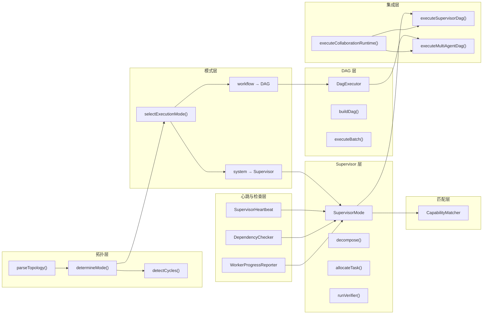

# H21：单元小结课——拓扑解析、DAG 执行与 Supervisor 协调

## 本单元回顾

Unit 3（H14-H20）从拓扑解析器讲起，到 Supervisor-DAG 集成结束。让我们回顾核心概念。

## 层次图：拓扑解析、DAG 执行与 Supervisor 协调



## 核心概念对照表

### `executeMultiAgentDag` vs `executeSupervisorDag`

| 维度 | `executeMultiAgentDag` | `executeSupervisorDag` |
| --- | --- | --- |
| 决策方式 | 静态拓扑排序 | Supervisor LLM 动态决策 |
| 任务分解 | 无（拓扑即任务） | Supervisor LLM 动态分解 |
| Worker 分配 | 按拓扑依赖自动分配 | Supervisor 通过 Contract Net 分配 |
| HITL 处理 | WORKER_BLOCK 事件 | Supervisor 工具调用 + 直连通道 |
| 适用场景 | 固定流程（如 CI/CD） | 动态协作（如旅行规划） |

### 心跳、依赖检查、进度汇报

| 组件 | 触发时机 | 写入 Blackboard | 读取方 |
| --- | --- | --- | --- |
| `SupervisorHeartbeat` | 每 1 分钟 | `swarm$supervisor$status` | Worker、UI |
| `DependencyChecker` | Worker 开始前 | 不写入（只读） | Supervisor |
| `WorkerProgressReporter` | 每 45 秒 | `swarm$worker-[ID]$progress` | Supervisor、UI |

### CapabilityMatcher 评分维度

| 维度 | 权重 | 检查内容 |
| --- | --- | --- |
| Domain 匹配 | 20% | 任务 domain vs Worker domain 的词重叠度 |
| Skill 匹配 | 20% | 任务 requiredSkills vs Worker skills |
| 本体权限 | 30% | Worker 是否可操作任务所需的本体类型 |
| Skill 契约 | 20% | Skill 输入/输出本体是否匹配任务需求 |
| 当前负载 | 10% | 基于本体实例数和操作复杂度 |

## 正向追踪：从拓扑到执行

```
Solution Manifest
  → parseTopology() → CollaborationTopology
    → determineMode() → "workflow" | "system"
      → "workflow" → executeMultiAgentDag()
        → buildDag() → DagExecutor.execute()
          → executeBatch() → Agent 子进程
      → "system" → executeSupervisorDag()
        → Supervisor 子进程
          → SUPERVISOR_TOOL_CALL → Glue Layer
            → dispatch_worker → Worker 子进程
            → wait_workers → 等待完成
            → run_verifier → LLM 验证
```

## 反向诊断：从症状定位责任层

| 症状 | 可能的责任层 | 排查方向 |
| --- | --- | --- |
| DAG 执行顺序错误 | `buildDag` | 检查 edges 类型是否为 `trigger` |
| Supervisor 不分配 Worker | `CapabilityMatcher` | 检查 Worker 的本体权限是否满足 |
| Worker 被阻塞 | `DependencyChecker` | 检查上游 Agent 是否完成 |
| 心跳状态不更新 | `SupervisorHeartbeat` | 检查定时器是否启动 |
| 进度汇报丢失 | `WorkerProgressReporter` | 检查心跳定时器是否重置 |

## 源码覆盖台账（Unit 3）

| 文件路径 | 状态 | 主讲章节 | 关键代码窗口 |
| --- | --- | --- | --- |
| `engine/topology-parser.ts` | 精读 | H14 | `parseTopology`, `determineMode`, `detectCycles` |
| `engine/mode-router.ts` | 精读 | H15 | `selectExecutionMode` |
| `engine/dag-executor.ts` | 精读 | H16 | `DagExecutor`, `buildDag`, `executeBatch` |
| `engine/supervisor.ts` | 精读 | H17 | `SupervisorMode`, `decompose`, `allocateTask` |
| `engine/supervisor-dag.ts` | 精读 | H18 | `executeSupervisorDag`, `handleSupervisorToolCall` |
| `engine/supervisor-heartbeat.ts` | 精读 | H19 | `SupervisorHeartbeat`, `writeStatus` |
| `engine/dependency-checker.ts` | 精读 | H19 | `DependencyChecker`, `checkDependencies` |
| `sandbox/worker-progress-reporter.ts` | 精读 | H19 | `WorkerProgressReporter`, `startTask`, `reportBlock` |
| `engine/capability-matcher.ts` | 精读 | H20 | `CapabilityMatcher`, `scoreAgent` |
| `session/memory-keys.ts` | 背景引用 | H19 | `buildSupervisorKey`, `buildWorkerKey` |

## 口头验收

不看源码，你能解释：

1. `parseTopology` 的输入和输出分别是什么？
2. `selectExecutionMode` 的判定规则是什么？
3. `DagExecutor` 的主循环包含哪些步骤？
4. Supervisor 的三个核心步骤是什么？
5. `CapabilityMatcher` 的五个评分维度是什么？
6. 心跳、依赖检查、进度汇报三者如何协作？
7. HITL 收敛的两条路径是什么？

## 下一单元预告

Unit 4（H22-H28）将深入多 Agent 协作运行时的核心模块：

- 事件总线与 SSE 实时推送
- 黑板状态机与并发控制
- 冲突检测与消解
- Agent 子进程生命周期管理

核心问题：**多个 Agent 如何安全地共享状态、避免冲突、协同工作？**
