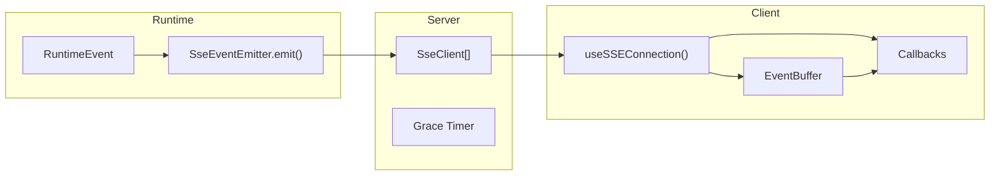

# H22：事件总线与 SSE 实时推送

## 小林的旅行规划，前端怎么知道 Worker 完成了

上一章（H21）回顾了 Unit 3 的核心内容。但有一个关键问题还没回答：**当 Worker 完成时，前端怎么知道？** 前端不会轮询，而是需要一种实时推送机制。

本章回答：`SseEventEmitter` 如何分发事件？`useSSEConnection` 如何建立连接？事件缓冲区如何工作？

## 概念阶梯：SSE 不是 WebSocket

| 特性 | SSE | WebSocket |
| --- | --- | --- |
| 方向 | 服务器 → 客户端单向 | 双向 |
| 协议 | HTTP | WebSocket |
| 重连 | 自动（浏览器内置） | 需手动实现 |
| 适用场景 | 服务器推送 | 实时双向通信 |

OriginOS 选择 SSE 的原因：
1. 只需要服务器 → 客户端单向推送
2. SSE 自动重连，无需额外实现
3. 基于 HTTP，兼容性好

## 第一段源码：`SseEventEmitter` — 事件分发

打开 [packages/core/src/modules/collaboration-runtime/facade/event-bus.ts](../../../../packages/core/src/modules/collaboration-runtime/facade/event-bus.ts)：

```ts
class SseEventEmitter implements EventEmitter {
  private sessionClients = new Map<string, SseClient[]>();

  emit(event: RuntimeEvent): void {
    const data = JSON.stringify(event);
    const targets = this.sessionClients.get(event.sessionId) ?? [];
    for (const client of targets) {
      try {
        client.send("message", data);
      } catch {
        // client disconnected, will be cleaned up
      }
    }

    // Electron 转发
    for (const forwarder of globalThis.__collaborationElectronForwarders ?? []) {
      try { forwarder(event); } catch { /* ignore */ }
    }
  }
```

`SseEventEmitter` 的职责：

1. 维护 `sessionId → SseClient[]` 的映射。
2. `emit(event)` 时，找到该 session 的所有客户端，发送事件。
3. 同时转发到 Electron（如果存在）。

注意：**`emit` 是同步的**，不会等待客户端确认。如果客户端断开，`send` 可能抛出异常，但被 `try-catch` 捕获。

## 第二段源码：客户端注册与 Grace 定时器

```ts
const sessionClients = new Map<string, Set<SseClient>>();
const graceTimers = new Map<string, NodeJS.Timeout>();
const GRACE_PERIOD_MS = 30_000;

export function registerClient(id: string, client: SseClient): void {
  const clients = sessionClients.get(id) ?? new Set();
  clients.add(client);
  sessionClients.set(id, clients);

  // 页面刷新后重连，取消 grace 定时器
  const existing = graceTimers.get(id);
  if (existing) {
    clearTimeout(existing);
    graceTimers.delete(id);
  }
}

export function unregisterClient(id: string, client: SseClient): void {
  const clients = sessionClients.get(id);
  if (!clients) {return;}

  clients.delete(client);
  if (clients.size === 0) {
    sessionClients.delete(id);
    startGraceTimer(id);
  }
}
```

Grace 定时器设计：

1. 当最后一个客户端断开时，启动 30 秒 grace 定时器。
2. 如果 30 秒内有新客户端连接（页面刷新重连），取消定时器。
3. 如果 30 秒后仍无客户端连接，仅记录日志，不自动终止会话。

关键设计：**Grace 定时器不自动终止会话**。这是因为会话可能还在运行（Worker 子进程），只是前端暂时断开。

## 第三段源码：`useSSEConnection` — React Hook

打开 [packages/core/src/modules/collaboration-runtime/ui/use-sse.ts](../../../../packages/core/src/modules/collaboration-runtime/ui/use-sse.ts)：

```ts
const globalConnections = new Map<string, () => void>();
const globalCallbacks = new Map<string, Set<(data: unknown) => void>>();
const eventBuffer = new Map<string, { events: unknown[]; timer: ReturnType<typeof setTimeout> }>();
const EVENT_BUFFER_TTL = 30_000;
```

全局状态：

1. `globalConnections`: `sessionId → unsubscribe 函数`
2. `globalCallbacks`: `sessionId → 回调集合`
3. `eventBuffer`: `sessionId → 事件缓冲区`

事件缓冲区（第 23—31 行）：

```ts
function bufferEvent(sessionId: string, data: unknown): void {
  const existing = eventBuffer.get(sessionId);
  if (existing) {
    existing.events.push(data);
    return;
  }
  const timer = setTimeout(() => eventBuffer.delete(sessionId), EVENT_BUFFER_TTL);
  eventBuffer.set(sessionId, { events: [data], timer });
}
```

缓冲区设计：

1. 当回调还没注册时（组件还没挂载），事件先缓存。
2. 最多保留 30 秒，超时后自动清理。
3. 当回调注册后，立即回放缓冲区中的事件。

连接建立（第 42—64 行）：

```ts
function getOrCreateConnection(sessionId: string): void {
  const existing = globalConnections.get(sessionId);
  if (existing) return;

  const unsubscribe = subscribeCollaborationEvents(sessionId, (rawData) => {
    try {
      const data = JSON.parse(rawData) as RuntimeEvent;
      if (data.sessionId !== sessionId) return;
      const callbacks = globalCallbacks.get(sessionId);
      if (callbacks && callbacks.size > 0) {
        for (const cb of callbacks) {
          cb(data);
        }
      } else {
        bufferEvent(sessionId, data);
      }
    } catch {
      // ignore non-JSON or heartbeat
    }
  });
  globalConnections.set(sessionId, unsubscribe);
}
```

关键设计：

1. **同一 session 只保持一条连接**（`globalConnections` 去重）。
2. **支持多个组件同时订阅同一 session**（`globalCallbacks` 集合）。
3. **事件先缓存再回放**（防止组件挂载前的事件丢失）。

## 第四段源码：Session 切换清理

```ts
const connect = useCallback(() => {
  if (!sessionId) return;

  // Session 切换时清理旧订阅
  if (sessionId !== prevSessionIdRef.current) {
    if (prevSessionIdRef.current && callbackRef.current) {
      removeCallback(prevSessionIdRef.current, callbackRef.current);
    }
    connectedRef.current = false;
    prevSessionIdRef.current = sessionId;
  }
  if (connectedRef.current) return;

  setConnecting(true);

  const onMessage = (raw: unknown) => {
    const event = raw as RuntimeEvent;
    connectedRef.current = true;
    setConnected(true);
    setConnecting(false);
    addEvent(event);

    const activity = eventToAgentStatus(event);
    if (activity && event.source) {
      updateAgentActivity(event.source as string, activity);
    }
  };

  callbackRef.current = onMessage;
  addCallback(sessionId, onMessage);

  getOrCreateConnection(sessionId);
}, [sessionId, addEvent, updateAgentActivity, setConnected, setConnecting]);
```

Session 切换处理：

1. 如果 `sessionId` 变化，清理旧订阅。
2. 设置 `connecting` 状态。
3. 注册新回调。
4. 建立连接（如果尚未建立）。

## 图解：SSE 事件流



## 失败路径与边界

### 边界 1：事件丢失

`emit` 是同步的，如果客户端在 `send` 时断开，事件可能丢失。虽然 `try-catch` 捕获了异常，但没有重试机制。

### 边界 2：缓冲区溢出

`eventBuffer` 没有大小限制，如果回调长时间不注册，可能累积大量事件。虽然 30 秒 TTL 会清理，但在高并发场景下仍可能占用大量内存。

### 边界 3：Session 切换竞态

`useSSEConnection` 的 `connect` 是异步的，如果在 `connect` 完成前切换 session，可能导致旧 session 的事件被添加到新 session。

### 边界 4：Electron 转发

`SseEventEmitter` 同时支持 Electron 转发（第 40—42 行），但 `__collaborationElectronForwarders` 是全局的，如果 forwarder 抛出异常，可能影响其他 forwarder。

## 测试证据与缺口

### 测试缺口

- 没有针对事件丢失的测试。
- 没有针对缓冲区溢出的测试。
- 没有针对 Session 切换竞态的测试。
- 没有针对 Electron 转发异常的测试。

## 口头验收

不看源码，你能解释：

1. `SseEventEmitter` 如何分发事件？
2. Grace 定时器的作用是什么？为什么不自动终止会话？
3. `useSSEConnection` 如何防止同一 session 的多条连接？
4. 事件缓冲区的作用是什么？
5. SSE 和 WebSocket 有什么区别？OriginOS 为什么选择 SSE？

## 章节收束

本章讲解了事件总线与 SSE 实时推送：`SseEventEmitter` 分发事件，`useSSEConnection` 建立连接，事件缓冲区防止事件丢失。

下一章（H23）会进入黑板状态机与并发控制。
