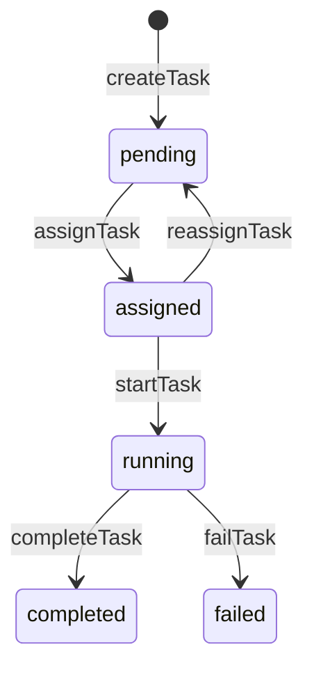

# H23：黑板状态机与并发控制

## 小林的旅行规划，多个 Worker 怎么共享数据

上一章（H22）讲到，SSE 实时推送让前端知道 Worker 完成了。但有一个关键问题：**多个 Worker 同时读写数据时，怎么避免冲突？**

本章回答：`Blackboard` 如何管理共享数据？锁机制如何工作？事件溯源如何重建状态？

## 概念阶梯：Blackboard 不是“全局变量”

| 特性 | Blackboard | 全局变量 |
| --- | --- | --- |
| 作用域 | 会话级别 | 进程级别 |
| 持久化 | 支持快照 | 不支持 |
| 并发控制 | 锁机制 | 无 |
| 事件溯源 | 支持 | 不支持 |
| 来源追溯 | Provenance | 无 |

## 第一段源码：`Blackboard` 的数据结构

打开 [packages/core/src/modules/collaboration-runtime/session/blackboard.ts](../../../../packages/core/src/modules/collaboration-runtime/session/blackboard.ts)：

```ts
export interface BlackboardState {
  sessionId: string;
  sharedData: Record<string, BlackboardEntry>;
  messages: BlackboardMessage[];
  tasks: TaskItem[];
  artifacts: Record<string, BlackboardArtifact>;
  locks: Record<string, BlackboardLock>;
}
```

Blackboard 的五种数据类型：

| 类型 | 用途 | 典型操作 |
| --- | --- | --- |
| `sharedData` | 共享键值数据 | `setData`, `getData`, `correctData` |
| `tasks` | 任务队列 | `createTask`, `assignTask`, `completeTask` |
| `artifacts` | 协作产物 | `addArtifact`, `getArtifact` |
| `locks` | 并发控制 | `lock`, `release`, `isLocked` |
| `messages` | Agent 通信 | `sendMessage`, `getMessages` |

## 第二段源码：锁机制

```ts
lock(key: string, agentId: string, ttlMs: number = DEFAULT_LOCK_TTL_MS): boolean {
  this.pruneExpiredLocks();

  if (this.locks[key] && this.locks[key].holder !== agentId) {
    return false;
  }

  this.locks[key] = {
    holder: agentId,
    expiresAt: new Date(Date.now() + ttlMs).toISOString(),
  };
  return true;
}

isLocked(key: string): boolean {
  const lock = this.locks[key];
  if (!lock) return false;
  if (new Date(lock.expiresAt) < new Date()) {
    delete this.locks[key];
    return false;
  }
  return true;
}
```

锁机制设计：

1. `lock(key, agentId, ttlMs)`：尝试获取锁，如果已被其他 Agent 持有，返回 false。
2. `isLocked(key)`：检查锁是否有效，同时清理过期锁。
3. 锁有 TTL（默认 30 秒），过期自动释放。

注意：**锁不是强制的**。`setData` 会检查锁，但 `getData` 不会。这意味着：读操作不需要锁，写操作需要锁。

## 第三段源码：事件溯源

```ts
fromEvents(events: RuntimeEvent[]): Blackboard {
  for (const event of events) {
    this.applyEvent(event);
  }
  return this as unknown as Blackboard;
}

private applyEvent(event: RuntimeEvent): void {
  switch (event.type) {
    case "AGENT_REGISTERED":
      this.registeredAgents.add(event.source);
      break;
    case "BLACKBOARD_WRITE": {
      const key = event.payload["key"] as string;
      const value = event.payload["value"];
      if (key && value !== undefined) {
        const existing = this.sharedData[key];
        const nextVersion = existing ? existing.provenance.version + 1 : 1;
        this.sharedData[key] = this.makeEntry(value, event.source, event.timestamp, event.payload, nextVersion);
      }
      break;
    }
    // ...
  }
}
```

事件溯源设计：

1. `fromEvents(events)`：从事件流重建状态。
2. `applyEvent(event)`：根据事件类型更新状态。
3. 每次写入都会增加版本号（`nextVersion`）。

## 第四段源码：Provenance（来源追溯）

```ts
private makeEntry(value, agentId, timestamp, eventPayload, version): BlackboardEntry {
  const provenance: BlackboardProvenance = {
    writer: agentId,
    timestamp,
    sourceUri: (eventPayload["sourceUri"] as string) ?? undefined,
    toolCallsCited: (eventPayload["toolCallsCited"] as string[]) ?? undefined,
    version,
  };

  return {
    value,
    provenance,
    corrections: [],
  };
}
```

Provenance 包含：

- `writer`: 写入者（Agent ID）
- `timestamp`: 写入时间
- `sourceUri`: 来源 URI
- `toolCallsCited`: 引用的工具调用
- `version`: 版本号

## 第五段源码：Correction（修正）

```ts
correctData(key: string, newValue: unknown, correctorId: string, reason: string): void {
  const existing = this.sharedData[key];
  if (!existing) {
    throw new Error(`Blackboard key "${key}" does not exist to correct`);
  }

  const correction: BlackboardCorrection = {
    id: `corr-${Date.now()}-${Math.random().toString(36).slice(2, 8)}`,
    key,
    newValue,
    supersededBy: "",
    correctedBy: correctorId,
    reason,
    timestamp: new Date().toISOString(),
  };

  existing.corrections.push(correction);

  const nextVersion = existing.provenance.version + 1;
  this.sharedData[key] = {
    value: newValue,
    provenance: {
      writer: correctorId,
      timestamp: correction.timestamp,
      sourceUri: `correction://${correction.id}`,
      toolCallsCited: [],
      version: nextVersion,
    },
    corrections: existing.corrections,
  };
}
```

Correction 设计：

1. **Append-only**：旧值保留，修正值存储在 `corrections` 数组中。
2. **版本递增**：每次修正增加版本号。
3. **原因记录**：记录修正者和修正原因。

## 图解：Blackboard 状态机



任务状态机：

| 状态 | 允许的操作 | 禁止的操作 |
| --- | --- | --- |
| `pending` | `assignTask` | `startTask`, `completeTask` |
| `assigned` | `startTask`, `reassignTask` | `completeTask` |
| `running` | `completeTask`, `failTask` | `assignTask` |
| `completed` | 无 | 所有操作 |
| `failed` | 无 | 所有操作 |

## 失败路径与边界

### 边界 1：锁不是强制的

`setData` 会检查锁，但 `getData` 不会。这意味着：读操作不需要锁，但多个 Agent 同时写同一 key 时可能冲突。

### 边界 2：锁的 TTL 是固定的

锁的默认 TTL 是 30 秒（`DEFAULT_LOCK_TTL_MS`），不可配置。如果 Agent 持有锁超过 30 秒，锁会自动释放，其他 Agent 可以获取。

### 边界 3：事件溯源不持久化

`fromEvents` 从事件流重建状态，但事件流本身存储在 `FsEventStore` 中。如果 `FsEventStore` 损坏，状态无法重建。

### 边界 4：`correctData` 不检查锁

`correctData` 不检查 key 是否被锁定（第 246—278 行）。这意味着：即使 key 被锁定，Verifier 也可以修正它。

## 测试证据与缺口

### 测试缺口

- 没有针对锁 TTL 过期的测试。
- 没有针对 `correctData` 不检查锁的测试。
- 没有针对事件溯源重建的测试。
- 没有针对多 Agent 并发写的测试。

## 口头验收

不看源码，你能解释：

1. Blackboard 的五种数据类型是什么？
2. 锁机制如何工作？为什么不是强制的？
3. 事件溯源如何重建状态？
4. Provenance 包含哪些信息？
5. Correction 为什么是 append-only 的？

## 章节收束

本章讲解了 Blackboard 状态机与并发控制：五种数据类型、锁机制、事件溯源、Provenance、Correction。

下一章（H24）会进入冲突检测与消解。
