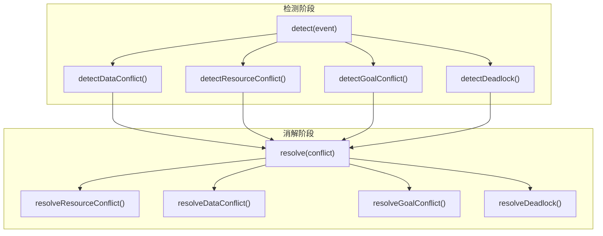

# H24：冲突检测与消解

## 小林的旅行规划，多个 Worker 同时写酒店数据怎么办

上一章（H23）讲到，Blackboard 通过锁机制控制并发写入。但锁只是预防手段，**当冲突已经发生时，系统如何检测并自动消解？**

本章回答：`ConflictDetector` 如何检测四种冲突类型？每种冲突的消解策略是什么？`checkLockTimeouts` 如何处理锁超时？

## 概念阶梯：冲突检测不是“事后诸葛亮”

| 特性 | ConflictDetector | 手动排查 |
| --- | --- | --- |
| 触发时机 | 每次黑板操作后自动检测 | 事后人工发现 |
| 检测范围 | 数据/资源/目标/死锁四种类型 | 通常只发现数据冲突 |
| 消解策略 | 自动应用（部分需 Supervisor） | 人工协商 |
| 历史记录 | 完整冲突历史 | 无系统记录 |

## 第一段源码：`ConflictDetector` 的四种冲突类型

打开 [packages/core/src/modules/collaboration-runtime/engine/conflict-detector.ts](../../../../packages/core/src/modules/collaboration-runtime/engine/conflict-detector.ts) 第 28—67 行：

```ts
export type ConflictType =
  | "resource_conflict"
  | "data_conflict"
  | "goal_conflict"
  | "deadlock";

export interface Conflict {
  id: string;
  type: ConflictType;
  agents: string[];
  details: Record<string, unknown>;
  resolution: ConflictResolution;
  timestamp: string;
  resolved: boolean;
}
```

四种冲突类型：

| 类型 | 触发条件 | 默认消解策略 |
| --- | --- | --- |
| `data_conflict` | 短时间内多个 Agent 写同一 Blackboard key | `lock_based` → `last_write_wins` |
| `resource_conflict` | 任务已被分配给 Agent A，Agent B 试图抢占 | `first_come_first_serve` |
| `goal_conflict` | 同一任务产出相互矛盾 | `supervisor_decision` |
| `deadlock` | 循环依赖导致死锁 | `break_cycle` |

## 第二段源码：`detect` — 统一检测入口

```ts
detect(newEvent: RuntimeEvent): Conflict | null {
  let conflict: Conflict | null = null;

  switch (newEvent.type) {
    case "BLACKBOARD_WRITE":
    case "BLACKBOARD_UPDATE":
      conflict = this.detectDataConflict(newEvent);
      break;

    case "TASK_ASSIGNED":
      conflict = this.detectResourceConflict(newEvent);
      break;

    case "SESSION_ABORTED":
    case "TASK_FAILED":
      conflict = this.detectGoalConflict(newEvent);
      break;
  }

  // 检查死锁（每次检测）
  if (!conflict) {
    conflict = this.detectDeadlock();
  }

  if (conflict) {
    this.history.push(conflict);
  }

  return conflict;
}
```

检测逻辑：

1. 根据事件类型分发到对应的检测方法。
2. 如果当前事件没有触发冲突，继续检查死锁。
3. 死锁检查是**每次检测都会执行**的，因为死锁可能由任何事件触发。
4. 检测到冲突后，记录到 `history` 中。

## 第三段源码：`detectDataConflict` — 数据冲突检测

```ts
private detectDataConflict(event: RuntimeEvent): Conflict | null {
  const key = event.payload?.["key"] as string | undefined;
  if (!key) return null;

  const now = Date.now();
  const lastWriter = this.recentWrites.get(key);

  // 清理过期的写入记录
  if (lastWriter && now - lastWriter.timestamp > this.config.writeIntervalMs) {
    this.recentWrites.delete(key);
  }

  // 记录当前写入
  this.recentWrites.set(key, {
    agentId: event.source,
    timestamp: now,
  });

  // 如果短时间内有其他 Agent 写过同一 key，触发冲突
  if (
    lastWriter &&
    now - lastWriter.timestamp <= this.config.writeIntervalMs &&
    lastWriter.agentId !== event.source
  ) {
    return {
      id: this.generateId(),
      type: "data_conflict",
      agents: [lastWriter.agentId, event.source],
      details: { key, lastWriter: lastWriter.agentId, currentWriter: event.source },
      resolution: "lock_based",
      timestamp: new Date().toISOString(),
      resolved: false,
    };
  }

  return null;
}
```

数据冲突检测策略：

1. **时间窗口**：默认 1 秒（`writeIntervalMs`，第 89 行）。
2. **记录写入**：每个 key 记录最后一次写入的 Agent 和时间戳。
3. **冲突条件**：同一 key 在短时间内被不同 Agent 写入。
4. **清理过期**：超过时间窗口的记录自动清理。

注意：**同一 Agent 连续写同一 key 不会触发冲突**（第 251 行）。

## 第四段源码：`detectDeadlock` — 死锁检测

```ts
private detectDeadlock(): Conflict | null {
  const tasks = this.blackboard.getTasks();
  const runningTasks = tasks.filter((t) => t.status === "running");

  if (runningTasks.length < 2) return null;

  // 构建依赖图
  const dependencyGraph = new Map<string, string[]>();
  for (const task of runningTasks) {
    dependencyGraph.set(task.id, task.dependsOn ?? []);
  }

  // 检测循环
  const cycle = this.findCycle(dependencyGraph);
  if (cycle && cycle.length > 1) {
    const agents = runningTasks
      .filter((t) => cycle.includes(t.id) && t.assignedTo)
      .map((t) => t.assignedTo!)
      .filter((a, i, arr) => arr.indexOf(a) === i);

    return {
      id: this.generateId(),
      type: "deadlock",
      agents: agents.length > 0 ? agents : ["unknown"],
      details: { cycle, taskIds: cycle },
      resolution: "break_cycle",
      timestamp: new Date().toISOString(),
      resolved: false,
    };
  }

  return null;
}
```

死锁检测策略：

1. 获取所有 `running` 状态的任务。
2. 构建依赖图：`taskId → dependsOn[]`。
3. 使用 DFS 检测循环（`findCycle`，第 382—417 行）。
4. 如果检测到循环，返回死锁冲突。

`findCycle` 使用标准 DFS 算法：

```ts
private findCycle(graph: Map<string, string[]>): string[] | null {
  const visited = new Set<string>();
  const inStack = new Set<string>();
  const path: string[] = [];

  const dfs = (node: string): string[] | null => {
    if (inStack.has(node)) {
      const cycleStart = path.indexOf(node);
      return path.slice(cycleStart);
    }
    if (visited.has(node)) return null;

    visited.add(node);
    inStack.add(node);
    path.push(node);

    for (const dep of graph.get(node) ?? []) {
      const result = dfs(dep);
      if (result) return result;
    }

    path.pop();
    inStack.delete(node);
    return null;
  };

  for (const node of graph.keys()) {
    const cycle = dfs(node);
    if (cycle) return cycle;
  }

  return null;
}
```

DFS 算法说明：

1. `visited`：已访问的节点（避免重复遍历）。
2. `inStack`：当前递归栈中的节点（检测回边）。
3. `path`：当前遍历路径（用于提取环）。
4. 如果发现 `inStack` 中的节点，说明存在环，返回从该节点开始的路径片段。

## 第五段源码：`resolve` — 消解策略

```ts
resolve(conflict: Conflict): ResolutionResult {
  switch (conflict.type) {
    case "resource_conflict":
      return this.resolveResourceConflict(conflict);
    case "data_conflict":
      return this.resolveDataConflict(conflict);
    case "goal_conflict":
      return this.resolveGoalConflict(conflict);
    case "deadlock":
      return this.resolveDeadlock(conflict);
  }
}
```

消解策略对照：

| 冲突类型 | 策略 | 说明 |
| --- | --- | --- |
| `resource_conflict` | `first_come_first_serve` | 保留第一个 Agent 的所有权 |
| `data_conflict` | `lock_based` → `last_write_wins` | 有锁按锁，无锁后写优先 |
| `goal_conflict` | `supervisor_decision` | 不自动消解，上报 Supervisor |
| `deadlock` | `break_cycle` | 中断优先级最低的 Agent |

### `resolveDataConflict` 详细逻辑

```ts
private resolveDataConflict(conflict: Conflict): ResolutionResult {
  const key = conflict.details["key"] as string | undefined;
  if (!key) {
    return { conflict, appliedStrategy: "last_write_wins", affectedAgents: conflict.agents, resolved: true };
  }

  const locks = this.blackboard.getLocks();
  const lock = locks[key];

  if (lock && conflict.agents.includes(lock.holder)) {
    conflict.resolution = "lock_based";
  } else {
    conflict.resolution = "last_write_wins";
  }

  conflict.resolved = true;

  return {
    conflict,
    appliedStrategy: conflict.resolution,
    affectedAgents: conflict.agents,
    resolved: true,
  };
}
```

数据冲突消解：

1. 如果 key 被某个 Agent 锁定，且该 Agent 在冲突双方中 → `lock_based`（锁持有者获胜）。
2. 否则 → `last_write_wins`（后写者获胜）。
3. 注意：**这里不检查锁是否过期**（Blackboard 的 `isLocked` 会检查，但 `getLocks` 返回原始锁记录）。

### `resolveDeadlock` 详细逻辑

```ts
private resolveDeadlock(conflict: Conflict): ResolutionResult {
  const cycle = conflict.details["cycle"] as string[] | undefined;
  if (!cycle || cycle.length === 0) {
    return { conflict, appliedStrategy: "none", affectedAgents: [], resolved: false };
  }

  const victim = this.selectDeadlockVictim(conflict.agents);

  if (victim) {
    conflict.resolution = "break_cycle";
    conflict.resolved = true;
  }

  return {
    conflict,
    appliedStrategy: "break_cycle",
    affectedAgents: victim ? [victim] : conflict.agents,
    resolved: !!victim,
  };
}
```

死锁消解：

1. 从冲突的 Agent 中选择**优先级最低**的作为牺牲者（victim）。
2. 如果没有配置优先级，选择最后一个 Agent（第 521—522 行）。
3. 中断该 Agent，打破循环。

## 第六段源码：`checkLockTimeouts` — 锁超时检查

```ts
checkLockTimeouts(): Conflict[] {
  const locks = this.blackboard.getLocks();
  const timedOut: Conflict[] = [];

  for (const [key, lock] of Object.entries(locks)) {
    const expiresAt = new Date(lock.expiresAt).getTime();
    if (Date.now() > expiresAt) {
      this.blackboard.release(key, lock.holder);

      const conflict: Conflict = {
        id: this.generateId(),
        type: "resource_conflict",
        agents: [lock.holder],
        details: { resource: key, reason: "lock_timeout" },
        resolution: "timeout",
        timestamp: new Date().toISOString(),
        resolved: true,
      };
      this.history.push(conflict);
      timedOut.push(conflict);
    }
  }

  return timedOut;
}
```

锁超时处理：

1. 遍历所有锁，检查是否过期。
2. 如果过期，自动释放锁。
3. 记录一个 `resource_conflict` 冲突（类型为 `timeout`）。
4. 返回所有超时冲突。

注意：**`checkLockTimeouts` 不会自动调用**，需要外部定时触发（如心跳定时器）。

## 图解：冲突检测与消解流程



## 失败路径与边界

### 边界 1：`detectDataConflict` 的时间窗口是固定的

`writeIntervalMs` 默认 1 秒（第 89 行），不可配置。如果两个 Agent 在 1.1 秒内先后写入同一 key，第二次写入不会被检测为冲突。

### 边界 2：`detectGoalConflict` 的 MVP 实现

`detectGoalConflict`（第 302—339 行）只检查任务输出中是否有 `conflict` 或 `contradiction` 字段。这是一个**非常简化的实现**，实际场景中目标冲突可能更复杂。

### 边界 3：`findCycle` 只检测有向图中的环

`findCycle` 只检查任务依赖图中的循环，不检查资源依赖图。如果死锁是由资源竞争（而非任务依赖）引起的，`findCycle` 无法检测。

### 边界 4：`checkLockTimeouts` 不会自动调用

`checkLockTimeouts` 需要外部定时触发。如果外部没有定时调用，锁可能永久不释放（直到 Blackboard 的 `isLocked` 在读取时清理）。

### 边界 5：`selectDeadlockVictim` 的优先级配置

`selectDeadlockVictim`（第 518—541 行）依赖 `agentPriorities` 配置。如果没有配置优先级，选择最后一个 Agent，这可能不是最优选择。

## 测试证据与缺口

### 已有测试（`conflict-detector.test.ts`）

**数据冲突检测**：

```ts
it("detects data conflict when two agents write same key within window", () => {
  const { blackboard, eventStore } = createTestDeps();
  const detector = new ConflictDetector(blackboard, eventStore, {
    writeIntervalMs: 500,
  });

  const evt1 = makeEvent({
    type: "BLACKBOARD_WRITE",
    source: "agent-a",
    payload: { key: "shared-data", value: "a-value" },
  });
  detector.detect(evt1);

  const evt2 = makeEvent({
    type: "BLACKBOARD_WRITE",
    source: "agent-b",
    payload: { key: "shared-data", value: "b-value" },
  });
  const conflict = detector.detect(evt2);

  expect(conflict).not.toBeNull();
  expect(conflict!.type).toBe("data_conflict");
});
```

**死锁检测**：

```ts
it("detects circular dependency deadlock", () => {
  const { blackboard, eventStore } = createTestDeps();

  const taskA = blackboard.createTask("Task A");
  const taskB = blackboard.createTask("Task B");
  const taskC = blackboard.createTask("Task C");

  taskA.dependsOn = [taskB.id];
  taskB.dependsOn = [taskC.id];
  taskC.dependsOn = [taskA.id];

  blackboard.assignTask(taskA.id, "agent-a");
  blackboard.startTask(taskA.id);
  // ... 启动其他任务

  const detector = new ConflictDetector(blackboard, eventStore);
  const conflict = detector.detect(makeEvent({ type: "AGENT_MESSAGE", source: "monitor" }));

  expect(conflict).not.toBeNull();
  expect(conflict!.type).toBe("deadlock");
});
```

**消解策略**：

```ts
it("resolves deadlock by breaking cycle (lowest priority victim)", () => {
  const detector = new ConflictDetector(blackboard, eventStore, {
    agentPriorities: [
      { agentId: "agent-a", priority: 10 },
      { agentId: "agent-b", priority: 5 },
      { agentId: "agent-c", priority: 1 },
    ],
  });

  const conflict = {
    id: "test-5",
    type: "deadlock" as const,
    agents: ["agent-a", "agent-b", "agent-c"],
    details: { cycle: ["task-a", "task-b", "task-c"] },
    resolution: "break_cycle" as const,
    timestamp: new Date().toISOString(),
    resolved: false,
  };

  const result = detector.resolve(conflict);
  expect(result.resolved).toBe(true);
  expect(result.affectedAgents).toContain("agent-c"); // 最低优先级
});
```

### 测试缺口

- 没有针对 `writeIntervalMs` 边界（刚好在窗口外）的测试。
- 没有针对 `detectGoalConflict` 复杂场景的测试。
- 没有针对资源依赖死锁的测试（`findCycle` 不检查资源图）。
- 没有针对 `checkLockTimeouts` 定时触发机制的测试。
- 没有针对 `selectDeadlockVictim` 无优先级配置的测试。

## 口头验收

不看源码，你能解释：

1. `ConflictDetector` 检测哪四种冲突类型？各在什么条件下触发？
2. `detectDataConflict` 的时间窗口是多少？同一 Agent 连续写入会触发冲突吗？
3. `findCycle` 使用什么算法？时间复杂度是多少？
4. 四种冲突的默认消解策略分别是什么？
5. `goal_conflict` 为什么不上报 Supervisor 裁决？
6. `checkLockTimeouts` 为什么不会自动调用？有什么风险？

## 章节收束

本章讲解了 `ConflictDetector` 的设计：四种冲突类型（数据、资源、目标、死锁）、检测策略、消解策略和锁超时处理。

下一章（H25）会进入可观测性：Logging、Metrics、Tracing、CostController。
