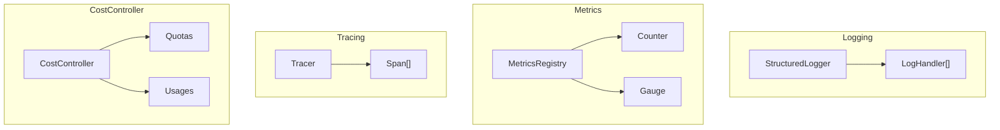

# H25：可观测性 — Logging、Metrics、Tracing 与 CostController

## 小林的旅行规划，系统怎么知道花了多少钱

上一章（H24）讲到，冲突检测自动消解并发冲突。但有一个关键问题：**当多个 Worker 同时运行时，系统如何追踪谁在做什么、花了多少 Token、哪里慢了？**

本章回答：`StructuredLogger` 如何记录结构化日志？`MetricsRegistry` 如何收集指标？`Tracer` 如何追踪调用链？`CostController` 如何控制成本？

## 概念阶梯：可观测性不是“打日志”

| 维度 | Logging | Metrics | Tracing | CostController |
| --- | --- | --- | --- | --- |
| 关注点 | 发生了什么 | 发生了多少次 | 花了多长时间 | 花了多少钱 |
| 数据量 | 大量文本 | 聚合数值 | 结构化链路 | 配额与消耗 |
| 查询方式 | 关键词搜索 | 聚合查询 | 链路追踪 | 配额检查 |
| 典型用途 | 故障排查 | 容量规划 | 性能优化 | 成本控制 |

## 第一段源码：`StructuredLogger` — 结构化日志

打开 [packages/core/src/modules/collaboration-runtime/observability/logging.ts](../../../../packages/core/src/modules/collaboration-runtime/observability/logging.ts) 第 29—120 行：

```ts
export class StructuredLogger {
  private sessionId: string;
  private handlers: LogHandler[] = [];
  private defaultAgentId?: string;

  constructor(sessionId: string) {
    this.sessionId = sessionId;
  }

  on(handler: LogHandler): void {
    this.handlers.push(handler);
  }

  emit(entry: Omit<LogEntry, "timestamp" | "sessionId"> & { level: LogLevel; message: string }): void {
    const logEntry: LogEntry = {
      ...entry,
      timestamp: new Date().toISOString(),
      sessionId: this.sessionId,
    };

    for (const handler of this.handlers) {
      try {
        handler(logEntry);
      } catch {
        // Handler failures should not crash the logger
      }
    }

    const colored = this.colorize(logEntry.level, `[${logEntry.level.toUpperCase()}]`);
    console.log(`${colored} ${logEntry.timestamp} [${logEntry.sessionId}] ${logEntry.agentId ?? "system"}: ${logEntry.message}`);
  }
```

`StructuredLogger` 设计：

1. **结构化**：每条日志包含 `timestamp`、`sessionId`、`agentId`、`level`、`message`、`data`。
2. **Handler 模式**：通过 `on(handler)` 注册多个处理器，支持日志路由到不同目的地。
3. **容错**：Handler 失败不会崩溃 Logger（第 63—66 行）。
4. **控制台输出**：带颜色格式化输出。

日志级别：

| 级别 | 用途 | 颜色 |
| --- | --- | --- |
| `debug` | 调试信息 | 青色 |
| `info` | 正常运行信息 | 绿色 |
| `warn` | 警告 | 黄色 |
| `error` | 错误 | 红色 |

## 第二段源码：`MetricsRegistry` — 指标收集

打开 [packages/core/src/modules/collaboration-runtime/observability/metrics.ts](../../../../packages/core/src/modules/collaboration-runtime/observability/metrics.ts) 第 96—240 行：

```ts
export class MetricsRegistry {
  private agentTurns = new Counter();
  private agentToolCalls = new Counter();
  private agentTokensUsed = new Counter();
  private collaborationMessages = new Counter();
  private collaborationConflicts = new Counter();
  private collaborationTaskSuccess = new Counter();
  private collaborationDuration = new Gauge();
```

指标类型：

| 类型 | 用途 | 实现 |
| --- | --- | --- |
| `Counter` | 只增不减的计数器 | `increment()` |
| `Gauge` | 可增可减的数值 | `set()` |

`Counter` 的 key 生成（第 53—58 行）：

```ts
private key(labels: Record<string, string>): string {
  return Object.entries(labels)
    .sort(([a], [b]) => a.localeCompare(b))
    .map(([k, v]) => `${k}=${v}`)
    .join(",");
}
```

注意：**labels 按 key 排序后拼接**，确保相同 labels 生成相同的 key。

Prometheus 导出（第 193—216 行）：

```ts
toPrometheusText(): string {
  const samples = this.collect();
  const lines: string[] = [];

  const grouped = new Map<string, MetricSample[]>();
  for (const sample of samples) {
    if (!grouped.has(sample.name)) grouped.set(sample.name, []);
    grouped.get(sample.name)!.push(sample);
  }

  for (const [name, samps] of grouped) {
    lines.push(`# TYPE ${name} counter`);
    for (const sample of samps) {
      const labelStr = Object.entries(sample.labels)
        .map(([k, v]) => `${k}="${v}"`)
        .join(",");
      lines.push(labelStr ? `${name}{${labelStr}} ${sample.value}` : `${name} ${sample.value}`);
    }
    lines.push("");
  }

  return lines.join("\n");
}
```

Prometheus 格式：

```
# TYPE agent_turns_total counter
agent_turns_total{agentId="hotel-researcher",sessionId="session-123"} 5
```

## 第三段源码：`Tracer` — 分布式追踪

打开 [packages/core/src/modules/collaboration-runtime/observability/tracing.ts](../../../../packages/core/src/modules/collaboration-runtime/observability/tracing.ts) 第 36—188 行：

```ts
export class Tracer {
  private spans = new Map<string, Span>();
  private traces = new Map<string, Span[]>();
  private activeSpans = new Map<string, Span>();
```

`Tracer` 的核心数据结构：

| 字段 | 类型 | 用途 |
| --- | --- | --- |
| `spans` | `Map<string, Span>` | 所有 span 的索引 |
| `traces` | `Map<string, Span[]>` | traceId → span 列表 |
| `activeSpans` | `Map<string, Span>` | 未结束的 span |

`withSpan` 自动管理生命周期（第 95—115 行）：

```ts
async withSpan<T>(
  operation: string,
  opts: { sessionId: string; traceId?: string; parentId?: string; agentId?: string; attributes?: Record<string, unknown> },
  fn: (spanId: string) => Promise<T>
): Promise<T> {
  const spanId = this.startSpan(operation, opts);
  try {
    const result = await fn(spanId);
    this.endSpan(spanId, "ok");
    return result;
  } catch (error) {
    this.endSpan(spanId, "error");
    throw error;
  }
}
```

`withSpan` 设计：

1. 自动 `startSpan` 和 `endSpan`。
2. 成功时标记 `ok`，失败时标记 `error`。
3. 异常会抛出，但 span 会先结束。

慢操作检测（第 160—165 行）：

```ts
getSlowOperations(thresholdMs: number): Span[] {
  return this.getAllSpans().filter((s) => {
    if (!s.endTime) return false;
    return s.endTime - s.startTime > thresholdMs;
  });
}
```

## 第四段源码：`CostController` — 成本控制

打开 [packages/core/src/modules/collaboration-runtime/observability/cost-controller.ts](../../../../packages/core/src/modules/collaboration-runtime/observability/cost-controller.ts) 第 68—293 行：

```ts
export class CostController {
  private quotas = new Map<string, AgentQuota>();
  private usages = new Map<string, AgentUsage>();
  private tokenInputCounts = new Map<string, number>();
  private tokenOutputCounts = new Map<string, number>();
```

配额检查（第 102—121 行）：

```ts
checkTokenQuota(agentId: string): QuotaCheck {
  const quota = this.quotas.get(agentId);
  if (!quota) {
    return { allowed: true, remaining: Infinity };
  }

  const usage = this.usages.get(agentId);
  const remaining = quota.maxTokens - (usage?.tokensUsed ?? 0);

  if (remaining <= 0) {
    return {
      allowed: false,
      remaining: 0,
      reason: `Token quota exceeded for ${agentId} (${usage?.tokensUsed}/${quota.maxTokens})`,
    };
  }

  return { allowed: true, remaining };
}
```

配额检查设计：

1. 如果没有设置配额 → 允许（`remaining: Infinity`）。
2. 计算剩余 Token 数。
3. 如果剩余 ≤ 0 → 拒绝，返回原因。
4. 否则 → 允许，返回剩余数。

成本估算（第 284—292 行）：

```ts
private estimateCost(totalTokens: number): number {
  const inputTokens = totalTokens * 0.5;
  const outputTokens = totalTokens * 0.5;
  return (
    (inputTokens / 1000) * (TOKEN_COST_PER_1K["input"] ?? 0.0025) +
    (outputTokens / 1000) * (TOKEN_COST_PER_1K["output"] ?? 0.01)
  );
}
```

成本估算假设：

1. 输入输出 Token 各占 50%。
2. 输入成本：$0.0025/1K tokens。
3. 输出成本：$0.01/1K tokens。

注意：**这是简化估算，实际成本可能因模型不同而差异很大。**

## 图解：可观测性四层架构



## 失败路径与边界

### 边界 1：`StructuredLogger` 的 Handler 失败不会崩溃

`emit` 中 `try-catch` 捕获 Handler 异常（第 62—66 行），但这也意味着：**如果所有 Handler 都失败，日志会丢失。**

### 边界 2：`MetricsRegistry` 没有持久化

`MetricsRegistry` 存储在内存中，进程重启后指标丢失。如果需要持久化，需要外部系统（如 Prometheus）拉取。

### 边界 3：`Tracer` 的内存泄漏

`Tracer` 存储所有 span，如果不调用 `cleanup`，内存会持续增长。`cleanup` 默认清理 5 分钟前完成的 trace（第 172 行）。

### 边界 4：`CostController` 的成本估算是近似的

`estimateCost` 假设输入输出各占 50%，且使用固定单价。实际成本可能因模型、供应商、折扣等因素不同。

### 边界 5：配额检查不是实时的

`checkTokenQuota` 检查的是已记录的 usage，如果 usage 更新有延迟，配额检查可能不准确。

## 测试证据与缺口

### 测试缺口

- 没有针对 `StructuredLogger` Handler 失败 fallback 的测试。
- 没有针对 `MetricsRegistry` Prometheus 导出格式的测试。
- 没有针对 `Tracer` 内存泄漏的测试。
- 没有针对 `CostController` 成本估算准确性的测试。
- 没有针对配额检查竞态条件的测试。

## 口头验收

不看源码，你能解释：

1. `StructuredLogger` 的 Handler 模式有什么优缺点？
2. `Counter` 和 `Gauge` 有什么区别？
3. `Tracer.withSpan` 如何自动管理 span 生命周期？
4. `CostController` 的配额检查在什么情况下会返回 `Infinity`？
5. 可观测性的四个维度（Logging/Metrics/Tracing/Cost）分别解决什么问题？

## 章节收束

本章讲解了可观测性四层架构：`StructuredLogger` 记录结构化日志，`MetricsRegistry` 收集指标，`Tracer` 追踪调用链，`CostController` 控制成本。

下一章（H26）会进入 UI 查看器边界：store、SSE、时间线与黑板视图。
