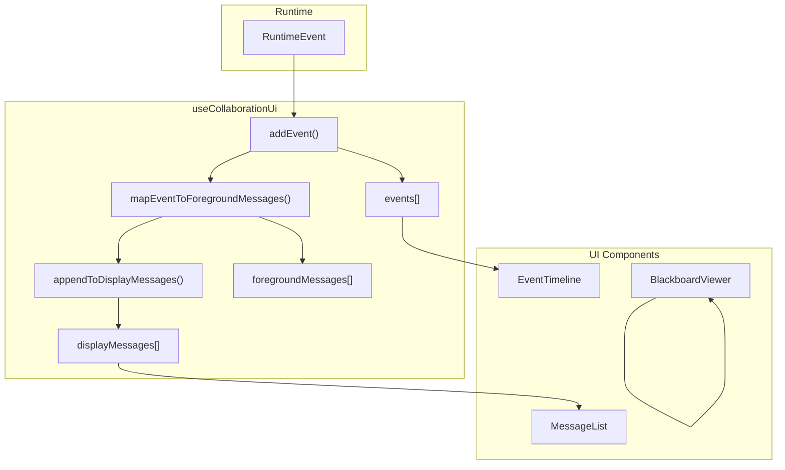

# H26：UI 查看器边界 — Store、SSE、时间线与黑板视图

## 小林的旅行规划，前端怎么看到协作进度

上一章（H25）讲到，可观测性四层架构记录运行时状态。但有一个关键问题：**前端如何实时看到协作进度？事件如何映射到 UI 消息？**

本章回答：`useCollaborationUi` Store 如何管理状态？`EventTimeline` 如何展示事件？`BlackboardViewer` 如何展示黑板状态？

## 概念阶梯：UI Store 不是“全局状态”

| 特性 | `useCollaborationUi` | 全局状态 |
| --- | --- | --- |
| 作用域 | 协作会话级别 | 应用级别 |
| 数据来源 | SSE 实时推送 | 手动设置 |
| 状态转换 | 事件驱动（`addEvent`） | 命令式更新 |
| 派生状态 | `foregroundMessages`、`displayMessages` | 无 |

## 第一段源码：`useCollaborationUi` — Zustand Store

打开 [packages/core/src/modules/collaboration-runtime/ui/store.ts](../../../../packages/core/src/modules/collaboration-runtime/ui/store.ts) 第 424—531 行：

```ts
export const useCollaborationUi = create<CollaborationUiState>((set, get) => ({
  ...initialState,

  addEvent: (event) => {
    const state = get();
    if (state.lastEventId === event.id) return;
    if (state.events.some((e) => e.id === event.id)) return;

    const newFgMessages = mapEventToForegroundMessages(event);

    const source = event.source;
    let newActiveMap = state.recentlyActiveMap;
    if (source && source !== "system" && source !== "user") {
      newActiveMap = { ...state.recentlyActiveMap, [source]: Date.now() + RECENTLY_ACTIVE_TTL };
    }

    const newEvents = state.events.length < MAX_EVENTS
      ? [...state.events, event]
      : [...state.events.slice(state.events.length - (MAX_EVENTS - 1)), event];

    let newForegroundMessages = state.foregroundMessages;
    let newDisplayMessages = state.displayMessages;

    if (newFgMessages.length > 0) {
      if (event.type === "MESSAGE_SENT" && newFgMessages[0]?.streamSource) {
        // 流式消息追加
        const incoming = newFgMessages[0];
        const last = state.foregroundMessages[state.foregroundMessages.length - 1];
        newForegroundMessages = last?.role === "supervisor" && last.streamSource === incoming.streamSource
          ? [...state.foregroundMessages.slice(0, -1), { ...last, text: `${last.text}${incoming.text}` }]
          : [...state.foregroundMessages, incoming];
        newDisplayMessages = appendToDisplayMessages([], newForegroundMessages);
      } else if (event.type === "ASSISTANT_MESSAGE" && isSupervisorSource(event.source)) {
        // 最终消息替换流式消息
        const finalText = String(event.payload?.["content"] ?? "").trim();
        const replaced = finalText
          ? replaceTrailingStreamMessage(state.foregroundMessages, event.source, finalText, event)
          : { messages: state.foregroundMessages, replaced: false };
        newForegroundMessages = replaced.replaced ? replaced.messages : [...state.foregroundMessages, ...newFgMessages];
        newDisplayMessages = replaced.replaced
          ? appendToDisplayMessages([], newForegroundMessages)
          : appendToDisplayMessages(state.displayMessages, newFgMessages);
      } else {
        newForegroundMessages = [...state.foregroundMessages, ...newFgMessages];
        newDisplayMessages = appendToDisplayMessages(state.displayMessages, newFgMessages);
      }
    }

    set({
      events: newEvents,
      lastEventId: event.id,
      foregroundMessages: newForegroundMessages,
      displayMessages: newDisplayMessages,
      recentlyActiveMap: newActiveMap,
    });
  },
```

`addEvent` 设计：

1. **去重**：检查 `lastEventId` 和 `events` 数组，防止重复添加。
2. **事件映射**：`mapEventToForegroundMessages` 将 `RuntimeEvent` 映射为 `ForegroundMessage[]`。
3. **活跃 Agent 追踪**：更新 `recentlyActiveMap`，用于拓扑图高亮。
4. **事件上限**：`MAX_EVENTS = 2000`，超过时淘汰最旧的事件。
5. **流式消息处理**：`MESSAGE_SENT` 追加到流式消息，`ASSISTANT_MESSAGE` 替换流式消息为最终文本。

## 第二段源码：`mapEventToForegroundMessages` — 事件映射

```ts
export function mapEventToForegroundMessages(event: RuntimeEvent): ForegroundMessage[] {
  if (event.source === "user") {
    if (event.type === "USER_INPUT" || event.type === "USER_REPLY_TO_SUPERVISOR") {
      const text = String(event.payload?.["message"] ?? "").trim();
      return text ? [{ id: event.id, role: "user", text, timestamp: event.timestamp }] : [];
    }
    // ...
  }

  if (event.type === "HUMAN_REVIEW_REQUEST") {
    const text = String(event.payload?.["question"] ?? "").trim();
    const onBehalfOf = !isSupervisorSource(event.source)
      ? event.source
      : (event.payload?.["onBehalfOf"] as string | undefined ?? event.payload?.["agentId"] as string | undefined);
    return text ? [{ id: event.id, role: "supervisor", text, timestamp: event.timestamp, isHitl: true, workerId, onBehalfOf }] : [];
  }

  if (event.type === "SUPERVISOR_TOOL_CALL") {
    const toolName = String(event.payload?.["toolName"] ?? "");
    if (toolName === "dispatch_worker") {
      const wid = String(args?.["workerId"] ?? "");
      const action = String(args?.["specificAction"] ?? "").slice(0, 80);
      return [{ id: event.id, role: "supervisor", text: `派发 ${wid}：${action}`, timestamp: event.timestamp, isCoordination: true, coordinationType: "dispatch" }];
    }
    // ...
  }

  // ...
}
```

事件映射规则：

| 事件类型 | 映射结果 | 说明 |
| --- | --- | --- |
| `USER_INPUT` | `role: "user"` | 用户输入 |
| `HUMAN_REVIEW_REQUEST` | `role: "supervisor"`, `isHitl: true` | HITL 请求 |
| `SUPERVISOR_TOOL_CALL` | `isCoordination: true` | 协调消息 |
| `AGENT_THINKING` | `isCoordination: true` | Agent 思考 |
| `AGENT_COMPLETE_TASK` | `isCoordination: true` | 任务完成 |

## 第三段源码：`appendToDisplayMessages` — 协调消息折叠

```ts
function appendToDisplayMessages(
  displayMessages: DisplayMessage[],
  newMessages: ForegroundMessage[],
): DisplayMessage[] {
  if (newMessages.length === 0) return displayMessages;

  const result: DisplayMessage[] = [...displayMessages];
  let coordBuf: ForegroundMessage[] = [];

  // 如果当前尾部是协调消息组，重新打开
  if (result.length > 0) {
    const tail = result[result.length - 1]!;
    if (tail.role === "coordination-group") {
      coordBuf = [...(tail as CoordinationGroup).items];
      result.pop();
    } else if ((tail as ForegroundMessage).isCoordination) {
      while (result.length > 0) {
        const last = result[result.length - 1]!;
        if (last.role !== "coordination-group" && (last as ForegroundMessage).isCoordination) {
          coordBuf.unshift(last as ForegroundMessage);
          result.pop();
        } else {
          break;
        }
      }
    }
  }

  const flushCoord = () => {
    if (coordBuf.length === 0) return;
    if (coordBuf.length < 3) {
      result.push(...coordBuf);
    } else {
      result.push({
        id: `coord-group-${coordBuf[0]!.id}`,
        role: "coordination-group",
        items: coordBuf,
        timestamp: coordBuf[0]!.timestamp,
      } as CoordinationGroup);
    }
    coordBuf = [];
  };

  for (const msg of newMessages) {
    if (msg.isCoordination) {
      coordBuf.push(msg);
    } else {
      flushCoord();
      result.push(msg);
    }
  }
  flushCoord();

  return result;
}
```

协调消息折叠规则：

1. **非协调消息**：直接添加到结果。
2. **协调消息**：累积到 `coordBuf`。
3. **累积 ≥ 3 条**：折叠为 `CoordinationGroup`。
4. **累积 < 3 条**：保持为独立消息。
5. **重新打开尾部**：如果尾部是协调消息组，重新打开继续累积。

## 第四段源码：`EventTimeline` — 事件时间线

打开 [packages/core/src/modules/collaboration-runtime/ui/EventTimeline.tsx](../../../../packages/core/src/modules/collaboration-runtime/ui/EventTimeline.tsx) 第 42—86 行：

```tsx
export function EventTimeline({ events }: EventTimelineProps) {
  const sortedEvents = useMemo(() => {
    return [...events].sort(
      (a, b) => new Date(a.timestamp).getTime() - new Date(b.timestamp).getTime()
    );
  }, [events]);

  return (
    <div className="space-y-2 max-h-96 overflow-y-auto">
      {sortedEvents.map((event) => {
        const colors = EVENT_COLORS[event.type] ?? DEFAULT_COLOR;
        const payloadSummary = formatPayloadSummary(event.payload);

        return (
          <div key={event.id} className={`flex items-start gap-3 p-2 rounded ${colors.bg} text-xs`}>
            <div className={`w-2 h-2 rounded-full mt-1.5 flex-shrink-0 ${colors.dot}`} />
            <div className="flex-1 min-w-0">
              <div className="flex items-center gap-2">
                <span className={`font-medium ${colors.text}`}>{event.type}</span>
                <span className="text-gray-400">{formatTime(event.timestamp)}</span>
                {event.source && <span className="text-gray-500 font-mono">[{event.source}]</span>}
              </div>
              {payloadSummary && <p className="text-gray-600 truncate mt-0.5">{payloadSummary}</p>}
            </div>
          </div>
        );
      })}
    </div>
  );
}
```

`EventTimeline` 设计：

1. **按时间排序**：`useMemo` 缓存排序结果。
2. **颜色映射**：`EVENT_COLORS` 按事件类型着色。
3. **Payload 摘要**：`formatPayloadSummary` 提取关键信息。

## 第五段源码：`BlackboardViewer` — 黑板状态视图

打开 [packages/core/src/modules/collaboration-runtime/ui/BlackboardViewer.tsx](../../../../packages/core/src/modules/collaboration-runtime/ui/BlackboardViewer.tsx) 第 12—69 行：

```tsx
export function BlackboardViewer({ data, tasks }: BlackboardViewerProps) {
  const pendingCount = tasks.filter((t) => t.state === "pending").length;
  const completedCount = tasks.filter((t) => t.state === "completed").length;
  const runningCount = tasks.filter((t) => t.state === "running").length;

  return (
    <div className="space-y-4">
      <div className="flex gap-4 text-sm">
        <div className="px-3 py-1 rounded bg-yellow-100 text-yellow-800">{pendingCount} pending</div>
        <div className="px-3 py-1 rounded bg-blue-100 text-blue-800">{runningCount} running</div>
        <div className="px-3 py-1 rounded bg-green-100 text-green-800">{completedCount} completed</div>
      </div>

      {tasks.length > 0 && (
        <div className="space-y-1">
          {tasks.map((task) => (
            <div key={task.id} className="flex items-center gap-2 text-sm px-2 py-1 rounded bg-gray-50">
              <TaskStateBadge state={task.state} />
              <span className="font-mono text-gray-700 truncate">{task.id}</span>
              {task.assignee && <span className="text-gray-400 ml-auto">{task.assignee}</span>}
            </div>
          ))}
        </div>
      )}

      {Object.keys(data).length > 0 && (
        <div>
          <h4 className="text-sm font-medium text-gray-700 mb-2">Shared Data</h4>
          <div className="space-y-1">
            {Object.entries(data).map(([key, value]) => (
              <details key={key} className="text-sm">
                <summary className="cursor-pointer text-gray-600 hover:text-gray-800 font-mono">{key}</summary>
                <pre className="ml-4 mt-1 text-xs text-gray-500 bg-gray-50 p-2 rounded overflow-auto max-h-32">
                  {truncate(JSON.stringify(value, null, 2), 200)}
                </pre>
              </details>
            ))}
          </div>
        </div>
      )}
    </div>
  );
}
```

`BlackboardViewer` 设计：

1. **任务统计**：pending、running、completed 计数。
2. **任务列表**：显示任务状态、ID、负责人。
3. **共享数据**：可折叠的 key-value 展示。

## 图解：UI Store 数据流



## 失败路径与边界

### 边界 1：事件上限导致旧事件丢失

`MAX_EVENTS = 2000`（第 77 行），超过后最旧的事件被移除。这意味着：**如果事件超过 2000 条，前端无法查看更早的事件。**

### 边界 2：流式消息可能丢失

`MESSAGE_SENT` 事件追加到流式消息，但如果 `ASSISTANT_MESSAGE` 没有到达，流式消息可能永久停留在未替换状态。

### 边界 3：`recentlyActiveMap` 需要手动清理

`recentlyActiveMap` 存储过期时间戳，但需要外部调用 `pruneRecentlyActive` 清理。如果不调用，Map 会持续增长。

### 边界 4：`EventTimeline` 没有分页

`EventTimeline` 展示所有事件，没有分页。如果事件很多，渲染性能会下降。

### 边界 5：`BlackboardViewer` 不实时更新

`BlackboardViewer` 接收 `data` 和 `tasks` 作为 props，不直接订阅 SSE。需要父组件定期更新 props。

## 测试证据与缺口

### 测试缺口

- 没有针对 `addEvent` 去重逻辑的测试。
- 没有针对流式消息替换的测试。
- 没有针对协调消息折叠（≥3 条）的测试。
- 没有针对 `MAX_EVENTS` 上限的测试。
- 没有针对 `recentlyActiveMap` 清理的测试。

## 口头验收

不看源码，你能解释：

1. `useCollaborationUi` 如何管理状态？`addEvent` 做了哪些事？
2. `mapEventToForegroundMessages` 如何将事件映射为消息？
3. 协调消息折叠的规则是什么？
4. `EventTimeline` 和 `BlackboardViewer` 分别展示什么？
5. UI Store 的数据流是怎样的？

## 章节收束

本章讲解了 UI 查看器边界：`useCollaborationUi` Store 管理状态，`EventTimeline` 展示事件时间线，`BlackboardViewer` 展示黑板状态。

下一章（H27）是 Unit 4 小结课。
