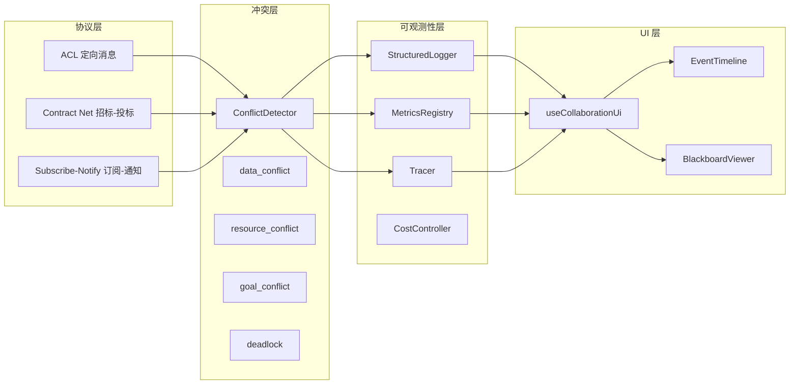

# H27：单元小结课 —— 协议、冲突与观测排错

## 本单元回顾

Unit 4（H22-H26）从事件总线讲起，到 UI 查看器结束。让我们回顾核心概念。

## 层次图：协议、冲突与观测



## 核心概念对照表

### 冲突类型与消解策略

| 冲突类型 | 触发条件 | 默认策略 | 备选策略 |
| --- | --- | --- | --- |
| `data_conflict` | 短时间内多个 Agent 写同一 key | `lock_based` | `last_write_wins` |
| `resource_conflict` | 任务被重新分配 | `first_come_first_serve` | `priority_based`, `negotiation` |
| `goal_conflict` | 任务产出矛盾 | `supervisor_decision` | `negotiation`, `voting` |
| `deadlock` | 循环依赖 | `break_cycle` | `timeout` |

### 可观测性四层

| 维度 | 核心类 | 关注点 | 典型用途 |
| --- | --- | --- | --- |
| Logging | `StructuredLogger` | 发生了什么 | 故障排查 |
| Metrics | `MetricsRegistry` | 发生了多少次 | 容量规划 |
| Tracing | `Tracer` | 花了多长时间 | 性能优化 |
| Cost | `CostController` | 花了多少钱 | 成本控制 |

### UI Store 状态分层

| 状态 | 类型 | 用途 |
| --- | --- | --- |
| `events` | `RuntimeEvent[]` | 原始事件日志 |
| `foregroundMessages` | `ForegroundMessage[]` | 前台消息列表 |
| `displayMessages` | `DisplayMessage[]` | 显示消息列表（含折叠） |
| `activities` | `Record<string, AgentActivity>` | Agent 活动状态 |
| `recentlyActiveMap` | `Record<string, number>` | 活跃 Agent 过期时间 |

## 正向追踪：从事件到 UI

```
RuntimeEvent
  → addEvent()
    → mapEventToForegroundMessages()
      → foregroundMessages[]
    → appendToDisplayMessages()
      → displayMessages[]
    → EventTimeline (events)
    → MessageList (displayMessages)
    → BlackboardViewer (blackboardData, tasks)
```

## 反向诊断：从症状定位责任层

| 症状 | 可能的责任层 | 排查方向 |
| --- | --- | --- |
| 消息未显示 | `mapEventToForegroundMessages` | 检查事件类型是否被映射 |
| 协调消息未折叠 | `appendToDisplayMessages` | 检查 `isCoordination` 标记 |
| 事件丢失 | `addEvent` 去重 | 检查 `lastEventId` |
| 活跃 Agent 未更新 | `recentlyActiveMap` | 检查 `pruneRecentlyActive` |
| 成本超限 | `CostController` | 检查 `checkTokenQuota` |

## 源码覆盖台账（Unit 4）

| 文件路径 | 状态 | 主讲章节 | 关键代码窗口 |
| --- | --- | --- | --- |
| `facade/event-bus.ts` | 精读 | H22 | `SseEventEmitter`, `registerClient`, `unregisterClient` |
| `ui/use-sse.ts` | 精读 | H22 | `useSSEConnection`, `getOrCreateConnection` |
| `session/blackboard.ts` | 精读 | H23 | `Blackboard`, `lock`, `isLocked`, `fromEvents` |
| `engine/conflict-detector.ts` | 精读 | H24 | `ConflictDetector`, `detect`, `resolve` |
| `observability/logging.ts` | 精读 | H25 | `StructuredLogger`, `emit` |
| `observability/metrics.ts` | 精读 | H25 | `MetricsRegistry`, `Counter`, `Gauge` |
| `observability/tracing.ts` | 精读 | H25 | `Tracer`, `withSpan` |
| `observability/cost-controller.ts` | 精读 | H25 | `CostController`, `checkTokenQuota` |
| `ui/store.ts` | 精读 | H26 | `useCollaborationUi`, `addEvent` |
| `ui/EventTimeline.tsx` | 精读 | H26 | `EventTimeline` |
| `ui/BlackboardViewer.tsx` | 精读 | H26 | `BlackboardViewer` |

## 口头验收

不看源码，你能解释：

1. `ConflictDetector` 检测哪四种冲突？各有什么消解策略？
2. 可观测性的四个维度分别解决什么问题？
3. `useCollaborationUi` 如何管理事件和消息？
4. 协调消息折叠的规则是什么？
5. 如何从“消息未显示”症状定位责任层？

## 下一单元预告

Unit 5（H28-H34）将深入沙箱与进程隔离：

- AgentSpawner 与进程模型
- NodeSandboxExecutor 与权限边界
- Worker 进度上报与认知会话结束
- AgentRegistry 与 PI Agent Bridge
- 沙箱测试与违规边界

核心问题：**Agent 子进程如何被创建、执行、监控和销毁？沙箱真正限制了什么？未限制什么？**
