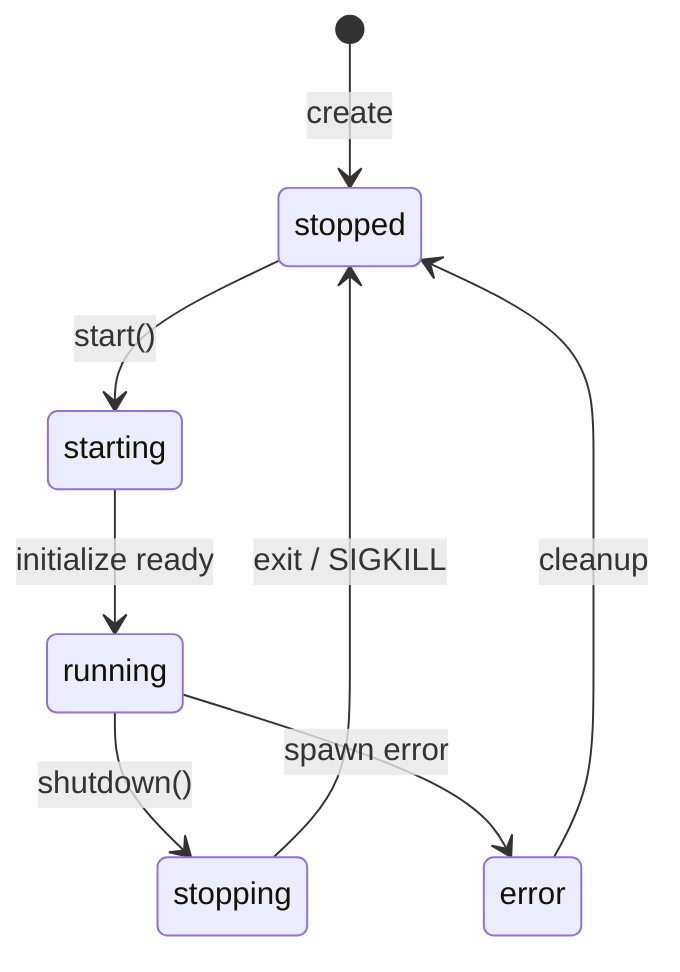

# H28：AgentSpawner 与进程模型

## 小林的旅行规划，Worker 是怎么启动的

上一章（H27）回顾了 Unit 4 的核心内容。现在进入 Unit 5：**Agent 子进程如何被创建、执行、监控和销毁？**

本章回答：`AgentSpawner` 如何启动子进程？`AgentProcess` 如何管理生命周期？stdio JSON Line 协议如何工作？

## 概念阶梯：子进程不是“线程”

| 特性 | 子进程 (AgentProcess) | 线程 |
| --- | --- | --- |
| 隔离性 | 进程级隔离 | 共享内存 |
| 崩溃影响 | 不影响主进程 | 可能导致整个进程崩溃 |
| 通信方式 | stdio / IPC | 共享内存 |
| 启动开销 | 高（需要加载 Node.js） | 低 |
| 适用场景 | 隔离运行 Agent | 轻量级并发 |

OriginOS 选择子进程的原因：
1. Agent 可能执行任意代码，需要进程级隔离。
2. Agent 可能崩溃，不能影响主进程。
3. 每个 Agent 可以有自己的环境变量和工作目录。

## 第一段源码：`AgentSpawner` — 进程工厂

打开 [packages/core/src/modules/collaboration-runtime/sandbox/agent-spawner.ts](../../../../packages/core/src/modules/collaboration-runtime/sandbox/agent-spawner.ts) 第 578—665 行：

```ts
export class AgentSpawner {
  private processes = new Map<string, AgentProcess>();

  constructor(_deps: unknown) {
    void _deps;
  }

  async spawn(config: AgentProcessConfig, onEvent: (event: RuntimeEvent) => void): Promise<AgentProcess> {
    if (this.processes.has(config.agentId)) {
      await this.destroy(config.agentId);
    }

    const proc = new AgentProcess(config.agentId, null, config);
    await proc.start(onEvent);
    this.processes.set(config.agentId, proc);
    return proc;
  }

  async stop(agentId: string): Promise<void> {
    const proc = this.processes.get(agentId);
    if (!proc) return;
    await proc.shutdown();
    this.processes.delete(agentId);
  }

  async destroy(agentId: string): Promise<void> {
    const proc = this.processes.get(agentId);
    if (!proc) return;
    await proc.shutdown();
    this.processes.delete(agentId);
  }

  get(agentId: string): AgentProcess | undefined {
    return this.processes.get(agentId);
  }

  list(): AgentProcess[] {
    return Array.from(this.processes.values());
  }

  async stopAll(): Promise<void> {
    const promises = Array.from(this.processes.keys()).map((id) => this.stop(id));
    await Promise.all(promises);
  }
}
```

`AgentSpawner` 设计：

1. **`processes` Map**：`agentId → AgentProcess` 的映射。
2. **`spawn`**：如果同 ID 已在运行，先 `destroy` 再创建。
3. **`stop` / `destroy`**：调用 `shutdown()` 后从 Map 中移除。
4. **`get` / `list`**：查询接口。

## 第二段源码：`AgentProcess.start` — 启动子进程

```ts
async start(onEvent: (event: RuntimeEvent) => void): Promise<void> {
  this.eventHandler = onEvent;
  const startAt = Date.now();

  // 检测是否是打包环境
  const isPackaged = (() => {
    try {
      const electron = require('electron') as { app?: { isPackaged?: boolean } };
      return electron.app?.isPackaged === true;
    } catch {
      return false;
    }
  })();

  // 打包环境 vs 开发环境
  let workerPath: string;
  let cmd: string;
  let args: string[];

  if (isPackaged) {
    const resourcesPath = (process as NodeJS.Process & { resourcesPath?: string }).resourcesPath ?? path.dirname(process.execPath);
    workerPath = path.join(resourcesPath, 'agent-worker', 'agent-worker.mjs');
    cmd = process.execPath;
    args = [workerPath];
  } else {
    workerPath = path.resolve(getMonorepoRoot(), "packages/core/src/modules/collaboration-runtime/sandbox/agent-worker.mts");
    cmd = "npx";
    args = ["tsx", workerPath];
  }
```

环境检测：

1. **打包环境**：使用 `extraResources` 中的 `agent-worker.mjs`，通过 Electron 的 Node.js 运行。
2. **开发环境**：使用源文件 `agent-worker.mts`，通过 `npx tsx` 运行。
3. **关键区别**：打包环境不需要 tsx，因为文件已预编译为 `.mjs`。

## 第三段源码：stdio JSON Line 协议

```ts
// stdout: JSON Line 事件流
child.stdout?.on("data", (chunk: Buffer) => {
  this.buffer += chunk.toString("utf-8");
  this.flushLines();
});

child.stderr?.on("data", (chunk: Buffer) => {
  const text = chunk.toString("utf-8");
  this.stderrTail = (this.stderrTail + text).slice(-4000);
  process.stderr.write(chunk);
});
```

协议设计：

1. **stdin → 子进程**：JSON 命令（`{ type: "prompt", message: "..." }`）。
2. **stdout ← 子进程**：JSON 事件（`{ type: "event", event: { ... } }`）。
3. **stderr ← 子进程**：调试信息，转发到父进程 stderr。
4. **Buffer 机制**：累积数据，按行分割解析。

`flushLines` 解析（第 545—571 行）：

```ts
private flushLines(): void {
  const lines = this.buffer.split("\n");
  this.buffer = lines.pop() ?? "";

  for (const line of lines) {
    if (!line.trim()) continue;
    try {
      const msg = JSON.parse(line) as Record<string, unknown>;
      if (msg["type"] === "ready") {
        this.pendingCommand?.resolve("ready");
      } else if (msg["type"] === "event" && msg["event"]) {
        this.eventHandler?.(msg["event"] as RuntimeEvent);
      } else if (msg["type"] === "error") {
        this.pendingCommand?.reject(new Error(String(msg["message"])));
      }
    } catch (e) {
      // 忽略非 JSON 行
    }
  }
}
```

消息类型：

| 类型 | 方向 | 说明 |
| --- | --- | --- |
| `ready` | 子进程 → Runtime | Agent 初始化完成 |
| `waiting` | 子进程 → Runtime | Agent 等待输入 |
| `event` | 子进程 → Runtime | 运行时事件 |
| `error` | 子进程 → Runtime | 错误信息 |
| `prompt` | Runtime → 子进程 | 发送 prompt |
| `resume` | Runtime → 子进程 | 恢复暂停的 Agent |
| `shutdown` | Runtime → 子进程 | 关闭 Agent |

## 第四段源码：`prompt` 与队列

```ts
async prompt(message: string): Promise<AgentCommandState> {
  if (this.status !== "running") {
    throw new Error(`Agent ${this.id} is not running (status: ${this.status})`);
  }

  if (!this.child?.stdin) {
    throw new Error("Agent stdin not available");
  }

  if (this.pendingCommand) {
    return new Promise<AgentCommandState>((resolve, reject) => {
      this.promptQueue.push({ message, resolve, reject });
    });
  }

  return this._sendPrompt(message);
}
```

Prompt 队列设计：

1. **串行队列**：如果已有 prompt 在飞行中，新 prompt 进入队列。
2. **超时**：5 分钟（300 秒）。
3. **队列排空**：`_drainPromptQueue` 自动处理队列。

## 第五段源码：`shutdown` 与强制终止

```ts
async shutdown(): Promise<void> {
  if (this.status === "stopped") return;

  this.status = "stopping";
  try {
    await this.sendCommand({ type: "shutdown" });
  } catch {
    // shutdown 命令超时，强制 kill
  }

  if (this.child) {
    this.child.kill("SIGKILL");
    await new Promise<void>(resolve => {
      this.child!.once("exit", () => resolve());
      setTimeout(resolve, 2000);
    });
    this.child = null;
  }
  this.status = "stopped";
}
```

Shutdown 流程：

1. 发送 `shutdown` 命令（ graceful 关闭）。
2. 如果超时，发送 `SIGKILL` 强制终止。
3. 等待 `exit` 事件，最多 2 秒。
4. 标记状态为 `stopped`。

## 第六段源码：全局单例与清理

```ts
export function getGlobalSpawner(): AgentSpawner {
  let globalSpawner = getGlobalSpawnerVar();
  if (!globalSpawner) {
    globalSpawner = new AgentSpawner(null);
    setGlobalSpawnerVar(globalSpawner);
    const cleanupTimer = setInterval(() => {
      getGlobalSpawnerVar()?.cleanup();
    }, 60 * 1000);
    setCleanupTimerVar(cleanupTimer);
    cleanupTimer.unref();
  }
  return globalSpawner;
}
```

全局单例设计：

1. **挂载到 `globalThis`**：避免 Next.js HMR 导致实例隔离。
2. **定时清理**：每 60 秒清理已停止的进程。
3. **进程退出时自动清理**：`process.on('exit', ...)` 强制 kill 所有子进程。

## 图解：AgentProcess 生命周期



## 失败路径与边界

### 边界 1：子进程启动失败

如果 `npx tsx` 不可用（如未安装），`start()` 会抛出错误。测试环境中常见（`agent-spawner.test.ts` 第 27—29 行）。

### 边界 2：Prompt 超时

Prompt 超时时间为 5 分钟（300 秒）。如果 Agent 在 5 分钟内没有返回 `ready`，会抛出超时错误。

### 边界 3：队列堆积

如果 Agent 处理速度跟不上 prompt 发送速度，`promptQueue` 会无限增长。虽然 `prompt` 是串行的，但外部调用者可能不等待就发送新 prompt。

### 边界 4：`SIGKILL` 不保证立即终止

`SIGKILL` 发送后，进程可能不会立即退出。`shutdown` 等待 2 秒，但如果进程处于不可中断状态（如 D 状态），可能无法及时清理。

### 边界 5：全局单例的 HMR 问题

`globalThis.__globalSpawner` 在 Next.js HMR 时不会自动清理。虽然 `cleanupTimer` 会定期清理，但旧的子进程可能仍在运行。

## 测试证据与缺口

### 已有测试（`agent-spawner.test.ts`）

```ts
it("creates and lists processes", async () => {
  const events: any[] = [];
  try {
    const proc = await spawner.spawn(
      { projectId: "p1", agentId: "agent-1", workingDirectory: "/tmp/test" },
      (e) => events.push(e)
    );
    expect(proc.id).toBe("agent-1");
    expect(proc.getStatus()).toBe("running");
    expect(spawner.list()).toHaveLength(1);
  } catch {
    expect(spawner.get("agent-1")?.getStatus()).toMatch(/stopped|error/);
  }
});
```

### 测试缺口

- 没有针对子进程启动失败的测试。
- 没有针对 Prompt 超时的测试。
- 没有针对队列堆积的测试。
- 没有针对 `SIGKILL` 强制终止的测试。
- 没有针对全局单例 HMR 问题的测试。

## 口头验收

不看源码，你能解释：

1. `AgentSpawner` 如何管理子进程？
2. stdio JSON Line 协议的消息类型有哪些？
3. `prompt` 为什么是串行的？队列如何工作？
4. `shutdown` 的 graceful 关闭和强制终止有什么区别？
5. 全局单例为什么要挂载到 `globalThis`？

## 章节收束

本章讲解了 `AgentSpawner` 的设计：进程工厂、stdio 协议、prompt 队列、shutdown 流程、全局单例。

下一章（H29）会进入 NodeSandboxExecutor 与权限边界。
