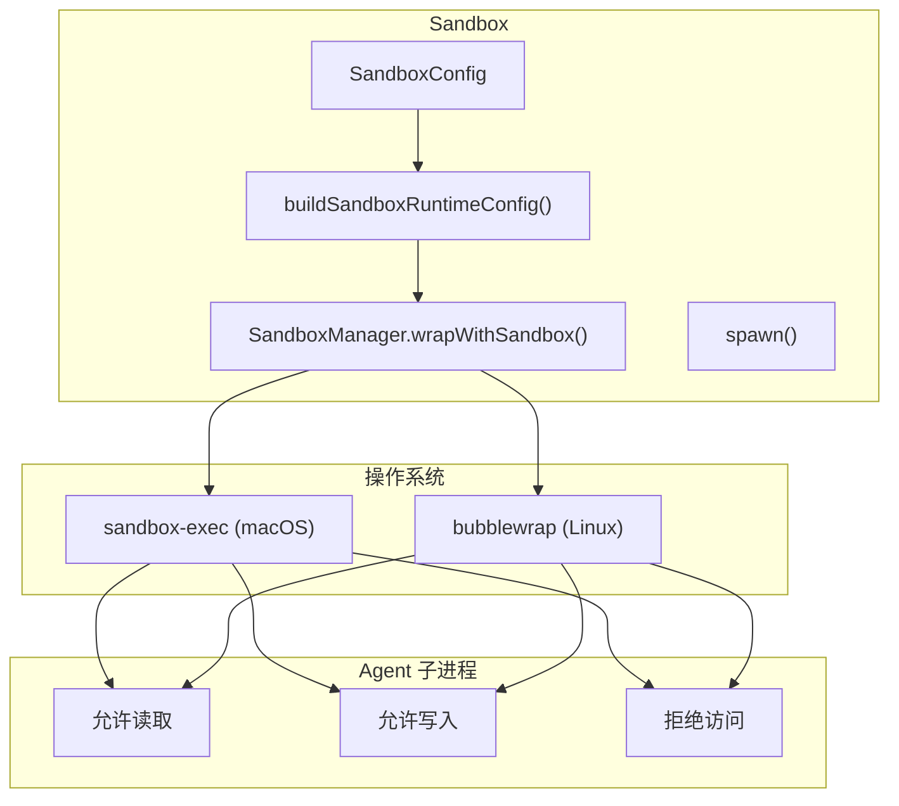

# H29：NodeSandboxExecutor 与权限边界

## 小林的旅行规划，Worker 能访问哪些文件

上一章（H28）讲到，`AgentSpawner` 启动子进程。但有一个关键问题：**Worker 子进程能访问哪些文件？如何防止越权访问？**

本章回答：`NodeSandboxExecutor` 如何限制文件系统？`SandboxConfig` 如何配置权限？`SandboxViolation` 如何记录越权行为？

## 概念阶梯：沙箱不是“完全隔离”

| 特性 | NodeSandboxExecutor | Docker 容器 |
| --- | --- | --- |
| 隔离级别 | 进程级 + 路径限制 | 操作系统级 |
| 文件系统 | 路径白名单/黑名单 | 完全隔离 |
| 网络 | 域名白名单 | 完全隔离 |
| 启动开销 | 低 | 高 |
| 适用场景 | 轻量级隔离 | 完全隔离 |

OriginOS 选择轻量级沙箱的原因：
1. Agent 需要访问项目文件，不能完全隔离。
2. 需要限制 Agent 访问敏感文件（如 `.ssh`、`.gitconfig`）。
3. 启动速度比 Docker 快。

## 第一段源码：`SandboxConfig` — 权限配置

打开 [packages/core/src/modules/collaboration-runtime/sandbox/node-executor.ts](../../../../packages/core/src/modules/collaboration-runtime/sandbox/node-executor.ts) 第 40—59 行：

```ts
export interface SandboxConfig {
  agentId: string;
  command: string;
  args?: string[];
  workingDir?: string;
  allowWrite?: string[];
  allowRead?: string[];
  denyWrite?: string[];
  denyRead?: string[];
  allowedDomains?: string[];
  deniedDomains?: string[];
  timeoutMs?: number;
}
```

权限配置字段：

| 字段 | 用途 | 示例 |
| --- | --- | --- |
| `allowWrite` | 允许写入的路径 | `data/projects/proj-123/**` |
| `allowRead` | 允许读取的路径 | `data/shared/**` |
| `denyWrite` | 显式拒绝写入的路径 | `.ssh/**` |
| `denyRead` | 显式拒绝读取的路径 | `.gitconfig` |
| `allowedDomains` | 允许访问的域名 | `api.example.com` |
| `deniedDomains` | 拒绝访问的域名 | `internal.example.com` |

## 第二段源码：`buildSandboxRuntimeConfig` — 配置转换

```ts
function buildSandboxRuntimeConfig(config: SandboxConfig): Partial<SandboxRuntimeConfig> {
  const runtimeConfig: Partial<SandboxRuntimeConfig> = {};

  runtimeConfig.filesystem = {
    denyRead: config.denyRead ?? [],
    allowRead: config.allowRead,
    allowWrite: config.allowWrite ?? [],
    denyWrite: [...(config.denyWrite ?? []), ...getDefaultDenyWritePaths()],
  };

  if (config.allowedDomains !== undefined || config.deniedDomains !== undefined) {
    runtimeConfig.network = {
      allowedDomains: config.allowedDomains ?? [],
      deniedDomains: config.deniedDomains ?? [],
    };
  }

  return runtimeConfig;
}
```

配置转换：

1. 将 `SandboxConfig` 转换为 `SandboxRuntimeConfig`。
2. 合并默认拒绝写入路径（`getDefaultDenyWritePaths`）。
3. 网络配置仅在显式指定时启用。

默认拒绝写入路径（第 116—127 行）：

```ts
function getDefaultDenyWritePaths(): string[] {
  const home = os.homedir();
  return [
    path.join(home, ".ssh"),
    path.join(home, ".gitconfig"),
    path.join(home, ".bashrc"),
    path.join(home, ".zshrc"),
    path.join(home, ".claude"),
    path.join(home, ".aws"),
    path.join(home, ".config"),
  ];
}
```

默认拒绝写入：

- `.ssh`：SSH 密钥
- `.gitconfig`：Git 配置
- `.bashrc` / `.zshrc`：Shell 配置
- `.claude`：Claude 配置
- `.aws`：AWS 凭证
- `.config`：应用配置

## 第三段源码：`NodeSandboxExecutor.spawn` — 沙箱启动

```ts
async spawn(config: SandboxConfig): Promise<SandboxHandle> {
  if (!this.initialized) {
    await this.initialize();
  }

  const perAgentConfig = buildSandboxRuntimeConfig(config);

  const fullCommand = config.args?.length
    ? `${config.command} ${config.args.join(" ")}`
    : config.command;

  const wrappedCommand = await SandboxManager.wrapWithSandbox(
    fullCommand,
    undefined,
    perAgentConfig as SandboxRuntimeConfig
  );

  const child = spawn(wrappedCommand, {
    shell: true,
    stdio: "pipe",
    env: process.env,
    cwd: config.workingDir,
  }) as ChildProcess;

  const controller = new AbortController();
  const handle = new SandboxHandleImpl(config.agentId, child, config.timeoutMs, controller);

  this.handles.set(config.agentId, handle);
  return handle;
}
```

沙箱启动流程：

1. 初始化 `SandboxManager`（如果未初始化）。
2. 构建 per-Agent 配置。
3. `wrapWithSandbox` 包装命令：
   - macOS：`sandbox-exec -f profile.sb ...`
   - Linux：`bwrap --unshare-all ...`
4. `spawn` 执行包装后的命令。
5. 返回 `SandboxHandle` 用于监控。

## 第四段源码：`SandboxHandleImpl` — 句柄管理

```ts
class SandboxHandleImpl implements SandboxHandle {
  readonly pid: number;
  readonly agentId: string;
  stdout = "";
  stderr = "";
  exitCode: number | null = null;

  private child: ChildProcess;
  private timeoutTimer: ReturnType<typeof setTimeout> | null = null;
  private controller: AbortController;
  private killed = false;

  constructor(agentId: string, child: ChildProcess, timeoutMs?: number, controller?: AbortController) {
    this.agentId = agentId;
    this.child = child;
    this.controller = controller ?? new AbortController();
    this.pid = child.pid ?? 0;

    child.stdout?.on("data", (chunk: Buffer) => {
      this.stdout += chunk.toString("utf-8");
    });

    child.stderr?.on("data", (chunk: Buffer) => {
      this.stderr += chunk.toString("utf-8");
    });

    child.on("exit", (code) => {
      this.exitCode = code;
    });

    if (timeoutMs) {
      this.timeoutTimer = setTimeout(() => {
        this.controller.abort();
        this.kill();
      }, timeoutMs);
    }
  }
```

`SandboxHandleImpl` 设计：

1. **收集 stdout/stderr**：累积输出到字符串。
2. **超时控制**：`AbortController` + `setTimeout`。
3. **进程状态**：`exitCode`、`killed`。

## 第五段源码：`kill` 与清理

```ts
async kill(): Promise<void> {
  if (this.killed) return;
  this.killed = true;

  if (this.timeoutTimer) {
    clearTimeout(this.timeoutTimer);
    this.timeoutTimer = null;
  }

  this.child.kill("SIGKILL");
  await new Promise<void>((resolve) => {
    this.child.on("exit", () => resolve());
    setTimeout(resolve, 2000);
  });
}
```

Kill 流程：

1. 标记 `killed = true`（幂等）。
2. 清除超时定时器。
3. 发送 `SIGKILL`。
4. 等待 `exit` 事件，最多 2 秒。

## 图解：沙箱权限层次



## 失败路径与边界

### 边界 1：沙箱依赖平台

`SandboxManager` 依赖 `sandbox-exec`（macOS）或 `bubblewrap`（Linux）。如果平台不支持，沙箱无法启动。

### 边界 2：`allowRead` 未配置时默认允许

`allowRead` 未配置时，默认允许读取所有路径（只有 `denyRead` 会限制）。这意味着：**如果没有配置 `allowRead`，Agent 可以读取任何文件。**

### 边界 3：超时控制依赖 `AbortController`

`AbortController` 用于超时控制，但 `SandboxManager` 可能不支持 AbortSignal。这意味着：**超时可能无法中断正在执行的命令。**

### 边界 4：`getDefaultDenyWritePaths` 只覆盖常见路径

默认拒绝写入路径只包含常见敏感路径，如果用户有其他敏感文件（如 `.gnupg`），不会被自动保护。

### 边界 5：`SandboxViolation` 只记录不阻止

`convertViolation` 将越权行为转换为 `SandboxViolation`，但**不会阻止 Agent 继续执行**。需要外部检查 `getViolations()` 并处理。

## 测试证据与缺口

### 测试缺口

- 没有针对 `sandbox-exec` / `bubblewrap` 可用性的测试。
- 没有针对 `allowRead` 未配置时的默认行为的测试。
- 没有针对超时控制的测试。
- 没有针对 `getDefaultDenyWritePaths` 覆盖范围的测试。
- 没有针对 `SandboxViolation` 记录和处理的测试。

## 口头验收

不看源码，你能解释：

1. `SandboxConfig` 的权限配置字段有哪些？
2. 默认拒绝写入的路径有哪些？
3. `wrapWithSandbox` 在 macOS 和 Linux 上分别使用什么工具？
4. `SandboxHandleImpl` 如何管理进程生命周期？
5. 沙箱的真正限制是什么？未限制什么？

## 章节收束

本章讲解了 `NodeSandboxExecutor` 的设计：权限配置、配置转换、沙箱启动、句柄管理、超时控制。

下一章（H30）会进入 Worker 进度上报与认知会话结束。
