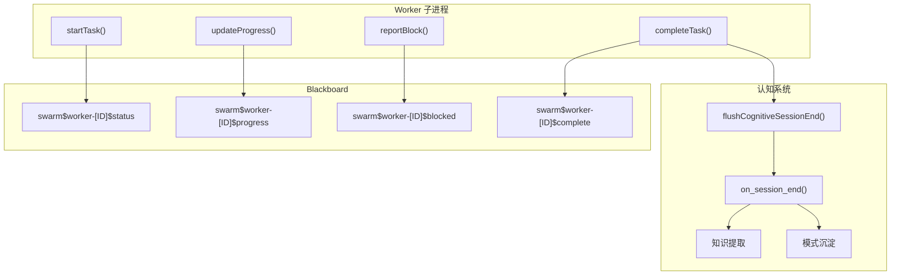

# H30：Worker 进度上报与认知会话结束

## 小林的旅行规划，Worker 完成时怎么通知系统

上一章（H29）讲到，沙箱限制 Agent 的文件访问权限。但有一个关键问题：**Worker 完成任务时，如何向运行时报告？认知会话结束时如何触发知识提取？**

本章回答：`WorkerProgressReporter` 如何上报进度？`flushCognitiveSessionEnd` 如何触发认知会话结束？

## 概念阶梯：进度上报不是“日志打印”

| 特性 | WorkerProgressReporter | 日志打印 |
| --- | --- | --- |
| 目标 | Blackboard（结构化数据） | 控制台（文本） |
| 消费者 | Supervisor、UI | 开发者 |
| 持久化 | 是 | 否 |
| 格式 | JSON | 文本 |

## 第一段源码：`WorkerProgressReporter` 回顾

打开 [packages/core/src/modules/collaboration-runtime/sandbox/worker-progress-reporter.ts](../../../../packages/core/src/modules/collaboration-runtime/sandbox/worker-progress-reporter.ts)（已在 H19 精读）：

```ts
export class WorkerProgressReporter {
  private intervalMs: number = 45_000;
  private timer?: NodeJS.Timeout;

  startTask(taskId: string, estimatedMs: number, dependencies: string[] = []): void {
    this.currentTaskId = taskId;
    this.status = "task-received";

    this.lastProgress = {
      taskId,
      stepsCompleted: [],
      currentStep: "task-received",
      progressPercentage: 0,
      blockers: [],
      filesModified: [],
      estimatedCompletion: Date.now() + estimatedMs,
    };

    this.writeStatus(dependencies);
    this.startHeartbeat();
  }
```

进度上报协议：

1. **接受任务时**：写入 `swarm$worker-[ID]$status`。
2. **每个显著步骤**：更新 `swarm$worker-[ID]$progress`。
3. **依赖缺失时**：写入 `swarm$worker-[ID]$blocked`。
4. **完成时**：写入 `swarm$worker-[ID]$complete`。

## 第二段源码：`flushCognitiveSessionEnd` — 认知会话结束

打开 [packages/core/src/modules/collaboration-runtime/sandbox/cognitive-session-end.ts](../../../../packages/core/src/modules/collaboration-runtime/sandbox/cognitive-session-end.ts) 第 1—15 行：

```ts
export async function flushCognitiveSessionEnd(
  cognitiveManager: unknown,
  messages: unknown[],
  label: string,
): Promise<void> {
  if (!cognitiveManager || typeof (cognitiveManager as { on_session_end?: unknown }).on_session_end !== 'function') {
    return;
  }

  try {
    await (cognitiveManager as { on_session_end: (messages: unknown[]) => Promise<void> }).on_session_end(messages);
  } catch (err) {
    console.error(`[AgentWorker] ${label} cognitive on_session_end error:`, err);
  }
}
```

`flushCognitiveSessionEnd` 设计：

1. **检查 `cognitiveManager`**：如果未配置或没有 `on_session_end` 方法，直接返回。
2. **调用 `on_session_end`**：触发认知会话结束处理。
3. **错误处理**：捕获异常，避免影响主流程。

认知会话结束流程：

```
Agent 子进程结束
  → flushCognitiveSessionEnd()
    → cognitiveManager.on_session_end(messages)
      → 分析实践日志
      → 提取新知识
      → 更新 Knowledge.md
      → 沉淀经验模式
```

## 图解：Worker 进度与认知会话



## 失败路径与边界

### 边界 1：`flushCognitiveSessionEnd` 是可选的

如果 `cognitiveManager` 未配置，`flushCognitiveSessionEnd` 直接返回。这意味着：**认知会话结束处理不是强制的。**

### 边界 2：`on_session_end` 可能耗时很长

`on_session_end` 可能涉及 LLM 分析、文件写入等操作，耗时可能很长。`flushCognitiveSessionEnd` 使用 `await`，会阻塞直到完成。

### 边界 3：`on_session_end` 失败不影响主流程

`flushCognitiveSessionEnd` 捕获了异常，即使 `on_session_end` 失败，也不会影响 Agent 子进程的正常退出。

### 边界 4：进度上报和认知会话结束是分离的

进度上报写入 Blackboard，认知会话结束触发知识提取。两者没有直接关联，但通常都在任务完成后触发。

## 测试证据与缺口

### 测试缺口

- 没有针对 `flushCognitiveSessionEnd` 的测试。
- 没有针对 `on_session_end` 耗时的测试。
- 没有针对认知会话结束失败 fallback 的测试。

## 口头验收

不看源码，你能解释：

1. `WorkerProgressReporter` 的进度上报协议是什么？
2. `flushCognitiveSessionEnd` 的作用是什么？
3. 认知会话结束处理为什么不是强制的？
4. 进度上报和认知会话结束有什么区别？

## 章节收束

本章讲解了 Worker 进度上报与认知会话结束：`WorkerProgressReporter` 上报进度到 Blackboard，`flushCognitiveSessionEnd` 触发认知会话结束处理。

下一章（H31）会进入 AgentRegistry 与 PI Agent Bridge。
