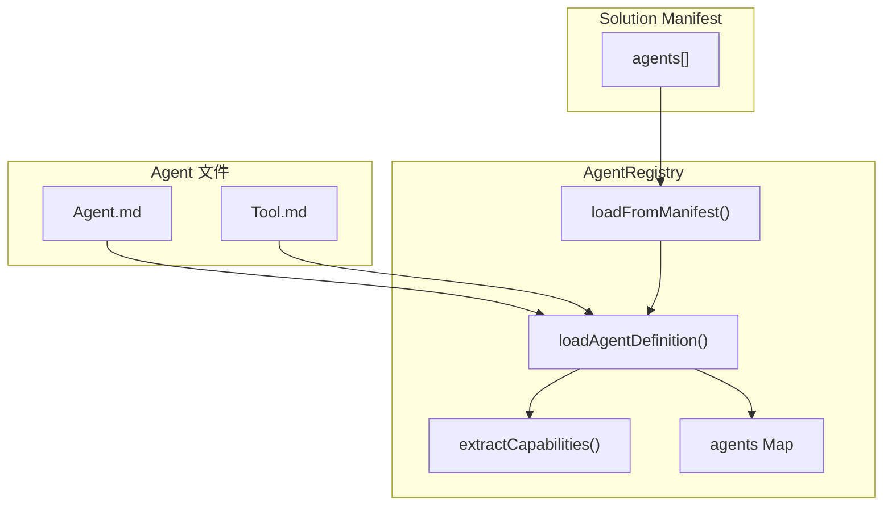

# H31：AgentRegistry 与 PI Agent Bridge

## 小林的旅行规划，系统怎么知道有哪些 Agent

上一章（H30）讲到，Worker 进度上报和认知会话结束。但有一个关键问题：**系统如何知道有哪些 Agent 可用？Agent 的定义从哪里来？**

本章回答：`AgentRegistry` 如何从 Solution Manifest 加载 Agent？`AgentNode` 的数据结构是什么？

## 概念阶梯：AgentRegistry 不是“数据库”

| 特性 | AgentRegistry | 数据库 |
| --- | --- | --- |
| 数据来源 | Solution Manifest + Agent.md | 持久化存储 |
| 更新方式 | 重新加载 | 实时更新 |
| 生命周期 | 运行时内存 | 持久化 |
| 查询方式 | Map 查找 | SQL 查询 |

## 第一段源码：`AgentRegistry` — Agent 注册表

打开 [packages/core/src/modules/collaboration-runtime/integrations/agent-registry.ts](../../../../packages/core/src/modules/collaboration-runtime/integrations/agent-registry.ts) 第 34—186 行：

```ts
export class AgentRegistry {
  private agents: Map<string, AgentNode> = new Map();
  private parser: AgentDefinitionParser;

  constructor(parser: AgentDefinitionParser) {
    this.parser = parser;
  }
```

`AgentRegistry` 设计：

1. **`agents` Map**：`agentId → AgentNode` 的映射。
2. **`parser`**：解析 Agent 定义的工具。

## 第二段源码：`loadFromManifest` — 从 Manifest 加载

```ts
async loadFromManifest(manifestPath: string, projectDir: string): Promise<AgentNode[]> {
  const content = await fs.readFile(manifestPath, "utf-8");
  const manifest = JSON.parse(content) as SolutionManifest;

  const nodes: AgentNode[] = [];
  for (const manifestAgent of manifest.agents) {
    const node = await this.loadAgentDefinition(projectDir, manifestAgent.id, manifestAgent);
    nodes.push(node);
  }

  return nodes;
}
```

加载流程：

1. 读取 Solution Manifest JSON 文件。
2. 遍历 `agents` 数组。
3. 对每个 Agent 调用 `loadAgentDefinition`。
4. 返回所有 `AgentNode`。

## 第三段源码：`loadAgentDefinition` — 加载单个 Agent

```ts
async loadAgentDefinition(projectDir: string, agentId: string, manifestAgent?: ManifestAgent): Promise<AgentNode> {
  let responsibility = manifestAgent?.responsibility ?? "";
  let capabilities: string[] = [];
  let domain = manifestAgent?.domain ?? "";
  let name = manifestAgent?.name ?? agentId;
  let skills: string[] = [];
  let dataOperations: Record<string, string[]> = manifestAgent?.dataOperations ?? {};

  // 读取 Agent.md
  const agentMdPath = path.join(projectDir, "agents", agentId, "Agent.md");
  try {
    const agentMdContent = await fs.readFile(agentMdPath, "utf-8");
    const parsed = this.parser.parseAgentDefinition(agentMdContent);
    if (parsed?.content) {
      responsibility = parsed.content;
    }
    if (!name || name === agentId) {
      name = parsed?.name ?? name;
    }
    capabilities = this.extractCapabilities(agentMdContent);
  } catch {
    if (!responsibility) {
      responsibility = `Agent: ${agentId}`;
    }
  }

  // 读取 Tool.md
  const toolMdPath = path.join(projectDir, "agents", agentId, "Tool.md");
  try {
    const toolMdContent = await fs.readFile(toolMdPath, "utf-8");
    const toolDef = this.parser.parseToolDefinition(toolMdContent);
    if (toolDef?.allowedTools) {
      for (const tool of toolDef.allowedTools) {
        if (!skills.includes(tool)) {
          skills.push(tool);
        }
      }
    }
  } catch {
    // Tool.md not found, skip
  }

  // 合并 skills from manifest
  if (manifestAgent?.skills) {
    for (const skill of manifestAgent.skills) {
      if (!skills.includes(skill.name)) {
        skills.push(skill.name);
      }
    }
  }

  const node: AgentNode = {
    id: agentId,
    name,
    domain,
    responsibility,
    capabilities,
    dataOperations,
    skills,
  };

  this.agents.set(agentId, node);
  return node;
}
```

加载逻辑：

1. **读取 Agent.md**：解析 Agent 定义，提取职责、能力。
2. **读取 Tool.md**：解析允许的工具，提取 skills。
3. **合并 Manifest**：合并 manifest 中的 skills。
4. **构建 AgentNode**：组装完整定义。

## 第四段源码：`extractCapabilities` — 能力提取

```ts
private extractCapabilities(content: string): string[] {
  const capabilities: string[] = [];
  const lines = content.split("\n");

  for (const line of lines) {
    const trimmed = line.trim();
    const bulletMatch = trimmed.match(/^[-*]\s+(.+)$/);
    if (bulletMatch?.[1] && bulletMatch[1].length > 3 && bulletMatch[1].length < 200) {
      capabilities.push(bulletMatch[1]);
    }
  }

  return capabilities;
}
```

能力提取规则：

1. 按行分割 Markdown 内容。
2. 匹配 `- ` 或 `* ` 开头的列表项。
3. 过滤长度在 3-200 之间的项。
4. 返回能力列表。

## 图解：AgentRegistry 数据流



## 失败路径与边界

### 边界 1：Agent.md 缺失时使用默认值

如果 `Agent.md` 不存在，`loadAgentDefinition` 使用默认值（`Agent: ${agentId}`）。这意味着：**Agent 定义不完整时不会报错。**

### 边界 2：Tool.md 缺失时跳过

如果 `Tool.md` 不存在，直接跳过。这意味着：**Agent 可能没有配置任何工具。**

### 边界 3：`extractCapabilities` 是简单的文本匹配

`extractCapabilities` 使用正则表达式匹配列表项，不是语义分析。这意味着：**能力提取可能不准确。**

### 边界 4：AgentRegistry 是内存中的

`AgentRegistry` 存储在内存中，进程重启后需要重新加载。这意味着：**Agent 定义变更后需要重启服务。**

## 测试证据与缺口

### 测试缺口

- 没有针对 `Agent.md` 缺失的测试。
- 没有针对 `Tool.md` 缺失的测试。
- 没有针对 `extractCapabilities` 准确性的测试。
- 没有针对 AgentRegistry 重新加载的测试。

## 口头验收

不看源码，你能解释：

1. `AgentRegistry` 从哪里加载 Agent 定义？
2. `loadAgentDefinition` 加载哪些文件？
3. `extractCapabilities` 如何提取能力？
4. AgentRegistry 的局限是什么？

## 章节收束

本章讲解了 `AgentRegistry` 的设计：从 Solution Manifest 加载 Agent、读取 Agent.md/Tool.md、提取能力、构建 AgentNode。

下一章（H32）是 Unit 5 小结课。
