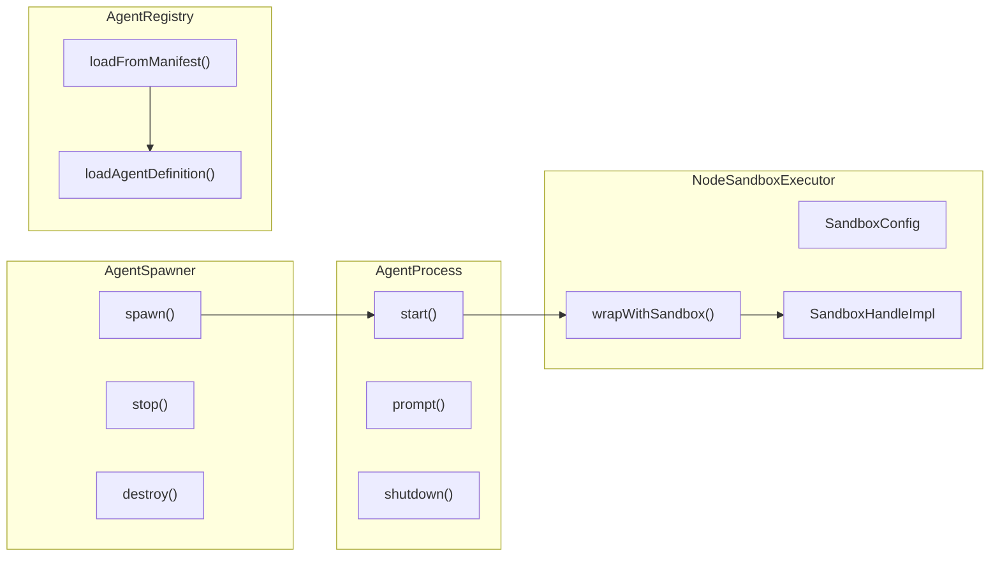

# H32：单元小结课 —— 沙箱安全边界

## 本单元回顾

Unit 5（H28-H31）从 AgentSpawner 讲起，到 AgentRegistry 结束。让我们回顾核心概念。

## 层次图：沙箱与进程隔离



## 核心概念对照表

### AgentProcess 生命周期

| 状态 | 触发条件 | 允许的操作 |
| --- | --- | --- |
| `stopped` | 初始状态 | `start()` |
| `starting` | `start()` 后 | 无 |
| `running` | 初始化完成 | `prompt()`, `shutdown()` |
| `stopping` | `shutdown()` 后 | 无 |
| `error` | 启动失败 | 无 |

### stdio JSON Line 协议

| 消息类型 | 方向 | 说明 |
| --- | --- | --- |
| `ready` | 子进程 → Runtime | Agent 初始化完成 |
| `waiting` | 子进程 → Runtime | Agent 等待输入 |
| `event` | 子进程 → Runtime | 运行时事件 |
| `error` | 子进程 → Runtime | 错误信息 |
| `prompt` | Runtime → 子进程 | 发送 prompt |
| `resume` | Runtime → 子进程 | 恢复暂停的 Agent |
| `shutdown` | Runtime → 子进程 | 关闭 Agent |

### 沙箱权限配置

| 字段 | 用途 | 默认值 |
| --- | --- | --- |
| `allowWrite` | 允许写入的路径 | `[]` |
| `allowRead` | 允许读取的路径 | `undefined`（默认允许所有） |
| `denyWrite` | 显式拒绝写入的路径 | `[]` |
| `denyRead` | 显式拒绝读取的路径 | `[]` |
| `allowedDomains` | 允许访问的域名 | `[]` |
| `deniedDomains` | 拒绝访问的域名 | `[]` |

### 四层安全边界

| 层级 | 实现 | 限制内容 |
| --- | --- | --- |
| 目录选择 | `workingDir` | Agent 工作目录 |
| 路径限制 | `allowWrite` / `denyWrite` | 文件系统访问 |
| 进程沙箱 | `sandbox-exec` / `bubblewrap` | 系统调用 |
| 操作系统权限 | 操作系统用户权限 | 系统资源 |

## 正向追踪：从 spawn 到 shutdown

```
AgentSpawner.spawn(config)
  → new AgentProcess(config)
    → proc.start(onEvent)
      → spawn(cmd, args, spawnOptions)
        → stdout: JSON Line 事件流
        → stderr: 调试信息
      → sendCommand({ type: "initialize" })
    → proc.prompt(message)
      → _sendPrompt(message)
        → stdin.write({ type: "prompt", message })
        → pendingCommand = { resolve, reject, timer }
    → proc.shutdown()
      → sendCommand({ type: "shutdown" })
      → child.kill("SIGKILL")
      → wait for exit (max 2s)
```

## 反向诊断：从症状定位责任层

| 症状 | 可能的责任层 | 排查方向 |
| --- | --- | --- |
| 子进程无法启动 | `AgentProcess.start` | 检查 `npx tsx` 是否可用 |
| Prompt 超时 | `AgentProcess._sendPrompt` | 检查 Agent 是否在 5 分钟内返回 ready |
| 沙箱无法启动 | `NodeSandboxExecutor.spawn` | 检查 `sandbox-exec` / `bubblewrap` 是否可用 |
| Agent 无法访问文件 | `SandboxConfig` | 检查 `allowRead` / `allowWrite` 配置 |
| Agent 定义缺失 | `AgentRegistry.loadAgentDefinition` | 检查 `Agent.md` 是否存在 |

## 源码覆盖台账（Unit 5）

| 文件路径 | 状态 | 主讲章节 | 关键代码窗口 |
| --- | --- | --- | --- |
| `sandbox/agent-spawner.ts` | 精读 | H28 | `AgentSpawner`, `AgentProcess`, `start`, `prompt`, `shutdown` |
| `sandbox/node-executor.ts` | 精读 | H29 | `NodeSandboxExecutor`, `SandboxConfig`, `wrapWithSandbox` |
| `sandbox/cognitive-session-end.ts` | 精读 | H30 | `flushCognitiveSessionEnd` |
| `sandbox/worker-progress-reporter.ts` | 背景引用 | H30 | `WorkerProgressReporter`（已在 H19 精读） |
| `integrations/agent-registry.ts` | 精读 | H31 | `AgentRegistry`, `loadFromManifest`, `loadAgentDefinition` |

## 口头验收

不看源码，你能解释：

1. `AgentSpawner` 如何管理子进程生命周期？
2. stdio JSON Line 协议的消息类型有哪些？
3. 沙箱的四层安全边界是什么？
4. `AgentRegistry` 从哪里加载 Agent 定义？
5. 如何从“子进程无法启动”症状定位责任层？

## 下一单元预告

Unit 6（H33-H39）将深入 Memory Core 记忆系统：

- Memory Core 全景：Block 与 Memory 对象
- Block CRUD、compile/render 与持久化
- RecallMemory 与 HistoryStore
- ArchivalMemory、embedding 与 HNSWIndex
- CoreMemoryTools 与 ArchivalMemoryTools
- Adapter 与 Provider

核心问题：**Memory Core 如何为 Agent 提供短期 block 记忆、长期 recall 记忆和归档 archival 记忆？**
