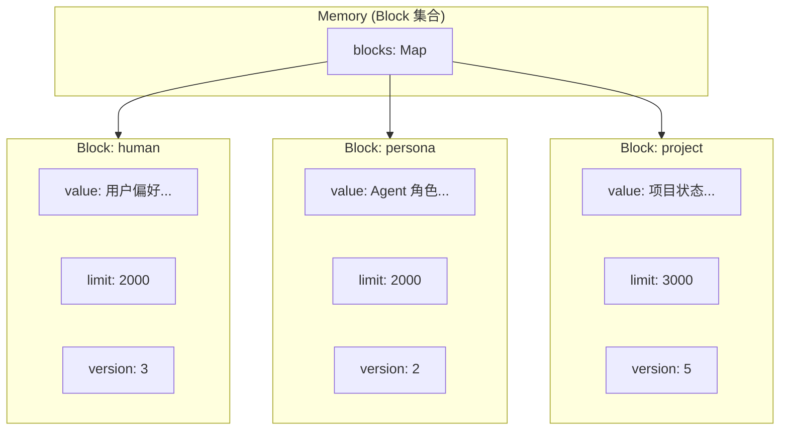

# H33：Memory Core 全景：Block 与 Memory 对象

## 小林的旅行规划，Agent 的记忆是怎么组织的

前几章讲了协作运行时、沙箱安全和 Agent 进程管理。现在进入 Unit 6：**Memory Core 记忆系统**。

Agent 在对话过程中需要记住用户信息、项目状态、对话历史。这些信息不是简单存在一个文件里，而是分成了三层：**Core Memory（核心记忆）**、**Recall Memory（对话历史）**、**Archival Memory（长期归档）**。本章先回答最基础的问题：Memory Core 的记忆单元 Block 是什么？Memory 对象如何管理这些 Block？

## 概念阶梯：Block 不是“变量”，而是“有约束的上下文窗口保留区”

初学者容易把 Block 理解为普通的键值对存储。但 Block 的设计更接近 LLM 上下文窗口中的保留区：

| 特性 | Block | 普通键值对 | 数据库记录 |
| --- | --- | --- | --- |
| 大小限制 | 有 `limit` 字符上限 | 通常无限制 | 由字段类型决定 |
| 版本追踪 | 每次修改 `version++` | 无 | 需额外实现 |
| 只读属性 | `readOnly` 字段 | 无 | 需权限控制 |
| 编译输出 | 可编译为 markdown/xml | 无 | 无 |
| 用途 | 注入 LLM system prompt | 通用存储 | 结构化查询 |

**核心区别**：Block 的设计目标是被编译后注入 LLM 的 system prompt，因此它有大小限制（防止超出 token 预算）、版本追踪（防止意外覆盖）和编译输出（markdown/xml 格式）。

## 第一段源码：`Block` 类型定义

打开 [packages/core/src/modules/memory-core/core/block.ts](../../../../packages/core/src/modules/memory-core/core/block.ts) 第 17—40 行：

```ts
export interface Block {
  id: string;
  label: string;
  value: string;
  limit: number;
  description: string;
  metadata: BlockMetadata;
  readOnly: boolean;
  tags: string[];
  namespace?: string;
  createdAt: number;
  updatedAt: number;
  version: number;
}
```

`Block` 设计：

1. **`id`**：唯一标识符，格式 `block-{timestamp}-{random}`。
2. **`label`**：Block 名称，如 `human`、`persona`、`project`。
3. **`value`**：实际内容，字符串形式。
4. **`limit`**：字符上限，防止超出 LLM token 预算。
5. **`readOnly`**：是否只读，`temporal` block 通常设为 true。
6. **`version`**：每次修改自动递增。

## 第二段源码：`DEFAULT_BLOCKS` — 默认 Block 定义

```ts
export const DEFAULT_BLOCKS: BlockDefinition[] = [
  { label: 'human', description: '用户画像、偏好、历史习惯', limit: 2000, namespace: 'system' },
  { label: 'persona', description: 'Agent 角色认知、工作风格、专业语言', limit: 2000, namespace: 'system' },
  { label: 'project', description: '当前项目状态、活跃任务、关键决策', limit: 3000, namespace: 'system' },
  { label: 'scratchpad', description: '临时笔记、待办、注意项', limit: 1000, namespace: 'system' },
  { label: 'temporal', description: '关键事件时间线', limit: 3000, readOnly: true, namespace: 'system' },
];
```

默认 Block 分工：

| Block | 用途 | 限制 | 是否只读 |
| --- | --- | --- | --- |
| `human` | 用户画像、偏好、历史习惯 | 2000 字符 | 否 |
| `persona` | Agent 角色认知、工作风格 | 2000 字符 | 否 |
| `project` | 当前项目状态、活跃任务 | 3000 字符 | 否 |
| `scratchpad` | 临时笔记、待办 | 1000 字符 | 否 |
| `temporal` | 关键事件时间线 | 3000 字符 | **是** |

## 第三段源码：`Memory` — Block 集合管理器

打开 [packages/core/src/modules/memory-core/core/memory.ts](../../../../packages/core/src/modules/memory-core/core/memory.ts) 第 32—42 行：

```ts
export class Memory {
  private blocks = new Map<string, Block>();
  private agentDir: string;

  constructor(agentDir: string, definitions?: BlockDefinition[]) {
    this.agentDir = agentDir;
    this.loadFromDisk();
    if (this.blocks.size === 0) {
      this.initializeDefaults(definitions);
    }
  }
```

`Memory` 设计：

1. **`blocks` Map**：`label → Block` 的映射，内存中的 Block 存储。
2. **`agentDir`**：Agent 工作目录，用于持久化。
3. **构造函数**：从磁盘加载 → 如果为空则初始化默认 Block。

## 第四段源码：`createBlock` — Block 工厂

```ts
export function createBlock(def: BlockDefinition, value = ''): Block {
  const now = Date.now();
  return {
    id: generateId(),
    label: def.label,
    value,
    limit: def.limit,
    description: def.description,
    metadata: {},
    readOnly: def.readOnly ?? false,
    tags: def.tags ?? [],
    namespace: def.namespace,
    createdAt: now,
    updatedAt: now,
    version: 1,
  };
}
```

Block 创建规则：

1. **ID 生成**：`block-{timestamp}-{random}`，确保唯一性。
2. **版本初始化为 1**：每次修改后递增。
3. **时间戳**：`createdAt` 和 `updatedAt` 初始相同。

## 第五段源码：`validateBlock` — Block 校验

```ts
export function validateBlock(block: Block): string | null {
  if (!block.label || block.label.trim() === '') {
    return 'Block label must not be empty';
  }
  if (block.value.length > block.limit) {
    return `Block value exceeds limit (${block.value.length} > ${block.limit})`;
  }
  if (block.limit <= 0) {
    return 'Block limit must be positive';
  }
  return null;
}
```

校验规则：

1. **label 不能为空**：Block 必须有名称。
2. **value 不能超过 limit**：防止超出 LLM token 预算。
3. **limit 必须为正数**：防止无效配置。

## 图解：Block 与 Memory 的关系



## 失败路径与边界

### 边界 1：Block label 必须唯一

如果尝试创建同名 Block，`Memory.createBlock` 会抛出错误。这意味着：**Block 名称是唯一的标识符，不能重复。**

### 边界 2：`limit` 是字符数限制，不是 token 数

`limit` 限制的是字符数，不是 LLM token 数。这意味着：**实际 token 消耗可能超过预期，因为不同语言的字符/token 比例不同。**

### 边界 3：`readOnly` 只在运行时检查

`readOnly` 属性在 `setBlock`、`appendBlock`、`replaceBlock` 时检查，但持久化文件（Memory.md）中没有只读标记。这意味着：**直接编辑文件可以绕过只读限制。**

### 边界 4：默认 Block 在 `blocks.size === 0` 时初始化

如果 Memory.md 存在但解析失败，`blocks` 可能为空，此时会初始化默认 Block。这意味着：**解析失败可能导致数据丢失。**

## 测试证据与缺口

### 已有测试（`block.test.ts`）

```ts
it('creates a block with correct defaults', () => {
  const block = createBlock({ label: 'test', description: 'Test', limit: 1000 });
  expect(block.label).toBe('test');
  expect(block.version).toBe(1);
  expect(block.readOnly).toBe(false);
});
```

### 测试缺口

- 没有针对 `validateBlock` 返回 null（有效 Block）的测试。
- 没有针对 `limit <= 0` 的边界测试。
- 没有针对 `fromLegacyBlock` 和 `toLegacyBlock` 的兼容性测试。

## 口头验收

不看源码，你能解释：

1. Block 和普通键值对有什么区别？
2. 默认的五个 Block 分别存储什么内容？
3. `Memory` 类如何管理 Block？
4. `validateBlock` 校验哪些条件？
5. `readOnly` 的限制在什么层面生效？

## 章节收束

本章讲解了 Memory Core 的基础概念：Block 是 LLM 上下文窗口的保留区，Memory 管理 Block 集合。下一章（H34）会进入 Block 的 CRUD 操作、compile/render 和持久化。
