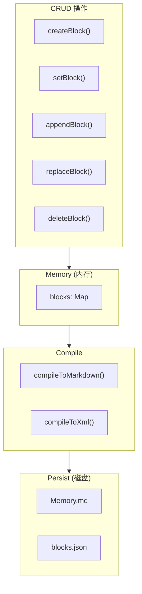

# H34：Block CRUD、compile/render 与持久化

## 小林的旅行规划，Agent 怎么修改和保存记忆

上一章讲了 Block 和 Memory 的基本概念。本章回答：**Agent 如何创建、读取、更新、删除 Block？如何编译为 markdown/xml？如何持久化到磁盘？**

## 概念阶梯：CRUD 不是“数据库操作”

Memory Core 的 CRUD 和传统数据库 CRUD 的区别：

| 特性 | Memory CRUD | 数据库 CRUD |
| --- | --- | --- |
| 存储介质 | 内存 Map + 文件 | 数据库表 |
| 持久化时机 | 每次修改后自动 `save()` | 事务提交时 |
| 版本控制 | 内置 `version` 字段 | 需额外实现 |
| 编译输出 | 支持 markdown/xml | 不支持 |
| 大小限制 | 运行时检查 `limit` | 字段类型限制 |

## 第一段源码：`getBlock` 与 `setBlock` — 读取与设置

打开 [packages/core/src/modules/memory-core/core/memory.ts](../../../../packages/core/src/modules/memory-core/core/memory.ts) 第 48—69 行：

```ts
getBlock(label: string): Block | null {
  return this.blocks.get(label) ?? null;
}

setBlock(label: string, value: string): void {
  const block = this.blocks.get(label);
  if (!block) throw new Error(`Block '${label}' does not exist`);
  if (block.readOnly) throw new Error(`Block '${label}' is read-only`);
  if (value.length > block.limit) {
    throw new Error(`Content exceeds block limit (${block.limit} chars)`);
  }
  block.value = value;
  block.updatedAt = Date.now();
  block.version += 1;
  block.metadata = {
    ...block.metadata,
    lastEdited: Date.now(),
    lastEditedBy: block.metadata.lastEditedBy ?? 'agent',
  };
  this.save();
}
```

`setBlock` 设计：

1. **存在性检查**：Block 必须存在。
2. **只读检查**：`readOnly` block 不能修改。
3. **大小检查**：新值不能超过 `limit`。
4. **版本递增**：每次修改 `version++`。
5. **自动持久化**：调用 `save()`。

## 第二段源码：`appendBlock` 与 `replaceBlock` — 追加与替换

```ts
appendBlock(label: string, content: string): void {
  const block = this.blocks.get(label);
  if (!block) throw new Error(`Block '${label}' does not exist`);
  if (block.readOnly) throw new Error(`Block '${label}' is read-only`);
  const newValue = block.value + (block.value ? '\n' : '') + content;
  if (newValue.length > block.limit) {
    throw new Error(`Content exceeds block limit (${block.limit} chars)`);
  }
  block.value = newValue;
  block.updatedAt = Date.now();
  block.version += 1;
  // ... metadata update
  this.save();
}

replaceBlock(label: string, oldContent: string, newContent: string): boolean {
  const block = this.blocks.get(label);
  if (!block) throw new Error(`Block '${label}' does not exist`);
  if (block.readOnly) throw new Error(`Block '${label}' is read-only`);
  if (!block.value.includes(oldContent)) return false;
  const newValue = block.value.replace(oldContent, newContent);
  if (newValue.length > block.limit) {
    throw new Error(`Content exceeds block limit (${block.limit} chars)`);
  }
  block.value = newValue;
  block.updatedAt = Date.now();
  block.version += 1;
  // ... metadata update
  this.save();
  return true;
}
```

操作对比：

| 操作 | 输入 | 输出 | 失败条件 |
| --- | --- | --- | --- |
| `setBlock` | 完整新值 | 成功/异常 | Block 不存在、只读、超限 |
| `appendBlock` | 追加内容 | 成功/异常 | Block 不存在、只读、超限 |
| `replaceBlock` | 旧内容 + 新内容 | true/false | Block 不存在、只读、旧内容不存在、超限 |

## 第三段源码：`compile` — 编译为 markdown/xml

```ts
compile(options?: CompileOptions): string {
  const { format = 'markdown', includeHidden = false, labels } = options ?? {};
  if (format === 'markdown') {
    return this.compileToMarkdown(labels, includeHidden);
  }
  return this.compileToXml(labels, includeHidden);
}
```

编译设计：

1. **markdown 格式**：人类可读，用于 `Memory.md` 文件。
2. **xml 格式**：机器解析，用于注入 LLM system prompt。
3. **过滤选项**：支持按 `labels` 过滤，支持包含隐藏 block。

### markdown 输出示例

```markdown
# Memory

## human
{description: 用户画像、偏好、历史习惯}
{limit: 2000}
{readOnly: false}

用户喜欢日本料理，偏好安静的餐厅。

## persona
{description: Agent 角色认知、工作风格、专业语言}
{limit: 2000}
{readOnly: false}

我是旅行规划助手，擅长推荐小众景点。
```

### xml 输出示例

```xml
<memory_blocks>
The following memory blocks are currently engaged in your core memory unit:

<human>
<description>用户画像、偏好、历史习惯</description>
<metadata>
- chars_current=23
- chars_limit=2000
</metadata>
<value>用户喜欢日本料理，偏好安静的餐厅。</value>
</human>
</memory_blocks>
```

## 第四段源码：`save` — 持久化到磁盘

```ts
save(): void {
  this.saveMemoryMd();
  this.saveBlocksSnapshot();
}

private saveMemoryMd(): void {
  const content = this.compileToMarkdown();
  const filePath = path.join(this.agentDir, 'Memory.md');
  fs.mkdirSync(this.agentDir, { recursive: true });
  fs.writeFileSync(filePath, content, 'utf-8');
}

private saveBlocksSnapshot(): void {
  const filePath = path.join(this.agentDir, 'blocks.json');
  // ... 保存版本快照
}
```

持久化设计：

1. **双文件持久化**：
   - `Memory.md`：人类可读的 markdown 格式。
   - `blocks.json`：机器解析的 JSON 版本快照。
2. **版本快照**：保留最近 10 个版本，支持回溯。
3. **自动创建目录**：`fs.mkdirSync` 确保目录存在。

## 图解：CRUD → Compile → Persist 流程



## 失败路径与边界

### 边界 1：`save()` 在每次 CRUD 后自动调用

这意味着：**频繁修改会导致频繁磁盘写入。** 在高并发场景下可能成为瓶颈。

### 边界 2：`blocks.json` 只保留最近 10 个版本

```ts
while (snapshots.length > 10) {
  snapshots.shift();
}
```

超过 10 个版本后，旧版本被丢弃。这意味着：**无法回溯到更早的版本。**

### 边界 3：`parseMemoryMd` 的解析是启发式的

`parseMemoryMd` 通过正则表达式解析 markdown 格式，不是严格的 markdown parser。这意味着：**如果手动编辑 Memory.md 格式错误，可能导致解析失败。**

### 边界 4：版本快照不包含 embedding

`serializeBlock` 只序列化基本字段，不包含 `embedding`（如果存在）。这意味着：**Archival Memory 的 embedding 需要单独持久化。**

## 测试证据与缺口

### 已有测试（`memory.test.ts`）

```ts
it('sets and gets block value', () => {
  const memory = new Memory('/tmp/test-memory');
  memory.setBlock('human', 'test value');
  const block = memory.getBlock('human');
  expect(block?.value).toBe('test value');
  expect(block?.version).toBe(2); // incremented from 1
});
```

### 测试缺口

- 没有针对 `replaceBlock` 返回 `false`（旧内容不存在）的测试。
- 没有针对 `compileToXml` 输出格式的测试。
- 没有针对版本快照超过 10 个时的淘汰测试。
- 没有针对 `parseMemoryMd` 解析失败的测试。

## 口头验收

不看源码，你能解释：

1. `setBlock` 和 `appendBlock` 有什么区别？
2. `compile` 支持哪些输出格式？
3. 持久化时为什么同时保存 `Memory.md` 和 `blocks.json`？
4. `replaceBlock` 返回 `false` 代表什么？
5. 版本快照保留多少个？旧版本如何处理？

## 章节收束

本章讲解了 Memory Core 的 CRUD 操作、编译输出和持久化机制。下一章（H35）会进入 RecallMemory 与 HistoryStore，了解对话历史如何存储和检索。
