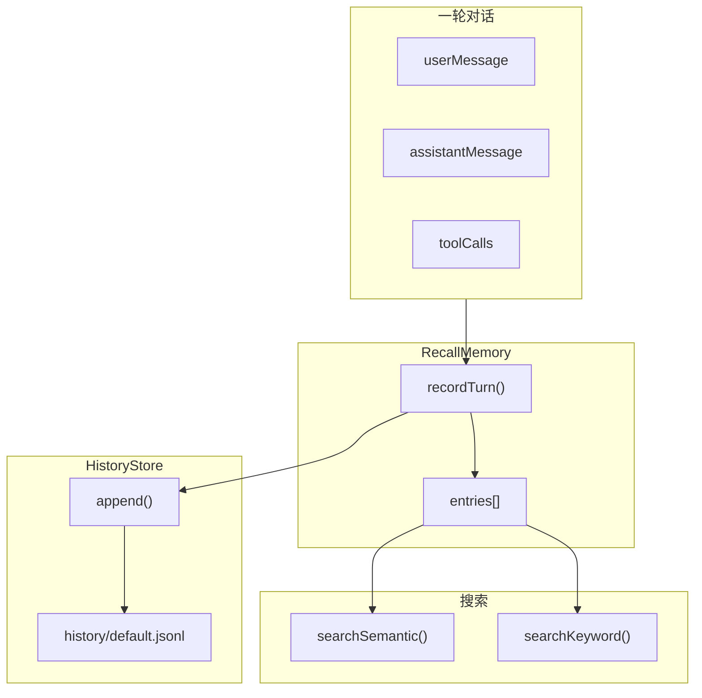

# H35：RecallMemory 与 HistoryStore

## 小林的旅行规划，Agent 怎么记住对话历史

上一章讲了 Block 的 CRUD 和持久化。本章回答：**Agent 如何记录每一轮对话？如何存储和检索对话历史？**

## 概念阶梯：RecallMemory 不是“日志文件”

RecallMemory 和传统日志的区别：

| 特性 | RecallMemory | 传统日志 |
| --- | --- | --- |
| 存储格式 | JSONL（按 session 拆分） | 文本文件 |
| 检索方式 | 语义搜索 + 关键词搜索 | grep |
| 持久化 | 每轮对话后追加写入 | 批量写入或缓冲 |
| 结构 | 结构化（turnNumber, userMessage, toolCalls） | 非结构化文本 |
| 用途 | LLM 上下文注入 | 调试和审计 |

## 第一段源码：`RecallMemory` — 对话历史管理器

打开 [packages/core/src/modules/memory-core/recall/recall-memory.ts](../../../../packages/core/src/modules/memory-core/recall/recall-memory.ts) 第 20—52 行：

```ts
export class RecallMemory {
  private entries: RecallEntry[] = [];
  private historyStore: HistoryStore;
  private dreamCursorPath: string;

  constructor(agentDir: string, sessionId: string = 'default') {
    this.historyStore = new HistoryStore(
      path.join(agentDir, 'memory', 'history'),
      sessionId
    );
    this.dreamCursorPath = path.join(agentDir, '.dream_cursor');
    this.loadFromDisk();
  }

  recordTurn(data: {
    turnNumber: number;
    userMessage: string;
    assistantMessage?: string;
    toolCalls?: Array<{ name: string; params?: unknown; result: string; success: boolean }>;
  }): void {
    const entry: RecallEntry = {
      turnNumber: data.turnNumber,
      summary: data.userMessage.slice(0, 200),
      userMessage: data.userMessage,
      assistantMessage: data.assistantMessage ?? '',
      toolCalls: data.toolCalls ?? [],
      timestamp: Date.now(),
    };
    this.entries.push(entry);
    this.historyStore.append(entry);
  }
```

`RecallMemory` 设计：

1. **`entries`**：内存中的对话记录数组。
2. **`historyStore`**：负责磁盘持久化。
3. **`dreamCursorPath`**：Dream 自动记忆维护的 cursor 文件路径。
4. **`recordTurn`**：记录一轮对话，同时更新内存和磁盘。

## 第二段源码：`HistoryStore` — JSONL 历史存储

打开 [packages/core/src/modules/memory-core/recall/history-store.ts](../../../../packages/core/src/modules/memory-core/recall/history-store.ts) 第 23—70 行：

```ts
export class HistoryStore {
  private historyDir: string;
  private sessionId: string;

  constructor(historyDir: string, sessionId: string) {
    this.historyDir = historyDir;
    this.sessionId = sessionId;
    this.migrateLegacyFile();
  }

  append(entry: RecallEntry): void {
    if (!fs.existsSync(this.historyDir)) {
      fs.mkdirSync(this.historyDir, { recursive: true });
    }
    fs.appendFileSync(this.sessionFilePath(), JSON.stringify(entry) + '\n', 'utf-8');
  }

  readAll(): RecallEntry[] {
    if (!fs.existsSync(this.historyDir)) return [];
    try {
      const files = fs.readdirSync(this.historyDir).filter((f) => f.endsWith('.jsonl'));
      const entries: RecallEntry[] = [];
      for (const file of files) {
        const content = fs.readFileSync(path.join(this.historyDir, file), 'utf-8');
        const lines = content.split('\n').filter((l) => l.trim());
        for (const line of lines) {
          try {
            const entry = JSON.parse(line) as RecallEntry;
            entries.push(entry);
          } catch {
            // skip corrupted lines
          }
        }
      }
      entries.sort((a, b) => a.turnNumber - b.turnNumber);
      return entries;
    } catch {
      return [];
    }
  }
```

`HistoryStore` 设计：

1. **按 session 拆分文件**：每个 session 一个 `.jsonl` 文件。
2. **追加写入**：每轮对话后追加一行 JSON。
3. **自动迁移**：支持从旧文件格式（`history.jsonl`）迁移到新格式（`history/default.jsonl`）。
4. **容错处理**：跳过损坏的行，不中断读取。

## 第三段源码：`searchSemantic` — 语义搜索

```ts
async searchSemantic(query: string, maxResults = 5): Promise<RecallSearchResult[]> {
  const queryEmbedding = await embeddingEngine.encode(query);

  const scored = await Promise.all(
    this.entries.map(async (entry) => {
      const textContent = `${entry.userMessage} ${entry.assistantMessage ?? ''}`;
      const entryEmbedding = await embeddingEngine.encode(textContent);
      const score = cosineSimilarity(queryEmbedding, entryEmbedding);
      return {
        turnNumber: entry.turnNumber,
        score,
        summary: entry.summary,
        text: entry.userMessage,
      };
    })
  );

  scored.sort((a, b) => b.score - a.score);
  return scored.slice(0, maxResults);
}
```

语义搜索设计：

1. **编码查询**：将查询文本编码为 embedding 向量。
2. **编码每条记录**：将每条对话记录编码为 embedding 向量。
3. **计算余弦相似度**：排序后返回最相似的记录。
4. **性能问题**：每次搜索都要编码所有记录，**时间复杂度 O(n)**。

## 第四段源码：`searchKeyword` — 关键词搜索（回退模式）

```ts
searchKeyword(query: string, maxResults = 5): RecallSearchResult[] {
  const scored = this.entries.map((entry) => this.scoreKeyword(entry, query));
  scored.sort((a, b) => b.score - a.score);
  return scored.slice(0, maxResults);
}

private scoreKeyword(entry: RecallEntry, query: string): RecallSearchResult {
  const queryTerms = query.toLowerCase().split(/\s+/).filter((t) => t.length > 2);
  const text = `${entry.userMessage} ${entry.assistantMessage ?? ''}`.toLowerCase();
  let score = 0;
  for (const term of queryTerms) {
    if (text.includes(term)) score += 1;
  }
  return {
    turnNumber: entry.turnNumber,
    score: score / Math.max(queryTerms.length, 1),
    summary: entry.summary,
    text: entry.userMessage,
  };
}
```

关键词搜索设计：

1. **分词**：按空格分割查询，过滤长度 ≤ 2 的词。
2. **匹配计数**：统计查询词在对话记录中的出现次数。
3. **归一化**：得分除以查询词数量，避免查询词多的得分高。

## 图解：RecallMemory 数据流



## 失败路径与边界

### 边界 1：`searchSemantic` 需要 ONNX 模型

如果 ONNX 模型不可用，`embeddingEngine.encode` 会回退到 TF-IDF。这意味着：**语义搜索质量取决于 ONNX 模型是否可用。**

### 边界 2：JSONL 文件可能损坏

`readAll` 跳过损坏的行，但**不会修复或报告损坏**。这意味着：**部分数据可能静默丢失。**

### 边界 3：`searchSemantic` 的时间复杂度是 O(n)

每次搜索都要编码所有记录。这意味着：**随着对话历史增长，搜索会越来越慢。**

### 边界 4：`dreamCursor` 是简单的数字文件

```ts
getDreamCursor(): number {
  if (!fs.existsSync(this.dreamCursorPath)) return 0;
  try {
    return parseInt(fs.readFileSync(this.dreamCursorPath, 'utf-8').trim(), 10) || 0;
  } catch {
    return 0;
  }
}
```

如果文件内容不是数字，返回 0。这意味着：**cursor 文件损坏后，Dream 可能从头开始处理。**

## 测试证据与缺口

### 已有测试（`recall.test.ts`）

```ts
it('records and retrieves turns', () => {
  const recall = new RecallMemory('/tmp/test-recall');
  recall.recordTurn({ turnNumber: 1, userMessage: 'Hello' });
  expect(recall.count()).toBe(1);
});
```

### 测试缺口

- 没有针对 `searchSemantic` 的测试（需要 ONNX 模型）。
- 没有针对 JSONL 文件损坏的测试。
- 没有针对 `dreamCursor` 文件损坏的测试。
- 没有针对大量数据时搜索性能的测试。

## 口头验收

不看源码，你能解释：

1. `RecallMemory` 和 `HistoryStore` 的分工是什么？
2. 对话历史存储在什么格式？
3. `searchSemantic` 和 `searchKeyword` 有什么区别？
4. `searchSemantic` 的性能瓶颈是什么？
5. `dreamCursor` 的作用是什么？

## 章节收束

本章讲解了 RecallMemory 和 HistoryStore 的设计：对话历史的记录、存储、检索。下一章（H36）会进入 ArchivalMemory、embedding 与 HNSWIndex，了解长期语义记忆的实现。
