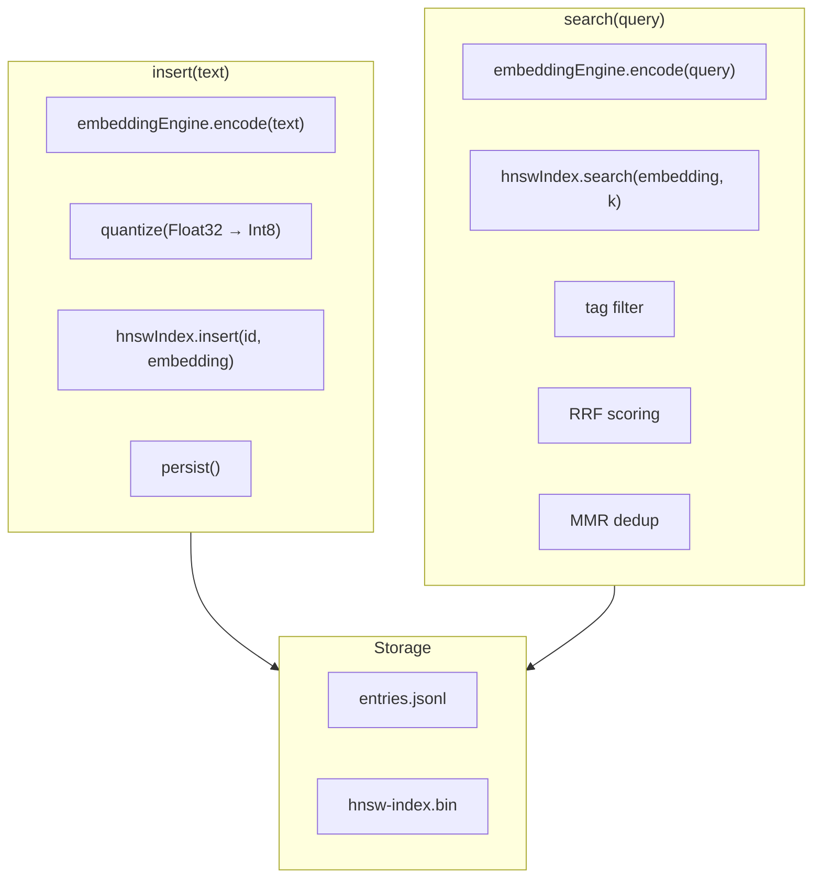

# H36：ArchivalMemory、embedding 与 HNSWIndex

## 小林的旅行规划，Agent 怎么记住长期知识

上一章讲了对话历史的存储和检索。本章回答：**Agent 如何存储和检索长期语义记忆？embedding 如何工作？HNSWIndex 如何加速搜索？**

## 概念阶梯：ArchivalMemory 不是“更大的 RecallMemory”

| 特性 | ArchivalMemory | RecallMemory |
| --- | --- | --- |
| 存储内容 | 长期知识、模式、经验 | 对话历史 |
| 搜索方式 | HNSW 向量索引 + 语义搜索 | 线性扫描 + 关键词 |
| 持久化 | `entries.jsonl` + `hnsw-index.bin` | `history/*.jsonl` |
| 生命周期 | 跨 session 持久 | 按 session 拆分 |
| 典型用途 | 知识库、经验模式 | 对话上下文 |

## 第一段源码：`ArchivalMemory` — 长期语义记忆

打开 [packages/core/src/modules/memory-core/archival/archival-memory.ts](../../../../packages/core/src/modules/memory-core/archival/archival-memory.ts) 第 46—88 行：

```ts
export class ArchivalMemory {
  private entries: ArchivalEntry[] = [];
  private hnswIndex: HNSWIndex;
  private storePath: string;
  private entriesFile: string;
  private indexFile: string;
  private indexReady = false;
  private indexBuildPromise: Promise<void> | null = null;

  constructor(agentDir: string) {
    this.storePath = path.join(agentDir, 'archival');
    this.entriesFile = path.join(this.storePath, 'entries.jsonl');
    this.indexFile = path.join(this.storePath, 'hnsw-index.bin');
    this.hnswIndex = new HNSWIndex({ m: 16, efConstruction: 200 });
    this.ensureStoreDir();
    this.loadFromDisk();
  }
```

`ArchivalMemory` 设计：

1. **`entries`**：内存中的归档记录数组。
2. **`hnswIndex`**：HNSW 向量索引，加速语义搜索。
3. **双文件持久化**：
   - `entries.jsonl`：原始记录。
   - `hnsw-index.bin`：索引二进制数据。

## 第二段源码：`insert` — 插入新记忆

```ts
async insert(text: string, tags?: string[]): Promise<string> {
  const id = `arch-${Date.now()}-${Math.random().toString(36).substring(2, 8)}`;
  const embedding = await embeddingEngine.encode(text);
  const quantized = new Int8Array(embedding.length);
  for (let i = 0; i < embedding.length; i++) {
    const v = embedding[i] ?? 0;
    quantized[i] = v > 0 ? Math.min(127, Math.round(v * 127)) : Math.max(-128, Math.round(v * 127));
  }

  const entry: ArchivalEntry = {
    id,
    text,
    tags: tags ?? [],
    createdAt: Date.now(),
    embedding: quantized,
  };

  this.entries.push(entry);
  this.hnswIndex.insert(id, embedding);
  await this.persist();

  return id;
}
```

插入流程：

1. **生成 ID**：`arch-{timestamp}-{random}`。
2. **编码文本**：`embeddingEngine.encode(text)` → 384 维向量。
3. **量化**：Float32 → Int8，节省存储空间。
4. **插入索引**：`hnswIndex.insert(id, embedding)`。
5. **持久化**：保存到磁盘。

## 第三段源码：`search` — 语义搜索

```ts
async search(query: string, options?: SearchOptions): Promise<ArchivalSearchResult[]> {
  await this.ensureIndexReady();

  const { limit = 10, minScore = 0.1, tags, diversity = 0.7 } = options ?? {};

  const queryEmbedding = await embeddingEngine.encode(query);
  const candidates = this.hnswIndex.search(queryEmbedding, limit * 3);

  // 按标签过滤
  let filtered = candidates;
  if (tags && tags.length > 0) {
    filtered = candidates.filter((c) => {
      const entry = this.getEntryById(c.id);
      return entry && entry.tags.some((t) => tags.includes(t));
    });
  }

  // 余弦相似度 RRF 融合
  const scored = filtered.map((c) => {
    const entry = this.getEntryById(c.id)!;
    const entryEmbedding = this.dequantize(entry.embedding!);
    const relevance = cosineSimilarity(queryEmbedding, entryEmbedding);

    // 时间衰减
    const ageDays = (Date.now() - entry.createdAt) / (1000 * 60 * 60 * 24);
    const temporalScore = 1 / (1 + 0.1 * ageDays);

    // RRF 融合
    const rank = filtered.indexOf(c) + 1;
    const rrfScore = 1 / (60 + rank);

    const finalScore =
      relevance * 0.6 + temporalScore * 0.2 + rrfScore * 10 * 0.2;

    return {
      id: entry.id,
      text: entry.text,
      score: finalScore,
      tags: entry.tags,
      createdAt: entry.createdAt,
    };
  });

  // MMR 去重
  const diverse = this.applyMMR(scored, diversity);

  return diverse
    .filter((r) => r.score >= minScore)
    .slice(0, limit);
}
```

搜索设计：

1. **编码查询**：将查询文本编码为 embedding。
2. **HNSW 搜索**：快速找到候选集（`limit * 3`）。
3. **标签过滤**：按标签筛选。
4. **RRF 融合**：结合相关性、时间衰减、排名。
5. **MMR 去重**：保证结果多样性。

## 第四段源码：`HNSWIndex` — 分层导航小世界索引

打开 [packages/core/src/modules/memory-core/archival/hnsw-index.ts](../../../../packages/core/src/modules/memory-core/archival/hnsw-index.ts) 第 25—75 行：

```ts
export class HNSWIndex {
  private nodes: HNSWNode[] = [];
  private idToIndex = new Map<string, number>();
  private m: number;
  private efConstruction: number;
  private efSearch: number;

  constructor(options: HNSWIndexOptions = {}) {
    this.m = options.m ?? 16;
    this.efConstruction = options.efConstruction ?? 200;
    this.efSearch = options.efSearch ?? 10;
  }

  insert(id: string, embedding: Float32Array): void {
    const nodeIndex = this.nodes.length;
    const node: HNSWNode = {
      id,
      embedding,
      layers: [],
    };

    // 随机层数（geometric distribution）
    let level = 0;
    while (Math.random() < 1 / Math.log2(this.m + 1) && level < 3) level++;
    for (let i = 0; i <= level; i++) {
      node.layers.push(new Set<number>());
    }

    // 在每层连接到最近邻居
    for (let layer = 0; layer < node.layers.length; layer++) {
      const neighbors = this.findNearestInLayer(node.embedding, layer, this.m);
      for (const n of neighbors) {
        node.layers[layer]!.add(n);
        // 双向连接
        const targetNode = this.nodes[n];
        if (targetNode && targetNode.layers[layer]) {
          targetNode.layers[layer]!.add(nodeIndex);
          // 限制最大连接数
          while (targetNode.layers[layer]!.size > this.m * 2) {
            const first = targetNode.layers[layer]!.values().next().value;
            if (first !== undefined) targetNode.layers[layer]!.delete(first);
          }
        }
      }
    }

    this.nodes.push(node);
    this.idToIndex.set(id, nodeIndex);
  }
```

HNSW 设计：

1. **分层结构**：每个节点随机分配到 1-4 层。
2. **最近邻居连接**：每层连接到最近的 `m` 个邻居。
3. **双向连接**：邻居之间互相连接。
4. **连接数限制**：每个节点的连接数不超过 `m * 2`。

## 图解：ArchivalMemory 架构



## 失败路径与边界

### 边界 1：ONNX 模型不可用时回退到 TF-IDF

如果 ONNX 模型不可用，`embeddingEngine.encode` 使用 TF-IDF 词袋向量。这意味着：**语义搜索质量会下降。**

### 边界 2：HNSW 索引在节点数 ≤ 1000 时使用暴力搜索

```ts
if (this.nodes.length <= 1000) {
  return this.bruteForceSearch(query, k);
}
```

小规模场景下，HNSW 的优势不明显。这意味着：**索引规模较小时，搜索性能提升有限。**

### 边界 3：Int8 量化可能损失精度

```ts
quantized[i] = v > 0 ? Math.min(127, Math.round(v * 127)) : Math.max(-128, Math.round(v * 127));
```

Float32 → Int8 量化会损失精度。这意味着：**极端情况下，相似度计算可能不准确。**

### 边界 4：`applyMMR` 是简化实现

MMR（Maximal Marginal Relevance）去重是简化实现，可能不如完整算法精确。这意味着：**结果多样性可能不够理想。**

## 测试证据与缺口

### 已有测试（`archival.test.ts`）

```ts
it('inserts and retrieves archival entries', async () => {
  const archival = new ArchivalMemory('/tmp/test-archival');
  const id = await archival.insert('test memory', ['tag1']);
  expect(archival.count()).toBe(1);
});
```

### 测试缺口

- 没有针对 `search` 结果排序的测试。
- 没有针对 `applyMMR` 去重效果的测试。
- 没有针对 Int8 量化精度的测试。
- 没有针对 HNSW 索引大规模性能的测试。

## 口头验收

不看源码，你能解释：

1. ArchivalMemory 和 RecallMemory 的区别是什么？
2. `insert` 流程包含哪些步骤？
3. HNSWIndex 如何组织节点？
4. `search` 中的 RRF 融合包含哪些因素？
5. Int8 量化的优缺点是什么？

## 章节收束

本章讲解了 ArchivalMemory 的设计：长期语义记忆的存储、HNSW 向量索引、语义搜索。下一章（H37）会进入 CoreMemoryTools 与 ArchivalMemoryTools，了解 Agent 如何操作记忆。
