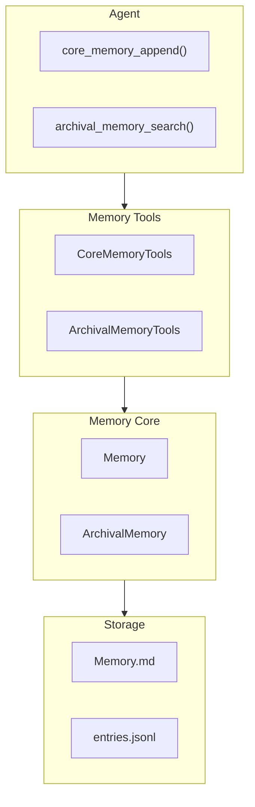

# H37：CoreMemoryTools 与 ArchivalMemoryTools

## 小林的旅行规划，Agent 怎么操作记忆

上一章讲了 ArchivalMemory 的存储和搜索。本章回答：**Agent 通过什么 API 操作 Core Memory 和 Archival Memory？这些 Tools 如何被调用？**

## 概念阶梯：Memory Tools 不是“直接操作文件”

| 特性 | Memory Tools | 直接操作文件 |
| --- | --- | --- |
| 接口层级 | 结构化 API | 文件 IO |
| 权限控制 | 内置 readOnly 检查 | 需外部实现 |
| 大小限制 | 自动检查 limit | 需手动检查 |
| 版本追踪 | 自动 version++ | 需手动实现 |
| 错误处理 | 返回结构化错误 | 抛出异常 |

## 第一段源码：`CoreMemoryTools` — 核心记忆操作

打开 [packages/core/src/modules/memory-core/tools/core-memory-tools.ts](../../../../packages/core/src/modules/memory-core/tools/core-memory-tools.ts) 第 10—68 行：

```ts
export class CoreMemoryTools {
  constructor(private memory: Memory) {}

  async core_memory_append(label: string, content: string): Promise<string> {
    const block = this.memory.getBlock(label);
    if (!block) return `Error: Block '${label}' does not exist.`;
    if (block.readOnly) return `Error: Block '${label}' is read-only.`;
    const newValue = block.value + (block.value ? '\n' : '') + content;
    if (newValue.length > block.limit) {
      return `Error: Content exceeds block limit (${block.limit} chars). Current: ${block.value.length}, New: ${newValue.length}`;
    }
    this.memory.setBlock(label, newValue);
    return `Block '${label}' appended successfully.`;
  }

  async core_memory_replace(
    label: string,
    oldContent: string,
    newContent: string,
  ): Promise<string> {
    const block = this.memory.getBlock(label);
    if (!block) return `Error: Block '${label}' does not exist.`;
    if (block.readOnly) return `Error: Block '${label}' is read-only.`;
    if (!block.value.includes(oldContent)) {
      return `Error: Old content not found in block '${label}'.`;
    }
    const newValue = block.value.replace(oldContent, newContent);
    if (newValue.length > block.limit) {
      return `Error: Content exceeds block limit (${block.limit} chars).`;
    }
    this.memory.setBlock(label, newValue);
    return `Block '${label}' replaced successfully.`;
  }
```

`CoreMemoryTools` 设计：

1. **`core_memory_append`**：追加内容到 block。
2. **`core_memory_replace`**：替换 block 中的内容。
3. **错误返回**：返回字符串错误信息，不抛出异常。
4. **大小检查**：自动检查 `limit`。

## 第二段源码：`insert_memory_block` 与 `read_memory_block`

```ts
async insert_memory_block(
  label: string,
  value: string,
  description?: string,
  limit?: number,
): Promise<string> {
  if (this.memory.getBlock(label)) {
    return `Error: Block '${label}' already exists.`;
  }
  const def: BlockDefinition = {
    label,
    description: description ?? 'Agent-created block',
    limit: limit ?? 2000,
  };
  createBlock(def); // validate
  this.memory.createBlock(def, value);
  return `Block '${label}' created successfully.`;
}

async read_memory_block(label: string): Promise<string> {
  const block = this.memory.getBlock(label);
  if (!block) return `Error: Block '${label}' does not exist.`;
  return block.value;
}
```

工具设计：

1. **`insert_memory_block`**：创建新 block。
2. **`read_memory_block`**：读取 block 内容。
3. **创建时验证**：`createBlock(def)` 验证 block 定义。

## 第三段源码：`ArchivalMemoryTools` — 归档记忆操作

打开 [packages/core/src/modules/memory-core/tools/archival-memory-tools.ts](../../../../packages/core/src/modules/memory-core/tools/archival-memory-tools.ts) 第 9—30 行：

```ts
export class ArchivalMemoryTools {
  constructor(private archival: ArchivalMemory) {}

  async archival_memory_insert(text: string, tags?: string[]): Promise<string> {
    const id = await this.archival.insert(text, tags);
    return `Archival memory saved (id: ${id}).`;
  }

  async archival_memory_search(
    query: string,
    limit = 5,
    options?: Omit<SearchOptions, 'limit'>,
  ): Promise<string> {
    const results = await this.archival.search(query, { limit, ...options });
    if (results.length === 0) return 'No relevant memories found.';
    const lines = [`Found ${results.length} relevant memories:`];
    for (const r of results) {
      lines.push(`- [score: ${r.score.toFixed(2)}] ${r.text}`);
    }
    return lines.join('\n');
  }
}
```

`ArchivalMemoryTools` 设计：

1. **`archival_memory_insert`**：插入长期记忆。
2. **`archival_memory_search`**：搜索归档记忆。
3. **格式化输出**：搜索结果格式化为字符串。

## 图解：Memory Tools 调用链



## 失败路径与边界

### 边界 1：Tools 返回字符串错误，不抛出异常

```ts
if (!block) return `Error: Block '${label}' does not exist.`;
```

这意味着：**调用方需要解析字符串来判断是否成功。**

### 边界 2：`core_memory_replace` 是简单字符串替换

```ts
const newValue = block.value.replace(oldContent, newContent);
```

使用 `String.prototype.replace`，只替换第一个匹配。这意味着：**如果 `oldContent` 出现多次，只有第一次会被替换。**

### 边界 3：`archival_memory_search` 的 `limit` 默认值为 5

```ts
async archival_memory_search(query: string, limit = 5, ...)
```

默认返回 5 条结果。这意味着：**如果未指定 `limit`，可能遗漏相关记忆。**

### 边界 4：Tools 是同步/异步混合

- `core_memory_append`、`core_memory_replace` 是同步操作（虽然标记为 `async`）。
- `archival_memory_insert`、`archival_memory_search` 是真正的异步操作。

这意味着：**调用方需要正确 `await` 异步操作。**

## 测试证据与缺口

### 已有测试（`tools-provider.test.ts`）

```ts
it('appends to block', async () => {
  const memory = new Memory('/tmp/test-tools');
  const tools = new CoreMemoryTools(memory);
  const result = await tools.core_memory_append('human', 'test');
  expect(result).toContain('appended successfully');
});
```

### 测试缺口

- 没有针对 `core_memory_replace` 替换多个匹配的测试。
- 没有针对 `archival_memory_search` 返回格式化字符串的测试。
- 没有针对错误信息格式的测试。

## 口头验收

不看源码，你能解释：

1. `CoreMemoryTools` 和 `ArchivalMemoryTools` 的分工是什么？
2. `core_memory_replace` 的替换行为是什么？
3. Tools 返回错误的方式是什么？
4. `archival_memory_search` 的输出格式是什么？

## 章节收束

本章讲解了 Memory Tools 的设计：CoreMemoryTools 操作 Block，ArchivalMemoryTools 操作归档记忆。下一章（H38）会进入 Adapter 与 Provider，了解 Memory Core 如何与现有系统兼容。
