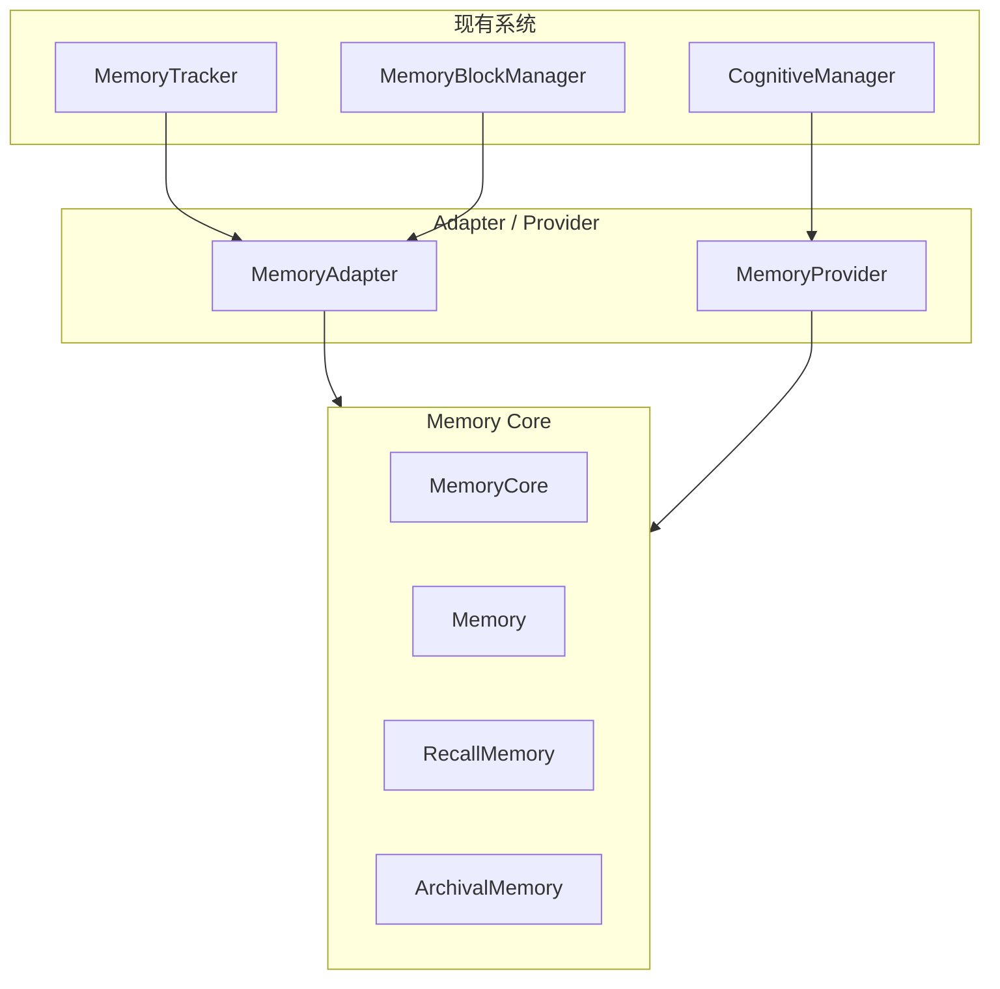

# H38：Adapter 与 Provider

## 小林的旅行规划，Memory Core 如何接入现有系统

上一章讲了 Memory Tools 的设计。本章回答：**Memory Core 如何与现有的 MemoryTracker、CognitiveManager 兼容？Adapter 和 Provider 如何工作？**

## 概念阶梯：Adapter 不是“重写”，而是“桥接”

| 特性 | MemoryAdapter | 重写 MemoryTracker |
| --- | --- | --- |
| 侵入性 | 无侵入，兼容旧 API | 需要修改所有调用方 |
| 迁移成本 | 低 | 高 |
| 风险 | 低（Adapter 可能遗漏） | 高（可能引入新 bug） |
| 维护成本 | 需要维护两套接口 | 只需维护一套 |

OriginOS 选择 Adapter 模式的原因：
1. 现有代码大量依赖 `MemoryTracker` 和 `MemoryBlockManager`。
2. 直接重写风险高，迁移周期长。
3. Adapter 可以在不改变调用方的情况下逐步迁移。

## 第一段源码：`MemoryAdapter` — 兼容层

打开 [packages/core/src/modules/memory-core/adapter.ts](../../../../packages/core/src/modules/memory-core/adapter.ts) 第 11—80 行：

```ts
export class MemoryAdapter {
  private core: MemoryCore;

  constructor(core: MemoryCore) {
    this.core = core;
  }

  // --- MemoryTracker 兼容 ---

  recordTurn(userMessage: string, turnNumber: number): void {
    this.core.recall.recordTurn({ turnNumber, userMessage });
  }

  getDreamCursor(): number {
    return this.core.recall.getDreamCursor();
  }

  setDreamCursor(cursor: number): void {
    this.core.recall.setDreamCursor(cursor);
  }

  readRecentHistory(sinceCursor: number): string {
    return this.core.recall.readRecentHistory(sinceCursor);
  }

  // --- MemoryBlockManager 兼容 ---

  getBlock(label: string): MemoryBlock | null {
    const block = this.core.memory.getBlock(label);
    if (!block) return null;
    return {
      label: block.label,
      value: block.value,
      limit: block.limit,
      description: block.description,
      metadata: block.metadata as Record<string, unknown>,
      readOnly: block.readOnly,
    };
  }

  setBlock(label: string, value: string): void {
    this.core.memory.setBlock(label, value);
  }

  appendBlock(label: string, content: string): void {
    this.core.memory.appendBlock(label, content);
  }

  replaceBlock(label: string, old: string, replacement: string): boolean {
    return this.core.memory.replaceBlock(label, old, replacement);
  }

  getCoreMemory(): string {
    return this.core.memory.compile({ format: 'markdown' });
  }
```

`MemoryAdapter` 设计：

1. **封装 `MemoryCore`**：所有操作委托给 `MemoryCore`。
2. **类型转换**：将新 `Block` 格式转换为旧 `MemoryBlock` 格式。
3. **方法映射**：
   - `recordTurn` → `core.recall.recordTurn`
   - `getBlock` → `core.memory.getBlock` + 类型转换
   - `getCoreMemory` → `core.memory.compile`

## 第二段源码：`MemoryProvider` — CognitiveProvider 实现

打开 [packages/core/src/modules/memory-core/session/memory-provider.ts](../../../../packages/core/src/modules/memory-core/session/memory-provider.ts) 第 29—100 行：

```ts
export class MemoryProvider implements CognitiveProvider {
  readonly name = 'memory';

  private core: MemoryCore;
  private consolidator: MemoryConsolidator;
  private agentDir: string;
  private sessionId: string;

  constructor(
    coreOrAgentDir: MemoryCore | string,
    sessionId: string = 'default',
    knowledgeConsumer?: { ingestCandidates(candidates: KnowledgeCandidateBatch[]): Promise<void> },
  ) {
    this.sessionId = sessionId;
    this.knowledgeConsumer = knowledgeConsumer;
    if (coreOrAgentDir instanceof MemoryCore) {
      this.core = coreOrAgentDir;
      this.agentDir = this.core.agentDir;
    } else {
      this.agentDir = coreOrAgentDir;
      this.core = new MemoryCore(coreOrAgentDir, sessionId);
    }
    this.consolidator = new MemoryConsolidator(this.agentDir, this.sessionId);
  }
```

`MemoryProvider` 设计：

1. **实现 `CognitiveProvider` 接口**：接入现有认知系统。
2. **支持两种构造方式**：
   - 传入 `MemoryCore` 实例（复用）。
   - 传入 `agentDir` 字符串（新建）。
3. **包含 `MemoryConsolidator`**：支持记忆整理。

## 第三段源码：`prefetch` — 记忆预取

```ts
async prefetch(query: string): Promise<string | null> {
  const sections = await this.queryMemory(query);
  const parts: string[] = [];

  if (sections.pattern.length > 0 || sections.reflection.length > 0) {
    parts.push('## Archival Memory (Semantic)\n');
    for (const item of [...sections.pattern, ...sections.reflection]) {
      parts.push(`- ${item}`);
    }
  }

  if (sections.recent_history.length > 0) {
    parts.push(`## Recall Memory (Conversation History)\n\n${sections.recent_history.map((item) => `- ${item}`).join('\n')}`);
  }

  if (sections.stable_memory.length > 0) {
    parts.push(`## Stable Memory\n\n${sections.stable_memory.map((item) => `- ${item}`).join('\n')}`);
  }

  return parts.length > 0 ? parts.join('\n\n') : null;
}
```

`prefetch` 设计：

1. **查询三层记忆**：Archival、Recall、Stable。
2. **格式化输出**：按 markdown 格式组织。
3. **返回 null**：如果没有相关记忆，返回 null。

## 第四段源码：`sync_turn` 与 `on_session_end`

```ts
async sync_turn(data: TurnCognitiveData): Promise<void> {
  this.core.recall.recordTurn({
    turnNumber: data.turnNumber,
    userMessage: data.userMessage,
    assistantMessage: data.assistantMessage,
    toolCalls: data.toolCalls,
  });
}

async on_session_end(_messages: unknown[]): Promise<ConsolidationResult | null> {
  const result = await this.consolidator.consolidate();
  // ... 处理 knowledge candidates
  return this.lastConsolidation;
}
```

生命周期钩子：

1. **`sync_turn`**：每轮对话后同步到 RecallMemory。
2. **`on_session_end`**：会话结束时触发记忆整理。

## 图解：Adapter 与 Provider 架构



## 失败路径与边界

### 边界 1：`MemoryAdapter` 是单向桥接

`MemoryAdapter` 只提供从旧 API 到新 `MemoryCore` 的桥接，不支持反向。这意味着：**新代码不能直接通过 Adapter 访问旧功能。**

### 边界 2：`getBlock` 返回的是拷贝

```ts
getBlock(label: string): MemoryBlock | null {
  const block = this.core.memory.getBlock(label);
  if (!block) return null;
  return {
    label: block.label,
    // ... 创建新对象
  };
}
```

返回的是新对象，不是引用。这意味着：**修改返回的对象不会影响 `MemoryCore` 中的数据。**

### 边界 3：`MemoryProvider` 构造时可能创建重复的 `MemoryCore`

```ts
if (coreOrAgentDir instanceof MemoryCore) {
  this.core = coreOrAgentDir;
} else {
  this.core = new MemoryCore(coreOrAgentDir, sessionId);
}
```

如果外部已经创建了 `MemoryCore`，但传入的是 `agentDir`，会创建新的实例。这意味着：**可能有两个独立的 `MemoryCore` 实例操作同一目录。**

### 边界 4：`prefetch` 的查询是简单的字符串包含

```ts
const stable_memory = this.lastConsolidation
  ? this.lastConsolidation.stableMemory.filter((item) => item.includes(query))
  : [];
```

使用 `String.prototype.includes`，不是语义搜索。这意味着：**查询必须是字符串的精确子串。**

## 测试证据与缺口

### 已有测试（`tools-provider.test.ts`）

```ts
it('adapts MemoryTracker API', () => {
  const core = new MemoryCore('/tmp/test-adapter');
  const adapter = new MemoryAdapter(core);
  adapter.recordTurn('Hello', 1);
  expect(adapter.readRecentHistory(0)).toContain('Hello');
});
```

### 测试缺口

- 没有针对 `MemoryAdapter` 返回拷贝的测试。
- 没有针对 `MemoryProvider` 重复创建 `MemoryCore` 的测试。
- 没有针对 `prefetch` 返回 null 的测试。

## 口头验收

不看源码，你能解释：

1. `MemoryAdapter` 和 `MemoryProvider` 的分工是什么？
2. Adapter 模式的优缺点是什么？
3. `getBlock` 返回的是引用还是拷贝？
4. `MemoryProvider` 如何避免重复创建 `MemoryCore`？

## 章节收束

本章讲解了 Adapter 和 Provider 的设计：兼容旧 API、接入认知系统、生命周期管理。下一章（H39）是 Unit 6 小结课。
