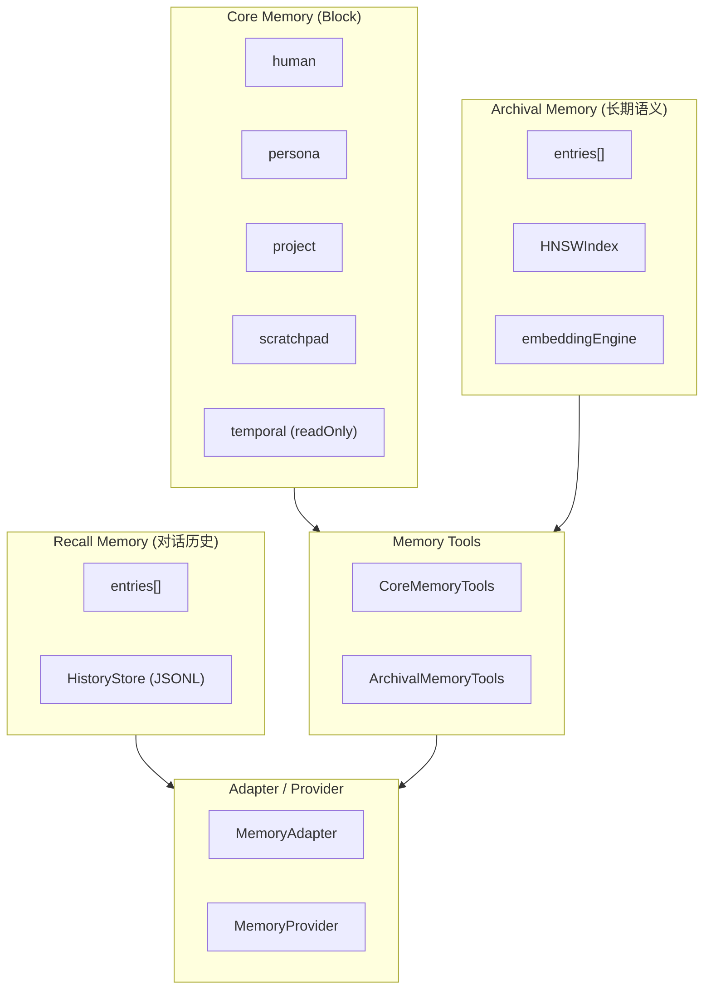

# H39：单元小结课 —— Memory Core 记忆系统

## 本单元回顾

Unit 6（H33-H38）从 Block 基础概念讲起，到 Adapter 与 Provider 结束。让我们回顾核心概念。

## 层次图：三层记忆架构



## 核心概念对照表

### 三层记忆对比

| 层级 | 存储内容 | 搜索方式 | 持久化 | 典型用途 |
| --- | --- | --- | --- | --- |
| **Core Memory** | Block 集合（human/persona/project等） | 按 label 查找 | Memory.md + blocks.json | LLM system prompt |
| **Recall Memory** | 对话历史 | 语义搜索 + 关键词搜索 | JSONL | 对话上下文 |
| **Archival Memory** | 长期知识、经验模式 | HNSW 向量索引 | entries.jsonl + hnsw-index.bin | 知识检索 |

### Block 默认配置

| Block | 用途 | 限制 | 是否只读 |
| --- | --- | --- | --- |
| `human` | 用户画像、偏好 | 2000 字符 | 否 |
| `persona` | Agent 角色认知 | 2000 字符 | 否 |
| `project` | 项目状态、任务 | 3000 字符 | 否 |
| `scratchpad` | 临时笔记 | 1000 字符 | 否 |
| `temporal` | 关键事件时间线 | 3000 字符 | **是** |

### CRUD 操作对比

| 操作 | 输入 | 失败条件 | 版本变化 |
| --- | --- | --- | --- |
| `setBlock` | 完整新值 | Block 不存在、只读、超限 | +1 |
| `appendBlock` | 追加内容 | Block 不存在、只读、超限 | +1 |
| `replaceBlock` | 旧内容 + 新内容 | Block 不存在、只读、旧内容不存在、超限 | +1 |
| `createBlock` | BlockDefinition | Block 已存在 | 1 |
| `deleteBlock` | label | Block 不存在、只读 | N/A |

## 正向追踪：从对话到记忆持久化

```
用户发送消息
  → Agent 处理
    → sync_turn() 记录到 RecallMemory
      → HistoryStore.append() → history/default.jsonl
    → Agent 修改 Core Memory
      → Memory.setBlock() / appendBlock() / replaceBlock()
        → Memory.save()
          → Memory.md (人类可读)
          → blocks.json (版本快照)
    → Agent 归档重要信息
      → ArchivalMemory.insert()
        → embeddingEngine.encode()
        → hnswIndex.insert()
        → persist() → entries.jsonl + hnsw-index.bin
```

## 反向诊断：从症状定位责任层

| 症状 | 可能的责任层 | 排查方向 |
| --- | --- | --- |
| Block 修改不生效 | `Memory.setBlock` | 检查 `readOnly` 和 `limit` |
| 对话历史丢失 | `HistoryStore` | 检查 `history/*.jsonl` 文件 |
| 语义搜索不准确 | `embeddingEngine` | 检查 ONNX 模型是否可用 |
| HNSW 搜索慢 | `HNSWIndex.search` | 检查节点数是否 > 1000 |
| 旧 API 调用失败 | `MemoryAdapter` | 检查 `MemoryCore` 初始化 |
| 记忆整理未触发 | `MemoryProvider.on_session_end` | 检查 `Consolidator` 配置 |

## 源码覆盖台账（Unit 6）

| 文件路径 | 状态 | 主讲章节 | 关键代码窗口 |
| --- | --- | --- | --- |
| `core/block.ts` | 精读 | H33 | `Block`, `BlockDefinition`, `createBlock`, `validateBlock` |
| `core/memory.ts` | 精读 | H34 | `Memory`, `setBlock`, `appendBlock`, `replaceBlock`, `compile`, `save` |
| `recall/recall-memory.ts` | 精读 | H35 | `RecallMemory`, `recordTurn`, `searchSemantic`, `searchKeyword` |
| `recall/history-store.ts` | 精读 | H35 | `HistoryStore`, `append`, `readAll` |
| `archival/archival-memory.ts` | 精读 | H36 | `ArchivalMemory`, `insert`, `search` |
| `archival/hnsw-index.ts` | 精读 | H36 | `HNSWIndex`, `insert`, `search` |
| `archival/embedding.ts` | 背景引用 | H36 | `EmbeddingEngine`, `encode`, `cosineSimilarity` |
| `tools/core-memory-tools.ts` | 精读 | H37 | `CoreMemoryTools`, `core_memory_append`, `core_memory_replace` |
| `tools/archival-memory-tools.ts` | 精读 | H37 | `ArchivalMemoryTools`, `archival_memory_insert`, `archival_memory_search` |
| `adapter.ts` | 精读 | H38 | `MemoryAdapter`, `getBlock`, `setBlock` |
| `session/memory-provider.ts` | 精读 | H38 | `MemoryProvider`, `prefetch`, `sync_turn`, `on_session_end` |

## 口头验收

不看源码，你能解释：

1. Memory Core 的三层记忆分别是什么？各有什么特点？
2. Block 的 `limit` 和 `readOnly` 有什么作用？
3. `searchSemantic` 和 `searchKeyword` 有什么区别？
4. HNSWIndex 如何加速语义搜索？
5. Adapter 模式在 Memory Core 中的作用是什么？

## 下一单元预告

Unit 7（H40-H47）将深入其他 Core Modules：

- 认知系统架构：Knowledge Base、Practice Log、Pattern Library
- CognitiveManager 生命周期钩子
- 知识提取与模式沉淀
- Frozen Snapshot 模式
- 多 Agent 协作中的记忆共享

核心问题：**Memory Core 如何支持 Agent 的认知进化？**
