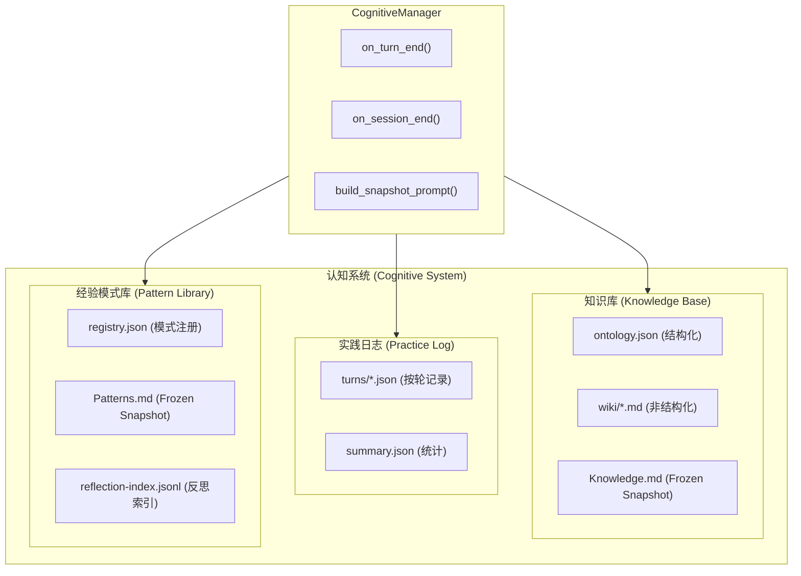

# H40：认知系统全景：Knowledge Base、Practice Log、Pattern Library

## 小林的旅行规划，Agent 如何积累经验和知识

前几章讲了 Memory Core 的三层记忆架构。现在进入 Unit 7：**认知系统**——Agent 如何在服务用户过程中积累知识、沉淀经验、持续进化。

## 概念阶梯：认知系统不是“更大的数据库”

| 特性 | 认知系统 | 数据库 | Memory Core |
| --- | --- | --- | --- |
| 数据类型 | 知识、经验、模式 | 结构化记录 | Block、对话历史、语义记忆 |
| 更新方式 | LLM 自动提取 | 应用写入 | Agent/用户编辑 |
| 生命周期 | 随对话自动演化 | 持久化存储 | 按 session 管理 |
| 查询方式 | 语义搜索 + 关键词 | SQL | 按 label 或向量 |
| 典型用途 | Agent 认知进化 | 业务数据 | LLM 上下文注入 |

## 认知系统三大组件



## 第一段源码：`CognitiveManager` — 认知管理器

打开 [packages/core/src/lib/integrations/pi-agent/cognitive/manager.ts](../../../../packages/core/src/lib/integrations/pi-agent/cognitive/manager.ts) 第 13—50 行：

```ts
export class CognitiveManager {
  private providers = new Map<string, CognitiveProvider>();
  private providerPaths = new Map<string, string>();

  /** 注册 Provider */
  register(provider: CognitiveProvider): void {
    this.providers.set(provider.name, provider);
    if ('agentDir' in provider && typeof (provider as any).agentDir === 'string') {
      this.providerPaths.set(provider.name, (provider as any).agentDir);
    }
  }

  /** Turn 结束钩子 */
  async on_turn_end(data: TurnCognitiveData): Promise<void> {
    setImmediate(async () => {
      for (const [, provider] of this.providers) {
        try {
          await provider.sync_turn(data);
        } catch (e) {
          console.error(`[CognitiveManager] ${provider.name} sync_turn error:`, e);
        }
      }
    });
  }
```

`CognitiveManager` 设计：

1. **`providers` Map**：管理多个 `CognitiveProvider`。
2. **`register` / `unregister`**：动态注册/注销 Provider。
3. **`on_turn_end`**：每轮对话后异步触发所有 Provider 的 `sync_turn`。

## 第二段源码：`KnowledgeProvider` — 知识库

打开 [packages/core/src/lib/integrations/pi-agent/cognitive/knowledge-provider.ts](../../../../packages/core/src/lib/integrations/pi-agent/cognitive/knowledge-provider.ts) 第 34—109 行：

```ts
export class KnowledgeProvider implements CognitiveProvider {
  readonly name = 'knowledge';

  private ontology: UnifiedOntology;
  private businessOntology: UnifiedOntology | null;

  async sync_turn(data: TurnCognitiveData): Promise<void> {
    const extracted = this.extractKnowledge(data);
    if (extracted.entities.length === 0 && extracted.facts.length === 0) return;

    // 1. 写入统一本体
    for (const ent of extracted.entities) {
      const existing = this.ontology.entities.find(
        e => e.name === ent.name && e.type === ent.type
      );
      if (!existing) {
        this.ontology.createEntity(ent.type, ent.name, ent.attributes);
      }
    }
    this.saveOntology();

    // 2. 更新衍生 wiki 页面
    this.writeWikiPages(extracted);
    this.updateIndex(extracted);
    this.appendLog(data.turnNumber, extracted);

    // 3. 更新 Frozen Snapshot
    this.exportSnapshot();
  }
```

`KnowledgeProvider` 设计：

1. **双本体存储**：
   - `ontology.json`：对话中自动提取的知识。
   - `business-ontology.json`：从 `business-model.json` 导入的业务本体（只读）。
2. **`sync_turn`**：每轮对话后自动提取知识。
3. **衍生视图**：wiki 页面、索引、日志。

## 第三段源码：`PracticeLogger` — 实践日志

打开 [packages/core/src/lib/integrations/pi-agent/cognitive/practice-logger.ts](../../../../packages/core/src/lib/integrations/pi-agent/cognitive/practice-logger.ts) 第 29—45 行：

```ts
export class PracticeLogger implements CognitiveProvider {
  readonly name = 'practice';

  async sync_turn(data: TurnCognitiveData): Promise<void> {
    const turnFile = path.join(this.turnsDir, `turn-${data.turnNumber}.json`);
    writeFileSync(turnFile, JSON.stringify(data, null, 2), 'utf-8');
    await this.updateSummary(data);
  }
```

`PracticeLogger` 设计：

1. **按轮记录**：每轮对话保存为 `turn-{N}.json`。
2. **统计汇总**：`summary.json` 记录总轮数、工具调用数、成功率。
3. **异步写入**：不阻塞 Agent 响应。

## 第四段源码：`PatternProvider` — 经验模式

打开 [packages/core/src/lib/integrations/pi-agent/cognitive/pattern-provider.ts](../../../../packages/core/src/lib/integrations/pi-agent/cognitive/pattern-provider.ts) 第 46—119 行：

```ts
export class PatternProvider implements CognitiveProvider {
  readonly name = 'pattern';

  async sync_turn(data: TurnCognitiveData): Promise<void> {
    const currentChain = data.toolCalls.map(t => t.name);

    // 检测失败
    const hasErrors = data.toolCalls.some(t => !t.success);
    const resolved = data.outcome.resolved;

    if (!resolved || hasErrors) {
      await this.on_failure(data);
      return;
    }

    // 记录工具链模式
    if (currentChain.length === 0) return;

    const registry = this.readRegistry();
    const matched = registry.patterns.find(p =>
      !p.isAntiPattern && this.chainsMatch(p.toolChain, currentChain)
    );

    if (matched) {
      matched.effectiveness.sampleCount++;
      // ... 更新统计
    } else if (currentChain.length <= 3) {
      // 创建新模式
      registry.patterns.push(newPattern);
    }

    this.writeRegistry(registry);
  }
```

`PatternProvider` 设计：

1. **工具链匹配**：识别常用的工具调用序列。
2. **失败检测**：记录失败场景，生成反思。
3. **模式注册**：新工具链自动注册为模式。

## 失败路径与边界

### 边界 1：`sync_turn` 是异步的，可能丢失数据

```ts
setImmediate(async () => {
  for (const [, provider] of this.providers) {
    await provider.sync_turn(data);
  }
});
```

`setImmediate` 不保证执行成功。这意味着：**如果进程崩溃，部分 Provider 的数据可能丢失。**

### 边界 2：`extractKnowledge` 是启发式的

知识提取依赖 LLM 分析，不是确定性的。这意味着：**提取的知识可能不准确或遗漏。**

### 边界 3：`PatternProvider` 只记录长度 ≤ 3 的工具链

```ts
} else if (currentChain.length <= 3) {
```

长工具链不被记录。这意味着：**复杂的工具调用模式可能丢失。**

## 测试证据与缺口

### 测试缺口

- 没有针对 `CognitiveManager` 多 Provider 并发执行的测试。
- 没有针对知识提取准确性的测试。
- 没有针对模式匹配算法的测试。

## 口头验收

不看源码，你能解释：

1. 认知系统的三大组件是什么？
2. `CognitiveManager` 如何协调多个 Provider？
3. `KnowledgeProvider` 的双本体设计是什么？
4. `PracticeLogger` 记录什么数据？
5. `PatternProvider` 如何识别模式？

## 章节收束

本章讲解了认知系统的全景：知识库、实践日志、经验模式。下一章（H41）会深入 CognitiveManager 的生命周期钩子。
