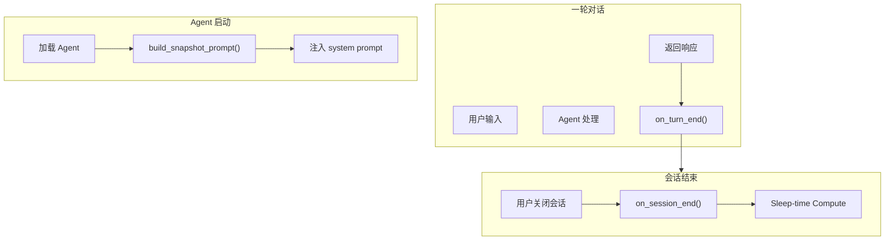

# H41：CognitiveManager 生命周期钩子

## 小林的旅行规划，Agent 何时整理记忆

上一章讲了认知系统的三大组件。本章回答：**CognitiveManager 的生命周期钩子有哪些？何时触发？**

## 概念阶梯：生命周期钩子不是“定时任务”

| 特性 | 生命周期钩子 | 定时任务 |
| --- | --- | --- |
| 触发时机 | 事件驱动（turn_end, session_end） | 时间驱动 |
| 执行方式 | 异步，不阻塞主流程 | 同步或异步 |
| 失败处理 | 捕获异常，不影响主流程 | 可能阻塞 |
| 粒度 | 按 Provider 分别执行 | 统一执行 |
| 典型用途 | 记忆同步、知识提取 | 定时备份、清理 |

## 第一段源码：`on_turn_end` — Turn 结束钩子

打开 [packages/core/src/lib/integrations/pi-agent/cognitive/manager.ts](../../../../packages/core/src/lib/integrations/pi-agent/cognitive/manager.ts) 第 38—50 行：

```ts
/** Turn 结束钩子 */
async on_turn_end(data: TurnCognitiveData): Promise<void> {
  // 异步执行，不阻塞主流程
  setImmediate(async () => {
    for (const [, provider] of this.providers) {
      try {
        await provider.sync_turn(data);
      } catch (e) {
        console.error(`[CognitiveManager] ${provider.name} sync_turn error:`, e);
      }
    }
  });
}
```

`on_turn_end` 设计：

1. **异步执行**：`setImmediate` 确保不阻塞主流程。
2. **遍历所有 Provider**：每个 Provider 独立执行。
3. **错误隔离**：单个 Provider 失败不影响其他 Provider。

## 第二段源码：`on_session_end` — Session 结束钩子

```ts
/** Session 结束钩子（周期分析） */
async on_session_end(messages: unknown[]): Promise<void> {
  // 各 Provider 各自实现批量分析逻辑
  for (const [, provider] of this.providers) {
    try {
      if ('on_session_end' in provider) {
        await (provider as any).on_session_end(messages);
      }
    } catch (e) {
      console.error(`[CognitiveManager] ${provider.name} on_session_end error:`, e);
    }
  }
}
```

`on_session_end` 设计：

1. **批量分析**：适合重量级操作（LLM 分析、知识提取）。
2. **可选实现**：Provider 可以不实现 `on_session_end`。
3. **顺序执行**：逐个 Provider 执行，不是并发。

## 第三段源码：`build_snapshot_prompt` — 构建 Frozen Snapshot

```ts
/** 构建 Frozen Snapshot：启动时加载所有 Provider 的快照到 system prompt */
async build_snapshot_prompt(): Promise<string> {
  const blocks: string[] = [];
  for (const [, provider] of this.providers) {
    try {
      const block = await provider.system_prompt_block();
      if (block) blocks.push(block);
    } catch (e) {
      console.error(`[CognitiveManager] ${provider.name} system_prompt_block error:`, e);
    }
  }
  return blocks.join('\n\n');
}
```

`build_snapshot_prompt` 设计：

1. **启动时调用**：Agent 启动时构建 system prompt。
2. **收集所有 Provider**：每个 Provider 贡献自己的快照。
3. **拼接输出**：按 `\n\n` 分隔。

## 第四段源码：`prefetch` — 预取相关上下文

```ts
/** Prefetch：从所有 Provider 召回相关上下文 */
async prefetch(query: string): Promise<Array<{ provider: string; content: string }>> {
  const results: Array<{ provider: string; content: string }> = [];
  for (const [, provider] of this.providers) {
    try {
      const content = await provider.prefetch(query);
      if (content) {
        results.push({ provider: provider.name, content });
      }
    } catch (e) {
      console.error(`[CognitiveManager] ${provider.name} prefetch error:`, e);
    }
  }
  return results;
}
```

`prefetch` 设计：

1. **查询所有 Provider**：每个 Provider 独立召回。
2. **返回结构化结果**：包含 Provider 名称和内容。
3. **用于 LLM 上下文注入**：将召回内容注入 system prompt。

## 图解：生命周期钩子触发时机



## 失败路径与边界

### 边界 1：`on_turn_end` 使用 `setImmediate`

`setImmediate` 在 Node.js 事件循环的下一轮执行。这意味着：**如果进程在 `setImmediate` 回调执行前崩溃，数据会丢失。**

### 边界 2：`on_session_end` 是顺序执行的

```ts
for (const [, provider] of this.providers) {
  await (provider as any).on_session_end(messages);
}
```

逐个 Provider 执行，不是并发。这意味着：**如果某个 Provider 耗时很长，会阻塞其他 Provider。**

### 边界 3：`system_prompt_block` 可能返回空字符串

```ts
const block = await provider.system_prompt_block();
if (block) blocks.push(block);
```

如果 Provider 没有快照，返回空字符串。这意味着：**部分 Provider 可能不贡献任何内容。**

## 测试证据与缺口

### 测试缺口

- 没有针对 `on_turn_end` 异步执行的测试。
- 没有针对 `on_session_end` 顺序执行的测试。
- 没有针对 `build_snapshot_prompt` 拼接格式的测试。

## 口头验收

不看源码，你能解释：

1. `on_turn_end` 和 `on_session_end` 的区别是什么？
2. `build_snapshot_prompt` 在什么时候调用？
3. `prefetch` 的作用是什么？
4. `on_turn_end` 为什么使用 `setImmediate`？

## 章节收束

本章讲解了 CognitiveManager 的生命周期钩子：turn_end、session_end、build_snapshot_prompt、prefetch。下一章（H42）会进入知识提取与模式沉淀。
