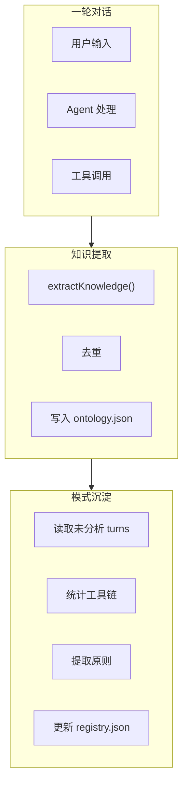

# H42：知识提取与模式沉淀

## 小林的旅行规划，Agent 如何从对话中学习

上一章讲了 CognitiveManager 的生命周期钩子。本章回答：**Agent 如何从对话中提取知识？如何沉淀经验模式？**

## 概念阶梯：知识提取不是“记录原话”

| 特性 | 知识提取 | 记录原话 |
| --- | --- | --- |
| 输入 | 对话历史 + 工具调用 | 原始文本 |
| 输出 | 结构化实体、关系、事实 | 非结构化文本 |
| 更新方式 | LLM 分析后自动提取 | 直接保存 |
| 去重 | 自动去重 | 无 |
| 典型用途 | 构建知识图谱 | 对话记录 |

## 第一段源码：`extractKnowledge` — 知识提取

打开 [packages/core/src/lib/integrations/pi-agent/cognitive/knowledge-provider.ts](../../../../packages/core/src/lib/integrations/pi-agent/cognitive/knowledge-provider.ts) 第 86—109 行：

```ts
async sync_turn(data: TurnCognitiveData): Promise<void> {
  const extracted = this.extractKnowledge(data);
  if (extracted.entities.length === 0 && extracted.facts.length === 0) return;

  // 1. 写入统一本体
  for (const ent of extracted.entities) {
    const existing = this.ontology.entities.find(
      e => e.name === ent.name && e.type === ent.type
    );
    if (!existing) {
      this.ontology.createEntity(ent.type, ent.name, ent.attributes);
    }
  }
  this.saveOntology();

  // 2. 更新衍生 wiki 页面
  this.writeWikiPages(extracted);
  this.updateIndex(extracted);
  this.appendLog(data.turnNumber, extracted);

  // 3. 更新 Frozen Snapshot
  this.exportSnapshot();
}
```

知识提取流程：

1. **提取实体和事实**：从对话中提取结构化知识。
2. **去重**：检查是否已存在同名同类型实体。
3. **持久化**：保存到 `ontology.json`。
4. **更新衍生视图**：wiki、索引、日志。

## 第二段源码：`UnifiedOntology` — 统一本体

打开 [packages/core/src/lib/integrations/pi-agent/cognitive/unified-ontology.ts](../../../../packages/core/src/lib/integrations/pi-agent/cognitive/unified-ontology.ts) 第 117—193 行：

```ts
export class UnifiedOntology {
  id: string;
  projectId: string;
  name: string;
  entities: Entity[];
  relations: Relation[];
  rules: Rule[];
  typeSchemas: Record<string, TypeSchema>;

  createEntity(type: string, name: string, attributes: Partial<Record<string, unknown>> = {}): Entity {
    const schema = this.typeSchemas[type];
    const now = Date.now();
    const id = `entity-${this.nextEntitySeq++}`;

    const attrs: Attribute[] = [];
    if (schema) {
      for (const as of schema.attributes) {
        const val = attributes[as.key];
        if (as.required && val === undefined) {
          throw new Error(`Missing required attribute '${as.key}' for type '${type}'`);
        }
        if (val !== undefined) {
          attrs.push({ key: as.key, value: val, type: as.type, required: as.required, description: as.description });
        }
      }
    } else {
      for (const [key, val] of Object.entries(attributes)) {
        attrs.push({ key, value: val, type: inferType(val) });
      }
    }

    const entity: Entity = { id, type, name, attributes: attrs, createdAt: now, updatedAt: now };
    this.entities.push(entity);
    this.updatedAt = now;
    return entity;
  }
```

`UnifiedOntology` 设计：

1. **Entity**：具有类型、名称、属性的实体。
2. **Relation**：实体之间的关系。
3. **Rule**：业务约束和规则。
4. **TypeSchema**：定义实体类型的属性约束。

## 第三段源码：模式沉淀 — `on_session_end`

打开 [packages/core/src/lib/integrations/pi-agent/cognitive/pattern-provider.ts](../../../../packages/core/src/lib/integrations/pi-agent/cognitive/pattern-provider.ts) 第 160—200 行：

```ts
async on_session_end(_messages: unknown[]): Promise<void> {
  const registry = this.readRegistry();
  const lastAnalyzed = registry.lastAnalyzedTurn;

  // 读取最近未分析的 turn 文件
  const turnFiles = this.listTurnFiles();
  const recentTurns = turnFiles
    .map(f => {
      const match = f.match(/turn-(\d+)\.json/);
      return match?.[1] ? { num: parseInt(match[1]), file: f } : null;
    })
    .filter(Boolean)
    .filter(t => t!.num > lastAnalyzed)
    .sort((a, b) => a!.num - b!.num);

  if (recentTurns.length === 0) return;

  // 收集每个工具链的统计 + 最佳 thinking 样本
  const chainStats = new Map<string, {
    count: number; resolved: number; totalLength: number;
    lastScene: string; bestThinking: string;
  }>();

  for (const turn of recentTurns) {
    const turnPath = path.join(this.turnsDir, turn!.file);
    try {
      const turnData: TurnCognitiveData = JSON.parse(readFileSync(turnPath, 'utf-8'));
      const chainKey = turnData.toolCalls.map(t => t.name).join(' → ');
      if (!chainKey) continue;

      const stats = chainStats.get(chainKey) ?? {
        count: 0, resolved: 0, totalLength: 0,
        lastScene: '', bestThinking: '',
      };
      stats.count++;
      if (turnData.outcome.resolved) stats.resolved++;
      stats.totalLength += turnData.toolCalls.length;
      stats.lastScene = turnData.userMessage.slice(0, 100);
      if (turnData.assistantThinking.length > stats.bestThinking.length) {
        stats.bestThinking = turnData.assistantThinking;
      }
    } catch {
      // ignore
    }
  }

  // ... 更新模式注册表
}
```

模式沉淀流程：

1. **读取未分析的 turns**：按 `turnNumber` 排序。
2. **统计工具链**：收集每个工具链的使用次数、成功率。
3. **提取最佳 thinking**：保留最长的 thinking 作为原则提炼素材。
4. **更新模式注册表**：生成新的 `PatternEntry`。

## 图解：知识提取与模式沉淀



## 失败路径与边界

### 边界 1：知识提取依赖 LLM，可能不准确

`extractKnowledge` 是启发式的，依赖 LLM 分析。这意味着：**提取的知识可能有误。**

### 边界 2：模式沉淀只分析长度 ≤ 3 的工具链

```ts
} else if (currentChain.length <= 3) {
```

长工具链不被分析。这意味着：**复杂模式可能遗漏。**

### 边界 3：`on_session_end` 可能耗时很长

`on_session_end` 涉及文件读取、LLM 分析等操作。这意味着：**会话结束后可能需要等待很长时间。**

## 测试证据与缺口

### 测试缺口

- 没有针对 `extractKnowledge` 准确性的测试。
- 没有针对模式沉淀效果的测试。
- 没有针对 `on_session_end` 耗时的测试。

## 口头验收

不看源码，你能解释：

1. 知识提取的流程是什么？
2. `UnifiedOntology` 包含哪些核心概念？
3. 模式沉淀的流程是什么？
4. 模式沉淀的局限性是什么？

## 章节收束

本章讲解了知识提取与模式沉淀的流程。下一章（H43）会进入 Frozen Snapshot 模式。
