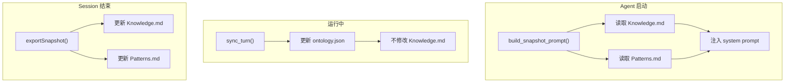

# H43：Frozen Snapshot 模式

## 小林的旅行规划，Agent 启动时如何加载记忆

上一章讲了知识提取与模式沉淀。本章回答：**Frozen Snapshot 模式是什么？为什么 Agent 启动时需要加载快照？**

## 概念阶梯：Frozen Snapshot 不是“实时数据”

| 特性 | Frozen Snapshot | 实时数据 |
| --- | --- | --- |
| 更新时机 | 周期性（session_end / 每 N 轮） | 实时 |
| 一致性 | 启动时固定，运行中不变 | 随时变化 |
| 用途 | LLM prefix cache 稳定 | 最新状态 |
| 存储 | `Knowledge.md`、`Patterns.md` | `ontology.json`、`registry.json` |
| 典型用途 | system prompt 注入 | 运行时查询 |

## 第一段源码：`system_prompt_block` — 生成快照

打开 [packages/core/src/lib/integrations/pi-agent/cognitive/knowledge-provider.ts](../../../../packages/core/src/lib/integrations/pi-agent/cognitive/knowledge-provider.ts) 第 142—154 行：

```ts
async system_prompt_block(): Promise<string> {
  if (existsSync(this.snapshotMdPath)) {
    try {
      const content = readFileSync(this.snapshotMdPath, 'utf-8');
      if (content.trim()) {
        return `## Knowledge Base Snapshot

以下是知识库快照（Knowledge.md），包含当前认知世界的知识索引：

${content}`;
      }
    } catch {
      // ignore
    }
  }
  return '';
}
```

`system_prompt_block` 设计：

1. **读取快照文件**：`Knowledge.md`。
2. **返回格式化字符串**：注入 system prompt。
3. **容错处理**：文件不存在或为空时返回空字符串。

## 第二段源码：`build_snapshot_prompt` — 构建完整快照

打开 [packages/core/src/lib/integrations/pi-agent/cognitive/manager.ts](../../../../packages/core/src/lib/integrations/pi-agent/cognitive/manager.ts) 第 66—78 行：

```ts
/** 构建 Frozen Snapshot：启动时加载所有 Provider 的快照到 system prompt */
async build_snapshot_prompt(): Promise<string> {
  const blocks: string[] = [];
  for (const [, provider] of this.providers) {
    try {
      const block = await provider.system_prompt_block();
      if (block) blocks.push(block);
    } catch (e) {
      console.error(`[CognitiveManager] ${provider.name} system_prompt_block error:`, e);
    }
  }
  return blocks.join('\n\n');
}
```

`build_snapshot_prompt` 设计：

1. **遍历所有 Provider**：收集每个 Provider 的快照。
2. **拼接输出**：按 `\n\n` 分隔。
3. **容错处理**：单个 Provider 失败不影响整体。

## 第三段源码：`exportSnapshot` — 导出快照

```ts
// KnowledgeProvider 中的导出方法
async exportSnapshot(): Promise<void> {
  const lines: string[] = [];
  
  // 导出实体
  for (const entity of this.ontology.entities) {
    lines.push(`- **${entity.name}** (${entity.type})`);
    for (const attr of entity.attributes) {
      lines.push(`  - ${attr.key}: ${attr.value}`);
    }
  }
  
  // 导出关系
  for (const relation of this.ontology.relations) {
    lines.push(`- ${relation.sourceId} --[${relation.type}]--> ${relation.targetId}`);
  }
  
  writeFileSync(this.snapshotMdPath, lines.join('\n'), 'utf-8');
}
```

`exportSnapshot` 设计：

1. **格式化实体**：名称、类型、属性。
2. **格式化关系**：源实体 → 关系类型 → 目标实体。
3. **写入文件**：`Knowledge.md`。

## 图解：Frozen Snapshot 生命周期



## Frozen Snapshot 的优势

1. **LLM prefix cache 稳定**：启动后 system prompt 不变，缓存命中率高。
2. **减少磁盘 I/O**：运行时只读内存，不读文件。
3. **简化并发控制**：快照是只读的，无需锁。

## 失败路径与边界

### 边界 1：快照可能过时

快照在 session_end 时更新，运行中不更新。这意味着：**Agent 可能使用旧知识。**

### 边界 2：快照文件可能损坏

```ts
try {
  const content = readFileSync(this.snapshotMdPath, 'utf-8');
} catch {
  // ignore
}
```

如果文件损坏，返回空字符串。这意味着：**Agent 启动时可能缺少知识。**

### 边界 3：快照大小可能超出 token 预算

快照包含所有知识，可能很大。这意味着：**需要控制快照大小，防止超出 LLM token 限制。**

## 测试证据与缺口

### 测试缺口

- 没有针对快照文件损坏的测试。
- 没有针对快照大小控制的测试。
- 没有针对快照更新频率的测试。

## 口头验收

不看源码，你能解释：

1. Frozen Snapshot 模式是什么？
2. 为什么使用 Frozen Snapshot？
3. 快照在什么时候更新？
4. Frozen Snapshot 的局限性是什么？

## 章节收束

本章讲解了 Frozen Snapshot 模式：启动时加载快照、运行中只读、session_end 时更新。下一章（H44）会进入 Sleep-time Compute。
