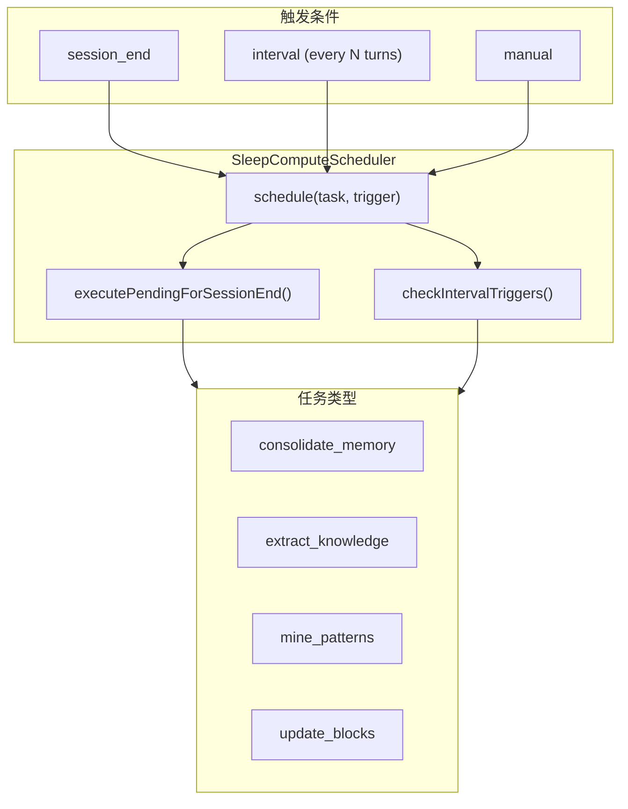

# H44：Sleep-time Compute

## 小林的旅行规划，Agent 空闲时做什么

上一章讲了 Frozen Snapshot 模式。本章回答：**Agent 空闲时如何执行重量级计算？Sleep-time Compute 如何调度？**

## 概念阶梯：Sleep-time Compute 不是“后台任务”

| 特性 | Sleep-time Compute | 后台任务 |
| --- | --- | --- |
| 触发时机 | session_end / interval / manual | 定时触发 |
| 执行内容 | 记忆整理、知识提取、模式沉淀 | 任意任务 |
| 优先级 | 低（不阻塞主流程） | 可配置 |
| 资源占用 | 可接受高资源占用 | 通常限制资源 |
| 失败处理 | 记录日志，不影响主流程 | 可能重试 |

## 第一段源码：`SleepComputeScheduler` — 睡眠计算调度器

打开 [packages/core/src/lib/integrations/pi-agent/cognitive/sleep-compute.ts](../../../../packages/core/src/lib/integrations/pi-agent/cognitive/sleep-compute.ts) 第 20—42 行：

```ts
export class SleepComputeScheduler {
  private pendingTasks: Map<string, SleepTaskEntry> = new Map();
  private turnCounter = 0;
  private idCounter = 0;

  /**
   * 调度一个睡眠计算任务。
   */
  schedule(task: SleepTask, trigger: SleepTrigger): string {
    const id = `sleep-${++this.idCounter}`;
    this.pendingTasks.set(id, {
      id,
      task,
      trigger,
      scheduledAt: Date.now(),
    });
    return id;
  }

  /**
   * 取消已调度的任务。
   */
  cancel(taskId: string): boolean {
    return this.pendingTasks.delete(taskId);
  }
```

`SleepComputeScheduler` 设计：

1. **`pendingTasks`**：待执行的任务队列。
2. **`schedule`**：添加任务到队列。
3. **`cancel`**：取消任务。
4. **`turnCounter`**：记录当前 turn 数，用于 interval 触发。

## 第二段源码：触发类型

```ts
export type SleepTrigger =
  | { type: 'session_end' }
  | { type: 'interval'; everyNTurns: number }
  | { type: 'manual' };
```

触发类型：

1. **`session_end`**：会话结束时触发。
2. **`interval`**：每 N 轮触发。
3. **`manual`**：手动触发。

## 第三段源码：执行任务

```ts
/**
 * 执行并移除所有 session_end 任务。
 */
executePendingForSessionEnd(): SleepTaskEntry[] {
  const toExecute = this.getPendingTasks();
  if (toExecute.length === 0) return [];

  // 清除所有已调度的任务（session_end 时全部执行）
  for (const entry of toExecute) {
    this.pendingTasks.delete(entry.id);
  }

  return toExecute;
}

/**
 * 检查是否因 interval 触发需要调度新任务。
 */
checkIntervalTriggers(currentTurn?: number): boolean {
  if (currentTurn !== undefined) {
    this.turnCounter = currentTurn;
  } else {
    this.turnCounter++;
  }

  const triggered = this.getPendingTasks().filter(e => {
    if (e.trigger.type !== 'interval') return false;
    return this.turnCounter % e.trigger.everyNTurns === 0;
  });

  return triggered.length > 0;
}
```

执行设计：

1. **`executePendingForSessionEnd`**：执行所有待处理任务。
2. **`checkIntervalTriggers`**：检查 interval 触发条件。
3. **`turnCounter`**：用于计算 interval 触发。

## 第四段源码：创建任务

```ts
/** 创建记忆整合任务 */
export function createConsolidateTask(turnFrom: number, turnTo: number): SleepTask {
  return {
    type: 'consolidate_memory',
    payload: { turnRange: [turnFrom, turnTo] },
  };
}

/** 创建知识提取任务 */
export function createKnowledgeTask(source: 'turns' | 'documents' = 'turns'): SleepTask {
  return {
    type: 'extract_knowledge',
    payload: { source },
  };
}

/** 创建模式挖掘任务 */
export function createPatternTask(lookback = 10): SleepTask {
  return {
    type: 'mine_patterns',
    payload: { lookback },
  };
}

/** 创建 block 更新任务 */
export function createUpdateBlockTask(blockNames: string[]): SleepTask {
  return {
    type: 'update_blocks',
    payload: { blockNames },
  };
}
```

任务类型：

1. **`consolidate_memory`**：记忆整合。
2. **`extract_knowledge`**：知识提取。
3. **`mine_patterns`**：模式挖掘。
4. **`update_blocks`**：Block 更新。

## 图解：Sleep-time Compute 调度



## 失败路径与边界

### 边界 1：任务队列可能无限增长

```ts
private pendingTasks: Map<string, SleepTaskEntry> = new Map();
```

没有限制队列大小。这意味着：**如果任务产生速度大于执行速度，内存可能耗尽。**

### 边界 2：`executePendingForSessionEnd` 执行所有任务

```ts
const toExecute = this.getPendingTasks();
```

不区分任务类型，全部执行。这意味着：**重量级任务可能阻塞轻量级任务。**

### 边界 3：interval 触发可能跳过

```ts
return this.turnCounter % e.trigger.everyNTurns === 0;
```

如果 `turnCounter` 不是连续递增的，可能跳过某些触发。这意味着：**interval 任务可能不按时执行。**

## 测试证据与缺口

### 测试缺口

- 没有针对任务队列大小限制的测试。
- 没有针对 interval 触发跳过的测试。
- 没有针对任务执行顺序的测试。

## 口头验收

不看源码，你能解释：

1. Sleep-time Compute 的三种触发类型是什么？
2. `SleepComputeScheduler` 如何管理任务？
3. 四种任务类型分别是什么？
4. Sleep-time Compute 的局限性是什么？

## 章节收束

本章讲解了 Sleep-time Compute 的设计：任务调度、触发类型、任务类型。下一章（H45）会进入多 Agent 协作中的记忆共享。
