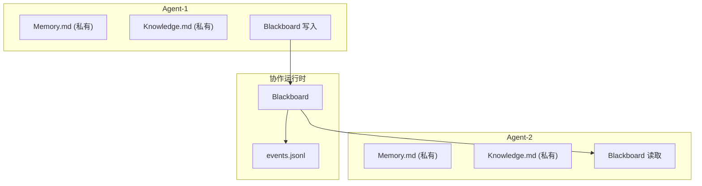

# H45：多 Agent 协作中的记忆共享

## 小林的旅行规划，多个 Agent 如何共享知识

上一章讲了 Sleep-time Compute。本章回答：**多 Agent 协作时，记忆如何共享？每个 Agent 有自己的记忆吗？**

## 概念阶梯：记忆共享不是“共享数据库”

| 特性 | 多 Agent 记忆共享 | 共享数据库 |
| --- | --- | --- |
| 隔离性 | 每个 Agent 有自己的记忆目录 | 共享表空间 |
| 共享方式 | Blackboard（协作运行时） | 直接读写 |
| 一致性 | 最终一致性 | 强一致性 |
| 权限控制 | 按 Agent 隔离 | 按角色隔离 |
| 典型用途 | 协作任务中的信息传递 | 集中式数据存储 |

## 第一段源码：Blackboard — 共享黑板

打开 [packages/core/src/modules/collaboration-runtime/session/blackboard.ts](../../../../packages/core/src/modules/collaboration-runtime/session/blackboard.ts)（已在 H22 精读）：

```ts
export class Blackboard {
  private entries = new Map<string, BlackboardEntry>();

  write(key: string, value: unknown, provenance: Provenance): void {
    this.entries.set(key, {
      key,
      value,
      provenance,
      timestamp: Date.now(),
    });
  }

  read(key: string): unknown | undefined {
    return this.entries.get(key)?.value;
  }
}
```

Blackboard 设计：

1. **键值对存储**：`key → value`。
2. **来源追踪**：`provenance` 记录写入者。
3. **时间戳**：记录写入时间。

## 第二段源码：Agent 工作目录隔离

```
data/
├── agents/
│   ├── agent-1/
│   │   ├── Memory.md
│   │   ├── Knowledge.md
│   │   └── patterns/
│   └── agent-2/
│       ├── Memory.md
│       ├── Knowledge.md
│       └── patterns/
└── collaboration-sessions/
    └── session-1/
        ├── events.jsonl
        └── blackboard.json
```

目录结构：

1. **每个 Agent 有自己的记忆目录**：`data/agents/{agentId}/`。
2. **协作 session 有共享 Blackboard**：`data/collaboration-sessions/{sessionId}/`。
3. **隔离与共享并存**：私有记忆 + 共享黑板。

## 第三段源码：协作运行时中的记忆传递

```ts
// Agent 子进程通过 stdio 协议上报事件
{
  "type": "event",
  "event": {
    "type": "blackboard_write",
    "key": "travel_plan",
    "value": { /* ... */ },
    "provenance": {
      "agentId": "agent-1",
      "turnNumber": 5
    }
  }
}
```

记忆传递：

1. **Agent 写入 Blackboard**：通过 stdio 协议上报。
2. **Runtime 广播**：其他 Agent 可以读取。
3. **持久化**：写入 `blackboard.json`。

## 图解：多 Agent 记忆架构



## 记忆共享的三种模式

### 模式 1：Blackboard 共享

- **适用场景**：临时数据、中间结果。
- **生命周期**：协作 session 结束。
- **示例**：Agent-1 生成的旅行计划，Agent-2 读取执行。

### 模式 2：Memory Core 注入

- **适用场景**：长期记忆、用户偏好。
- **生命周期**：跨 session 持久。
- **示例**：Agent-1 记录的用户偏好，Agent-2 启动时加载。

### 模式 3：Knowledge Provider 合并

- **适用场景**：知识库、经验模式。
- **生命周期**：持久化到磁盘。
- **示例**：Agent-1 提取的知识，合并到项目知识库。

## 失败路径与边界

### 边界 1：Blackboard 没有访问控制

任何 Agent 都可以读写 Blackboard。这意味着：**Agent 可能覆盖其他 Agent 的数据。**

### 边界 2：Memory Core 不自动同步

每个 Agent 有自己的 `Memory.md`。这意味着：**Agent 之间的 Core Memory 不同步。**

### 边界 3：Knowledge Provider 合并可能冲突

```ts
const existing = this.ontology.entities.find(
  e => e.name === ent.name && e.type === ent.type
);
if (!existing) {
  this.ontology.createEntity(ent.type, ent.name, ent.attributes);
}
```

同名实体可能冲突。这意味着：**知识合并时可能丢失信息。**

## 测试证据与缺口

### 测试缺口

- 没有针对 Blackboard 并发读写的测试。
- 没有针对 Memory Core 同步的测试。
- 没有针对 Knowledge Provider 合并冲突的测试。

## 口头验收

不看源码，你能解释：

1. 多 Agent 协作中的记忆共享方式有哪些？
2. Blackboard 的作用是什么？
3. Memory Core 为什么不自动同步？
4. 知识合并时可能遇到什么问题？

## 章节收束

本章讲解了多 Agent 协作中的记忆共享：Blackboard、Memory Core、Knowledge Provider。下一章（H46）会进入认知系统的测试与验证。
