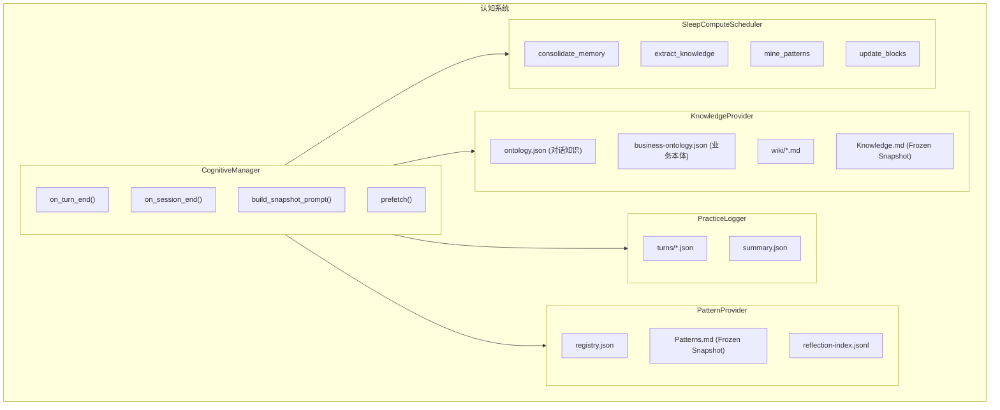

# H47：单元小结课 —— 认知系统

## 本单元回顾

Unit 7（H40-H46）从认知系统全景讲起，到测试验证结束。让我们回顾核心概念。

## 层次图：认知系统架构



## 核心概念对照表

### 认知系统三大组件

| 组件 | 职责 | 存储 | 更新时机 |
| --- | --- | --- | --- |
| **KnowledgeProvider** | 知识提取、本体管理 | `ontology.json`, `wiki/*.md` | `sync_turn`, `on_session_end` |
| **PracticeLogger** | 实践日志记录 | `turns/*.json`, `summary.json` | `sync_turn` |
| **PatternProvider** | 经验模式提取 | `registry.json`, `Patterns.md` | `sync_turn`, `on_session_end` |

### CognitiveManager 生命周期钩子

| 钩子 | 触发时机 | 用途 | 异步 |
| --- | --- | --- | --- |
| `on_turn_end` | 每轮对话后 | 同步数据到 Provider | 是 |
| `on_session_end` | 会话结束时 | 批量分析、知识提取 | 是 |
| `build_snapshot_prompt` | Agent 启动时 | 构建 Frozen Snapshot | 是 |
| `prefetch` | 需要上下文时 | 召回相关知识 | 是 |

### Frozen Snapshot

| 特性 | 说明 |
| --- | --- |
| 更新时机 | `session_end` / 每 N 轮 |
| 用途 | LLM prefix cache 稳定 |
| 存储 | `Knowledge.md`, `Patterns.md` |
| 运行时 | 只读，不修改 |

### Sleep-time Compute

| 任务类型 | 用途 |
| --- | --- |
| `consolidate_memory` | 记忆整合 |
| `extract_knowledge` | 知识提取 |
| `mine_patterns` | 模式挖掘 |
| `update_blocks` | Block 更新 |

## 正向追踪：从对话到认知进化

```
用户发送消息
  → Agent 处理
    → CognitiveManager.on_turn_end()
      → KnowledgeProvider.sync_turn()
        → extractKnowledge()
        → 去重
        → 写入 ontology.json
        → 更新 wiki/*.md
        → 更新 Knowledge.md (Frozen Snapshot)
      → PracticeLogger.sync_turn()
        → 写入 turns/turn-{N}.json
        → 更新 summary.json
      → PatternProvider.sync_turn()
        → 记录工具链
        → 更新 registry.json
        → 更新 Patterns.md (Frozen Snapshot)
    → 用户关闭会话
      → CognitiveManager.on_session_end()
        → SleepComputeScheduler.executePendingForSessionEnd()
          → 执行 consolidate_memory
          → 执行 extract_knowledge
          → 执行 mine_patterns
          → 执行 update_blocks
```

## 反向诊断：从症状定位责任层

| 症状 | 可能的责任层 | 排查方向 |
| --- | --- | --- |
| 知识提取不准确 | `KnowledgeProvider.extractKnowledge` | 检查 LLM 响应 |
| 模式未更新 | `PatternProvider.on_session_end` | 检查 `registry.json` |
| 日志未记录 | `PracticeLogger.sync_turn` | 检查 `turns/` 目录 |
| 快照未更新 | `exportSnapshot` | 检查 `Knowledge.md` |
| 睡眠任务未执行 | `SleepComputeScheduler` | 检查任务队列 |

## 源码覆盖台账（Unit 7）

| 文件路径 | 状态 | 主讲章节 | 关键代码窗口 |
| --- | --- | --- | --- |
| `cognitive/manager.ts` | 精读 | H41 | `CognitiveManager`, `on_turn_end`, `on_session_end` |
| `cognitive/knowledge-provider.ts` | 精读 | H42 | `KnowledgeProvider`, `sync_turn`, `extractKnowledge` |
| `cognitive/pattern-provider.ts` | 精读 | H42 | `PatternProvider`, `sync_turn`, `on_session_end` |
| `cognitive/practice-logger.ts` | 精读 | H40 | `PracticeLogger`, `sync_turn` |
| `cognitive/unified-ontology.ts` | 精读 | H42 | `UnifiedOntology`, `createEntity` |
| `cognitive/sleep-compute.ts` | 精读 | H44 | `SleepComputeScheduler`, `schedule`, `executePendingForSessionEnd` |
| `cognitive/types.ts` | 背景引用 | H40 | `TurnCognitiveData`, `CognitiveProvider` |
| `cognitive/__tests__/*.test.ts` | 背景引用 | H46 | 测试用例 |

## 口头验收

不看源码，你能解释：

1. 认知系统的三大组件是什么？
2. `CognitiveManager` 的生命周期钩子有哪些？
3. Frozen Snapshot 模式是什么？
4. Sleep-time Compute 的任务类型有哪些？
5. 多 Agent 协作中的记忆共享方式有哪些？

## 下一单元预告

Unit 8（H48-H55）将深入其他 Core Modules：

- Neural Channel 神经通道
- Scheduler 调度器
- View Manager 视图管理
- View Reconciler 视图协调

核心问题：**OriginOS 的其他 Core Modules 如何协同工作？**
