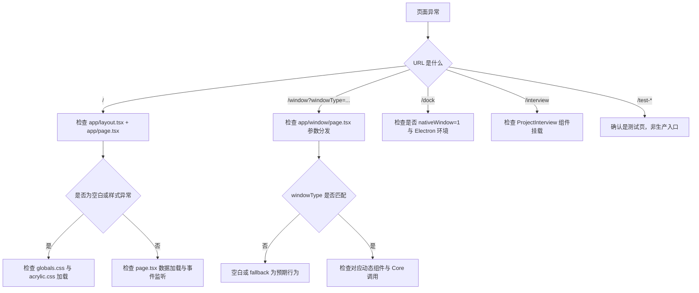

# 单元总览与复盘一：App Router 与页面入口（I01—I06）

小林在浏览器地址栏输入 `http://localhost:3000`，屏幕上出现了一个深色桌面：顶部菜单栏、项目卡片、应用启动器、底部 Dock。点击“创建项目”后，一个访谈窗口弹了出来；点击某个 Skill，又弹出一个对话窗口。第二天，小林直接打开 `/window?windowType=skill&skillName=trip-planner`，发现页面也能单独渲染一个 Skill 对话框。

从用户视角看，这都是“打开页面”。但从 Next.js App Router 的视角看，这些请求经过了不同的路由文件、不同的渲染策略、不同的组件挂载方式，有些只在 Electron 里以独立窗口运行，有些只在开发测试时使用。

本单元小结要解决一个问题：读者如何把这些入口放进同一张地图，并在看到空白页、路由不匹配或窗口渲染异常时，知道应该检查哪一层。

## 0. 本页先读什么

如果只记住一句话，记住这一句：

> OriginOS 的“桌面”不是一个页面，而是一组由 Next.js App Router 按约定路由的入口集合。

这句话拆开看，有三层含义：

1. `app/page.tsx` 渲染的是主桌面，但 `/window`、`/dock`、`/interview` 也是合法入口。
2. 同一个窗口内容可能以“主页内弹窗”或“独立 /window 页面”两种形态出现。
3. 页面只负责挂载组件，真正状态管理和副作用在 Part J 的组件层与 Part E/F/G 的 Core 层。

阅读本页可以按下面的顺序：

| 阅读阶段 | 重点问题 | 对应章节 |
| --- | --- | --- |
| 建立总图 | 一个 URL 如何决定渲染哪个文件？ | 第 1 节 |
| 主页责任 | `page.tsx` 为什么这么大，它管什么、不管什么？ | 第 2 节 |
| 特殊入口 | Dock、Interview、测试页分别承担什么职责？ | 第 3、4 节 |
| 窗口路由 | `/window` 如何用 query 参数分发多种窗口类型？ | 第 5 节 |
| 复盘整合 | 所有入口如何连成一张排查地图？ | 第 6 节 |

## 1. 同一套系统有多个入口

初学者容易把 OriginOS 理解成“一个单页应用”：打开就是 `page.tsx`，所有窗口都是这个页面里的弹窗。实际上它更接近“一个桌面操作系统”：有主桌面、有独立 Dock、有独立窗口页、有测试页，还有只在 Electron 里使用的透明窗口。

| URL 路径 | 对应文件 | 典型使用场景 | 是否依赖主页 |
| --- | --- | --- | --- |
| `/` | `app/page.tsx` + `app/layout.tsx` | 浏览器中打开 OriginOS 主桌面 | 否 |
| `/desktop` | `app/desktop/page.tsx` | 测试 OS.1 Desktop 组件 | 否（测试页） |
| `/dock?nativeWindow=1` | `app/dock/page.tsx` + `app/dock/layout.tsx` | Electron 中作为独立 Dock 窗口 | 否 |
| `/interview` | `app/interview/page.tsx` | 旧版访谈全页入口 | 否 |
| `/test-interview` | `app/test-interview/page.tsx` | 开发调试 InterviewWindow | 否（测试页） |
| `/test-window` | `app/test-window/page.tsx` | 开发调试窗口系统 | 否（测试页） |
| `/window?windowType=...` | `app/window/page.tsx` | 独立窗口渲染 skill/workspace/interview/agent/solution/collaboration/sandbox | 否 |

这张表的关键不是路径名，而是“每个路径都可能是独立入口”。例如 Skill 对话框既可以在主页通过 `AppWindowManager` 打开成“主页内窗口”，也可以在 Electron 中作为独立 `/window?windowType=skill` 进程打开。两种路径最终挂载的是同一个 `SkillDialog` 组件，但路由责任完全不同。

## 2. 主桌面不是全部，但它是最复杂的入口

`app/page.tsx` 承担了三件事：

1. **数据加载**：项目列表、用户 Agent、用户 Skill、用户配置。
2. **事件桥接**：监听 Dock 动作、原生窗口关闭、IPC 通知、BroadcastChannel。
3. **窗口调度**：根据用户动作调用 `AppWindowManager` 打开不同类型的窗口。

但它不直接管理：

- 窗口的拖拽/缩放/焦点（那是 `AppWindowManager` 和 `AppWindowContainer` 的职责，Part J）。
- Agent 运行时或会话存储（那是 Core 的 `agentSessionService`，Part E）。
- 项目、访谈、本体的业务逻辑（那是 Part G）。

所以读 `page.tsx` 时，重点不是逐行读懂 1500 行 JSX，而是识别出“数据 → 事件 → 窗口调度”三条主线，并知道哪些调用会进入 Core、哪些调用留在 UI 层。

## 3. 三个最容易混淆的入口概念

### 3.1 页面入口 vs 窗口组件

| 概念 | 负责什么 | 典型文件 | 常见误解 |
| --- | --- | --- | --- |
| 页面入口 | URL 到组件的挂载点 | `app/page.tsx`、`app/window/page.tsx` | 页面越复杂，业务逻辑就越多 |
| 窗口组件 | 窗口内部的内容与交互 | `SkillDialog`、`InterviewWindow`、`WorkspaceWindow` | 窗口组件只能在主页内使用 |
| 窗口管理器 | 窗口的位置、大小、层级、生命周期 | `AppWindowManager`、`appWindowStore` | 窗口管理器负责渲染窗口内容 |

`app/window/page.tsx` 是最能说明这组关系的文件：它本身只有 130 行，几乎全是 `dynamic` 导入和 query 参数分发。真正的内容组件在 `components/` 下。

### 3.2 主页内窗口 vs 独立窗口页

| 形态 | 触发方式 | URL 是否变化 | 使用场景 |
| --- | --- | --- | --- |
| 主页内窗口 | `AppWindowManager.openComponentWindow` | 不变 | Web 模式、快速预览 |
| 独立窗口页 | Electron 打开新 BrowserWindow，加载 `/window?...` | 变 | Electron 原生多窗口 |
| 全页入口 | 直接导航到 `/interview` 或 `/desktop` | 变 | 测试、旧流程、独立体验 |

在 Electron 里，Dock 动作常常通过 IPC 从 Dock 窗口传回主进程，主进程再打开新的 BrowserWindow 加载 `/window?...`。这个链路的 Web 侧终点就是 `app/window/page.tsx`。

### 3.3 生产入口 vs 测试入口

| 类型 | 文件 | 是否应在生产环境暴露 | 如何识别 |
| --- | --- | --- | --- |
| 生产入口 | `page.tsx`、`window/page.tsx`、`dock/page.tsx` | 是 | 有真实业务语义 |
| 开发测试入口 | `desktop/page.tsx`、`test-interview/page.tsx`、`test-window/page.tsx` | 否 | 文件名或注释含 test/demo |

`test-window/page.tsx` 内部甚至硬编码了测试组件和示例 URL。这类页面不应被当作系统主入口理解。

## 4. 六节课连成一条因果链

I01—I06 不是六个孤立文件介绍。它们按“从 URL 到组件挂载”的顺序，逐步补全判断能力。

| 课次 | 本课解决的判断问题 | 核心源码锚点 | 学完后的判断能力 |
| --- | --- | --- | --- |
| I01 | 根布局和主页如何组织全局样式与页面结构 | `app/layout.tsx`、`app/page.tsx` 的导入与返回结构 | 能区分 layout、page、globals.css 的职责 |
| I02 | 主页如何加载数据并打开窗口 | `app/page.tsx` 中的 `useProjects`、事件监听、窗口调度函数 | 能追踪一次点击到 `AppWindowManager` 的调用链 |
| I03 | Dock 和 Desktop 测试页为什么存在 | `app/dock/page.tsx`、`app/desktop/page.tsx` | 能识别 Electron 专用入口和测试入口 |
| I04 | Interview 和测试页如何承载流程 | `app/interview/page.tsx`、`app/test-interview/page.tsx` | 能区分全页流程与窗口组件 |
| I05 | `/window` 怎样用 query 参数分发多种窗口 | `app/window/page.tsx`、`app/window/CollaborationWindow.tsx` | 能根据 URL 预测渲染的组件 |
| I06 | 如何不依赖运行环境验证入口地图 | 复用上述文件 | 能根据 URL、query、组件责任判断渲染结果 |

这条链的停止边界也要清楚。I01—I06 还没有详细讲 Next.js Route Handler、API 请求解析、Core Service 调用。那些问题进入后续 API 边界单元再展开。

当前单元先把入口地图打牢。入口清楚以后，再看 API 路由时，读者才不会把所有问题都混成“页面没出来”。

## 5. 源码覆盖台账

| 课次 | 已直接精读的生产源码 | 配对测试或验证入口 | 本单元只证明什么 |
| --- | --- | --- | --- |
| I01 | `app/layout.tsx`、`app/page.tsx` 顶层结构 | 无单元测试；以 `pnpm dev` 运行观察验证 | 页面挂载、全局样式、根布局责任 |
| I02 | `app/page.tsx` 数据加载、事件桥接、窗口调度 | 无单元测试；以运行观察和链路追踪验证 | 主页状态组织与窗口打开入口 |
| I03 | `app/dock/page.tsx`、`app/dock/layout.tsx`、`app/desktop/page.tsx` | 无单元测试 | Dock 透明窗口、IPC/BroadcastChannel 桥接、测试页 |
| I04 | `app/interview/page.tsx`、`app/test-interview/page.tsx`、`app/test-window/page.tsx` | 无单元测试 | 访谈全页入口与两个测试入口 |
| I05 | `app/window/page.tsx`、`app/window/CollaborationWindow.tsx` | 无单元测试 | query 参数分发、动态导入、协作窗口 |
| I06 | 不新增生产逻辑；复用上述入口文件 | 运行 + 纸面推演 | 将入口知识转成可验证的预测能力 |

本单元相邻但尚未精读的文件也要明说。`components/os/**`、`components/framework/**`、`store/appWindowStore.ts`、`services/AppWindowManager.ts` 属于 Part J；`lib/features/**`、`lib/integrations/**` 属于 Part E/F/G。`styles/globals.css` 和 `styles/acrylic.css` 是全局样式，本单元只说明消费关系，不展开设计系统。

这不是遗漏，而是边界管理。一个单元必须知道自己讲到哪里，也必须知道哪里还没有讲。

## 6. 异常排查：先看入口，再看组件

当小林说“页面出不来”时，最稳的排查方式不是直接跳进组件代码，而是先确认请求到达了哪个入口文件。



这张图的排查口诀：

1. 先看 URL，确认走到了哪个 `page.tsx`。
2. 再看 layout 和全局样式是否挂载。
3. 再看页面参数或事件是否传递到组件。
4. 最后才进入组件内部或 Core 逻辑。

这套顺序能避免一个常见误判：把“入口路由没走到正确文件”当成“组件有 bug”。

## 7. 纸面复盘实验

下面这个实验不需要运行项目。目标是根据 URL 和 query 参数，预测系统会渲染什么、不会渲染什么。

```text
URL A: /
URL B: /window?windowType=skill&skillName=trip-planner&title=旅行助手
URL C: /dock?nativeWindow=1
URL D: /interview
URL E: /test-window
```

合格推演应包含下面判断：

| URL | 应渲染的页面/组件 | 不应出现的元素 | 关键判断依据 |
| --- | --- | --- | --- |
| A | `OSHomePage`（主桌面） | 单独的 SkillDialog 全屏 | `page.tsx` 返回完整桌面布局 |
| B | `SkillDialog`（全屏/窗口） | 主桌面项目列表 | `window/page.tsx` 按 `windowType=skill` 分发 |
| C | `Dock`（透明叠加层） | 主桌面内容 | `dock/page.tsx` 专为 Dock 窗口设计 |
| D | `ProjectInterview`（全页） | 主页窗口管理器 | `interview/page.tsx` 直接挂载访谈组件 |
| E | 窗口系统测试界面 | 真实业务数据 | `test-window/page.tsx` 是开发测试入口 |

如果能把“渲染什么”和“不渲染什么”同时说清楚，就说明本单元的入口地图已经建立。

## 8. 测试证据的读法

本单元没有直接配对单元测试。能提供的证据是运行观察与链路追踪：

| 验证方式 | 已经证明 | 没有证明 |
| --- | --- | --- |
| `pnpm dev` 后访问 `/` | 主桌面能渲染 | 生产构建后行为一致 |
| `pnpm dev` 后访问 `/window?windowType=skill&skillName=...` | 对应组件能独立挂载 | Electron 独立窗口打开时行为一致 |
| 阅读 `app/dock/page.tsx` 的 IPC/BroadcastChannel 分支 | Dock 动作有双路径桥接 | 真实 Electron 进程间通信已通过 |
| 阅读 `app/window/page.tsx` 的 `windowType` 分发 | query 参数决定组件 | 未知 windowType 有错误处理 |

读这类“无测试”的入口代码时，保持三个问题：

1. Given：什么 URL / 什么环境会到达这个文件？
2. When：文件内部做了什么分发或桥接？
3. Then：最终挂载哪个组件，遗漏了什么分支？

## 9. 口头验收

学完 I01—I06 后，不看正文也应能回答下面六个问题：

1. `app/layout.tsx` 和 `app/page.tsx` 分别承担什么责任？
2. 主页 `page.tsx` 为什么把数据加载、事件监听、窗口调度放在一起，却不直接管理窗口动画？
3. `/dock?nativeWindow=1` 和 `/` 在渲染目标上有什么区别？
4. `/window?windowType=skill` 与主页内弹出的 Skill 窗口，最终挂载的组件是否相同？入口责任是否相同？
5. `test-interview/page.tsx` 和 `interview/page.tsx` 为什么不能互相替代？
6. 看到空白页时，为什么要先确认 URL 和 `windowType` 参数，再检查组件内部？

合格回答不要求背诵源码行号，但必须能说出文件职责、入口边界和排查顺序。能说清“这个入口不解决什么问题”，比只说清“是什么”更重要。

## 10. 进入下一单元

I01—I06 建立的是 OriginOS Web 侧的入口地图。下一组课程会继续追踪这些页面如何向服务端发送请求：Agent 会话怎样创建、消息怎样发送、API Route Handler 怎样解析请求体并调用 Core Service。

因此，本单元的结论可以压缩成一句话：

> 先确认 URL 走到了哪个页面，再确认页面挂载了哪个组件，最后才进入组件或 Core 内部。

这句话会在后续 API 边界单元里继续使用。
