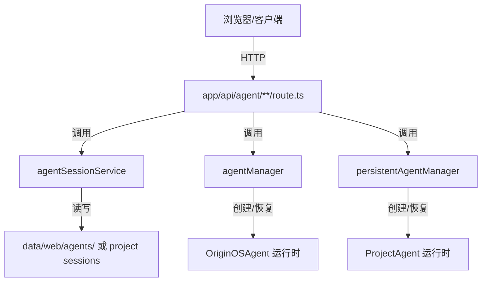

# 单元总览与复盘二：Agent 会话 API — 创建与管理（I07—I11）

小林点击“创建项目”后，主页调用 `AppWindowManager` 打开了一个访谈窗口。窗口里的 `InterviewWindow` 组件会立即调用 `POST /api/agent/sessions`，请求创建一个 Agent 会话。这个会话 ID 会贯穿后续的访谈回答、本体生成和项目初始化。

从用户视角看，这只是“窗口弹出来了”。但从系统视角看，一次 HTTP POST 跨越了浏览器到 Next.js Route Handler 的边界，Route Handler 再调用 Core 的 `agentSessionService`，把会话数据保存到本地文件系统。

本单元小结要解决一个问题：读者如何理解 Agent 会话从 HTTP 请求到 Core Service 的完整链路，并在创建失败、会话找不到、销毁不彻底时知道应该检查哪一层。

## 0. 本页先读什么

如果只记住一句话，记住这一句：

> Agent 会话 API 是 Web 边界与 Core 运行时的第一个握手点。

这句话拆开看，有三层含义：

1. Route Handler 不负责 Agent 思考，只负责把请求翻译成 Core Service 能理解的形状。
2. 同一个会话 ID 可能对应多种入口类型（skill、agent、role-agent、project）。
3. 销毁 Agent 实例和删除会话数据是两个不同操作。

阅读本页可以按下面的顺序：

| 阅读阶段 | 重点问题 | 对应章节 |
| --- | --- | --- |
| 建立总图 | 一次 POST 如何变成 Core 中的会话文件？ | 第 1、2 节 |
| 分清边界 | Route Handler、agentSessionService、agentManager 各负责什么？ | 第 3 节 |
| 识别模式 | 为什么很多路由有 runtime / in-process 双分支？ | 第 4 节 |
| 对回课程 | 五节课分别补上链路中的哪一段？ | 第 5 节 |
| 查证源码 | 哪些源码已直接讲过，哪些留到后面？ | 第 6 节 |
| 练习排查 | 创建/恢复/销毁异常时按什么顺序检查？ | 第 7—9 节 |

## 1. 会话 API 的三层结构

Agent 会话相关代码分布在三个层级：



本单元只看 B 层（Route Handler）以及它如何调用 C/D/E。C/D/E 的内部实现属于 Part E/F。

## 2. 一条 POST 请求的完整变形

以 `POST /api/agent/sessions` 为例：

```text
浏览器发送 JSON body
  → Next.js 路由匹配到 app/api/agent/sessions/route.ts
    → 校验必填字段（projectId, projectName）
    → 持久化运行时 LLM 配置
    → 合并用户配置中的 mapping
    → 如果传入 sessionId，尝试复用现有会话
    → 确保 agentBaseDir 存在
    → 调用 agentSessionService.createSession
      → 写入 data/web/agents/{sessionId}/session.json
    → 返回 201 + 会话对象
```

这条链的关键是：**Route Handler 不生成业务会话的语义，它只负责边界适配**。会话 ID、默认模型、systemPrompt 等由 `agentSessionService` 决定。

## 3. 三个最容易混淆的对象

### 3.1 Session、Agent 运行时、窗口

| 对象 | 负责什么 | 由谁创建 | 常见误解 |
| --- | --- | --- | --- |
| AgentSession | 持久化的会话数据（消息、配置、项目上下文） | agentSessionService | 会话存在等于 Agent 正在运行 |
| OriginOSAgent / ProjectAgent | 当前进程中的运行时实例 | agentManager / persistentAgentManager | 运行时销毁等于会话数据删除 |
| 窗口 | 用户可见的容器 | AppWindowManager（Part J） | 窗口关闭等于会话销毁 |

### 3.2 创建、恢复、销毁、删除

| 操作 | HTTP 方法 | 作用对象 | 持久化数据是否保留 |
| --- | --- | --- | --- |
| 创建 | POST /sessions | AgentSession | 是 |
| 恢复 | GET /sessions/{id} | AgentSession + 运行时 | 是 |
| 销毁实例 | POST /sessions/{id}/destroy 或 /destroy | Agent 运行时/子进程 | 是 |
| 删除数据 | DELETE /sessions/{id} | AgentSession 文件 | 否 |

### 3.3 Runtime 模式与 In-process 模式

很多 Agent 相关路由都有双分支：

```ts
const USE_RUNTIME_MODE = process.env['USE_COLLABORATION_RUNTIME'] === 'true';
```

| 模式 | 含义 | 典型调用 |
| --- | --- | --- |
| In-process | Agent 运行在 Next.js 进程内 | `agentManager.*`、`persistentAgentManager.*` |
| Runtime | Agent 运行在独立子进程中 | `getGlobalSpawner().*` |

这是为了支持多 Agent 协作运行时的进程隔离。本单元只要识别这个分支，具体 spawner 实现属于 Part H。

## 4. 五节课连成一条因果链

I07—I11 不是五个孤立文件介绍。它们按“从注册表到会话创建、恢复、修改、销毁”的顺序推进。

| 课次 | 本课解决的判断问题 | 核心源码锚点 | 学完后的判断能力 |
| --- | --- | --- | --- |
| I07 | runtime 子进程注册表如何避免 HMR 丢失实例 | `api/agent/_runtime-agent-registry.ts` | 能解释 globalThis 挂载的用途 |
| I08 | POST /sessions 如何创建和复用会话 | `api/agent/sessions/route.ts` | 能追踪请求体到 session.json 的变形 |
| I09 | GET /sessions 和 GET /sessions/{id} 如何恢复 | `api/agent/sessions/route.ts` 的 GET、`api/agent/sessions/[sessionId]/route.ts` 的 GET | 能区分列表、读取、恢复三种语义 |
| I10 | 如何更新、删除、销毁会话 | `api/agent/sessions/[sessionId]/route.ts` 的 PUT/DELETE、`api/agent/sessions/[sessionId]/destroy/route.ts`、`api/agent/sessions/destroy/route.ts` | 能区分删除数据与销毁实例 |
| I11 | 如何验证会话管理链路 | 复用上述文件 | 能根据状态码定位责任层 |

这条链的停止边界也要清楚。I07—I11 还没有详细讲消息发送、SSE 流式响应、项目级 Agent 的 start/stop/messages。那些问题进入 U3 再展开。

## 5. 源码覆盖台账

| 课次 | 已直接精读的生产源码 | 配对测试或验证入口 | 本单元只证明什么 |
| --- | --- | --- | --- |
| I07 | `api/agent/_runtime-agent-registry.ts` | 无单元测试 | runtime 子进程注册表的边界与生命周期 |
| I08 | `api/agent/sessions/route.ts` 的 POST | 无单元测试 | 会话创建、配置合并、目录创建、复用逻辑 |
| I09 | `api/agent/sessions/route.ts` 的 GET、`api/agent/sessions/[sessionId]/route.ts` 的 GET | 无单元测试 | 列表查询与带恢复的单条读取 |
| I10 | `api/agent/sessions/[sessionId]/route.ts` 的 PUT/DELETE、`api/agent/sessions/[sessionId]/destroy/route.ts`、`api/agent/sessions/destroy/route.ts` | 无单元测试 | 更新、删除、销毁的语义差异与双模式分支 |
| I11 | 不新增生产逻辑；复用上述文件 | 纸面推演 + 运行观察 | 把会话管理知识转成可验证的预测能力 |

本单元相邻但尚未精读的文件：`api/agent/sessions/[sessionId]/messages/route.ts`、`api/agent/projects/[projectId]/**`、`api/agent/abort/route.ts` 属于 U3；`lib/features/agent/session-service.ts`、`lib/integrations/pi-agent/agent-manager.ts`、`lib/integrations/pi-agent/persistent-agent-manager.ts` 属于 Part E/F。

## 6. 异常排查：先分模式，再分对象

当小林说“会话创建失败”或“窗口关了但 Agent 还在跑”时，最稳的排查方式是先确认 runtime 模式，再确认操作对象。

```mermaid
flowchart TD
    A[会话异常] --> B{USE_COLLABORATION_RUNTIME?}
    B -->|是| C[检查 spawner / runtimeAgents 注册表]
    B -->|否| D[检查 agentManager / persistentAgentManager]
    C --> E{操作类型}
    D --> E
    E -->|创建| F[检查 POST /sessions 请求体与 agentSessionService]
    E -->|恢复| G[检查 GET /sessions/{id} 的 projectId/entryType/entryId]
    E -->|更新| H[检查 PUT 请求体]
    E -->|删除| I[检查 DELETE 与会话文件]
    E -->|销毁| J[检查 destroy 路由与运行时实例]
```

排查口诀：

1. 先看环境变量，区分 runtime 还是 in-process。
2. 再看 HTTP 路径，区分创建、恢复、更新、删除、销毁。
3. 创建/恢复问题先看 `agentSessionService`。
4. 销毁问题先看运行时实例或 spawner。
5. 删除数据问题先看会话文件是否存在。

## 7. 纸面复盘实验

下面这个实验不需要运行项目。目标是根据请求和源码，推断系统行为和状态码。

```text
请求 A: POST /api/agent/sessions
Body: { projectId: "p1", projectName: "测试项目", llmConfig: { provider: "openai" } }

请求 B: GET /api/agent/sessions/p1?projectId=p1&entryType=skill&entryId=skill-1

请求 C: DELETE /api/agent/sessions/p1

请求 D: POST /api/agent/sessions/p1/destroy
环境: USE_COLLABORATION_RUNTIME=true
```

合格推演应包含：

| 请求 | 关键调用 | 成功结果 | 常见失败 |
| --- | --- | --- | --- |
| A | `agentSessionService.createSession` | 201 + 新会话 | 缺少 projectId/projectName 返回 400 |
| B | `restoreSessionAtBoundary` | 200 + 恢复后的会话 | 缺少 entryType/entryId 返回 400；找不到返回 404 |
| C | `agentSessionService.deleteSession` | 200 + `{ deleted: true }` | 会话不存在返回 404 |
| D | `spawner.get` / `spawner.destroy` | 200 + `{ agentDestroyed: true/false }` | 子进程已不存在返回 false 但 200 |

## 8. 测试证据的读法

本单元没有直接配对的单元测试。能验证的事实来自运行观察和接口测试：

| 验证方式 | 已经证明 | 没有证明 |
| --- | --- | --- |
| `curl` 或浏览器 DevTools 调用 POST /sessions | Route Handler 能创建会话文件 | Core Service 所有分支都正确 |
| `curl` 调用 GET /sessions/{id} | 恢复路径能读到会话 | 运行时一定能成功恢复 |
| 调用 DELETE /sessions/{id} | 会话数据能被删除 | 关联运行时实例已停止 |
| 调用 POST /destroy | 能尝试清理运行时 | 子进程一定被干净终止 |

读这类代码时保持三个问题：

1. Given：请求体/查询参数准备了什么？
2. When：Route Handler 调用了哪个 Core 函数？
3. Then：返回的 `success`/`error` 分别代表什么？

## 9. 口头验收

学完 I07—I11 后，不看正文也应能回答下面六个问题：

1. `_runtime-agent-registry.ts` 为什么要用 `globalThis` 挂载注册表？
2. `POST /api/agent/sessions` 在什么条件下会复用已有会话而不是创建新会话？
3. `GET /api/agent/sessions/{sessionId}` 为什么需要 `projectId`、`entryType`、`entryId` 三个参数？
4. `PUT /sessions/{id}` 和 `DELETE /sessions/{id}` 分别修改什么？
5. `POST /sessions/{id}/destroy` 和 `DELETE /sessions/{id}` 有什么区别？
6. 为什么很多 Agent 路由都有 `USE_COLLABORATION_RUNTIME` 双分支？

合格回答不要求背诵源码行号，但必须能说出调用顺序、责任边界和状态码含义。能说清“哪个对象被修改”，比只说清“调用了哪个 API”更重要。

## 10. 进入下一单元

I07—I11 建立的是 Agent 会话从 HTTP 到 Core 的创建与管理链路。下一组课程会继续追踪消息如何发送、SSE 流如何组织、项目级 Agent 如何启动与停止。

因此，本单元的结论可以压缩成一句话：

> 先分清是创建、恢复、更新、删除还是销毁，再分清是 runtime 模式还是 in-process 模式，最后才进入 Core 内部。

这句话会在后续消息与流式响应单元里继续使用。
