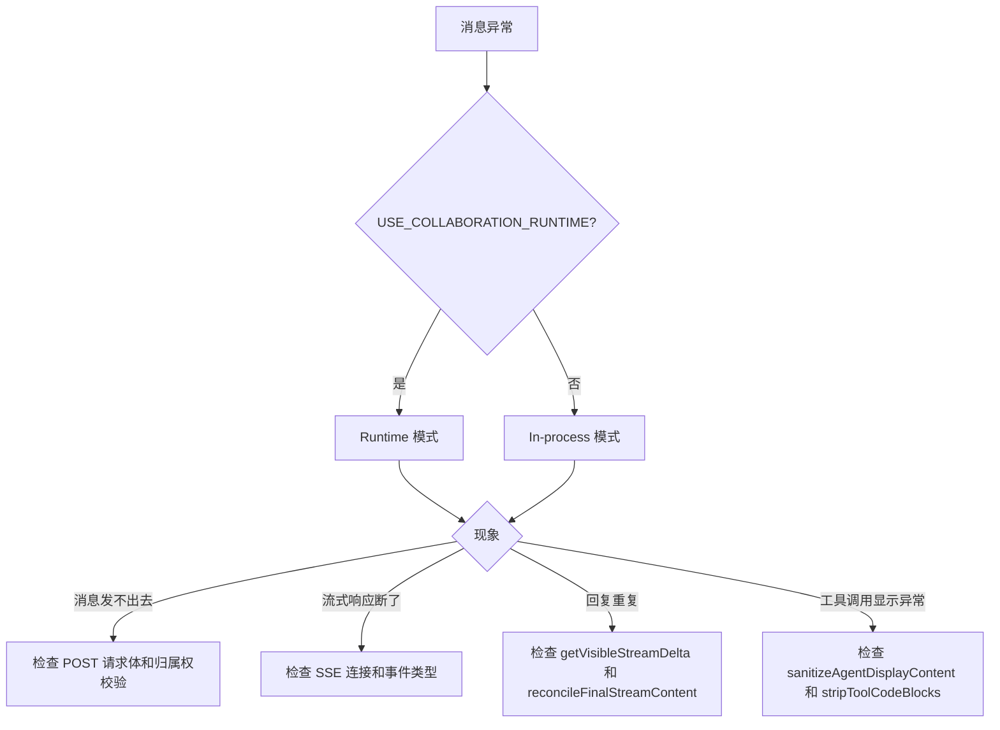

# 单元总览与复盘三：Agent 消息与流式响应（I12—I17）

小林在 SkillDialog 里输入一条消息，点击发送。从用户视角看，这只是"一句话发出去"；但从系统视角看，这条消息跨越了浏览器到 Next.js Route Handler 的边界，Route Handler 再调用 Core 的 Agent 运行时，最终通过 SSE（Server-Sent Events）流把 LLM 的回复逐字推回浏览器。

本单元小结要解决一个问题：读者如何理解一条消息从 HTTP POST 到 SSE 流式响应的完整链路，并在消息丢失、流中断、内容重复时知道应该检查哪一层。

## 0. 本页先读什么

如果只记住一句话，记住这一句：

> Agent 消息 API 不是简单的请求-响应，而是"请求 → 订阅 → 流式推送"的长连接模式。

这句话拆开看，有三层含义：

1. **消息发送是异步的**：客户端发送消息后，不会立即收到完整回复，而是订阅一个事件流。
2. **SSE 是单向推送**：服务器通过 SSE 推送 `text_delta`、`assistant_message`、`done` 等事件，客户端按事件类型更新 UI。
3. **Runtime 模式与 In-process 模式的流式实现不同**：前者拦截子进程 stdout 事件，后者订阅 Agent 实例的事件。

阅读本页可以按下面的顺序：

| 阅读阶段 | 重点问题 | 对应章节 |
| --- | --- | --- |
| 建立总图 | 一条消息如何从 HTTP POST 变成 SSE 流？ | 第 1、2 节 |
| 分清边界 | Route Handler、Agent 运行时、SSE 流各负责什么？ | 第 3 节 |
| 识别模式 | 为什么 Runtime 和 In-process 的 SSE 实现不同？ | 第 4 节 |
| 对回课程 | 六节课分别补上链路中的哪一段？ | 第 5 节 |
| 查证源码 | 哪些源码已直接讲过，哪些留到后面？ | 第 6 节 |
| 练习排查 | 消息发送/流式响应异常时按什么顺序检查？ | 第 7—9 节 |

## 1. 消息 API 的三层结构

Agent 消息相关代码分布在三个层级：

```mermaid
flowchart TD
    A[浏览器/客户端] -->|HTTP POST + SSE| B[app/api/agent/sessions/[sessionId]/messages/route.ts]
    B -->|调用| C[agentManager.getOrRestoreAgentRuntime]
    B -->|订阅| D[AgentEvent / RuntimeEvent]
    C -->|创建/恢复| E[OriginOSAgent 运行时]
    D -->|SSE 推送| F[浏览器 EventSource]
    F -->|更新 UI| G[React 组件]
```

本单元只看 B 层（Route Handler）以及它如何与 C/D 交互。C/D 的内部实现属于 Part E/F。

## 2. 一条消息发送的完整变形

以 `POST /api/agent/sessions/{sessionId}/messages` 为例：

```text
浏览器发送 JSON body { content, projectId }
  → Next.js 路由匹配到 app/api/agent/sessions/[sessionId]/messages/route.ts
    → 校验 content 字段
    → 获取或创建会话（agentSessionService.getSession）
    → 校验会话归属权（assertSessionMessageOwnership）
    → 恢复 Agent 运行时（agentManager.getOrRestoreAgentRuntime）
    → 添加用户消息到会话（agentSessionService.addMessage）
    → 检查 Accept 头，判断是否请求 SSE
    → 如果是 SSE：
      → 创建 ReadableStream
      → 订阅 AgentEvent / RuntimeEvent
      → 通过 SSE 推送 text_delta / assistant_message / done
    → 如果是非流式：
      → 调用 agent.prompt(content)
      → 收集所有事件
      → 返回完整 assistant 消息
```

这条链的关键是：**Route Handler 不生成 LLM 回复，它只是事件的搬运工**。回复内容由 Agent 运行时生成，Route Handler 只负责把事件翻译成 SSE 格式推送给客户端。

## 3. 三个最容易混淆的对象

### 3.1 用户消息、Assistant 消息、SSE 事件

| 对象 | 来源 | 去向 | 常见误解 |
| --- | --- | --- | --- |
| 用户消息 | 客户端发送 | 保存到 session.json | 发送后就消失了 |
| Assistant 消息 | LLM 生成 | 通过 SSE 推送 + 保存到 session.json | 只在内存中 |
| SSE 事件 | Route Handler 包装 | 推送到浏览器 | 就是原始 AgentEvent |

### 3.2 流式 vs 非流式

| 维度 | 流式 (SSE) | 非流式 |
| --- | --- | --- |
| 请求头 | `Accept: text/event-stream` | 默认 |
| 响应格式 | `text/event-stream` | `application/json` |
| 返回时机 | 逐字推送 | 全部完成后返回 |
| 用户体验 | 打字机效果 | 等待后一次性显示 |
| 实现复杂度 | 高（需要 ReadableStream） | 低 |

### 3.3 Runtime 模式与 In-process 模式的 SSE

很多 Agent 消息路由都有双分支：

```ts
const USE_RUNTIME_MODE = process.env['USE_COLLABORATION_RUNTIME'] === 'true';
```

| 模式 | SSE 来源 | 事件类型 | 典型实现 |
| --- | --- | --- | --- |
| In-process | Agent 实例的事件订阅 | `AgentEvent` | `createInProcessEventStream` |
| Runtime | 子进程 stdout 的事件拦截 | `RuntimeEvent` | `createRuntimeEventStream` |

这是为了支持多 Agent 协作运行时的进程隔离。本单元只要识别这个分支，具体实现属于 Part H。

## 4. 六节课连成一条因果链

I12—I17 不是六个孤立文件介绍。它们按"从消息发送到 SSE 流式响应"的顺序推进。

| 课次 | 本课解决的判断问题 | 核心源码锚点 | 学完后的判断能力 |
| --- | --- | --- | --- |
| I12 | `POST /sessions/{id}/messages` 如何发送消息并触发 SSE | `api/agent/sessions/[sessionId]/messages/route.ts` 的 POST | 能追踪消息从 HTTP 到 SSE 的完整链路 |
| I13 | In-process 模式的 SSE 如何实现 | `createInProcessEventStream` 函数 | 能理解 AgentEvent 订阅和 SSE 推送的关系 |
| I14 | Runtime 模式的 SSE 如何实现 | `createRuntimeEventStream` 函数 | 能理解 RuntimeEvent 拦截和 SSE 推送的关系 |
| I15 | 流式去重和 content 合并策略 | `getVisibleStreamDelta`、`reconcileFinalStreamContent` | 能理解为什么需要流式去重 |
| I16 | `POST /api/agent/abort` 如何中断正在进行的请求 | `api/agent/abort/route.ts` | 能区分 abort 和 destroy 的语义 |
| I17 | 如何验证消息发送和流式响应链路 | 复用上述文件 | 能根据现象定位是消息发送还是流式推送问题 |

这条链的停止边界也要清楚。I12—I17 还没有详细讲项目级 Agent 的 messages 路由、多 Agent 协作的消息路由、Agent 内部的工具调用机制。那些问题进入 U4/U5 再展开。

## 5. 源码覆盖台账

| 课次 | 已直接精读的生产源码 | 配对测试或验证入口 | 本单元只证明什么 |
| --- | --- | --- | --- |
| I12 | `api/agent/sessions/[sessionId]/messages/route.ts` 的 POST | 无单元测试 | 消息发送、归属权校验、SSE 分支选择 |
| I13 | `createInProcessEventStream` 函数 | 无单元测试 | In-process 模式的 SSE 事件订阅和推送 |
| I14 | `createRuntimeEventStream` 函数 | 无单元测试 | Runtime 模式的 RuntimeEvent 拦截和推送 |
| I15 | `getVisibleStreamDelta`、`reconcileFinalStreamContent`、`sanitizeAgentDisplayContent` | 无单元测试 | 流式去重、content 合并、工具调用过滤 |
| I16 | `api/agent/abort/route.ts` | 无单元测试 | Abort 的双模式实现和三层兜底 |
| I17 | 不新增生产逻辑；复用上述文件 | 纸面推演 + 运行观察 | 把消息和流式响应知识转成可验证的排查能力 |

本单元相邻但尚未精读的文件：`api/agent/projects/[projectId]/messages/route.ts`（项目级消息，U4）、`api/agent/projects/[projectId]/start/route.ts`、`api/agent/projects/[projectId]/stop/route.ts`（项目级 Agent 生命周期，U4）。

## 6. 异常排查：先分模式，再分阶段

当小林说"消息发不出去""流式响应断了""回复重复了"时，最稳的排查方式是先确认 runtime 模式，再确认消息发送阶段。



排查口诀：

1. 先看环境变量，区分 runtime 还是 in-process。
2. 再看 HTTP 请求是否成功（状态码）。
3. 消息发送问题先看请求体和归属权校验。
4. 流式问题先看 SSE 连接是否建立。
5. 内容重复问题先去重逻辑。
6. 工具调用显示问题先看过滤逻辑。

## 7. 纸面复盘实验

下面这个实验不需要运行项目。目标是根据请求和源码，推断系统行为和状态码。

```text
请求 A: POST /api/agent/sessions/s1/messages
Body: { content: "Hello", projectId: "p1" }
Accept: text/event-stream

请求 B: POST /api/agent/sessions/s1/messages
Body: { content: "Hello", projectId: "p1" }
Accept: application/json

请求 C: POST /api/agent/sessions/s1/messages
Body: { content: "", projectId: "p1" }

请求 D: POST /api/agent/abort
Body: { agentId: "project-p1" }
环境: USE_COLLABORATION_RUNTIME=true
```

合格推演应包含：

| 请求 | 关键调用 | 成功结果 | 常见失败 |
| --- | --- | --- | --- |
| A | `createEventStream` → `createRuntimeEventStream` | SSE 流，包含 text_delta / assistant_message / done | 运行时未恢复返回 500 |
| B | `agent.prompt(content)` | 201 + 完整 assistant 消息 | LLM 调用失败返回 500 |
| C | 校验 content 字段 | 400，content is required | — |
| D | `spawner.get(agentId)` → `proc.abort()` | 200 + null | Agent 未找到但返回 200 |

## 8. 测试证据的读法

本单元没有直接配对的单元测试。能验证的事实来自运行观察和接口测试：

| 验证方式 | 已经证明 | 没有证明 |
| --- | --- | --- |
| `curl` 发送 SSE 请求 | Route Handler 能建立 SSE 连接 | 所有事件类型都正确推送 |
| 浏览器 DevTools 观察 SSE | 能收到 text_delta 事件 | 内容一定不重复 |
| `curl` 发送非流式请求 | 能返回完整 assistant 消息 | LLM 回复一定正确 |
| `curl` 调用 abort | 能尝试中断 Agent | Agent 一定被中断 |

读这类代码时保持三个问题：

1. Given：请求体/请求头准备了什么？
2. When：Route Handler 调用了哪个 Core 函数？
3. Then：SSE 事件流中包含哪些事件类型？

## 9. 口头验收

学完 I12—I17 后，不看正文也应能回答下面六个问题：

1. `POST /sessions/{id}/messages` 在什么条件下返回 SSE 流，什么条件下返回 JSON？
2. In-process 模式的 SSE 和 Runtime 模式的 SSE 有什么区别？
3. `text_delta` 和 `assistant_message` 事件有什么区别？
4. 为什么需要 `getVisibleStreamDelta` 和 `reconcileFinalStreamContent`？
5. `POST /api/agent/abort` 和 `POST /sessions/{id}/destroy` 有什么区别？
6. 如果 SSE 流中断了，应该按什么顺序排查？

合格回答不要求背诵源码行号，但必须能说出事件类型、责任边界和排查顺序。能说清"哪个阶段出问题了"，比只说清"调用了哪个 API"更重要。

## 10. 进入下一单元

I12—I17 建立的是 Agent 消息从 HTTP 到 SSE 流式响应的完整链路。下一组课程会继续追踪项目级 Agent 如何启动、停止、发送消息，以及多 Agent 协作运行时的消息路由。

因此，本单元的结论可以压缩成一句话：

> 消息发送不是请求-响应，而是订阅-推送；先确认 SSE 连接建立成功，再确认事件类型正确，最后才检查内容去重和过滤。

这句话会在后续项目级 Agent 和多 Agent 协作单元里继续使用。
