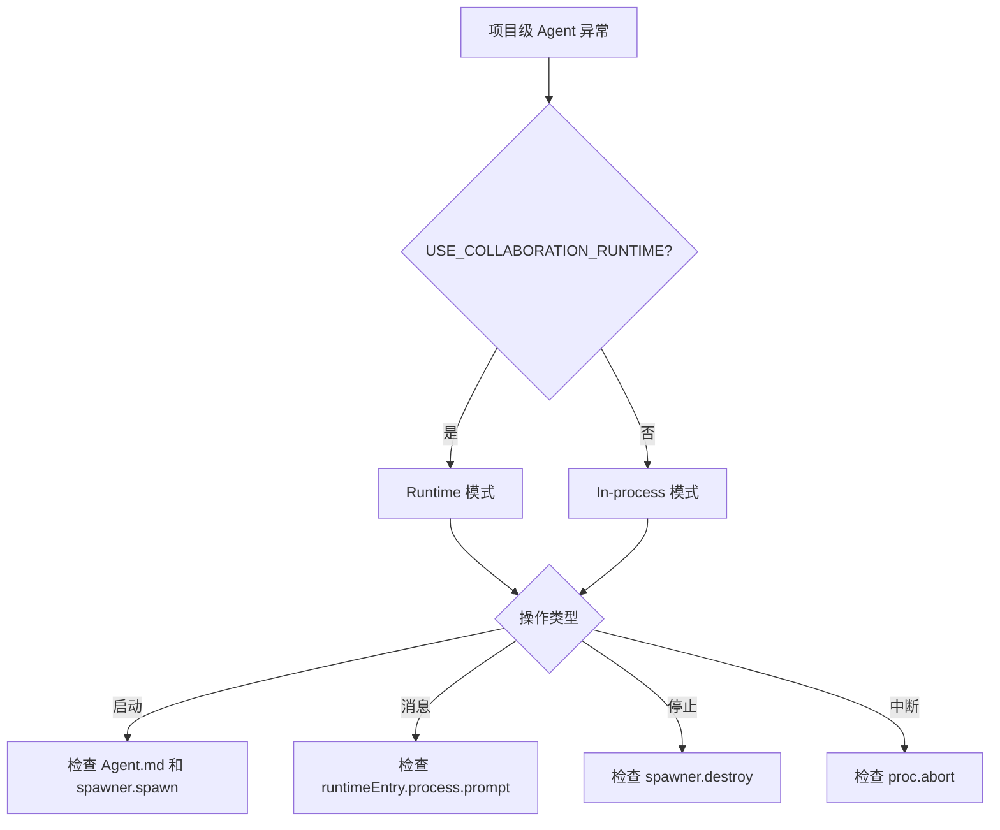

# 单元总览与复盘四：项目级 Agent 生命周期（I18—I25）

小林点击"启动项目 Agent"后，系统会调用 `POST /api/agent/projects/{projectId}/start`。从用户视角看，这只是"Agent 启动了"；但从系统视角看，这个请求跨越了 HTTP 边界，Route Handler 再调用 Core 的 `persistentAgentManager` 或 `spawner`，最终创建或恢复一个项目级 Agent 运行时。

本单元小结要解决一个问题：读者如何理解项目级 Agent 从启动到停止的完整生命周期，并在启动失败、消息发送失败、停止不彻底时知道应该检查哪一层。

## 0. 本页先读什么

如果只记住一句话，记住这一句：

> 项目级 Agent 的生命周期是"启动 → 发送消息 → 停止"，每个阶段都有 Runtime 和 In-process 两种实现。

这句话拆开看，有三层含义：

1. **启动不是简单的创建**：启动时需要读取项目目录的 `Agent.md`，决定运行时类型。
2. **消息发送与会话消息不同**：项目级 Agent 使用 `POST /api/agent/projects/{projectId}/messages`，而不是 `POST /api/agent/sessions/{sessionId}/messages`。
3. **停止需要清理运行时**：Runtime 模式下需要销毁子进程，In-process 模式下需要停止持久化 Agent。

阅读本页可以按下面的顺序：

| 阅读阶段 | 重点问题 | 对应章节 |
| --- | --- | --- |
| 建立总图 | 项目级 Agent 如何启动？ | 第 1、2 节 |
| 分清边界 | Route Handler、persistentAgentManager、spawner 各负责什么？ | 第 3 节 |
| 识别模式 | 为什么 Runtime 和 In-process 的启动实现不同？ | 第 4 节 |
| 对回课程 | 八节课分别补上链路中的哪一段？ | 第 5 节 |
| 查证源码 | 哪些源码已直接讲过，哪些留到后面？ | 第 6 节 |
| 练习排查 | 启动/消息/停止异常时按什么顺序检查？ | 第 7—9 节 |

## 1. 项目级 Agent 的三层结构

项目级 Agent 相关代码分布在三个层级：

```mermaid
flowchart TD
    A[浏览器/客户端] -->|HTTP| B[app/api/agent/projects/[projectId]/**/route.ts]
    B -->|调用| C[persistentAgentManager]
    B -->|调用| D[spawner]
    C -->|创建/恢复| E[ProjectAgent 运行时]
    D -->|创建/恢复| F[子进程 Agent]
```

本单元只看 B 层（Route Handler）以及它如何调用 C/D。C/D 的内部实现属于 Part E/F。

## 2. 一条启动请求的完整变形

以 `POST /api/agent/projects/{projectId}/start` 为例：

```text
浏览器发送 JSON body { sessionId, llmConfig }
  → Next.js 路由匹配到 app/api/agent/projects/[projectId]/start/route.ts
    → 解析 projectId 和 body
    → 持久化运行时 LLM 配置
    → 如果 USE_RUNTIME_MODE：
      → 读取项目目录 Agent.md
      → 解析 frontmatter 中的 agentType
      → 调用 spawner.spawn(...)
      → 注册到 globalThis.__runtimeAgents
      → 返回 status
    → 如果 In-process：
      → 调用 persistentAgentManager.startAgent(projectId, llmConfig)
      → 返回 status
```

这条链的关键是：**Route Handler 不决定 Agent 的类型，它只读取项目目录的 `Agent.md` 并转发给 Core**。

## 3. 三个最容易混淆的对象

### 3.1 项目级 Agent vs 会话级 Agent

| 对象 | 项目级 Agent | 会话级 Agent |
| --- | --- | --- |
| HTTP 路径 | `/api/agent/projects/{id}/**` | `/api/agent/sessions/{id}/**` |
| 管理器 | `persistentAgentManager` / `spawner` | `agentManager` / `spawner` |
| 典型场景 | 项目访谈、长期运行的 Agent | Skill 对话、短期交互 |
| 生命周期 | 项目级别 | 会话级别 |
| 数据存储 | `data/web/projects/{id}/` | `data/web/agents/{id}/` |

### 3.2 Runtime 模式与 In-process 模式

```ts
const USE_RUNTIME_MODE = process.env['USE_COLLABORATION_RUNTIME'] === 'true';
```

| 模式 | 启动 | 消息 | 停止 |
| --- | --- | --- | --- |
| Runtime | `spawner.spawn` | `runtimeEntry.process.prompt` | `spawner.destroy` |
| In-process | `persistentAgentManager.startAgent` | `agent.handleMessage` | `persistentAgentManager.stopAgent` |

### 3.3 Agent.md 的作用

`Agent.md` 是项目级 Agent 的配置文件，包含：

- **frontmatter**：`agentType`（`interview`、`persistent`、`originos` 等）
- **systemPrompt**：Agent 的系统提示词

Route Handler 读取 `Agent.md` 的 frontmatter 来决定运行时类型：

```ts
const agentTypeMatch = fmMatch[1].match(/^agentType:\s*(.+)$/m);
if (agentTypeMatch?.[1]) {
  const rawType = agentTypeMatch[1].trim().toLowerCase();
  agentType = rawType === 'interview' ? 'persistent' : 'originos';
}
```

## 4. 八节课连成一条因果链

I18—I25 不是八个孤立文件介绍。它们按"从启动到消息到停止"的顺序推进。

| 课次 | 本课解决的判断问题 | 核心源码锚点 | 学完后的判断能力 |
| --- | --- | --- | --- |
| I18 | `POST /projects/{id}/start` 如何启动项目级 Agent | `api/agent/projects/[projectId]/start/route.ts` | 能追踪启动请求到子进程/实例的完整链路 |
| I19 | `POST /projects/{id}/messages` 如何发送消息 | `api/agent/projects/[projectId]/messages/route.ts` 的 POST | 能区分项目级与会话级消息发送 |
| I20 | `GET /projects/{id}/messages` 如何获取状态 | `api/agent/projects/[projectId]/messages/route.ts` 的 GET | 能理解项目级 Agent 的状态查询 |
| I21 | `POST /projects/{id}/stop` 如何停止 Agent | `api/agent/projects/[projectId]/stop/route.ts` | 能区分 Runtime 和 In-process 的停止逻辑 |
| I22 | `POST /projects/{id}/abort` 如何中断 Agent | `api/agent/projects/[projectId]/abort/route.ts` | 能区分 abort 和 stop 的语义 |
| I23 | Runtime 模式下的消息发送 | `sendRuntimeMessage`、`createRuntimeEventStream`（项目级版本） | 能理解项目级 Runtime 消息发送 |
| I24 | 工具调用过滤和 content 处理 | `stripToolCodeBlocks`、`isToolCallOnlyContent` | 能理解工具调用在 SSE 中的显示逻辑 |
| I25 | 如何验证项目级 Agent 生命周期 | 复用上述文件 | 能根据现象定位启动/消息/停止问题 |

这条链的停止边界也要清楚。I18—I25 还没有详细讲多 Agent 协作运行时的消息路由、Agent 内部的工具调用机制、项目访谈的具体流程。那些问题进入 U5/U6 再展开。

## 5. 源码覆盖台账

| 课次 | 已直接精读的生产源码 | 配对测试或验证入口 | 本单元只证明什么 |
| --- | --- | --- | --- |
| I18 | `api/agent/projects/[projectId]/start/route.ts` | 无单元测试 | 启动请求到子进程/实例的链路 |
| I19 | `api/agent/projects/[projectId]/messages/route.ts` 的 POST | 无单元测试 | 项目级消息发送、SSE 流式响应 |
| I20 | `api/agent/projects/[projectId]/messages/route.ts` 的 GET | 无单元测试 | 项目级 Agent 状态查询 |
| I21 | `api/agent/projects/[projectId]/stop/route.ts` | 无单元测试 | Runtime 和 In-process 的停止逻辑 |
| I22 | `api/agent/projects/[projectId]/abort/route.ts` | 无单元测试 | 中断的双模式实现 |
| I23 | `sendRuntimeMessage`、`createRuntimeEventStream`（项目级版本） | 无单元测试 | 项目级 Runtime 消息发送 |
| I24 | `stripToolCodeBlocks`、`isToolCallOnlyContent` | 无单元测试 | 工具调用过滤和 content 处理 |
| I25 | 不新增生产逻辑；复用上述文件 | 纸面推演 + 运行观察 | 把项目级 Agent 知识转成可验证的排查能力 |

本单元相邻但尚未精读的文件：`api/agent/sessions/**`（U2-U3，已讲过）、`lib/integrations/pi-agent/persistent-agent-manager.ts`（Part E/F）、`lib/integrations/pi-agent/agent-manager.ts`（Part E/F）。

## 6. 异常排查：先分模式，再分阶段

当小林说"项目 Agent 启动失败""消息发不出去""Agent 停不掉"时，最稳的排查方式是先确认 runtime 模式，再确认操作阶段。



排查口诀：

1. 先看环境变量，区分 runtime 还是 in-process。
2. 启动问题先看 Agent.md 和项目目录。
3. 消息问题先看 Agent 是否已启动。
4. 停止问题先看运行时实例是否存在。
5. 中断问题先看 abort 路由和运行时模式。

## 7. 纸面复盘实验

下面这个实验不需要运行项目。目标是根据请求和源码，推断系统行为和状态码。

```text
请求 A: POST /api/agent/projects/p1/start
Body: { sessionId: "project-p1", llmConfig: { provider: "openai" } }

请求 B: POST /api/agent/projects/p1/messages
Headers: Accept: text/event-stream
Body: { content: "Hello" }

请求 C: GET /api/agent/projects/p1/messages

请求 D: POST /api/agent/projects/p1/stop
Body: { sessionId: "project-p1" }

请求 E: POST /api/agent/projects/p1/abort
Body: { sessionId: "project-p1" }

环境: USE_COLLABORATION_RUNTIME=true
```

合格推演应包含：

| 请求 | 关键调用 | 成功结果 | 常见失败 |
| --- | --- | --- | --- |
| A | `spawner.spawn` | 200 + status | Agent.md 不存在使用默认 |
| B | `runtimeEntry.process.prompt` | SSE 流 | Agent 未启动返回 400 |
| C | `spawner.get` / `persistentAgentManager.getAgent` | 200 + status | Agent 未运行返回 404 |
| D | `spawner.destroy` | 200 + projectId | 子进程已不存在 |
| E | `proc.abort` | 200 + null | Agent 未找到但返回 200 |

## 8. 测试证据的读法

本单元没有直接配对的单元测试。能验证的事实来自运行观察和接口测试：

| 验证方式 | 已经证明 | 没有证明 |
| --- | --- | --- |
| `curl` 调用 start | Route Handler 能启动 Agent | Core Service 所有分支都正确 |
| `curl` 调用 messages | 能发送消息并返回 SSE | LLM 回复一定正确 |
| `curl` 调用 stop | 能尝试停止 Agent | 子进程一定被干净终止 |
| `curl` 调用 abort | 能尝试中断 Agent | Agent 一定被中断 |

读这类代码时保持三个问题：

1. Given：请求体/查询参数准备了什么？
2. When：Route Handler 调用了哪个 Core 函数？
3. Then：返回的 `success`/`error` 分别代表什么？

## 9. 口头验收

学完 I18—I25 后，不看正文也应能回答下面六个问题：

1. `POST /api/agent/projects/{id}/start` 在什么条件下使用 Runtime 模式，什么条件下使用 In-process 模式？
2. `Agent.md` 的 frontmatter 如何影响 Agent 的运行时类型？
3. `POST /api/agent/projects/{id}/messages` 和 `POST /api/agent/sessions/{id}/messages` 有什么区别？
4. `POST /api/agent/projects/{id}/stop` 和 `POST /api/agent/projects/{id}/abort` 有什么区别？
5. Runtime 模式下，项目级 Agent 的消息如何发送到子进程？
6. 如果项目级 Agent 启动失败，应该按什么顺序排查？

合格回答不要求背诵源码行号，但必须能说出调用顺序、责任边界和状态码含义。能说清"哪个对象被启动/停止"，比只说清"调用了哪个 API"更重要。

## 10. 进入下一单元

I18—I25 建立的是项目级 Agent 从启动到停止的完整生命周期。下一组课程会继续追踪项目级 Agent 的 SSE 流式响应、工具调用过滤、以及多 Agent 协作运行时的消息路由。

因此，本单元的结论可以压缩成一句话：

> 先确认 Runtime 模式还是 In-process 模式，再确认是启动、消息、停止还是中断，最后才进入 Core 内部。

这句话会在后续多 Agent 协作单元里继续使用。
