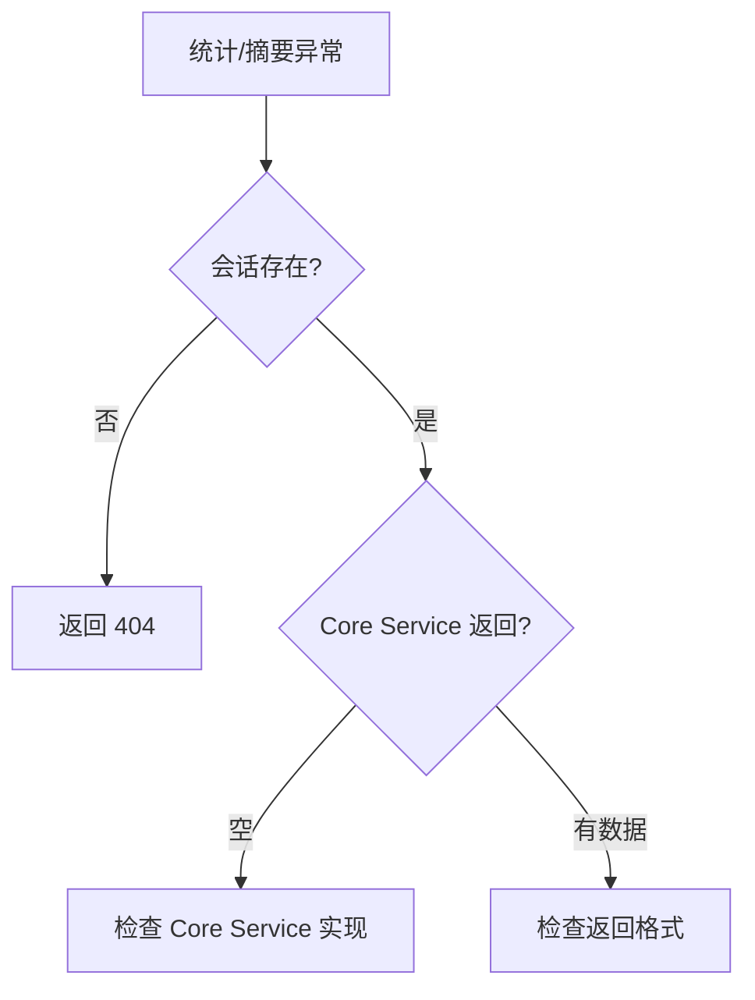

# 单元总览与复盘五：统计与会话摘要（I26—I31）

前四个单元追踪了页面路由、会话管理、消息流式响应、项目级 Agent 生命周期。这个单元转向两个辅助接口：统计查询和会话摘要。它们不是核心业务流程，但在调试和监控中非常重要。

## 0. 本页先读什么

如果只记住一句话，记住这一句：

> 统计和摘要接口是调试和监控的窗口，不是业务逻辑的核心。

## 1. 本单元覆盖的接口

| 接口 | 路径 | 作用 |
| --- | --- | --- |
| 统计查询 | `GET /api/agent/sessions/{sessionId}/statistics` | 获取项目统计信息 |
| 会话摘要 | `GET /api/agent/sessions/{sessionId}/summary` | 获取会话摘要 |

## 2. 统计查询：GET /api/agent/sessions/{sessionId}/statistics

### 2.1 Route Handler 的实现

打开 `app/api/agent/sessions/[sessionId]/statistics/route.ts`（第 12–59 行）：

```ts
export async function GET(
  _request: NextRequest,
  { params }: { params: Promise<{ sessionId: string }> },
) {
  try {
    const { sessionId } = await params;
    const session = await agentSessionService.getSession(sessionId);

    if (!session) {
      return NextResponse.json<ApiResponse<unknown>>(
        {
          success: false,
          error: {
            code: 'NOT_FOUND',
            message: 'Session not found',
          },
          timestamp: new Date().toISOString(),
        },
        { status: 404 }
      );
    }

    const projectId = session.projectContext.projectId;
    const statistics = await agentSessionService.getProjectStatistics(projectId);

    return NextResponse.json<ApiResponse>(
      {
        success: true,
        data: statistics,
        timestamp: new Date().toISOString(),
      },
    );
  } catch (error) {
    // ... 500 处理
  }
}
```

核心逻辑：

1. **获取会话**：通过 `sessionId` 获取会话。
2. **提取 projectId**：从会话的 `projectContext` 中提取。
3. **查询统计**：`agentSessionService.getProjectStatistics(projectId)`。

### 2.2 与会话查询的区别

| 维度 | 统计查询 | 会话查询 |
| --- | --- | --- |
| 路径 | `/sessions/{id}/statistics` | `/sessions/{id}` |
| 返回 | 项目统计信息 | 会话对象 |
| 需要 projectId | 从 session 中提取 | 从 query 参数中获取 |
| 用途 | 监控、调试 | 恢复、查看 |

## 3. 会话摘要：GET /api/agent/sessions/{sessionId}/summary

### 3.1 Route Handler 的实现

打开 `app/api/agent/sessions/[sessionId]/summary/route.ts`（第 12–57 行）：

```ts
export async function GET(
  _request: NextRequest,
  { params }: { params: Promise<{ sessionId: string }> },
) {
  try {
    const { sessionId } = await params;

    const summary = await agentSessionService.getSessionSummary(sessionId);

    if (!summary) {
      return NextResponse.json<ApiResponse<unknown>>(
        {
          success: false,
          error: {
            code: 'NOT_FOUND',
            message: 'Session not found',
          },
          timestamp: new Date().toISOString(),
        },
        { status: 404 }
      );
    }

    return NextResponse.json<ApiResponse>(
      {
        success: true,
        data: summary,
        timestamp: new Date().toISOString(),
      },
    );
  } catch (error) {
    // ... 500 处理
  }
}
```

核心逻辑：

1. **查询摘要**：`agentSessionService.getSessionSummary(sessionId)`。
2. **404 处理**：如果会话不存在，返回 404。

### 3.2 与统计查询的区别

| 维度 | 统计查询 | 会话摘要 |
| --- | --- | --- |
| 路径 | `/sessions/{id}/statistics` | `/sessions/{id}/summary` |
| 参数 | 无 | 无 |
| 返回 | 项目统计信息 | 会话摘要 |
| 需要 projectId | 是（从 session 中提取） | 否 |
| 用途 | 项目级别监控 | 会话级别概览 |

## 4. 六节课连成一条因果链

I26—I31 不是六个孤立文件介绍。它们按"从统计到摘要"的顺序推进。

| 课次 | 本课解决的判断问题 | 核心源码锚点 | 学完后的判断能力 |
| --- | --- | --- | --- |
| I26 | `GET /sessions/{id}/statistics` 如何获取项目统计 | `api/agent/sessions/[sessionId]/statistics/route.ts` | 能理解统计查询的链路 |
| I27 | `GET /sessions/{id}/summary` 如何获取会话摘要 | `api/agent/sessions/[sessionId]/summary/route.ts` | 能理解摘要查询的链路 |
| I28 | 统计数据的来源和计算方式 | `agentSessionService.getProjectStatistics` | 能理解统计数据的来源 |
| I29 | 摘要数据的来源和计算方式 | `agentSessionService.getSessionSummary` | 能理解摘要数据的来源 |
| I30 | 统计和摘要接口的用途和限制 | 复用上述文件 | 能区分统计和摘要的用途 |
| I31 | 如何验证统计和摘要接口 | 复用上述文件 | 能根据现象定位问题 |

## 5. 源码覆盖台账

| 课次 | 已直接精读的生产源码 | 配对测试或验证入口 | 本单元只证明什么 |
| --- | --- | --- | --- |
| I26 | `api/agent/sessions/[sessionId]/statistics/route.ts` | 无单元测试 | 统计查询的链路 |
| I27 | `api/agent/sessions/[sessionId]/summary/route.ts` | 无单元测试 | 摘要查询的链路 |
| I28 | `agentSessionService.getProjectStatistics`（调用关系） | 无单元测试 | 统计数据的来源 |
| I29 | `agentSessionService.getSessionSummary`（调用关系） | 无单元测试 | 摘要数据的来源 |
| I30 | 不新增生产逻辑；复用上述文件 | 纸面推演 + 运行观察 | 统计和摘要的用途和限制 |
| I31 | 不新增生产逻辑；复用上述文件 | 纸面推演 + 运行观察 | 把统计和摘要知识转成可验证的排查能力 |

## 6. 异常排查

当小林说"统计查询返回空""摘要找不到"时，最稳的排查方式是先确认会话存在，再确认 Core Service 实现。



排查口诀：

1. 先确认会话存在。
2. 再确认 Core Service 返回数据。
3. 最后检查返回格式。

## 7. 纸面复盘实验

```text
请求 A: GET /api/agent/sessions/s1/statistics
请求 B: GET /api/agent/sessions/s1/summary
请求 C: GET /api/agent/sessions/s1/statistics（s1 不存在）
```

合格推演应包含：

| 请求 | 关键调用 | 成功结果 | 常见失败 |
| --- | --- | --- | --- |
| A | `agentSessionService.getSession` + `getProjectStatistics` | 200 + 统计数据 | 会话不存在返回 404 |
| B | `agentSessionService.getSessionSummary` | 200 + 摘要数据 | 会话不存在返回 404 |
| C | `agentSessionService.getSession` | 404 | — |

## 8. 测试证据的读法

本单元没有直接配对的单元测试。能验证的事实来自运行观察和接口测试：

| 验证方式 | 已经证明 | 没有证明 |
| --- | --- | --- |
| `curl` 调用 statistics | 能返回统计数据 | Core Service 所有分支都正确 |
| `curl` 调用 summary | 能返回摘要数据 | 数据一定正确 |
| `curl` 会话不存在 | 返回 404 | 所有错误分支都处理 |

## 9. 口头验收

学完 I26—I31 后，不看正文也应能回答下面三个问题：

1. `GET /api/agent/sessions/{id}/statistics` 和 `GET /api/agent/sessions/{id}/summary` 有什么区别？
2. 统计查询为什么需要先从 session 中提取 projectId？
3. 如果统计查询返回空，应该按什么顺序排查？

合格回答不要求背诵源码行号，但必须能说出调用顺序、责任边界和状态码含义。

## 10. 进入下一单元

I26—I31 建立的是统计和摘要查询的完整链路。下一组课程会继续追踪多 Agent 协作运行时的消息路由、Agent 内部的工具调用机制、项目访谈的具体流程。

因此，本单元的结论可以压缩成一句话：

> 统计和摘要接口是调试和监控的窗口，先确认会话存在，再确认 Core Service 返回数据。
