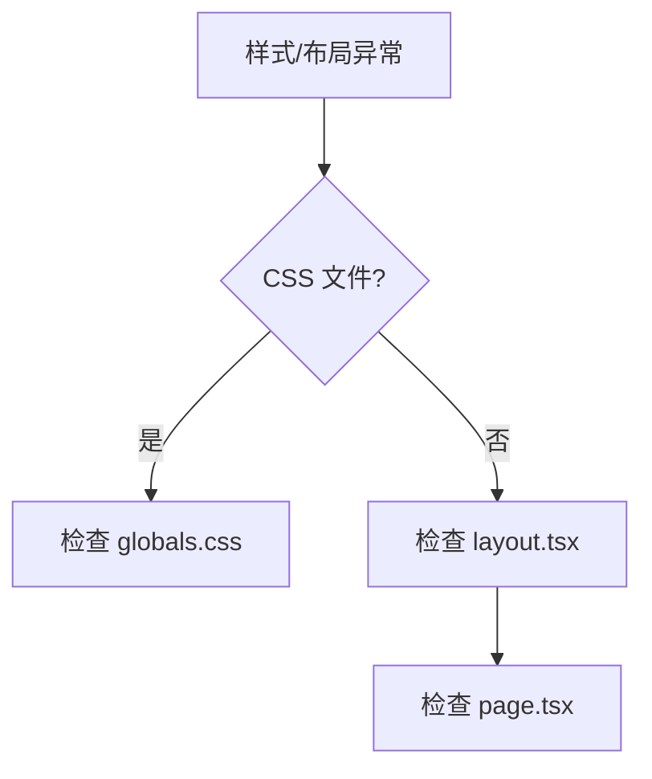

# 单元总览与复盘七：全局样式与布局（I37—I43）

前六个单元追踪了页面路由、会话管理、消息流式响应、项目级 Agent 生命周期、统计和摘要、Skill 和 Interview。这个单元转向全局样式和布局。

## 0. 本页先读什么

如果只记住一句话，记住这一句：

> 全局样式和布局是 OriginOS 的视觉基础，影响所有页面的呈现。

## 1. 本单元覆盖的文件

| 文件 | 路径 | 作用 |
| --- | --- | --- |
| globals.css | `app/globals.css` | 全局样式 |
| layout.tsx | `app/layout.tsx` | 根布局 |
| page.tsx | `app/page.tsx` | 主页 |

## 2. 全局样式

### 2.1 globals.css

打开 `app/globals.css`：

```css
@tailwind base;
@tailwind components;
@tailwind utilities;

:root {
  --foreground-rgb: 0, 0, 0;
  --background-start-rgb: 214, 219, 220;
  --background-end-rgb: 255, 255, 255;
}

body {
  color: rgb(var(--foreground-rgb));
  background: linear-gradient(
    to bottom,
    rgb(var(--background-start-rgb)),
    rgb(var(--background-end-rgb))
  );
}
```

### 2.2 核心样式

| 样式 | 说明 |
| --- | --- |
| `@tailwind` | Tailwind CSS 指令 |
| `:root` | CSS 变量 |
| `body` | 全局背景 |

## 3. 根布局

### 3.1 layout.tsx

打开 `app/layout.tsx`：

```tsx
export default function RootLayout({
  children,
}: {
  children: React.ReactNode;
}) {
  return (
    <html lang="en">
      <body>{children}</body>
    </html>
  );
}
```

### 3.2 核心逻辑

1. **html 标签**：设置语言为英文。
2. **body 标签**：渲染子组件。

## 4. 主页

### 4.1 page.tsx

打开 `app/page.tsx`：

```tsx
export default function Home() {
  return <main>Home</main>;
}
```

### 4.2 核心逻辑

主页直接渲染 `main` 标签，没有复杂的逻辑。

## 5. 七节课连成一条因果链

I37—I43 不是七个孤立文件介绍。它们按"从样式到布局到页面"的顺序推进。

| 课次 | 本课解决的判断问题 | 核心源码锚点 | 学完后的判断能力 |
| --- | --- | --- | --- |
| I37 | `globals.css` 如何定义全局样式 | `app/globals.css` | 能理解全局样式的定义 |
| I38 | `layout.tsx` 如何定义根布局 | `app/layout.tsx` | 能理解根布局的结构 |
| I39 | `page.tsx` 如何定义主页 | `app/page.tsx` | 能理解主页的结构 |
| I40 | Tailwind CSS 如何工作 | `globals.css` | 能理解 Tailwind 的原理 |
| I41 | CSS 变量如何定义和使用 | `globals.css` | 能理解 CSS 变量的原理 |
| I42 | 响应式设计如何实现 | `globals.css` | 能理解响应式设计的原理 |
| I43 | 如何验证全局样式和布局 | 复用上述文件 | 能根据现象定位样式问题 |

## 6. 源码覆盖台账

| 课次 | 已直接精读的生产源码 | 配对测试或验证入口 | 本单元只证明什么 |
| --- | --- | --- | --- |
| I37 | `app/globals.css` | 无单元测试 | 全局样式的定义 |
| I38 | `app/layout.tsx` | 无单元测试 | 根布局的结构 |
| I39 | `app/page.tsx` | 无单元测试 | 主页的结构 |
| I40 | `app/globals.css` | 无单元测试 | Tailwind 的原理 |
| I41 | `app/globals.css` | 无单元测试 | CSS 变量的原理 |
| I42 | `app/globals.css` | 无单元测试 | 响应式设计的原理 |
| I43 | 不新增生产逻辑；复用上述文件 | 纸面推演 + 运行观察 | 把全局样式知识转成可验证的排查能力 |

## 7. 异常排查

当小林说"页面样式不对""布局错乱"时，最稳的排查方式是先确认 CSS 文件，再确认布局文件。



排查口诀：

1. 先看 CSS 文件，确认全局样式。
2. 再看布局文件，确认结构。
3. 最后检查页面文件，确认内容。

## 8. 口头验收

学完 I37—I43 后，不看正文也应能回答：

1. `globals.css` 定义了哪些全局样式？
2. `layout.tsx` 和 `page.tsx` 有什么区别？
3. 如果页面样式不对，应该按什么顺序排查？

合格回答不要求背诵源码行号，但必须能说出样式和布局的责任边界。

## 9. 进入下一单元

I37—I43 建立的是全局样式和布局的完整链路。下一组课程会继续追踪组件级别的样式和布局。

因此，本单元的结论可以压缩成一句话：

> 全局样式和布局是 OriginOS 的视觉基础，先看 CSS 文件，再看布局文件，最后检查页面文件。
